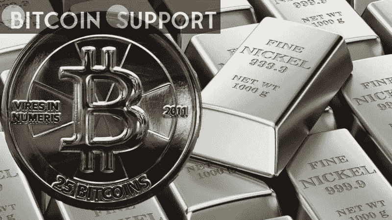
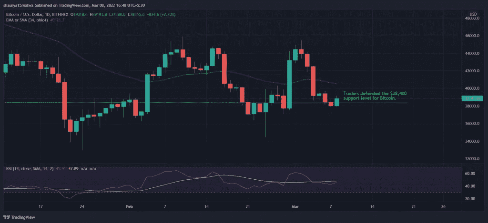

# 比特币的价格保持在 38000 美元以上，而镍的价格出人意料地飙升至 101000 美元

> 原文：<https://medium.com/coinmonks/bitcoin-maintains-a-price-above-38-000-while-nickel-surges-to-101-000-in-a-surprising-run-9588078da258?source=collection_archive---------77----------------------->

**Visit our website:-** [**https://bitcoinsupports.com/**](https://bitcoinsupports.com/)

周二的加密货币市场依然低迷，尽管在东欧危机期间，某些其他行业大幅上涨。在欧盟(EU)宣布计划发行债券以抵消乌克兰危机和俄罗斯制裁的负面影响后，比特币和其他主要加密货币周二有所上涨。向欧盟成员国提供资金的提议可能会在下周出台，资金将用于能源和国防投资。提议的消息提振了欧洲股市。德国 DAX 指数上涨 0.7%，斯托克欧洲 600 指数上涨 0.5%。标准普尔 500 指数期货开始上涨 0.38%，而白银期货从昨天开始扩大涨幅，上涨 2.68%。比特币连续第二天保持在 3.8 万美元关口上方，但仍比一周前的水平低 13%。以太网在过去 24 小时内下跌了 1.3%，而其他主要加密货币的涨幅从币安链家的 BNB 的 3.1%到 Terra 的 LUNA 的 1%不等。Avalanche 的 AVAX 和 XRP 在同一时期都下跌了 1%。

**Visit our website:-** [**https://bitcoinsupports.com/**](https://bitcoinsupports.com/)

由于担心俄罗斯的制裁可能会限制石油进口，布伦特原油价格周一超过每桶 122 美元。俄罗斯是主要生产国，并表示如果德国不遵守其他西方国家的制裁，它将切断对德国的天然气供应。据 BBC 报道，欧盟大约 40%的天然气和 30%的石油从俄罗斯进口。伦敦金属交易所已经停止了镍的交易，此前有报道称，在亚洲时段早些时候，一场疑似的卖空交易将金属价格推高至创纪录的 10.1 万美元。Hargreaves Lansdown 的投资分析师苏珊娜·斯特里特(Susannah Streeter)表示:“那些押注金价不会升值的人，被迫以高得多的价格买入黄金，从而导致了空头挤压。”。“交易的暂停很可能是由一笔巨额保证金追缴引发的，强劲的收益推动投机者匆忙在账户中存入更多资金来填补缺口。”

[https://twitter.com/JavierBlas/status/1501092364340846596](https://twitter.com/JavierBlas/status/1501092364340846596)

镍是电动汽车电池的关键成分，这一领域近年来随着加密货币一起发展。

周二加密货币的进步使总市值增加了 1.1%。比特币主导指数从之前的 42.4%上升至 42.4%。恐惧和贪婪加密货币指数-一个情绪指标-单日下跌 2 点至 21 点，仍处于“严重恐惧”状态，这意味着加密价格可能在未来几周上涨。随着乌克兰紧张局势加剧的消息传出，比特币和其他风险资产本周开始下跌。然而，周一晚间该股收复了失地。

根据分析公司 Santiment 的数据，在比特币周末下跌期间，主要投机者涌入了 Tether 的 USDT 代币。FxPro 分析师告诉记者，大量 USDT 储备可能表明买家正准备购买比特币，比特币在上周下跌后可能被低估。

**然而，并不是所有人都相信向上流动。**

**“由于欧洲的地缘政治局势，我们目前正在应对一个极其动荡的市场，”DFG 加密基金创始人詹姆斯·沃(James Wo)在一次电报聊天中透露。“我们预计，市场将继续呈现快速而剧烈的上下波动，类似于传统金融中的风险资产，直到出现新的现状迹象。”**

**访问我们的网站:-**[**https://bitcoinsupports.com/**](https://bitcoinsupports.com/)

**免责声明:以上为作者观点，不应视为投资建议。读者应该自己做研究。**