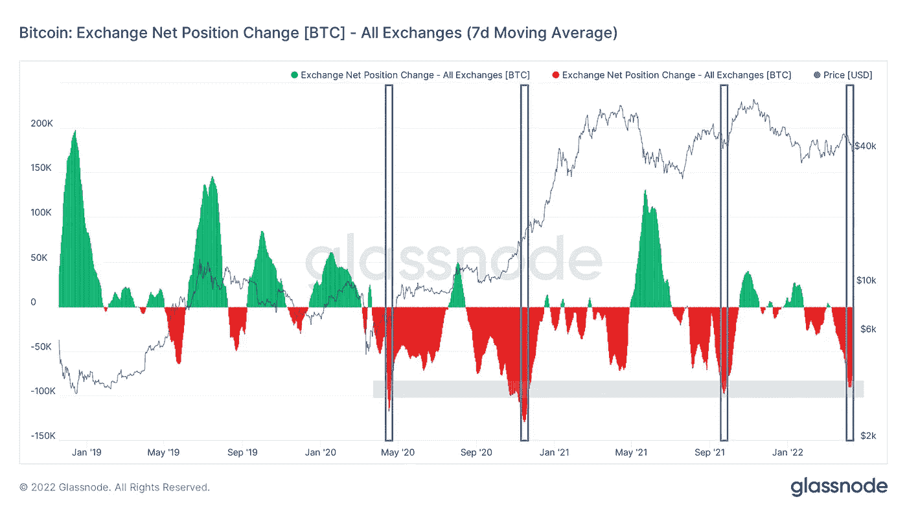

# 随着 BTC 交易所的提款达到新高，比特币保持了 41，000 美元的价值

> 原文：<https://medium.com/coinmonks/bitcoin-maintains-its-41k-value-as-btc-exchange-withdrawals-reach-new-highs-dc6e4f73365e?source=collection_archive---------58----------------------->

**Visit our website for full blog:-** [**https://bitcoinsupports.com/bitcoin-maintains-its-41k-value-as-btc-exchange-withdrawals-reach-new-highs/**](https://bitcoinsupports.com/bitcoin-maintains-its-41k-value-as-btc-exchange-withdrawals-reach-new-highs/)

比特币可能会威胁到更低的水平，但数据显示，需求在幕后“只会上升”。在周三华尔街开始反弹后，比特币(BTC)在 4 月 14 日继续上涨。

**Visit our website for full blog:-** [**https://bitcoinsupports.com/bitcoin-maintains-its-41k-value-as-btc-exchange-withdrawals-reach-new-highs/**](https://bitcoinsupports.com/bitcoin-maintains-its-41k-value-as-btc-exchange-withdrawals-reach-new-highs/)

**目前持有的水平是 40，500 美元**

根据 TradingView 的数据，BTC/美元周四仍在 41，000 美元上方交易，在上涨过程中收复了 40，000 美元大关。“到目前为止一切顺利，我预计会升至 41k，但我不确定是否会再升至绿框(蓝框)，”受欢迎的交易员 Crypto Ed 昨晚拿着一张短期价格目标图表示。

**“在接下来的几个小时里，稍微多涨一点，然后回调。”我们将重新测试 40.5k，如果保持不变，我们将测试 42–43k(白色)。如果你减掉 40.5 磅，我们会选择绿色盒子。”**

**Visit our website for full blog:-** [**https://bitcoinsupports.com/bitcoin-maintains-its-41k-value-as-btc-exchange-withdrawals-reach-new-highs/**](https://bitcoinsupports.com/bitcoin-maintains-its-41k-value-as-btc-exchange-withdrawals-reach-new-highs/)

在撰写本文时，40，500 美元的价格没有显示出下降的迹象，波动性逐渐消失到周四，比特币的上升趋势没有面临严重威胁。其他人利用缺乏看涨情绪的机会，认为尽管缺乏看涨情绪，但比特币今年远非看跌。

https://Twitter . com/MatthewHyland _/status/1514387005039423492

时间偏好越低，担忧就越少——正如分析师 TechDev 强调的那样，即使从 11 月的历史高点暴跌 50%以上，比特币也表现出与传统市场行为的相似之处。本月的焦点是一种类似于 20 世纪 90 年代初道琼斯指数的图表模式。“时代变了。资产会随着时间而变化。大多数时候，宏观的总体人类活动并不“以下是 TechDev 的摘要。一些人仍然担心比特币与股票的相关性，预计比特币的下跌将对价格产生重大影响。

**从交易所的提款增加了**

与此同时，还有其他原因让 Blockware 首席洞察分析师威廉·克莱门特保持对他的信任。他周三表示，加密货币交易所正在以前所未有的速度减少 BTC 储备，这意味着需求的任何增加都将与快速萎缩的供应相竞争，从而进一步推动价格表现。他补充说，除了链上监控公司 Glassnode 的统计数据，“我们只在其他三次目睹比特币以这种速度从交易所被取走。”

glass node 的净头寸变化指标监控 18 家交易所余额的向上和向下变化。

**Visit our website for full blog:-** [**https://bitcoinsupports.com/bitcoin-maintains-its-41k-value-as-btc-exchange-withdrawals-reach-new-highs/**](https://bitcoinsupports.com/bitcoin-maintains-its-41k-value-as-btc-exchange-withdrawals-reach-new-highs/)

外汇取款高峰是一个激烈争论的话题，随着需求飙升，专家们的兴奋情绪今年有所增加。

**访问我们的网站获取完整博客:-**[**https://bitcoinsupports . com/bitcoin-maintains-its-41k-value-as-BTC-exchange-取款-reach-new-highs/**](https://bitcoinsupports.com/bitcoin-maintains-its-41k-value-as-btc-exchange-withdrawals-reach-new-highs/)

**免责声明:以上为作者观点，不应视为投资建议。读者应该自己做研究。**

> 加入 Coinmonks [电报频道](https://t.me/coincodecap)和 [Youtube 频道](https://www.youtube.com/c/coinmonks/videos)了解加密交易和投资

# 另外，阅读

*   [最佳比特币保证金交易](/coinmonks/bitcoin-margin-trading-exchange-bcbfcbf7b8e3) | [萝莉点评](/coinmonks/lolli-review-e6ddc7895ad8) | [比特币保证金交易](https://coincodecap.com/bityard-margin-trading)
*   [创造并出售你的第一个 NFT](https://coincodecap.com/create-nft) | [密码交易机器人](https://coincodecap.com/best-crypto-trading-bots)
*   [如何在 CoinDCX 上购买柴犬(SHIB)币？](https://coincodecap.com/buy-shiba-coindcx)
*   [CBET 评论](https://coincodecap.com/cbet-casino-review) | [库科恩 vs 比特币基地](https://coincodecap.com/kucoin-vs-coinbase) | [拜比特 vs 比特币基地](https://coincodecap.com/bybit-vs-coinbase)
*   [折叠 App 回顾](https://coincodecap.com/fold-app-review) | [本地比特币回顾](/coinmonks/localbitcoins-review-6cc001c6ed56) | [Bybit vs 币安](https://coincodecap.com/bybit-binance-moonxbt)