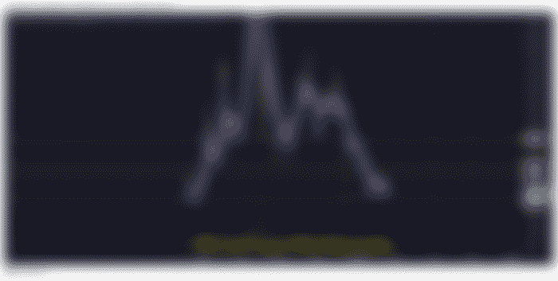

# 比特币:2022 年 3 月 16 日

> 原文：<https://medium.com/coinmonks/bitcoin-march-16-2022-55b632151314?source=collection_archive---------65----------------------->

# [比特币 40，600.00 美元](https://read.cash/@Rutkowski/bitcoin-march-16-2022-a9266332#bitcoin-4060000)

比特币目前超过 40，000.00 美元，低于过去 24 小时内的 41，600.00 美元左右。不利的一面是，我们仍未突破之前的低点 42，500.00 美元左右

一旦比特币开始超过这些水平，我们应该会像许多人呼吁的那样，看到备受期待的 57，000.00 美元的运行，然后我们会看到预期的 9，000 美元至 13，000 美元的暴跌

我仍然没有看到整个 9k 发挥出来，但我不完全排除它。这是一个秘密，我知道任何事情都可能发生，从 0.15 美分到 20，000.00 美元，几个月内，反之亦然。

看上面的图表，这三条线代表了我正在计算的前 3 个较低的高点。为了进入看涨势头，跨越这些水平是很重要的。

然而，如果趋势性的想法得以实现，我个人不会指望比特币在暴跌之前突破 52k 美元。52k 美元是一个主要的阻力位。从我个人的观察来看，比特币在 50k 美元左右更是如此。

# [XRP .77 美分](https://read.cash/@Rutkowski/bitcoin-march-16-2022-a9266332#xrp-77-cents)

XRP 股市仅比昨天略有上涨。SEC 与 RIPPLE 之间仍然没有最新的进展，老实说，如果不是在开庭日期，我预计在接近 8 月之前不会有重大更新。

我仍然看好 XRP 和 XLM。我知道如果 XRP 失败了，XLM 已经和 XRP 做的一样多了。老实说，两个都不抱没有意义。

# [蝙蝠基本注意力代币 0.81 美元](https://read.cash/@Rutkowski/bitcoin-march-16-2022-a9266332#bat-basic-attention-token-081)

英美烟草公司正准备在市场上采取另一项重大举措。如果你不知道，BAT 是勇敢浏览器的原生标志。当你使用 Brave Browser 时，你是安全的，不会被不想要的广告淹没，这些广告看了不会给你报酬。

相反，Brave Browser 给你看广告的选项，反过来他们在 BAT 里奖励你。广告在不久的将来。

# [比特币现金 BCH 291.00 美元](https://read.cash/@Rutkowski/bitcoin-march-16-2022-a9266332#bitcoin-cash-bch-29100)

比特币现金仍在 261 美元和 342 美元之间的累积区域，目前为 291 美元。与市场目前的点位相比，2020 年似乎会出现同样的情况。我希望看到同样的阻力水平会给我们的恢复带来麻烦。

下面的图表显示了我预计会遇到最大阻力的水平。在我们突破 385 美元后，755 美元将是下一个最大的壮举。当我们达到这些水平时，我们可能会看到历史的重演，或者它可能会很快变成支撑，有点像比特币在 28k 美元到 33k 美元之间

# [总结](https://read.cash/@Rutkowski/bitcoin-march-16-2022-a9266332#summary)

在这个美好的周三下午，市场情绪看起来非常乐观。我认为最好是缩小范围，提醒我们自己我们到底有多深，但也要反思和看看我们到目前为止已经走了多远。

Crypto 一直在做一些重大的事情，从柴犬被以太坊的创造者穿越到每百万 85 美元。事实证明，给印度 Covid 救济基金的捐款是柴犬最大的亮点。也是当时世界上最大的秘密捐赠。

乔·拜登签署了一项行政命令，以促进美国采用加密技术。我们还在等着看这将对密码市场产生什么影响。

Crypto Exchange 的首席执行官是拜登竞选活动的第二大捐赠人。也许这个行政命令是花钱买的？

Crypto.com 以 8 亿美元购买了举办超级碗的 Crypto.com 竞技场的冠名权

采用比特币作为法定货币的国家。

比特币资助乌克兰抵御俄罗斯。(与其创造者相反)

比特币资助卡车司机车队，政府成功地迫使一个人投降。3 BTC 是为加拿大和美国的卡车司机准备的 14.6 BTC 已经分发给卡车司机，政府无法阻止。(crypto 的真正含义)

美国，几个州接受比特币作为税款，也使用比特币支付工资。比特币采用背后的立法。各州起草立法增加比特币开采。总统候选人承诺让比特币成为合法货币。

我可以继续像 XRP 这样的项目，让 ODL 成为银行，并与 JP 摩根等顶级银行签订了 100 多份合同和专利。然而最主要的一点是到目前为止我们所看到的 crypto 的增长数量以及它的发展方向。

我想我们都看过那些可怕的未来主义科幻电影，在这些电影中，人们在看不见的地方用奇怪的数字货币和电子硬币进行私人购买。嗯，在我们真正开始从大气中获取电力之前，我们可能不会拥有所有这些飞行汽车，但世界正在随着完全数字化的货币而完全自动化。

我们已经为每次摩托罗拉发布的这种情况做好了准备。他们一直在大踏步地向我们提供更先进的技术。现在我们有了“所谓的人工智能”机器学习技术，我们自己的技术也因为人工智能而取得了实质性的进步。

这带来了美国工人阶级的更替，也带来了编程和工程的重要性。区块链似乎是开启这些能力的钥匙。世界金融和科技行业的未来正在向区块链演变。

我们这些研究和学习区块链的人，如果希望投资在正确的地方，总有一天会有足够的钱来照顾我们的家庭。上帝保佑你&保持健康！

> 加入 Coinmonks [电报频道](https://t.me/coincodecap)和 [Youtube 频道](https://www.youtube.com/c/coinmonks/videos)了解加密交易和投资

# 另外，阅读

*   [用于 Huobi 的加密交易信号](https://coincodecap.com/huobi-crypto-trading-signals) | [HitBTC 审核](/coinmonks/hitbtc-review-c5143c5d53c2)
*   [如何在 FTX 交易所交易期货](https://coincodecap.com/ftx-futures-trading) | [OKEx vs 币安](https://coincodecap.com/okex-vs-binance)
*   [OKEx vs KuCoin](https://coincodecap.com/okex-kucoin) | [摄氏替代品](https://coincodecap.com/celsius-alternatives) | [如何购买 VeChain](https://coincodecap.com/buy-vechain)
*   [ProfitFarmers 点评](https://coincodecap.com/profitfarmers-review) | [如何使用 Cornix 交易机器人](https://coincodecap.com/cornix-trading-bot)
*   [如何匿名购买比特币](https://coincodecap.com/buy-bitcoin-anonymously) | [比特币现金钱包](https://coincodecap.com/bitcoin-cash-wallets)