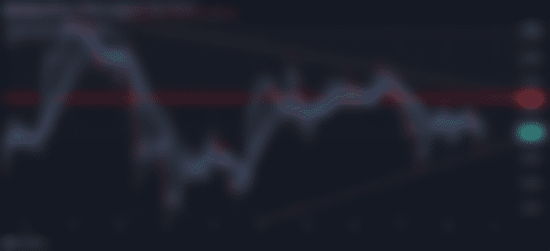
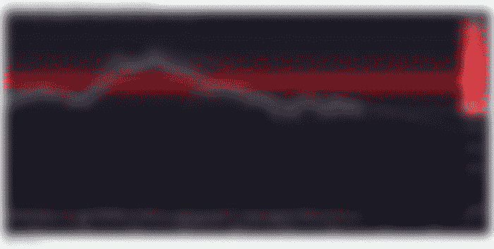

# 比特币:2022 年 3 月 17 日

> 原文：<https://medium.com/coinmonks/bitcoin-march-17-2022-d7565bfd7699?source=collection_archive---------40----------------------->

# [今晚:比特币的动向！](https://read.cash/@Rutkowski/bitcoin-march-17-2022-0d53c010#tonight-bitcoin039s-move)

# [去年这个时候，比特币在哪里？](https://read.cash/@Rutkowski/bitcoin-march-17-2022-0d53c010#this-time-last-year-where-was-bitcoin-at)

目前的比特币价格为 40，800.00 美元，与去年的价格相差约 17，000.00 美元。

虽然持有 40k 美元以上感觉很有希望，但无法超过 42k 美元是令人不安的。在历史重演之前，比特币只能被拒绝这么多次，比特币会向一个方向或另一个方向迈出重大步伐。

我们目前正在抵抗下跌趋势的阻力，同时努力守住支撑线。今晚有可能成为“比特币加密的重要一夜”，我将一如既往地保持乐观但现实。

自 2022 年 2 月 4 日以来，我们一直处于这一积累区，请记住，这一下跌趋势始于 2021 年 11 月 10 日。比特币一直在努力反弹。从$33k 到$46k 的竞争一直很激烈，我看不出任何东西会很快改变这种情况。

也就是说，我们可能更倾向于重温上一轮牛市的历史高点。让我挑战不低于 33k 美元的唯一一件事是，企业拥有数十亿美元的比特币，并继续在这些水平上买入，谈论钻石手。我也探索过一些主要的秩序册…

蝙蝠基本注意力标志

英美烟草公司看起来已经准备好迎接 2021 年 11 月的新一轮竞争了。我不会拿房子做赌注，但我会坚持下去。捐赠和广告支付开始形成一种模式。

XRP 仍然没有和解！

XRP 仍在打这场官司，但似乎再次变得乐观起来。我们看到了一个下跌的趋势，但是我们确实在另一个阻力位上方收盘，这可能是在这个水平支撑的好迹象。

BCH 比特币现金，人民的选择

BCH 比特币现金目前看起来与比特币图表有点相似，只是略有不同，没有超出正常范围。无论批评者愿不愿意承认，我一直坚信比特币现金与比特币直接相关。

我知道这冒犯了很多人，但是 BCH 是从哪里来的？比美国广播公司，现在是电子现金，顺便说一句，我做得很体面，当我分裂我的 BCH 到美国广播公司，然后它自动把自己变成电子现金。有人从中获利吗？

安培

我对 AMP 的了解非常有限，我确实有几千个，以防万一。我总是密切关注 CoinBase，因为除了迷因币之外，他们似乎是引领大多数潮流的人。

他们确实采用了迷因币，而且这种趋势还在继续。考虑到他们以前没有发现价格超过这一点。我唯一能说的是，AMP 似乎正在和加密市场的其他公司一起获得牵引力。假设加密市场的其余部分继续获得牵引力，那么在不久的将来，一些主要的价格行为将会发生。

# [总结](https://read.cash/@Rutkowski/bitcoin-march-17-2022-0d53c010#summary)

我喜欢研究加密和跟踪加密市场。我喜欢定期反思，看看我在加密世界里成长了多少。我将发表另一篇关于我所持股份的博文，与我上次发表的一篇类似的博文相比，它已经失去了控制。

我开始有太多的外汇账户，太多的冷钱包，太多的种子短语，这让我不堪重负。我有一个终极交换的理想，可以解决所有这些问题，而不会错过任何机会。

想象一下，一个应用程序把你喜欢的所有东西都集中到一个地方。那将会是一些事情，不是吗？

感谢阅读，上帝保佑你&保持健康！

> 加入 Coinmonks [电报频道](https://t.me/coincodecap)和 [Youtube 频道](https://www.youtube.com/c/coinmonks/videos)了解加密交易和投资

# 另外，阅读

*   [加密复制交易平台](/coinmonks/top-10-crypto-copy-trading-platforms-for-beginners-d0c37c7d698c) | [如何在 WazirX 上购买比特币](/coinmonks/buy-bitcoin-on-wazirx-2d12b7989af1)
*   [CoinLoan 评论](https://coincodecap.com/coinloan-review)|[Crypto.com 评论](/coinmonks/crypto-com-review-f143dca1f74c)
*   [如何在加拿大购买加密货币？](https://coincodecap.com/how-to-buy-cryptocurrency-in-canada)
*   [百无聊赖的猿游艇俱乐部(BAYC)评论](https://coincodecap.com/bored-ape-yacht-club-bayc-review)
*   [5 款最佳加密交易终端](https://coincodecap.com/crypto-trading-terminals) | [最佳 DeFi 应用](https://coincodecap.com/best-defi-apps)
*   [最佳网上赌场](https://coincodecap.com/best-online-casinos) | [币安评论](/coinmonks/binance-review-ee10d3bf3b6e) | [BitMEX 评论](https://coincodecap.com/bitmex-review)
*   [麻雀交换评论](https://coincodecap.com/sparrow-exchange-review) | [纳什交换评论](https://coincodecap.com/nash-exchange-review)