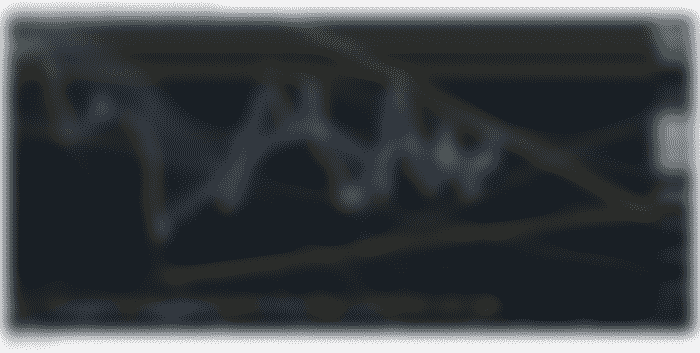
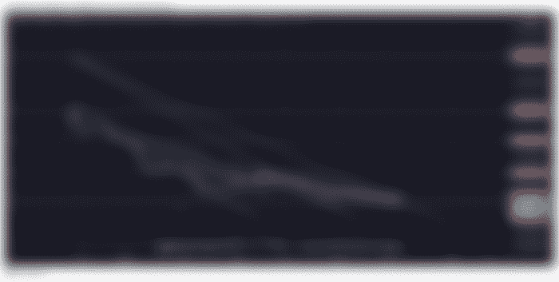

# 比特币:2022 年 3 月 18 日看涨周五！

> 原文：<https://medium.com/coinmonks/bitcoin-march-18-2022-bullish-friday-71f44c164f4a?source=collection_archive---------36----------------------->

# [41K 美元的比特币](https://read.cash/@Rutkowski/bitcoin-march-18-2022-bullish-friday-cb843bc4#bitcoin-at-41k)

比特币正在引领一个可能是“熊市阻力粉碎的周末”，而我们仍在与阻力区作战，比特币却显示出想要占据上风的迹象。

我们目前仍有两个阻力位压制比特币。值得注意的是，我们目前高于 41，000 美元，目标是再次达到 42，000 美元。当我写这篇文章时，我希望看到我们突破 42K 美元。

我花了一些时间谈论牛市，以及比特币如何仍然是加密技术总市值的主导因素。这是许多没有充分观察市场足够长时间的个人的分歧领域。

当比特币看涨时，大约 80%会上涨，20%会下跌，当比特币看跌时，20%会上涨，80%会下跌。我观察这种趋势已经很多年了。可能足够让我变得有点自满。

我有时会看比特币，发现它的表现很差，我可能会耸耸肩，看看几个钱包，发现我错过了一些不错的销售潜力。我目前正在编写一个名为鲍勃的虚拟人类助手。我将会发布关于给他编程的深度文章，但是这需要时间。

我目前在他的加密方面工作。我让 Bob 去检索目前为止超过 10 种加密货币的当前价格。我正在添加一个投资组合跟踪模块，这样鲍勃将实时监控我的加密，并提醒我，当我持有的任何加密货币移动。

有没有其他人对这种类型的软件感兴趣，或者只有我觉得需要一个虚拟人来帮助我的投资组合？

XRP 0.79 美元

Ripple 试图辩称，由于 RIPPLE 赢得了公平通知辩护动议，SEC 的内部文件对 SEC 来说毫无用处。Ripple 一直与监管机构、律师和政府官员合作，以实现 Ripple 的目标“清晰”。

该诉讼是关于 XRP 是否代表瑞波，以及如果瑞波被命令停止和终止与 XRP 的所有关系，并被命令烧毁瑞波的 XRP，XRP 甚至会有市场吗？这会伤害 XRP 持有者吗？

我个人喜欢基于 Ripple 的 XRP 的想法，即请求银行和政府利用 XRP 获得(ODL)按需流动性，这种流动性的成本几乎不到一美分，可以立即发送数十亿美元。

这是 XRP 的优势

YOOSHI 家族。每百万 28 美分！

上面的图表显示了 YOOSHI 交易观的部分历史。我在 2021 年夏天左右开始购买 YOOSHI，当时的价格不到 10 美元/1 亿，而现在是 29.44 美元/1 亿 YOOSHI。

佑希的表现和柴犬很像，除了在更大的时间尺度上。YOOSHI 正在创建自己的充满 NFTS 的生态系统，为持有者矿工提供动力！我将长期拥有 YOOSHI，或者直到我有足够的房子钱，这样我就可以有一个包了。

理想情况下，YOOSHI 应该在接下来的四周内开始采取一些像样的措施。我知道对 YOOSHI 来说这是一个很长的时间框架，但这是现实的。

说到 SHIB，每百万 22 美元

我以百万分之 0.04 的价格买入 SHIB，这可能是我买入 YOOSHI 和其他项目的唯一原因，比如我以前通常不会投资的 ELON。扬声器敲门者的一句话，“恐惧的钱不赚钱”。这句话有时是正确的。

就回报而言，SHIB 是我迄今为止做的最好的投资。基于当时的研究，我不会说这是最好的投资，但我很高兴我做了这个决定。本周，SHIB 准备应对每百万 28 美元。

总结:

过去几天相当乐观，包括今天。我知道我们现在有一大堆理由应该极度乐观。然而，在过去的几周里，比特币从周五到周日开始下跌，然后再次上涨。

我希望看到看涨的势头继续下去，突破 42K 美元，并开始挑战 46K 美元，这将使我对加密市场保持舒适的心态，前提是没有疯狂的事情发生。

本周大部分市场都很好&一片绿色，让人松了一口气。许多图表开始暗示一个坚实的底部，让人们有理由相信另一条腿正在上升。我们仍然很有可能再次走低。

这是你们期待已久的时刻。

BCH 比特币现金

比特币现金 BCH 和它的前身比特币一起上升并不奇怪。BCH 是在一个点上，我们应该看到一个不错的穗，并提供我们不会被拒绝第 9 次，我们应该再次向 420 美元的范围。

感谢阅读，上帝保佑你&保持健康！

> 加入 Coinmonks [电报频道](https://t.me/coincodecap)和 [Youtube 频道](https://www.youtube.com/c/coinmonks/videos)了解加密交易和投资

# 另外，阅读

*   [麻雀交换评论](https://coincodecap.com/sparrow-exchange-review) | [纳什交换评论](https://coincodecap.com/nash-exchange-review)
*   最好的[加密税务软件](/coinmonks/best-crypto-tax-tool-for-my-money-72d4b430816b) | [硬币追踪评论](/coinmonks/cointracking-review-a-reliable-cryptocurrency-tax-software-5114e3eb5737)
*   [Stackedinvest 评论](https://coincodecap.com/stackedinvest-review) | [北海巨妖评论](/coinmonks/kraken-review-6165fc1056ac) | [bitFlyer 评论](https://coincodecap.com/bitflyer-review)
*   最佳[加密借贷平台](/coinmonks/top-5-crypto-lending-platforms-in-2020-that-you-need-to-know-a1b675cec3fa) | [杠杆令牌](/coinmonks/leveraged-token-3f5257808b22)
*   最佳[加密制图工具](/coinmonks/what-are-the-best-charting-platforms-for-cryptocurrency-trading-85aade584d80) | [最佳加密交易所](/coinmonks/crypto-exchange-dd2f9d6f3769)