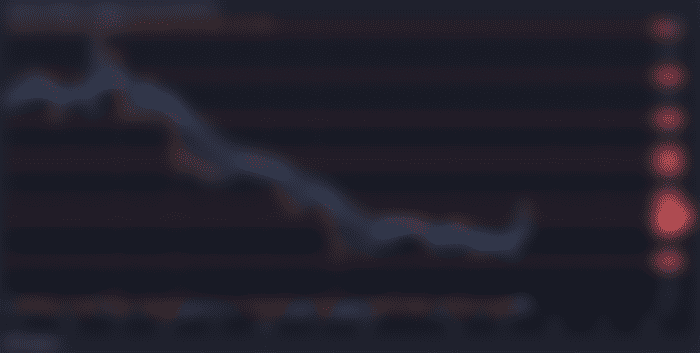
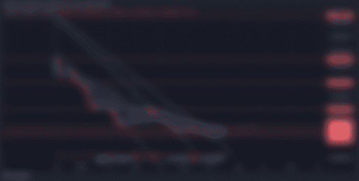

# 比特币:2022 年 3 月 24 日；不错的泵，更大的修正？

> 原文：<https://medium.com/coinmonks/bitcoin-march-24-2022-nice-pump-bigger-correction-7ddf3d375d8f?source=collection_archive---------79----------------------->

# 44000 美元以上的比特币？

比特币火了，就看你用哪个交易所了。仅今天一天，比特币价格就飙升至 44000 美元至 47000 美元之间。然而，我使用币安比图。比特币不断穿越强阻力位，寻找强支撑维持。

我们很多人开始问的问题是，我们是否正处于一个新周期的起点？这个周期真的结束了吗？我们还看空吗？

# 我们正在开始一个新的周期吗？

虽然我们已经从 29k 美元到 33k 美元低到 44k 美元到 47k 美元，而且在图表上看起来非常好，尽管我们仍然比以前的顶部低大约 30%(这是合理的估计，不是确切的数字)。

很难说我们不再看跌了。我们仍然有很多因素在影响比特币和整个加密市场的价格走势。其中大部分都非常乐观。

有史以来最受欢迎的一句话，“最好的买入时机是当他们血流成河的时候。”事实上，市场在大约 16 周的时间里都是熊市。例外情况是两周休假，然后是一周休假。

对我来说，最大的警示信号是上面提到的“假出局”。这是比特币自 33000 美元左右的“所谓底部”以来，第四次试图创下比前几次下跌趋势更高的高点

历史一直是判断比特币在特定走势后可能走向的有力指标。虽然我不是财务顾问，但我也不会假装提供财务建议。我倾向于认为，如果我们突破 47k 美元，并像目前在 42k 美元上方那样保持强劲支撑，那么底部可能会正式到来。

我们不会脱离困境，直到我们在 52000 美元以上，这是我一直谈论的可怕水平。

# [上一个周期真的结束了吗？](https://read.cash/@Rutkowski/bitcoin-march-24-2022-nice-pump-bigger-correction-12142c94#was-the-previous-cycle-ever-really-over)

自“2020 年牛市周期”开始以来，这一理论一直备受争议。随着时间的推移，我们发现这种情况正在遥远地上演。几乎就像时间框架和价格行为不同的“2013 年牛市”。

在“真正的熊市”开始之前，我听到的关于“三重顶理论”的最初理论来自 BitBoyCrypto。我不知道他是否还在接受“三重顶理论”，我也不关心。然而，我发现它与更大范围的事情相关。

我以前说过很多次了，我们只不过是研究未知领域的人类，试图成为克里斯多佛·哥伦布。我们正在从有限的数据中学习，这些数据每天都在增长，并随着时代的发展而发展。虽然大多数时候，时间框架预测会变成一个史诗般的失败。

当你仔细研究时，唯一的失误是预测的时间框架。到目前为止，我们已经看到了“两个顶点”。也就是说，回顾之前的熊市，在进入短暂的熊市之前，我们最有可能看到有 78%的机会到达第三个顶部。

我对“第三高”的上行并不乐观，但是，我的 137K 美元预测发生的可能性几乎为零，除非我们处于新周期的开始。这波浪潮可能会在 2021 年 4 月紧随其后。

# 我们还看跌吗？

是的，我们仍然看跌，至少目前是这样。尽管大量证据、市场情绪和其他所有指标都表明我们正在看涨，但我们必须谨慎行事。当市场像这样时，人们往往会过于贪婪。

当我们变得过于贪婪时，我们会放松警惕，常常会被毁了。尽管我们应该做最坏的打算。不管我们想不想说。我们目前从之前的高点全线大幅下跌。

至少可以说，这并不算不正常，但我们必须依靠摆在我们面前的证据。这一证据表明，即使现在是 44k 美元，我们仍然处于熊市。我们仍然有一个强有力的下降趋势，现在似乎变弱了。

然而，比特币每遭到一次拒绝，下跌趋势就会加强。现在图表上的价格跳跃量是一个非常高的指标，表明价格水平在当前时间是不可持续的，一根向下的蜡烛即将进入一个非常强的支撑区。这就是它如何看待此刻是时间。

# [比特币现金:BCH；它在哪里？](https://read.cash/@Rutkowski/bitcoin-march-24-2022-nice-pump-bigger-correction-12142c94#bitcoin-cash-bch-where-is-it-at)

比特币现金似乎已经领先于它的前身比特币。BCH 从周二和周三的高点下跌了约 25 美元。BCH 看起来可能能够守住之前的阻力位。

前提是我们不会看到它的前身有重大下降。历史已经一次又一次地证明了自己，随着时间的推移，比特币的下跌极大地影响了 BCH，除了 Altcoin 季节。

“三重顶理论”的另一个注意事项是，这意味着真正的替代硬币季节还没有真正发生。对于我们这些为支付账单和养家糊口而苦苦挣扎的人来说，这将是一个福音。生活成本不断上升，工资保持不变，我们变得更穷，而富人变得更富。

密码改变了这一切。

## XRP

XRP 仍在跟随上升趋势，看起来非常乐观。过去几周，XRP 有很多重大新闻头条，这给了投资者更多理由投资 FOMO。然而，真正的 FOMO 甚至还没有开始，预计将在 2022 年 8 月初开始。

唯一一个从受孕的第一天起就有实际使用案例的秘密。我并不想冒犯任何目前已经出现的有各种用例的加密项目。我只是在思考 XRP 出现时的市场。

# [YOOSHI](https://read.cash/@Rutkowski/bitcoin-march-24-2022-nice-pump-bigger-correction-12142c94#yooshi)

在我看来，YOOSHI 将是最后一个真正爆炸的人。YOOSHI 目前的价格是 0.32 美分，牢牢地控制在 0.28 美分之上，它在这个价位上停留了似乎几年，但仅仅是几个星期。

你的钱包里有什么？YOOSHI！哈哈我忍不住了。

# [芝 INU 真正的总督黑仔](https://read.cash/@Rutkowski/bitcoin-march-24-2022-nice-pump-bigger-correction-12142c94#shiba-inu-the-real-doge-killer)

柴田 INU 最近被谈论了很多。人们谈论的焦点是，随着 SHIBA 价格走高，它将夺回每百万美元 40 美元的区域。我不确定我会在这一点上赌上我的房子。然而，如果你在我第一次告诉你们买柴犬的时候就赌上了你的房子，那么现在你会有大约 20 栋房子。

不要睡在 shiba 上，Bullzilla 在我放弃试图让他注意到 shiba 以及 bitboy 和其他有影响的人几个月后使用了这句话。

# [总结](https://read.cash/@Rutkowski/bitcoin-march-24-2022-nice-pump-bigger-correction-12142c94#summary)

春天到了，随着天气转暖。家庭正在计划度假，与朋友和爱人共度时光，同时沐浴夏日阳光。我想祝大家一路平安，度过一个愉快的夏天，愿上帝保佑你和你所爱的人。

我知道在财务上，crypto 对我和我的家人来说确实是一种变相的祝福。家人可能不像我这样理解 crypto，但这就是为什么他们有我，哈哈。我们仍然很幸运能成为像密码这样重要的东西的一部分。

除了财务自由之外，加密确实在很多方面改变了生活。是的，我知道财务自由是大多数人第一次冒险进入加密革命时的梦想。那些拒绝承认其存在的人仍能接触到加密技术，更不用说它对整个世界的影响了。

即使自称天才的人也常常无法理解密码。我曾经在 2020 年 3 月崩盘前的 2019 年和一个男人聊过。这个人被当地社区视为天才。我知道这个人在枪支方面很聪明，修理汽车以及毫无意义的社交媒体视频。

我听到这位先生谈论他的 401K，以及他认为在当时投资某些行业是最好的，酒店业。我试图向他解释，随着 2020 年崩盘的临近，市场即将崩溃。

我解释了 crypto，以及如果他当时兑现了他的 401K，只投资 25%,并在来年将现金投资到股票市场，他就再也不用担心钱了。这个人试图嘲笑我，好像我是无知的，不理解经济和政治如何影响一切。

不用说，不要像这家伙。所有的迹象都是他们的，你所要做的就是做一些研究，你会自己发现的。我也喜欢向那个人提起比特币，因为他几乎每天都会听到比特币，不管他做什么。有时候当你看着它毁掉你周围的人，知道他们所要做的就是倾听和研究，这真的很糟糕。

> 加入 Coinmonks [电报频道](https://t.me/coincodecap)和 [Youtube 频道](https://www.youtube.com/c/coinmonks/videos)了解加密交易和投资

# 另外，阅读

*   [Exness 点评](https://coincodecap.com/exness-review)|[moon xbt Vs bit get Vs Bingbon](https://coincodecap.com/bingbon-vs-bitget-vs-moonxbt)
*   [如何开始通过加密贷款赚取被动收入](https://coincodecap.com/passive-income-crypto-lending)
*   [BigONE 交易所评论](/coinmonks/bigone-exchange-review-64705d85a1d4) | [电网交易机器人](https://coincodecap.com/grid-trading)
*   [氹欞侊贸易评论](https://coincodecap.com/anny-trade-review) | [CoinSpot 评论](https://coincodecap.com/coinspot-review)
*   [新加坡十大最佳加密交易所](https://coincodecap.com/crypto-exchange-in-singapore) | [收购 AXS](https://coincodecap.com/buy-axs-token)
*   [投资印度的最佳加密软件](https://coincodecap.com/best-crypto-to-invest-in-india-in-2021) | [WazirX P2P](https://coincodecap.com/wazirx-p2p)