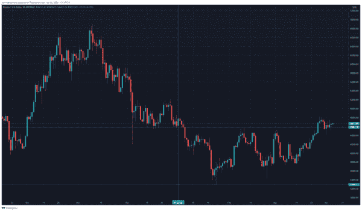

# 比特币市场情报—第一期

> 原文：<https://medium.com/coinmonks/bitcoin-market-intelligence-issue-1-fbed6903b081?source=collection_archive---------36----------------------->

## 两周一次的时事通讯发布

嘿大家好，

欢迎来到我关于比特币的双周刊的第一期。我很高兴你已经找到了我的简讯，我希望你会发现它有用和信息丰富。

在这篇时事通讯中，我将从链上和链下的角度来写比特币、宏观发展、比特币与金融市场的关系以及比特币网络的基本发展。

今天，我将对比特币、其相对于其他金融资产的表现以及宏观发展有一个更全面的了解。

根据 messari.io 的数据，2021 年 11 月 10 日，比特币价格创下 68721.9 美元的历史新高。自那以后，比特币的价格开始降温，有时已经从历史高点下跌了 40%以上。在整个 2022 年，价格主要在 33k 美元和 46k 美元之间交易，最近有一些迹象表明突破了这个范围。

Graph 1: Bitcoin Price USD Bitstamp (Source: Tradingview)

比特币的价格在这两个水平之间波动，表明市场参与者犹豫不决。在我看来，这并不奇怪，因为…

**你可以在这里免费阅读时事通讯全文:**

 [## 比特币市场情报-第 1 期

### 嗨，大家好，欢迎来到我关于比特币的双周时事通讯的第一期。我很高兴你找到了你的…

www.getrevue.co](https://www.getrevue.co/profile/bitcoinmarketintelligence/issues/bitcoin-market-intelligence-issue-1-1103838) 

**别忘了订阅时事通讯，以免错过下一期。**

*本内容仅用于教育目的。它不构成交易建议。过去的表现并不代表未来的结果。不要投资超过你能承受的损失。本文作者可能持有文章中提到的资产。*

> 加入 Coinmonks [电报频道](https://t.me/coincodecap)和 [Youtube 频道](https://www.youtube.com/c/coinmonks/videos)了解加密交易和投资

# 另外，阅读

*   [Bookmap 评论](https://coincodecap.com/bookmap-review-2021-best-trading-software) | [美国 5 大最佳加密交易所](https://coincodecap.com/crypto-exchange-usa)
*   [如何在 FTX 交易所交易期货](https://coincodecap.com/ftx-futures-trading) | [OKEx vs 币安](https://coincodecap.com/okex-vs-binance)
*   [CoinLoan 评论](https://coincodecap.com/coinloan-review) | [YouHodler 评论](/coinmonks/youhodler-4-easy-ways-to-make-money-98969b9689f2) | [BlockFi 评论](https://coincodecap.com/blockfi-review)
*   XT.COM 评论 | [币安评论](https://coincodecap.com/xt-com-review)
*   [SmithBot 评论](https://coincodecap.com/smithbot-review) | [4 款最佳免费开源交易机器人](https://coincodecap.com/free-open-source-trading-bots)