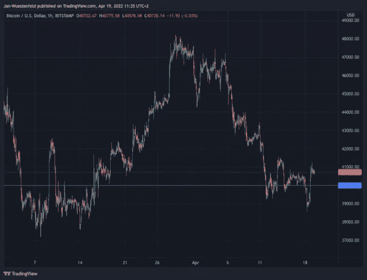

# 比特币市场情报—第 2 期

> 原文：<https://medium.com/coinmonks/bitcoin-market-intelligence-issue-2-a57134049255?source=collection_archive---------36----------------------->

嘿大家好，

我很高兴你找到了我的第二期简讯。在第一篇文章中，我写了市场的总体发展以及比特币与其他资产、中央银行等的关系。

在这一期，我将写更多关于比特币网络本身的基本发展。

上周，比特币的价格自 3 月中旬以来首次跌破 4 万美元(目前交易回到 4 万美元以上)，显示出一些疲软的迹象。然而到目前为止，价格保持良好。

Graph 1: Bitcoin Price USD Bitstamp Hourly (Source: Tradingview)

**美联储和欧洲央行**

在进入基本面之前，我想简单更新一下上一期的时事通讯。如果之前有任何疑问，美联储确实在 4 月 6 日非常明确地表明了其鹰派立场…

**你可以在这里免费阅读时事通讯全文:**

 [## 比特币市场情报-第 2 期

### 大家好，我很高兴你们找到了我的第二期时事通讯。在第一篇中，我写了…

www.getrevue.co](https://www.getrevue.co/profile/bitcoinmarketintelligence/issues/bitcoin-market-intelligence-issue-2-1121166) 

**别忘了订阅时事通讯，以免错过下一期。**

本内容仅用于教育目的。它不构成交易建议。过去的表现并不代表未来的结果。不要投资超过你能承受的损失。本文作者可能持有文章中提到的资产。

> *加入 Coinmonks* [*电报频道*](https://t.me/coincodecap) *和* [*Youtube 频道*](https://www.youtube.com/c/coinmonks/videos) *了解加密交易和投资*

# 另外，阅读

*   [3 商业评论](/coinmonks/3commas-review-an-excellent-crypto-trading-bot-2020-1313a58bec92) | [Pionex 评论](https://coincodecap.com/pionex-review-exchange-with-crypto-trading-bot) | [Coinrule 评论](/coinmonks/coinrule-review-2021-a-beginner-friendly-crypto-trading-bot-daf0504848ba)
*   [莱杰 vs n rave](/coinmonks/ledger-vs-ngrave-zero-7e40f0c1d694)|[莱杰 nano s vs x](/coinmonks/ledger-nano-s-vs-x-battery-hardware-price-storage-59a6663fe3b0) | [币安评论](/coinmonks/binance-review-ee10d3bf3b6e)
*   [Bybit Exchange 审查](/coinmonks/bybit-exchange-review-dbd570019b71) | [Bityard 审查](https://coincodecap.com/bityard-reivew) | [Jet-Bot 审查](https://coincodecap.com/jet-bot-review)
*   [3 commas vs Cryptohopper](/coinmonks/3commas-vs-pionex-vs-cryptohopper-best-crypto-bot-6a98d2baa203)|[赚取加密利息](/coinmonks/earn-crypto-interest-b10b810fdda3)
*   最好的比特币[硬件钱包](/coinmonks/hardware-wallets-dfa1211730c6) | [BitBox02 回顾](/coinmonks/bitbox02-review-your-swiss-bitcoin-hardware-wallet-c36c88fff29)
*   [block fi vs Celsius](/coinmonks/blockfi-vs-celsius-vs-hodlnaut-8a1cc8c26630)|[Hodlnaut 审核](/coinmonks/hodlnaut-review-best-way-to-hodl-is-to-earn-interest-on-your-bitcoin-6658a8c19edf) | [KuCoin 审核](https://coincodecap.com/kucoin-review)