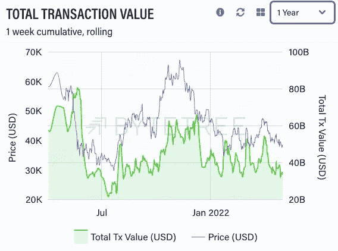

# 比特币市场情报—第 3 期

> 原文：<https://medium.com/coinmonks/bitcoin-market-intelligence-issue-3-2f19cb9c7e4b?source=collection_archive---------31----------------------->

嘿大家好，

欢迎阅读比特币市场情报简讯第三期。在这一期，我将深入探讨可以用来衡量比特币兴趣和活跃度的指标。

在上一期，我已经写过三个衡量网络活跃度的指标。即链上转移的比特币总价值以及向交易所发送比特币和从交易所接收比特币的地址数量。

这三项指标都继续处于低位。事实上，自第三期以来，从交易所接收比特币的地址数量的 7 天移动平均数甚至进一步下降，现在低于上次熊市的水平。

但这三个指标并不是唯一可以用来衡量比特币网络和比特币整体活动的指标…

**你可以在这里免费阅读时事通讯全文:**

 [## 比特币市场情报-第 3 期

### 大家好，欢迎来到第三期比特币市场情报简讯。在这个问题上，我将采取…

www.getrevue.co](https://www.getrevue.co/profile/bitcoinmarketintelligence/issues/bitcoin-market-intelligence-issue-3-1142268) 

**别忘了订阅时事通讯，以免错过下一期。**

*本内容仅用于教育目的。它不构成交易建议。过去的表现并不代表未来的结果。不要投资超过你能承受的损失。本文作者可能持有文章中提到的资产。*

> *加入 Coinmonks* [*电报频道*](https://t.me/coincodecap) *和* [*Youtube 频道*](https://www.youtube.com/c/coinmonks/videos) *了解加密交易和投资*

# 另外，阅读

*   [有哪些交易信号？](https://coincodecap.com/trading-signal) | [Bitstamp vs 比特币基地](https://coincodecap.com/bitstamp-coinbase) | [买索拉纳](https://coincodecap.com/buy-solana)
*   [ProfitFarmers 回顾](https://coincodecap.com/profitfarmers-review) | [如何使用 Cornix Trading Bot](https://coincodecap.com/cornix-trading-bot)
*   [十大最佳加密货币博客](https://coincodecap.com/best-cryptocurrency-blogs) | [YouHodler 评论](https://coincodecap.com/youhodler-review)
*   [MyConstant Review](https://coincodecap.com/myconstant-review) | [8 款最佳摇摆交易机器人](https://coincodecap.com/best-swing-trading-bots)
*   [MXC 交易所评论](/coinmonks/mxc-exchange-review-3af0ec1cba8c) | [Pionex vs 币安](https://coincodecap.com/pionex-vs-binance) | [Pionex 套利机器人](https://coincodecap.com/pionex-arbitrage-bot)