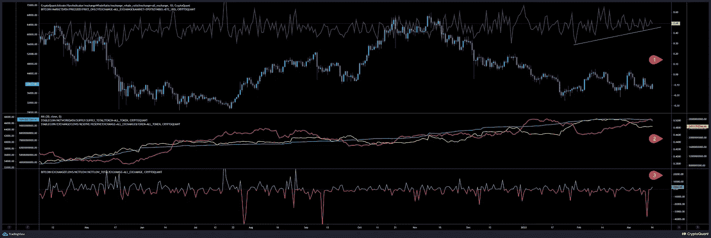
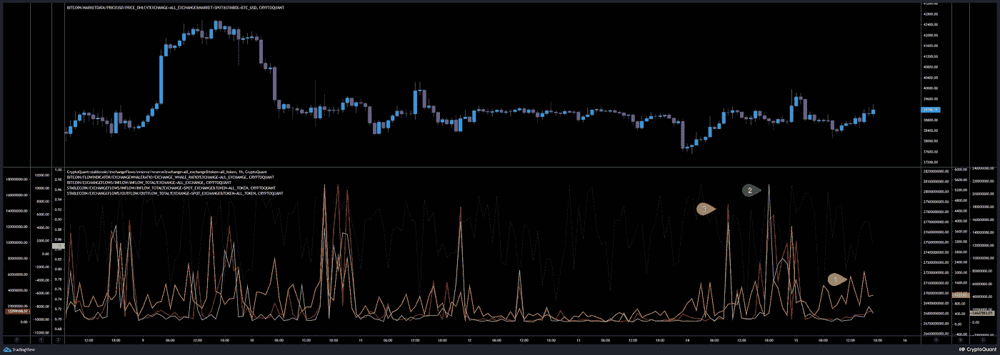
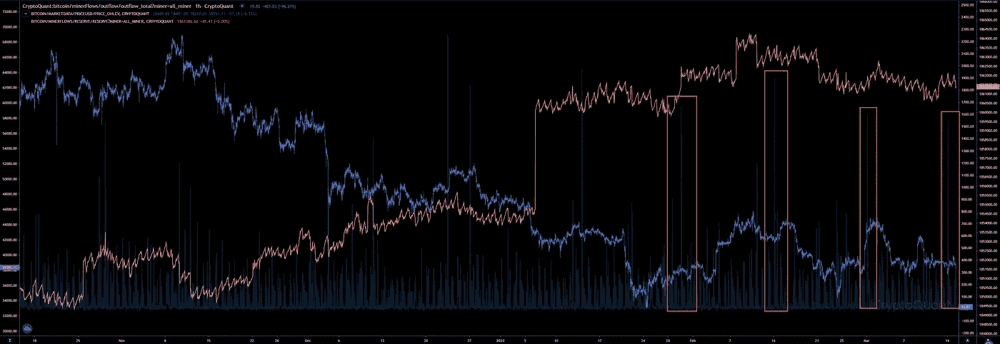
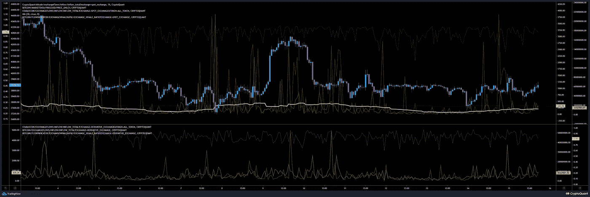
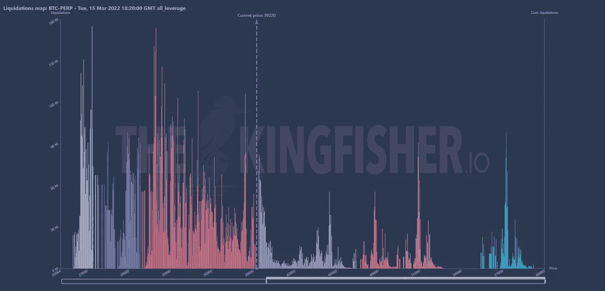
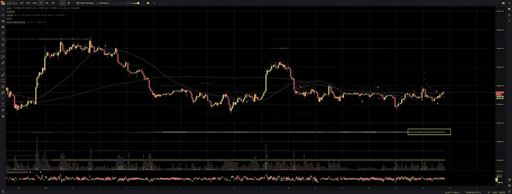
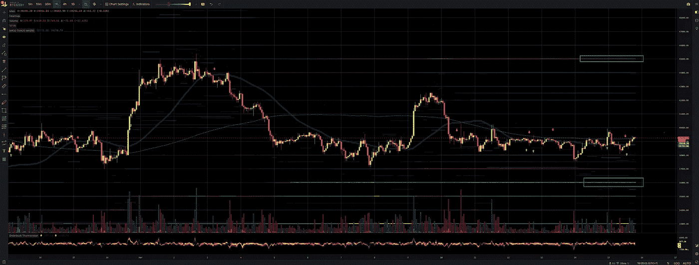
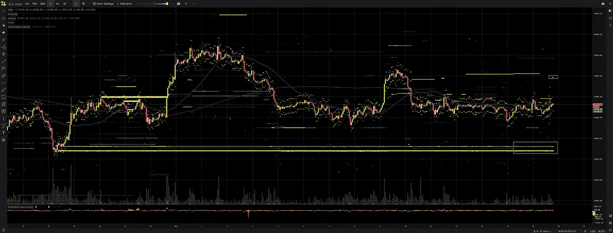
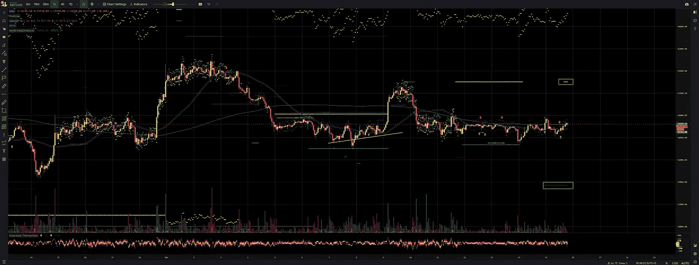

# 比特币市场更新[16 年 3 月 22 日]

> 原文：<https://medium.com/coinmonks/bitcoin-market-update-16mar22-55d616fc3b37?source=collection_archive---------46----------------------->

**鲸比-每日查看
图表分析**

鲸鱼比率(1)不断形成更高的低点，表明它保持相对较高的卖出压力。自 2 月份以来，我们的卖出压力越来越大。就像十二月和一月之间的时间一样。然后，我们有一个在鲸鱼的比例和价格跟着泵转储。

鲸的比率 30d 平均值②似乎达到了顶峰，现在正在下降。虽然稳定的铜储量没有变化，整体供应正在下降，但只是一点点。

昨日交易所总净流量(3)显示流入量大于流出量，表明净流量约为 2800 BTC。

**结论**:鲸比 30d 已经达到顶峰。通常从现在起，我们应该期待一个垃圾场很快。

**市场流量分析
图表分析**

BTC①流入量越来越多。昨天有近 23500 笔 BTC 资金流入，我想说，今天流入 BTC 的资金甚至更多。

稳定的货币流入量(2)今天有所下降。昨天，我们几乎达到了 1 月 28 日的水平，有近 9.8 亿美元！！稳定的货币外流(3)昨天也很大，几乎 9 . 5 亿美元，比 7 月 22 日少一点！！今天检测到的稳定硬币运动少了很多

**结论**:检测到较不稳定的可卡因活性，但检测到较多的 BTC 活性。这不一定是看跌，因为他们可以使用这些 BTC 也作为硬币保证金。接下来我们需要检查衍生品市场。

**矿工流量分析
图表分析:**

昨天，矿工们卖出了 2867 辆 BTC。正如在之前的分析中提到的，这似乎是他们自今年以来每两周做的事情。

**结论**:矿工储量在下降，但仍维持在 186 万 BTC 以上的水平。

**期货交易分析
数据分析:**

自昨天以来，融资利率已经下降，而未平仓利率正在上升，杠杆率也在上升！

许多流入 BTC 的资金都与衍生品交易有关！有趣的是，我们可以发现大量 BTC 资金从衍生品交易所流出，这可能是获利回吐的一个指标。近 5000 BTC 在过去的两个小时内被撤回！稳定的货币活动保持在相对较低的水平，交易量保持在 1 亿美元以下。

**结论**:尽管融资利率自昨日以来有所下降，但现在几乎是中性的，而且还会再次上升。与此同时，未平仓合约的增加表明更多的多头正在到来，并带来更多的平仓量

根据平仓图，我们正在积累更多的长期平仓量。鲸鱼可以推高一点，在 39.4k - 39.8k 平仓这些高杠杆空头，但长期平仓量应该会吸引他们更多。38.4k 以下的看起来都很有前景。

**交换订单墙壁
分析:**

比特币基地限制下降到 35k。

币安在 45k 限制上升，在 36k 限制下降。

**Bitfinex** 限制上行至 43.4k(低卷)，限制下行至 37.8k(低卷簇)。

**FTX Perp** 在 41.9k 限制上涨，在 37k 和 35.2k 限制下跌

**北海巨妖**在 43.6k 限涨，在 38k 和 35k 限跌。

BitMex 在 43k 限制上涨，在 33.7k 限制下跌。

结论:看来 43k 可能是下一个局部顶部，35k 可能是下一个局部底部。

# 结论和个人交易策略

鲸鱼比率保持高位，检测到更多与衍生品交易相关的流量，与期权交易相关的 hoge 交易量表明更多的横向运行或 BTC 价格应该上升，未来交易者预计会有一个泵，而他们正在产生一个大的交易量清算集群，交易所墙保持在他们的水平，除了 FTX perp。这种变化取决于价格行为，比如控制价格变动。

几乎每个垃圾场都是从垃圾场开始的。这是我所期望的。是的，短期看涨，但我一直非常看跌。这些数据还不能让我信服。我想我们会先困住多头，然后大举抛售。因此，我将开始以最大 x12 的杠杆做空。我将在 39.5k 开始做空，我预计最大本地顶部在 42k。但是和往常一样，只是用数据做出自己的结论！

**每日加密简讯
&每日 BTC 市场更新关注我**

> 加入 Coinmonks [电报频道](https://t.me/coincodecap)和 [Youtube 频道](https://www.youtube.com/c/coinmonks/videos)了解加密交易和投资

# 另外，阅读

*   [我的加密副本交易经历](/coinmonks/my-experience-with-crypto-copy-trading-d6feb2ce3ac5) | [比特币基地评论](/coinmonks/coinbase-review-6ef4e0f56064)
*   [CoinFLEX 评论](https://coincodecap.com/coinflex-review) | [AEX 交易所评论](https://coincodecap.com/aex-exchange-review) | [UPbit 评论](https://coincodecap.com/upbit-review)
*   [AscendEx 保证金交易](https://coincodecap.com/ascendex-margin-trading) | [Bitfinex 赌注](https://coincodecap.com/bitfinex-staking) | [bitFlyer 审核](https://coincodecap.com/bitflyer-review)
*   [麻雀交换评论](https://coincodecap.com/sparrow-exchange-review) | [纳什交换评论](https://coincodecap.com/nash-exchange-review)
*   [拥护卡审核](https://coincodecap.com/uphold-card-review) | [信任钱包 vs MetaMask](https://coincodecap.com/trust-wallet-vs-metamask)