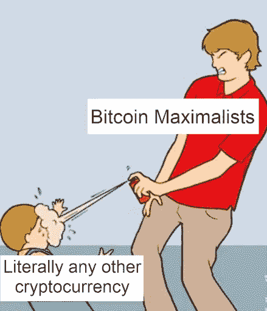

# 比特币最大化和 Web3 最小化

> 原文：<https://medium.com/coinmonks/bitcoin-maximalism-and-web3-minimalism-40c929e9cad1?source=collection_archive---------15----------------------->

如今，检查秘密空间就像欣赏你朋友推荐的那家新开的三明治店的菜单一样。这里有很多三明治，每一种你想象中的味道都很好——如果不是很好的话！然而，当你知道你真的应该只挑一个三明治并吃完它时，一种不安在你的内心深处滋长。所以，你问你的朋友，哪个潜艇是最好的？

她说，比特币。

在 Web3 的世界里，每个三明治都是一个技术筒仓。正如 Instagram、脸书、谷歌和通常的怀疑者定义了你可以在 Web2 中做什么一样，无数的协议、区块链和证明之类的东西点缀着 Web3 的景观。所有这些都引出了一个问题，用什么和为什么？

我希望调查那些选择强调比特币的少数人——看看是什么让比特币成为最大化主义者，以及为什么。但首先，为了理解比特币最大化主义者，让我们来看看比特币本身。

从根本上说，比特币是一个简单的系统。通过强大的共识层，比特币网络为世界上任何两个人提供了一种安全的机制，以交换价值、锁定资金或对他们的硬币执行有限但有用的操作。作为第一种此类货币，许多加密货币的粉丝认为其简单的设计是一种优雅，是在假名的脑海中创造的，是为人民而建的。在对比特币白皮书的介绍中的几个句子中，摆脱金融机构的愿望反映了信任一个中央机构的挫败感。一种持久的挫败感会激发一群竞争者；加密货币、比特币现金、莱特币、Dogecoin 的类似克隆，以及像以太坊这样的全新系统。

但是，暂且把比特币可能在你心中激起的对财务自由的渴望放在一边，让我们来比较一下比特币在哪里衰落，在哪里成功。

# 这项技术

比特币的粉丝经常把网络的力量作为衡量比特币价值的一个关键指标。由于整个网络很难被视为“瘫痪”，任何人都可以旋转比特币节点并参与其中，生态系统本身保持着令人印象深刻的强大区块链。此外，由于几个类似的区块链已经采用了比特币的工作证明(PoW)方案，人们认为[中本聪共识中一定存在内在价值。](https://coinmarketcap.com/alexandria/article/what-is-the-nakamoto-consensus)然而，比特币对 PoW 的依赖也是其最大的麻烦。简而言之，比特币挖矿是试图随机计算一个商定的解决方案，这个解决方案难以置信地难以找到，但却很容易验证。在这种模式下，比特币是安全的。但是，货币的批评者指出，为了成功开采一个区块，对大量计算能力和越来越多的电力的需求越来越大。如果比特币网络是一个国家，那么 T2 将是世界上能源消耗排名前 30 位的国家之一。它的同行，即[卡尔达诺和类似的基于 PoS 的生态系统](https://www.leafscore.com/blog/the-9-most-sustainable-cryptocurrencies-for-2021/)，正在积极遏制它们对环境的影响，很有可能比特币不会很快做出让步。比特币爱好者将这个看似巨大的全球能源消耗量重新定义为传统金融机构总能耗的一小部分。

此时，你可能会问，用这么多能量，比特币能实现什么？

这项技术没有你想象的那么鼓舞人心。尽管有无数的采矿设备和大量的每秒哈希运算，比特币网络每秒最多可以处理 7 笔交易。这个数字与世界上最大的金融机构之一 Visa 在这段时间内处理的 1700 笔交易相比微不足道。正是这种明显的差异有助于将两者之间的全球能源消耗联系起来。此外，一旦你的比特币交易被网络选中并“挖掘”成一个区块，为了真正确保你的交易在区块链得到保证，最好等待一个小时，让你的交易被挖掘到[概率终结](https://academy.binance.com/en/glossary/finality)的深度。

随着反对比特币协议的实际问题越来越多，该领域的同行已经对比特币的缺点进行了创新。例如，区块链竞争对手索拉纳放弃了权力。相反，竞争对手链使用一种完全不同的共识机制，称为历史证明，以达到声称的每秒 5 万笔交易。再说一次，如果你站在那张隐约可见的商店菜单前，并牢记这一切，你可能会在看到一位顾客自豪地选择比特币时挠头。—当有这么多选择的时候？

# 比特币的现在和未来

正如任何一个三明治消费者都有权选择他们个人的三明治偏好一样，任何一个密码爱好者都可以从个人偏好中选择他们最喜欢的区块链。不是每个决定都必须浸透理性和彻底的逻辑。然而，如果这是你想要的，那么比特币狂热分子对加密货币的看法有很多原因。比特币最大的亮点在于它提供了一个真正去中心化的支付系统。虽然去中心化是几乎所有 Web3 项目的核心，但该领域的许多专家仍然认为比特币[做得最好](https://cointelegraph.com/explained/which-blockchain-is-the-most-decentralized-experts-answer)。今年 9 月中国禁止加密货币的决定证明了网络的弹性。当 47%的秘密开采停止时，比特币并没有消亡。相反，价格会像任何资产一样调整，网络也会随之调整。

对于许多比特币最大主义者来说，这些方面(安全性、适应性、真正的分散性)似乎体现了他们愿意为之献身的一座小山。这种心态得到了 Twitter 前首席执行官杰克·多西的支持，他同时支持比特币作为美元的最终替代品，并对整个 Web3 持批评态度。多尔西引用了向 Web3 生态系统注入巨额资金的例子，阐明了一种金融拐杖，它在提升空间、允许创新的同时，也创造了一个由风险投资公司连接在一起的激励系统——在许多有前途的 Web3 项目背后引入了一个中心实体。在这里，人们如何判断一个集中的实体对一个分散的技术的影响程度还不清楚，但是杰克和许多其他人坚信这项技术。或许，在比特币最大主义者的心目中，这种加密货币是高尚地建立起来的，它的目的是挑战并有可能解放那些来自中央金融机构的人，它成功了。当被简单地视为对传统金融的反击时，比特币完成了它设定的目标，并在这一过程中获得了大量支持。虽然它的缺点，即 PoW 的各个方面可能永远不会直接得到解决，但比特币的最大主义者对他们的代表作比特币感到满意，比特币可能会继续改善，但没有必要。