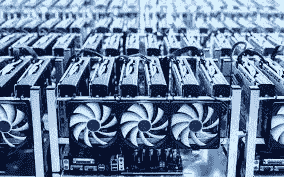

# 用指南针挖掘比特币

> 原文：<https://medium.com/coinmonks/bitcoin-mining-with-compass-b1e352365f75?source=collection_archive---------7----------------------->

## 首先，什么是比特币挖矿，它是如何工作的？

从最纯粹的形式来看，比特币挖矿是将你的计算能力贡献给比特币网络并为你的努力获得回报的过程。现在，这并不像听起来那么容易(或那么难)。挖掘比特币的过程通常会产生大量成本。通常，硬件和电力成本是最大的成本。

有几种不同的方法来挖掘密码。以比特币为例，常见的方法有两种:GPU 挖掘和 ASIC 挖掘。GPU 挖掘涉及到显卡的使用，而 ASIC 挖掘涉及到专门为挖掘比特币而专门设计的芯片的使用——仅此而已！正如人们所料，ASIC 矿用钻机的成本通常比购买显卡要高得多，然而，它们也更强大，因此(通常)更有利可图。

*现在还值得一提的是，使用 ASIC 矿机进行采矿也存在较高的风险。也就是说，一个 ASIC 矿商除了挖掘比特币之外，也没什么好的。如果比特币失去了它的光彩，拥有这样一个硬件可能不再有任何经济激励。如果这种情况发生，随着人们希望卖掉他们的设备，可能会有大量类似的机器出现，这将推低价格。我个人认为这种可能性不大。*

## 我的比特币挖矿努力

钻机，我购买了一个 AntMiner T19，这是额定为 88。这是 Terra-Hash 的缩写，是对处理能力的一种度量。处理能力越高，贡献给比特币网络的钱就越多。我的特殊投资花费了我大约 72 美元。

对于我的特殊努力，在购买我的采矿钻机后，我签署了一份合同，让它由第三方 Compass Mining 托管。他们主持和操作钻井平台，我只是支付他们的服务。

我的指南针之旅始于几个月前。在第一次听说他们之后，我花了几个月的时间进行研究，然后从他们那里买了我的第一台(也是目前唯一的一台)采矿钻机。我在 2021 年 7 月购买了该钻机，预计在 9 月上线，但在几次延迟后，它最终在 11 月中旬上线。

*老实说，我不确定这些延迟在多大程度上是由于 Compass 的所作所为或者是他们无法控制的问题。然而，他们为我的延误总共赔偿了 1000 美元。他们似乎对整个事情了如指掌，最后事情终于解决了。*

## **数字**

我购买的矿工排名第 88，根据 CryptoCompare.com 的数据，预计每天净得约 0.0005 BTC——根据我购买比特币时的价格(约 5 万美元)，每月约 900 美元。

对于 6300 美元的投资来说，每月 900 美元听起来很不错，但是有一些需要考虑的因素。第一个是主机费用。这是我向 Compass 支付的费用，用于托管和操作我的采矿钻机。他们每千瓦时收费 0.063 美元，每月大约 150 美元。这一托管量涵盖了从仓库空间到电力、冷却等所有与采矿相关的成本，除了机器本身的成本。一旦考虑到这一点，我每个月的净收入约为 750 美元，这还算不错，但有一个问题:

收入数额易变，也可能随着时间的推移而减少。有两个因素会对此产生影响

第一个问题可以归结为简单的供求关系。每 10 分钟，就有 6.5 个比特币被铸造出来，并按照矿工对网络的贡献比例分配给他们。矿工贡献的计算能力越多，他们获得的新硬币份额就越高。然而，这也有不好的一面:当你购买一台采矿钻机时，它能够产生的计算能力保持不变，但网络中的计算能力总量却不会，相反，它往往会随着时间的推移而增加，使你的钻机各自的份额越来越小。很难预测这种情况发生的速度，但这个故事的寓意是，你可以预期你的收入会随着时间的推移而减少。

另一个考虑因素是比特币本身的价格。从采矿中获得的收入以比特币计价(支付)。这意味着你的整体收入会随着比特币的价格而增减。从长期来看，我预计比特币的价格将总体呈上升趋势，但这很难说，尤其是当你试图给它设定一个时间表的时候。然而，我确实认为，比特币价格的总体上涨趋势可能会抵消一部分来自计算能力供应增加的下行压力，但很难说会抵消多少。

*重要的一点是:每四年，比特币的铸造量就会减半。这也被称为 halvening。下一次定于 2024 年。*

还有最后一个考虑因素，那就是设备的寿命。很难为一个典型的比特币挖矿平台持续多长时间规定一个精确的时间表。其中一些与维护有关—维护得当的硬件通常比维护不佳的硬件使用时间更长。然而，即使维护得当的硬件也可能具有相对较短的寿命。基于一切，我已经阅读了我购买的采矿钻机，我预计 2-3 年的使用寿命。这听起来可能不是很长的时间，事实上也不是，但机器应该在第一年结束前就收回了成本，所以这很可能是一项相当有利可图的投资。

## 现在怎么样了？

嗯，自从我的钻机上线以来，已经有两个多月了，我很自豪地说，我的钻机已经完成了大约 0.025 BTC 的采矿量。(按照目前的比特币价格，这大约是 1200 美元)。减去 600 美元的启动和托管费用，然后加上我因延迟收到的 1000 美元的信贷，我剩下大约 1600 美元的“利润”。(我还是要交税的)。考虑到这是一笔 6300 美元的投资，这确实不错。假设一切顺利，我应该在明年年中左右达到盈亏平衡点。

我也是，所有关于透明度，所以如果你想看我的采矿钻机现场统计，请随时从这个链接这样做:

[https://www . F2 pool . com/mining-user/3226 b 467 D2 de 95 DFB CD 23322 b 8583 de 0](https://www.f2pool.com/mining-user/3226b467d2de95dfbcd23322b8583de0)

我希望这篇文章能帮助你更好地理解比特币挖矿的过程是什么样的。如果你想了解更多，我鼓励你去看看 Compass 的网站。如果您有任何问题，也请联系我们，我愿意尽我所能帮助您！

 [## 指南针-比特币开采和托管

### 欢迎来到全球首屈一指的比特币交易市场！多亏了指南针，现在每个人都可以开采比特币了。

compassmining.io](https://compassmining.io/) 

(这不是一个附属链接，如果你决定通过他们购买或主办，我不赚钱)

还有，请随便给我买杯咖啡:)

BC 1 q 3 LNS j 0y 7 fgsksz 8836 MQ 0 x8 fk q 2 mxyvap 02 zue