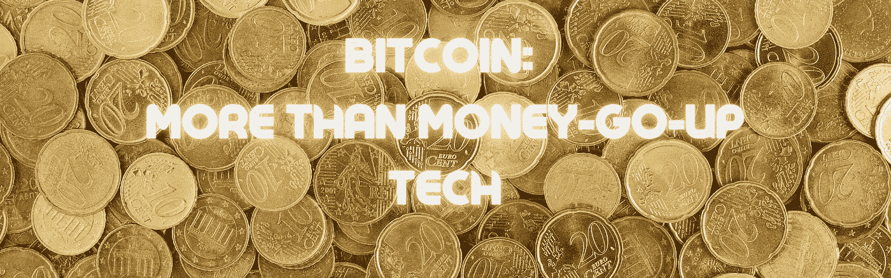

# 比特币:不仅仅是货币升值技术

> 原文：<https://medium.com/coinmonks/bitcoin-more-than-just-money-go-up-tech-7e9239a523c4?source=collection_archive---------23----------------------->

当我刚接触比特币的时候，我并不关心它是否是某种精心设计的*计划*，不可持续且腐败，或者它是否实际上是**——*——只要数字上升，我就想拥有一些。*

*具有讽刺意味的是，我对比特币的心理概念与一个没有硬币的人处于同一水平——我只是少了*点道德，多了*点决心。***

*但是随着我对加密货币的基本原理了解得越来越多——赛弗朋克文化、加密技术在战争中的应用、加密创新背后的浪漫自由主义传说——我意识到这个数字实际上是出于很多非常酷的原因而上升的。*

*我开始考虑这是 ***而不是*** 只是为了让富人更富而制造的金钱至上的技术。*

*也许普通投资者和说不的造币者在加密货币和加密技术上做了一个[催款-克鲁格](https://www.youtube.com/watch?v=y50i1bI2uN4)*

*当然，比特币不是硅谷式的技术发明。*

*大多数人没有意识到*到底发生了什么*，他们只是想*获得*带来收益的东西。这就是*完全*好的。上船吧。*

*但是他们错过了一些非常酷的想法。他们错过了拥有这种资产的骄傲和信念。*

*尽管如此，他们比那些错过收益和随之而来的所有智力上的势利感的人处于更好的状态。*

*我的意思是，如果一个人有可投资的资本，那么不涉足的最穷的借口是道德上的哗众取宠——对环境的关注，声称整个事情是一个赚钱的计划，一个泡沫，一种时尚。宣称什么都没有真正发生。*

*多可惜啊，拥有可投资的资本，却和一个因为贫穷或缺乏远见而坐失良机的愤懑之人有着同样的情绪。*

*比特币不仅仅是一种货币升值技术，更重要的是要深入了解有一天会影响每个人生活的东西。*

## *密码学是一种文化*

*有难以想象的专业领域，其中大多数你永远不会知道存在。也就是说，有难以想象的数量的人群，他们毕生致力于掌握某些你永远不会知道的技能，更不用说变得擅长了。*

*你也不需要。*

*偶尔，由于其实用性的需要，这些随机专业知识中的一种产品会使其成为主流，并使其进入更多人的生活，而这些人可能不知道它的存在。它会被误解，但会被广泛采用。*

*对大多数人来说，加密货币并不有趣，直到它达到一定的市场饱和水平*证明它的价值*。然后他们*收购了*一些。FOMO。*

*比特币的一个好处是，你可以拥有它，却不知道在这个*收购过程中发生了什么—* ,也不知道是什么改变了他的环境，让它发生。*

## *加密上网者*

*现实情况是，某一群电脑虫很长时间以来一直在努力解决现实生活中严重而可怕的问题。*

*整个军事部门的特殊情报，今天仍在运作，致力于保存这些技术的遗产。*

*“*赛博朋克”，*利用计算机科学解决社会中实际的*严重的*问题。比如战争。比如钱。*

*事实上，任何围绕金钱的话题都有非常敏感的政治含义…*

*金钱就是统治，金钱就是权力。*

*敢于将一种替代货币的技术推向市场本身就需要很大的勇气。很多**专业知识**。*

*事实上，这是几十年来密码学创新的累积——巨人站在其他巨人的肩膀上。不仅仅是聪明人，还有试图改变世界的聪明人——与许多其他聪明人合作和组织。*

*所有这些遗产——仅仅是为了提出一个资金增值计划！*

## *他们做到了*

*现在，很多事情都岌岌可危。为了强调密码朋克们进入的那种情况，当前市场持有价值**7000 亿美元**的比特币。那种价值观很难理解。*

*事实上，需要一些非常优雅的工程来建造能够在那个规模上随着时间的推移保持大量价值的东西。同时不断创新，越来越抗碎。*

*如今，基础设施是巨大的。有数十亿美元的硬件专用于保护比特币。有成千上万非常热切的人才在维护比特币。*

*简而言之，博弈论攻击了人类的思维，并高度激励它发展和维护网络。用蜂蜜比用醋能吸引更多的苍蝇。*

*由于激励，资产本身遵循同样的螺旋上升模式。*

## *看待金钱的新方式*

*把*拥有比特币*想象成*在比特币中储存价值*会有所帮助。在某种程度上，你“持有”的比特币是一种代币，代表你在网络中占据的虚拟空间。你的*值。**

*随着越来越多的人选择将他们的价值安全地储存在比特币中，价格将会上涨，因为这个空间是有限的。*

*数字*肯定是*在涨。大多数人没有意识到这一点，但他们很高兴在网络上存储价值，因为他们知道未来会有更多的人想这样做，使他们在网络上占据的空间更有价值。*

*低买高卖。*

*价格上涨纯粹是“T4”的结果，因为新价值公司希望在网络上占据同样多的“空间”。*

*当然，投机者在比特币中找到了一席之地，但他们很难称得上是比特币的发明者。*

*恰好维恩图的一边是密码朋克，另一边是阴谋家，这与大规模采用密码存储价值的想法相交。*

*虽然加密文化的基本原理告诉我们一种可以有效和安全地存储价值的技术——远离任人唯亲、腐败和官僚效率，但市场会给我们炒作、FOMO 和计划。*

> *加入 Coinmonks [电报频道](https://t.me/coincodecap)和 [Youtube 频道](https://www.youtube.com/c/coinmonks/videos)了解加密交易和投资*

## *另外，阅读*

*   *[ko only Review](https://coincodecap.com/koinly-review)|[Binaryx Review](https://coincodecap.com/binaryx-review)|[Hodlnaut vs CakeDefi](https://coincodecap.com/hodlnaut-vs-cakedefi-vs-celsius)*
*   *[比斯勒评论](https://coincodecap.com/bitsler-review)|[WazirX vs coin switch vs coin dcx](https://coincodecap.com/wazirx-vs-coinswitch-vs-coindcx)*
*   *[赢取注册奖金——10 大最佳加密平台](https://coincodecap.com/earn-sign-up-bonus)*
*   *[最佳加密交易信号电报](/coinmonks/best-crypto-signals-telegram-5785cdbc4b2b) | [MoonXBT 评论](/coinmonks/moonxbt-review-6e4ab26d037)*
*   *[Coinswitch 俱吠罗评论](/coinmonks/coinswitch-kuber-review-1a8dc5c7a739) | [电网交易机器人](https://coincodecap.com/grid-trading) | [比特币基地收费](/coinmonks/coinbase-fees-831e77d4f2c5)*
*   *[Bitget 回顾](https://coincodecap.com/bitget-review) | [双子 vs 区块链](https://coincodecap.com/gemini-vs-blockfi) | [OKEx 期货交易](https://coincodecap.com/okex-futures-trading)*
*   *[OKEx vs KuCoin](https://coincodecap.com/okex-kucoin) | [摄氏替代品](https://coincodecap.com/celsius-alternatives) | [如何购买 VeChain](https://coincodecap.com/buy-vechain)*
*   *[币安期货交易](https://coincodecap.com/binance-futures-trading)|[3 comas vs Mudrex vs eToro](https://coincodecap.com/mudrex-3commas-etoro)*
*   *[在印度利用加密套利赚取被动收入](https://coincodecap.com/crypto-arbitrage-in-india)*
*   *[德国最佳加密交易所](https://coincodecap.com/crypto-exchanges-in-germany) | [WazirX P2P](https://coincodecap.com/wazirx-p2p)*