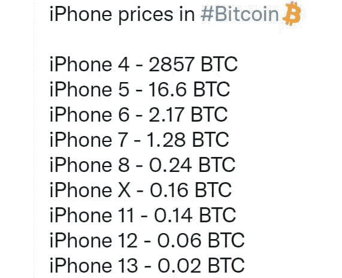
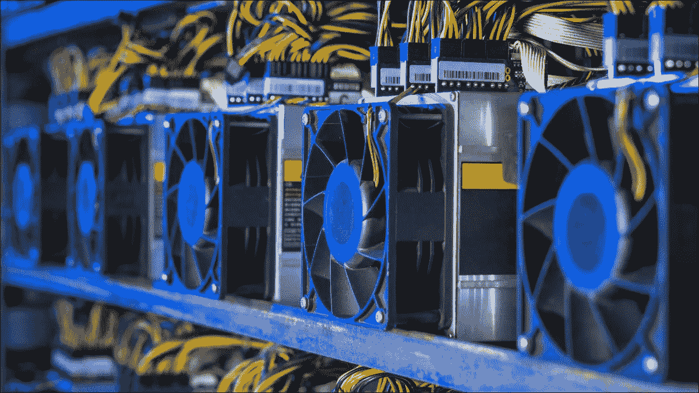
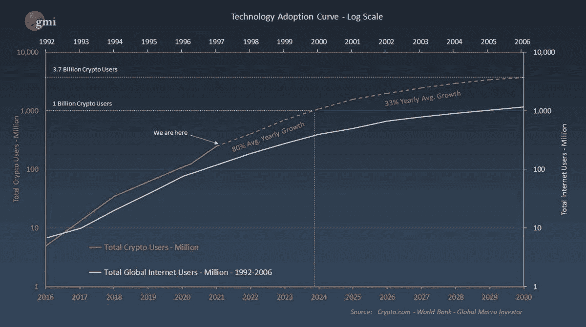

# 比特币——接触这种资产的更传统的方式。

> 原文：<https://medium.com/coinmonks/bitcoin-more-traditional-ways-to-get-exposure-to-the-asset-eb31bba7ad9f?source=collection_archive---------22----------------------->

这篇短文的唯一目的是教育。这不是财务建议。

# 舒适

这往往是我们生活中最渴望的。在这篇文章中，我将讨论舒适度和投资。然后，我会提供 3 个解决方案，帮助你对投资比特币/加密领域感到更舒服。

# 购买力&比特币

昨天，据宣布，消费者价格指数(CPI)达到了 40 年来的最高水平，达到了 7.5%。我肯定你感觉到了…在杂货店…在加油站…当你看着你的支票账户余额…

关键是，大多数人对这种明显的/增加的购买力损失感到不舒服。这是一种无声的税收形式，你并没有意识到你已经签了合同。货币贬值导致许多像你一样的人寻找保持购买力的方法。

比特币不仅是在帮助人们维持购买力，而是在帮助他们增加购买力！(见用比特币定价的 iPhones)

Twitter — Documenting Bitcoin

不幸的是，截至目前，许多人对拥有比特币并不放心。加密钱包是非传统的，可能会令人困惑。

个人保管您的密码需要高度的个人责任感和技术知识。近年来，许多人失去了获取私人密钥的途径，或者他们的比特币在 T2 交易所被盗。

害怕失去你的钱是可以理解的。不幸的是，恐惧经常让我们错过黄金投资机会。

# 另一种方法。传统投资工具。

在传统经纪账户中持有资产对投资者来说有一个明显的好处。保险。证券投资者保护公司(SIPC)在其经纪人破产的情况下保护投资者。这给他们提供了一层安慰。美国密码交易所不能提供。

所以，作为一个利用传统经纪人为你投资的人，你的最佳投资机会是什么？

1.  购买公司资产负债表上持有大量比特币的公司股票。
2.  购买正在建立加密货币交易/投资平台的公司的股票。
3.  购买那些挖掘新比特币的公司的股票。

第一个投资机会包括 Microstrategy (MSTR)、Tesla (TSLA)和 Square 等公司。微观战略是三者中最激进的。在过去的两年里，他们已经将公司的资产负债表从美元转换成了比特币。为了购买比特币，他们发行了未来现金流债券。目前，他们持有的比特币价值超过 50 亿美元。正是由于这些原因，微观策略与比特币的价格走势有着最直接的关联。持有这只股票会让你最接近直接接触比特币。(披露:我们在罗斯个人退休帐户中持有 Microstrategy 股票)

特斯拉和 Square 的比特币总资产比例要小得多，分别为 0.2%和 0.6%。因为与总资产相比，这些百分比相当小，所以这些股票与比特币的价格走势没有很强的相关性。

第二个投资机会仅限于一家上市公司，比特币基地(COIN)。比特币基地于 2012 年由 Brian Armstrong 和 Fred Ehrsam 创立。按交易量计算，它是目前美国最大的加密货币交易所，并于去年 4 月在纳斯达克上市。比特币基地目前支持 100 多种加密货币的交易，其股价通常与加密货币市场的整体表现相关。

第三个投资机会是比特币矿业公司。对美国投资者来说，几个最突出的例子包括:马拉松数字控股公司(Marathon Digital Holdings)、RIOT 区块链公司(Riot)和 Hut 8 矿业公司(Hut)。比特币矿工是解决数学难题的强大计算机。

为了解决这个难题，矿工会得到比特币作为奖励。矿工也构成了协议的安全层。他们确认交易，并为履行这一职能支付交易费。

最近，瓦尔基里比特币矿业交易所交易基金(WGMI)在纳斯达克上市。对于寻求分散投资比特币采矿业的投资者来说，这将是一个绝佳的选择。

与 Microstrategy 类似，比特币矿业公司的股票价格往往与比特币的价格高度相关。有时，它们甚至会增加波动性。(比特币价格变动时上涨/下跌幅度更大)

Photo Credit: [https://www.howtogeek.com/771391/what-is-crypto-mining-and-how-does-it-work/](https://www.howtogeek.com/771391/what-is-crypto-mining-and-how-does-it-work/)

最后一点。围绕 2022 年某个时候现货比特币 ETF(实物比特币支持的 ETF)的批准，美国有很多猜测。

许多专家指出，一旦这种现货比特币 ETF 获得 SEC 批准，一波机构资本将流入该领域，比特币的价格将大幅上涨。

所以，如果你还在读这篇文章，并且在考虑你是否已经错过了比特币投资的机会…我有信心告诉你…你还为时过早！(参见下面的互联网/加密采用曲线)

Photo Credit: Raoul Pal — Global Macro investor

> *加入 Coinmonks* [*电报频道*](https://t.me/coincodecap) *和* [*Youtube 频道*](https://www.youtube.com/c/coinmonks/videos) *了解加密交易和投资*

# 另外，阅读

*   [3 商业评论](/coinmonks/3commas-review-an-excellent-crypto-trading-bot-2020-1313a58bec92) | [Pionex 评论](https://coincodecap.com/pionex-review-exchange-with-crypto-trading-bot) | [Coinrule 评论](/coinmonks/coinrule-review-2021-a-beginner-friendly-crypto-trading-bot-daf0504848ba)
*   [莱杰 vs n 格拉夫](/coinmonks/ledger-vs-ngrave-zero-7e40f0c1d694) | [莱杰纳诺 s vs x](/coinmonks/ledger-nano-s-vs-x-battery-hardware-price-storage-59a6663fe3b0) | [币安评论](/coinmonks/binance-review-ee10d3bf3b6e)
*   [Bybit Exchange 审查](/coinmonks/bybit-exchange-review-dbd570019b71) | [Bityard 审查](https://coincodecap.com/bityard-reivew) | [Jet-Bot 审查](https://coincodecap.com/jet-bot-review)
*   [3 commas vs crypto hopper](/coinmonks/3commas-vs-pionex-vs-cryptohopper-best-crypto-bot-6a98d2baa203)|[赚取加密利息](/coinmonks/earn-crypto-interest-b10b810fdda3)
*   最好的比特币[硬件钱包](/coinmonks/hardware-wallets-dfa1211730c6) | [BitBox02 回顾](/coinmonks/bitbox02-review-your-swiss-bitcoin-hardware-wallet-c36c88fff29)
*   [BlockFi vs Celsius](/coinmonks/blockfi-vs-celsius-vs-hodlnaut-8a1cc8c26630)|[Hodlnaut 点评](/coinmonks/hodlnaut-review-best-way-to-hodl-is-to-earn-interest-on-your-bitcoin-6658a8c19edf) | [KuCoin 点评](https://coincodecap.com/kucoin-review)
*   [Bitsgap 审查](/coinmonks/bitsgap-review-a-crypto-trading-bot-that-makes-easy-money-a5d88a336df2) | [Quadency 审查](/coinmonks/quadency-review-a-crypto-trading-automation-platform-3068eaa374e1) | [Bitbns 审查](/coinmonks/bitbns-review-38256a07e161)