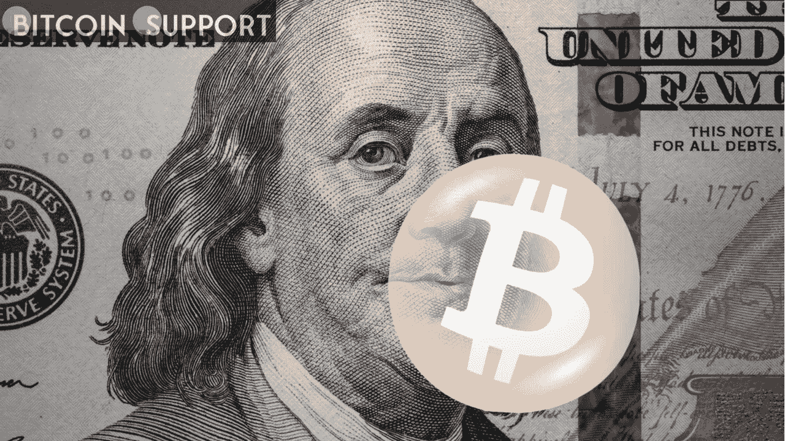
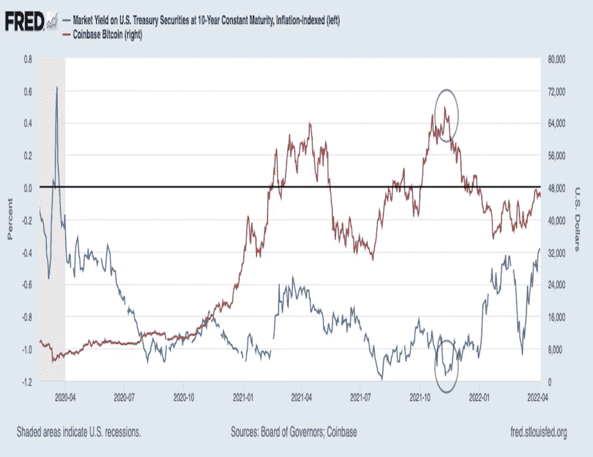

# 随着美国经通胀调整的债券收益率升至两年高点，比特币的观察人士变得谨慎起来

> 原文：<https://medium.com/coinmonks/bitcoin-observers-wary-as-us-inflation-adjusted-bond-yields-reach-2-year-high-48571505a46f?source=collection_archive---------74----------------------->

**Visit our website:-** [**https://bitcoinsupports.com/**](https://bitcoinsupports.com/)

一家研究机构表示，通常情况下，较高的借贷成本对风险资产是有害的。就在你认为秘密的进步已经稳定了市场的时候，宏观问题又一次威胁着市场的稳定。

具体来说，美国和其他地方通胀调整后的名义政府债券收益率上升，可能会使比特币等风险资产和黄金等传统价值储存资产的问题复杂化。根据圣路易斯美联储银行的数据，美国 10 年期实际或经通胀调整的国债收益率本周升至-0.38%，为 2020 年 6 月初以来的最高水平。尽管收益率仍然为负，但它在 4 周内上升了 66 个基点，达到接近 90 度的水平。

“当实际收益率企稳时，预计黄金和比特币将迎来另一轮大幅上涨。“我们还没到那一步，”True Insights 的创始人兼研究主管耶鲁安·布洛克兰在推特上写道。根据 Kaiko Research 的每周简讯，“通常，借贷成本上升会损害科技股和加密货币等风险资产，这些资产对投资者的吸引力似乎不如避险债券。”

比特币对各种各样的人来说意味着各种各样的东西。对于加密爱好者来说，比特币是黄金的数字替代品，也是美元这一全球储备货币的可行替代品。另一方面，传统市场投资者在很大程度上将其视为类似于股票的风险资产。该指数与标准普尔 500 指数和科技股的相关性越来越强就证明了这一点。

**Visit our website:-** [**https://bitcoinsupports.com/**](https://bitcoinsupports.com/)

上图表明，比特币和实际收益率之间并不存在一致的联系。然而，比特币 11 月份的峰值出现在 10 年期实际收益率达到低点的同时。正如一位分析师去年警告的那样，或许在 2020 年 3 月冠状病毒引发的崩盘后积累比特币作为财富储存手段的宏观交易员，为了应对实际收益率的上升而削减了敞口。美联储的强硬态度和 10 年期名义收益率的持续上升导致实际收益率大幅上升。

根据图表平台 TradingView 的数据，截至发稿时，名义收益率为 2.6%，为三年来的最高水平，自美联储 3 月 16 日加息以来上涨了 40 个基点。今年迄今，该收益率已上升逾 100 个基点，这一涨幅引起了观察人士的担忧。

“亚洲交易中 10 年期国债收益率持续上升。多年来，债券市场出现了无数次虚假警报，但这开始类似于人们长期担心的爆发，”彭博市场高级编辑约翰·奥特斯(John Authers)在推特上写道。当被问及 10 年期收益率何时会成为风险资产的担忧来源时，Authers 回答说，“现在，如果不是不久前……”

“风险厌恶情绪正在逐步增加，美元指数已经达到今年的最高水平，”加密资产管理公司 Blofin 的波动性交易员 Griffin Ardern 解释道。“流动性收缩有可能加剧。三月份 FOMC 会议的详细信息将于美国东部时间下午 2:00 公布。”

**访问我们的网站:-**[**https://bitcoinsupports.com/**](https://bitcoinsupports.com/)

**免责声明:以上为作者观点，不应视为投资建议。读者应该自己做研究。**

> 加入 Coinmonks [电报频道](https://t.me/coincodecap)和 [Youtube 频道](https://www.youtube.com/c/coinmonks/videos)了解加密交易和投资

# 另外，阅读

*   [比特币基地僵尸程序](/coinmonks/coinbase-bots-ac6359e897f3) | [AscendEX 审查](/coinmonks/ascendex-review-53e829cf75fa) | [OKEx 交易僵尸程序](/coinmonks/okex-trading-bots-234920f61e60)
*   [如何在印度购买比特币？](/coinmonks/buy-bitcoin-in-india-feb50ddfef94) | [瓦济克斯审查](/coinmonks/wazirx-review-5c811b074f5b)
*   [隐翅虫替代品](/coinmonks/cryptohopper-alternatives-d67287b16d27) | [HitBTC 审查](/coinmonks/hitbtc-review-c5143c5d53c2)
*   [CBET 点评](https://coincodecap.com/cbet-casino-review) | [库币 vs 比特币基地](https://coincodecap.com/kucoin-vs-coinbase)
*   [折叠 App 审核](https://coincodecap.com/fold-app-review) | [Kucoin 交易机器人](/coinmonks/kucoin-trading-bot-automate-your-trades-8cf0ca2138e0) | [Probit 审核](https://coincodecap.com/probit-review)