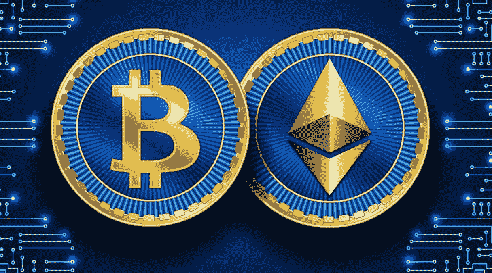

# 比特币或以太坊|投资前你需要知道的一切

> 原文：<https://medium.com/coinmonks/bitcoin-or-ethereum-all-you-need-to-know-before-investing-8ee3e7aa5286?source=collection_archive---------34----------------------->

加密货币是一种新型的数字货币。您可以以数字方式转移您的非数字常规货币，如美元。然而，这并不完全等同于加密货币工作方式。随着加密货币得到全球认可，你可以像使用传统货币一样，用它进行电子支付。

加密货币受到保护；这些虚拟货币是分布式网络上的资产。加密货币的分散性质意味着国家行政部门或当局无法管理或控制它们。

区块链创新依赖于适当的注册数据库，支持货币的加密形式。密码术和加密策略保护网络并防止改变。每笔交易都被存储为链条上的一个不同的块，这些记录应该是准确的和不可改变的。

**比特币和以太坊，投资前需要知道的事情？**

比特币和以太坊是当今最知名的加密货币形式。这些无疑是市值最大的密码。比特币的市值超过 7400 亿美元，以太坊的市值在 3100 亿美元左右。

比特币是第一名。看一下加密货币的排名图概览，你会看到比特币在第一的位置，以太坊追在第二。

比特币对抗以太坊是一场争夺最佳位置的战斗。个人必须认识到哪一个是最好的。

**比特币和以太坊的区别**

以太坊和比特币是依靠区块链技术的加密货币形式。除此之外，这两种加密货币都是独一无二的，有不同的用途。

**比特币**

比特币是领先的数字货币，由加密货币设计师中本聪于 2009 年创立。这种先进的数字货币的想法很简单，但却取得了巨大的成功。一个简单、分散的金融体系保证了一种不同于传统货币的安全替代品，即法定货币。

比特币在区块链网络上运行。比特币钱包之间使用私钥进行交易，提供数字可信度验证。密码确保可尊敬性和连续的交易顺序，系统确认未决交易。

比特币已经达到可以铸造 2100 万枚硬币的数量。当达到这个数字时，这些货币仍然可以兑换，但其他货币不能盖章。

交易者通常观察这些机会，因为一些机会使市场波动，而另一些机会则没有明显的市场发展。

比特币旨在提供一种转移资金的方法，并让你完全控制自己的资产。

**比特币状态**

๏价格:38.997 美元

๏市值:7400 亿美元

๏市场支配地位:43.42%

**以太坊**

比特币推出后不久，以太坊提出了一种新的加密货币使用方式，不仅仅是作为一种货币，并想象它可以在更多方面得到使用。

从智能合约和去中心化应用开始，以太坊以前就明白他们需要一个他们的惯例可以信任的单一货币作为他们的基础。这促使以太坊基金会管理以太坊活动，但不能独立改变协议。

以太坊的开采方式和比特币一样。然而，以太坊矿工可能会收取费用来确认交易。此外，对释放的乙醚量没有限制。这消除了明显的稀缺性，这可能是比特币估值较高的原因。

以太是以太坊组织中使用的已知货币，但在其他地方不被普遍认可。同样，比特币也不能作为以太坊平台上的已知货币。

以太坊国家

๏价格:2589.70 美元

๏市值:3100 亿美元

๏市场占有率:22.40%

**应该投资比特币还是以太坊？**

比特币和以太坊是两个区块链，但服务于各种需求，各有利弊。

虽然比特币区块链的目的是管理交易所和储存价值，但以太坊是一个支持其他项目进步的平台。

**比特币的 5 大本质优势**

๏比特币是现有的主要加密货币，具有最佳的识别度和流动性，这使其成为最普遍认可的加密技术。

๏比特币仍有至关重要的发展预期；它的价值取决于供求关系，而不是政治阻力。

๏比特币使用区块链技术来保护其免受大规模虚假陈述或欺诈。

๏比特币的兑换速度比法定货币快。

๏比特币 2100 万的上限可能会增加成本。

**比特币的 3 个缺点**

๏价格异常不可预测，比特币的效用有限。

๏比特币使用了惊人数量的能源，这对环境变化是可怕的。

๏比特币不会 100%匿名。

**以太坊的 3 大本质优势**

๏以太坊可以利用区块链技术实现其分散、直接和透明的系统。

๏以太坊赋予了数字货币以外的功能，如去中心化应用和智能合约。

๏的创造者社区是最大的社区之一，以太坊处理交易的速度比比特币还要快。

**以太坊的 3 个缺点**

๏交易所的费用可能比比特币还高。

与其他平台相比，๏以太坊速度较慢。

๏的无限供应可能会降低人们对以太币的兴趣。

**比特币与以太坊的相似性**

尽管存在差异，以太坊和比特币通常有一些共同的特征，就像许多其他加密货币一样。

比特币和以太币是 fiat 和 stablecoins 之外的大多数交易集的首选报告货币标准，因为它们非常受欢迎。因此，如果你有比特币或以太坊，在加密交易中转换到其他形式的加密货币就没有问题，比如流动性。

比特币和以太坊都位于区块链，这意味着它们拥有让区块链独一无二、紧密相连和强大的内在属性。

因为它们运行在区块链上，所以它们非常安全、不可变并且是去中心化的。

这两个组织都是由矿工维护的，他们获得密码来运行交换和支持网络。无论如何，每一个背后的机制都是独一无二的。

**长话短说，**比特币和以太坊自推出以来获得了极高的价值。无论哪种方式，他们仍然是试验性的，随着进展而来的问题，消费者金融保护局(CFPB)的关注还没有得到解决。

例如，区块链的分权思想意味着，如果出了问题，没有人可以求助。此外，在区块链上交易比通过银行或借记卡要贵得多。

假设将资源放在区块链上是最好的方法，那么最好考虑前两种方法。决定哪一个适合你取决于你的目标和需求。

> ***NFT、比特币、Web3.0、DeFi、初学者加密货币***
> 
> *使用*[*CryptoWeb*](http://cryptoweb.wiki/)*免费的初学加密指南掌握 web3.0 世界的基础知识，在这里，我们深入了解了该领域中一些顶级的 NFT、加密和元宇宙项目，以便您在投资之前得到通知。*

> 加入 Coinmonks [电报频道](https://t.me/coincodecap)和 [Youtube 频道](https://www.youtube.com/c/coinmonks/videos)了解加密交易和投资

# 另外，阅读

*   [如何在 FTX 交易所交易期货](https://coincodecap.com/ftx-futures-trading) | [OKEx 对币安](https://coincodecap.com/okex-vs-binance)
*   [OKEx vs. KuCoin](https://coincodecap.com/okex-kucoin) | [摄氏替代品](https://coincodecap.com/celsius-alternatives) | [如何购买 VeChain](https://coincodecap.com/buy-vechain)
*   [ProfitFarmers 回顾](https://coincodecap.com/profitfarmers-review) | [如何使用 Cornix 交易机器人](https://coincodecap.com/cornix-trading-bot)
*   [如何匿名购买比特币](https://coincodecap.com/buy-bitcoin-anonymously) | [比特币现金钱包](https://coincodecap.com/bitcoin-cash-wallets)
*   [瓦济克斯 NFT 评论](https://coincodecap.com/wazirx-nft-review)|[Bitsgap vs Pionex](https://coincodecap.com/bitsgap-vs-pionex)|[Tangem 评论](https://coincodecap.com/tangem-wallet-review)