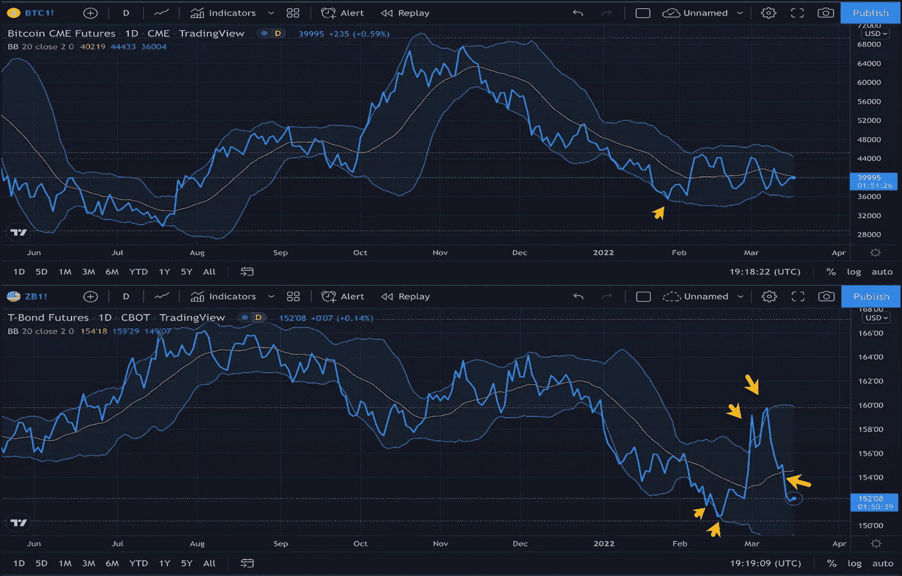

# 比特币还是国债？挑一个

> 原文：<https://medium.com/coinmonks/bitcoin-or-treasuries-pick-one-17ee5d513916?source=collection_archive---------81----------------------->

比特币或美国国债。你想拿哪个？

围绕着每一个问题，都有一系列有价值的论点。两者都有“逃向安全”的一面。当投资者考虑安全性时，他们会想到可靠性。他们通常不太关心升值，而更关心贬值。保本是他们想要的。他们不寻找有太多可变性/波动性的东西。

观察波动性的一种方法是用布林线来描绘资产。布林线是价格简单移动平均线上下的标准偏差水平。与波动性较小的资产相比，波动性较大的资产可能更容易突破这些界限。

看看芝加哥商业交易所比特币期货的连续合约和芝加哥商业交易所 30 年期国债期货的连续合约，似乎美国国债比比特币更不稳定。资产安全的古老基准比加密货币的标准更不稳定。在过去的两个月里，债券已经几次超出了标准偏差。比特币一整年几乎没见过他们的乐队。

没有足够的结论，但我觉得这种比较很有趣。在最近的宏观动荡中，债券经历了磨难，而加密却泰然处之。在加密领域，有一种说法是，熊市是埋头苦干的好时机。灾难也是如此。当世界在搅拌机里，不要跳水。坐下来，等事情平静下来，你就可以尽情享用了。

> *加入 Coinmonks* [*电报频道*](https://t.me/coincodecap) *和* [*Youtube 频道*](https://www.youtube.com/c/coinmonks/videos) *了解加密交易和投资*

# 另外，阅读

*   [Bookmap 评论](https://coincodecap.com/bookmap-review-2021-best-trading-software) | [美国 5 大最佳加密交易所](https://coincodecap.com/crypto-exchange-usa)
*   最佳加密[硬件钱包](/coinmonks/hardware-wallets-dfa1211730c6) | [Bitbns 评论](/coinmonks/bitbns-review-38256a07e161)
*   [新加坡十大最佳加密交易所](https://coincodecap.com/crypto-exchange-in-singapore) | [购买 AXS](https://coincodecap.com/buy-axs-token)
*   [红狗赌场评论](https://coincodecap.com/red-dog-casino-review) | [Swyftx 评论](https://coincodecap.com/swyftx-review) | [造币厂评论](https://coincodecap.com/coingate-review)
*   [投资印度的最佳密码](https://coincodecap.com/best-crypto-to-invest-in-india-in-2021)|[WazirX P2P](https://coincodecap.com/wazirx-p2p)|[Hi Dollar Review](https://coincodecap.com/hi-dollar-review)