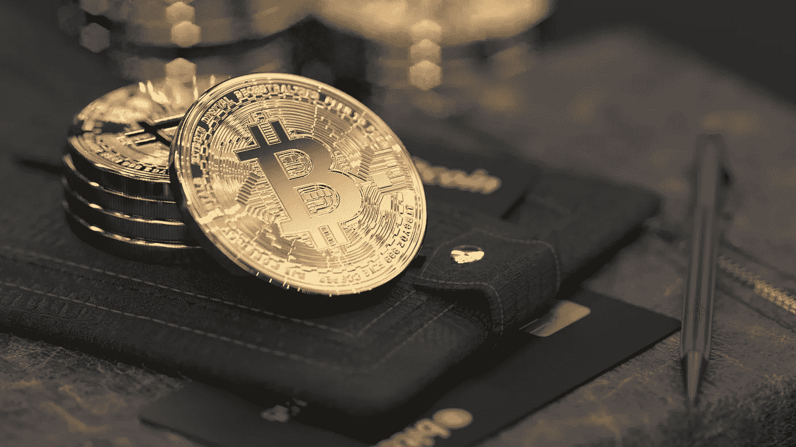
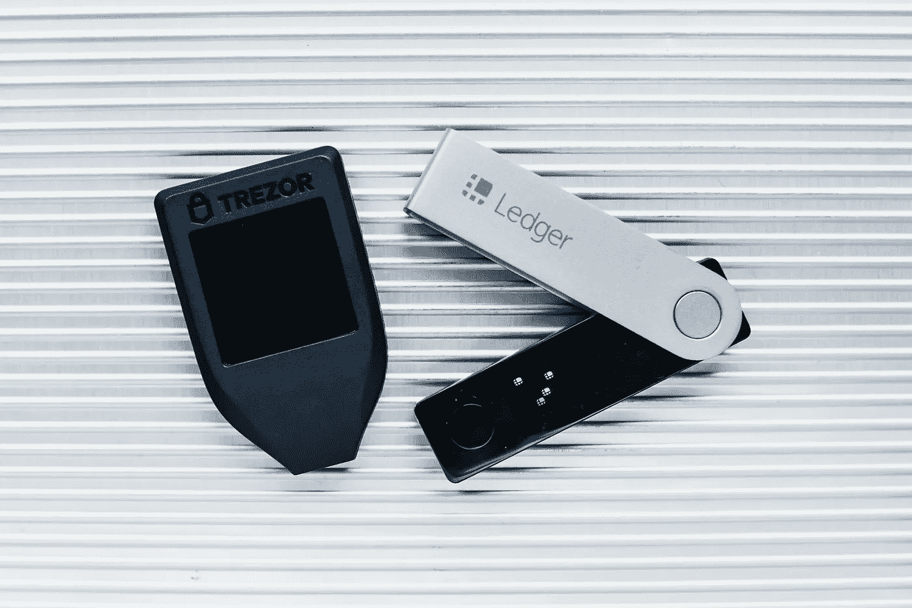

# 比特币所有权:你的硬币真的是你的吗？

> 原文：<https://medium.com/coinmonks/bitcoin-ownership-are-your-coins-really-yours-fe29d0417e82?source=collection_archive---------27----------------------->

和其他加密货币一样，比特币也是一种数字货币。这意味着所有者没有实物硬币/纸币。在传统银行这样的中央金融系统中，一个人可以通过拥有现金或银行账户余额(不考虑资产)来证明自己拥有一定数量的资金。

那么，如何证明比特币的所有权呢？
比特币的所有权由两把钥匙决定——一把私钥和一把公钥。
公钥经过哈希处理，生成一个地址，比特币将被发送到这个地址。它类似于传统银行的账号。

私钥是用于兑换锁定到公钥的比特币的数字签名。它可以类似于传统银行中的账户签名。公钥-私钥用法充当用户的唯一标识符，也是一种身份验证形式。
通常，如果 A 人(Tina)想要向 B 人(Amaka)发送 0.5 个比特币，Tina 将通过二维码、发票或个人消息获得 Amaka 的比特币地址。然后，她创建了一个交易，用她的一个 UTXOs 将 0.5 比特币发送到 Amaka 的地址。在这个交易被广播到比特币网络后，Amaka 可以使用她的私钥来兑换(并消费)这 0.5BTC。

> UTXOs 可以比作实物硬币，因为它们必须被离散地消费。如果你想花 5 分钱，你不能花半毛钱。取而代之的是，你必须花光所有的一角硬币，并得到一枚五分硬币作为找头。然而，与实体硬币不同，UTXOs 没有标准化的面值。一个 UTXO 可以容纳任意数量的比特币。
> 
> 未用完交易输出(UTXO)是比特币交易的输出。输出作为 UTXO 存在，直到它在后续事务中被用作输入，此时它不再是未用完的。在给定时间点所有现有 UTXO 的集合被称为 [UTXO 集合](https://river.com/learn/terms/u/utxo-set/)。比特币节点会跟踪 UTXO 集合，以便准确确定哪些硬币存在以及谁可以使用它们。
> 
> —河流金融公司

**比特币如何被收购？**

比特币利用公共账本记录所有比特币交易。这个账本就是区块链，它是一堆连接在一起的区块，包含比特币网络中所有交易的记录。这个分类账是公开可访问的，交易由比特币网络中的点对点节点进行验证。
比特币可以通过两种主要方式获得:

1.  通过 coinbase 交易:矿工是验证比特币交易并将其挖掘到块上的节点。采矿需要一些昂贵的机械，因此，矿工可以获得比特币作为奖励，以保持网络运行，并补偿他们产生的成本。这种比特币奖励被称为 coinbase 交易，是创造新比特币的唯一方式。
2.  通过比特币交易:比特币也是一种交换手段，因此个人或组织交易比特币。这也是获取比特币的一种方式。

**比特币存储**

如前所述，比特币只是一串证明硬币所有权的钥匙。为了存储比特币，密钥被存储在一个钱包里——一个数字钱包。比特币钱包存储用于访问比特币地址和发送交易的加密信息。公钥用于接收付款，而私钥用于签署和发送交易。

> 每个比特币钱包都包含一组秘密数字或私人密钥，与用户的区块链通讯录相对应。这些密钥用于签署比特币交易，有效地让用户控制该地址的比特币。如果攻击者可以窃取钱包的私钥，他们就可以将该地址的比特币转移到自己的钱包中。*—*[*Investopedia*](https://www.investopedia.com/terms/b/bitcoin-wallet.asp)

**注意:**一些现代钱包是 [HD 钱包](https://learnmeabitcoin.com/technical/hd-wallets)，因此，它们保存助记符种子，因为这可以用来生成所有用户的私有和公共密钥。

## **比特币钱包**

1.  **热钱包:**此类钱包可以访问并连接互联网。可以是监禁的，也可以是非监禁的。热保管钱包是由第三方为用户管理钥匙的钱包。一个热保管钱包易于使用，但把用户的控制权。
    非保管热钱包连接到互联网，但在这里，用户完全控制他们的钥匙。
    桌面、网络、手机钱包都是热门钱包类型。

一、桌面钱包:桌面钱包安装在台式机或笔记本电脑上，不需要保管。然而，这并不安全，因为可能会有电脑恶意软件危害你的硬币。例如军械库、蜂巢 OS X 和银金矿。

二。手机钱包:手机钱包安装在 android、iOS 或其他移动设备上。它们可以是托管的或非托管的，并且容易受到恶意攻击、网络钓鱼来窃取用户的硬币。例子有蜂房，菌，币安，比特诺等。

三。网络钱包:网络钱包是一种在线服务，可以代表你发送和存储加密货币。如果网络钱包是一个保管钱包，你相信保管人会保护你的私钥安全。如果私钥受密码保护(因为它没有存储在您的设备上)，这意味着私钥应该在密码后面加密。然而，它仍然位于一个您无法控制的服务器上。这意味着您需要信任服务器所有者:

*   不要在散列私钥上撒谎
*   正确散列私钥，使攻击者无法得到它。这两个都是大问题，因为网络钱包很容易谎称没有保存私钥的副本并取走你的硬币。例如比特币基地、区块链等。

**2。冷钱包:**这种钱包离线生成并存储用户的密钥。这种钱包通常被称为冷库。因为这种类型的钱包是离线的，所以它是最安全的，因为它不容易受到互联网上的恶意攻击，并且人们只能通过物理访问冷库来窃取硬币。
冷藏钱包主要是非保管性的，因此用户可以直接使用冷藏设备，从而获得钥匙。然而，某些[保管人](https://river.com/learn/bitcoin-wallets/)将用户的比特币保存在一个冷藏设施中，该设施实际上存储在军用级别的金库中。
最常用的冷库是五金钱包。硬件钱包是一种存储用户密钥的小型便携式设备。此设备始终保持与互联网断开连接。为了进行交易，需要一台计算机和制造商的应用程序来保持私钥离线。硬件钱包的例子有 Ledger 和 Trezor。
纸质钱包也是冷藏的另一种方法。这是一种存储比特币的离线机制，涉及到将私钥和比特币地址打印到纸上。

An image of Trezor and Ledger hardware wallets

## **保护您的硬币**

> 不是你的钥匙，也不是你的硬币——一句流行的比特币谚语

有一种流行的说法是，如果你不控制你钱包的钥匙，那么它们就不是你的硬币——保管人只是承诺给你你拥有的硬币。
这里有一些关于如何保护你的硬币的建议:

1.  如果可以的话，用不保管的热钱包。这样，您就可以控制您的钥匙和硬币，并且可以在日常交易中轻松使用。
2.  备份你的钱包。这在你忘记细节的情况下很重要，这样你就不会完全失去你的硬币。如果你用的是高清钱包，那再好不过了！你只需要备份你的记忆，你可以恢复所有的硬币。
3.  为了节省大量的比特币，建议使用硬件钱包。这是非常安全的，并减少了盗窃的机会。
4.  加密您的钱包。加密你的钱包意味着使用密码锁定你的硬币不被花掉。这是一个额外的安全层，如果攻击者获得了您的硬币，他们将无法使用它——除非他们也可以访问这个密码。
5.  更新你的钱包软件。通常会发布新的更新和错误修复，以帮助您的钱包软件更加安全。确保您的软件保持最新。
6.  保护你的身份:尽量不要把你的个人数据和你的钱包联系起来。这将给恶意者提供更少的信息，并增强匿名性。
7.  尽量不要用网络钱包。它们非常容易受到恶意软件、网络钓鱼和硬币盗窃的攻击，因为您的密钥存储在服务器上，而不是您的设备上。
8.  使用 Multisig:比特币包括一个[多重签名](https://en.bitcoin.it/wiki/Multi-signature)功能，允许一笔交易需要花费多个独立的批准。这可以防止盗窃，因为攻击者不能仅用一个被盗的签名来花费硬币。
    此外，multisig 功能可用于在您去世时将所有权转移给家人/亲属。如果你没有为你的同龄人和家人制定备份计划，你的比特币可能会永远丢失，让你的亲属作为签名之一可以确保他们在你不在的时候可以花掉比特币。

**结论** 在保护硬币的问题上，需要做出权衡。如果你节省了一大笔钱，使用硬件钱包，但要确保备份你的种子/密钥，因为你的安全完全取决于你自己。
对于硬币相对较少的日常交易，您可以使用移动钱包(最好使用非保管钱包)——确保加密并备份，以防丢失。

记住，不是你的钥匙，不是你的硬币！

那么告诉我，你用的是什么类型的比特币钱包？你已经采取了哪些安全措施？如果没有，你会尝试哪一种？

你可以在这里和我分享你的想法，或者在推特上联系我

> 加入 Coinmonks [电报频道](https://t.me/coincodecap)和 [Youtube 频道](https://www.youtube.com/c/coinmonks/videos)了解加密交易和投资

# 另外，阅读

*   [用信用卡购买密码的 10 个最佳地点](https://coincodecap.com/buy-crypto-with-credit-card)
*   [最好的卡达诺钱包](https://coincodecap.com/best-cardano-wallets) | [Bingbon 副本交易](https://coincodecap.com/bingbon-copy-trading)
*   [印度最佳 P2P 加密交易所](https://coincodecap.com/p2p-crypto-exchanges-in-india) | [柴犬钱包](https://coincodecap.com/baby-shiba-inu-wallets)
*   [8 大加密联盟项目](https://coincodecap.com/crypto-affiliate-programs) | [eToro vs 比特币基地](https://coincodecap.com/etoro-vs-coinbase)
*   [最佳以太坊钱包](https://coincodecap.com/best-ethereum-wallets) | [电报上的加密货币机器人](https://coincodecap.com/telegram-crypto-bots)
*   [交易杠杆代币的最佳交易所](https://coincodecap.com/leveraged-token-exchanges) | [购买 Floki](https://coincodecap.com/buy-floki-inu-token)