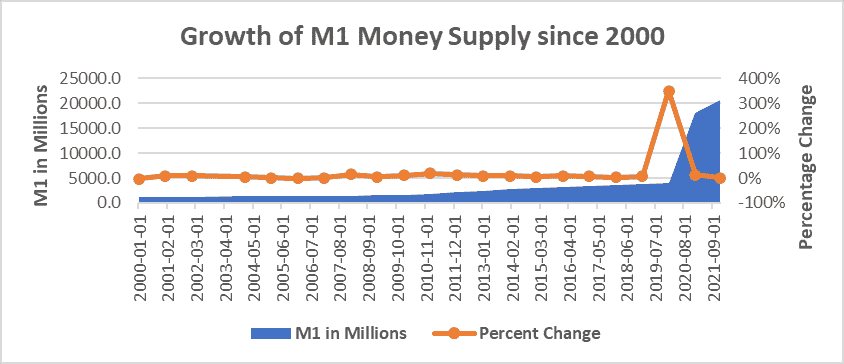
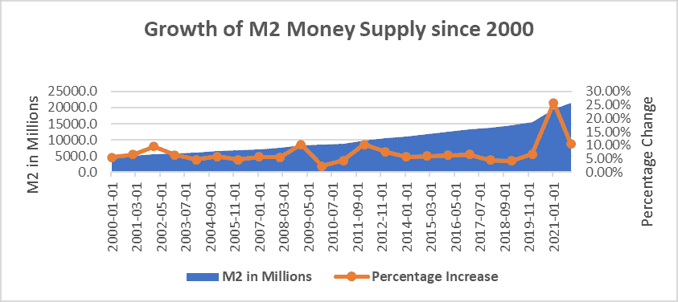

# 比特币第一部分:理解货币

> 原文：<https://medium.com/coinmonks/bitcoin-part-1-understanding-money-c5f0aa136841?source=collection_archive---------29----------------------->

03/06/2022

**比特币 I:理解货币**
*尼古拉斯·斯塔里奇*

市场崩溃，印钞激增，美国一蹶不振。2008 年 10 月，这一现实不仅影响着美国国内的人们，也影响着全世界的人们。然而，对中本聪来说，这并不是事实。

中本聪试图创建一个不同的货币标准，使用不变的代码称为比特币，他试图确保世界各地许多人面临的现实，不是他们的长期现实。

从那时起，甚至在了解它之前，中本聪的激情项目已经达到了 1 万亿的总市值，成为世界上第七大资产。比特币的认知度和受欢迎程度持续增长——在几乎每个人的社区都获得了动力:普通公民、名人、机构等等。

除此之外，重要的是要认识到，在其存在的整个过程中，比特币的价值主张是不断变化的。经过多年的变化，比特币现在似乎终于找到了它最贴切的价值主张**“价值储存”**。理解这一价值主张始于定义比特币的基本特征，并评估它们与当前宏观和微观经济形势的关系。

**简介**

当比特币正式推出时，许多早期采用者试图定义自己采用的原因。许多人强调了该技术的去中心化本质、匿名钱包、交易速度、低费用以及代码即法律的理念。然而，让这家新企业既有兴趣又有信誉的是 2100 万枚硬币的**编码供应上限。**

编码供应如此独特的原因是，作为一种通缩威慑，2100 万枚硬币的供应将在 132 年内释放，最后一枚硬币将在 2140 年被开采。比特币是通过每 10 分钟挖掘一次区块来铸造的，但作为另一种通缩威慑，新铸造的供应量也是每 210，000 个区块减半*(大约。每 4 年)*。从 2008 年到 2012 年，每块铸造了 50 个比特币，从 2012 年到 2016 年，每块铸造了 25 个比特币，以此类推。目前，铸造过程为 6.125 个比特币，下一次减半将于 2024 年 5 月发生——铸造过程将被削减至每块 3.0625 个比特币。我们 ***知道*** 通货膨胀的时间表。

目前，约有 1890 万比特币的供应量在流通，约占 2100 万比特币总供应量的 89%。这一公共供应量导致了采用推理的又一次调整——人们不得不再次重新定义他们购买、存储和使用比特币的论点。推动最初采用的是廉价而快速地发送货币的能力，这有助于比特币作为大额现金交易和国际电汇交易的替代品而声名远扬。然而，随着比特币的增长和供应量达到更大的公共容量，新的采纳者开始质疑最初的购买前提，提出诸如以下问题:*钱是什么？为什么重要？为什么一定要理解呢？*

作为一个新的采纳者，“什么是钱”这个问题确实引起了我的共鸣。甚至在一个 8-9 岁的孩子的时候，我就问自己，为什么这张正面有一个老人的绿色纸允许我购买我(当时)如此痴迷的乐高玩具。自从我玩乐高的日子以来，我对钱的定义已经发生了变化，我在经济上更加独立，我理解美元的价值——这些理解影响了我进一步的结论。

**钱是什么？**

金钱本身没有价值，而是被赋予了价值，人们相应地赋予了价值。因此，金钱是信任的社会语言。这个概念传统上很难理解，因为我们几乎所有人都已经习惯于赋予金钱价值。然而，退一步说，你可以简单地把它想成这样:*钱可以是定义它的任何东西，它可以是毯子、iPhones、石头、贝壳，甚至是印有白人老头的绿色纸片。*我们不把钱的价值定义为毯子、石头或 iPhones 的原因不仅是因为这很难，还因为它不符合我将在下面概述的规则。

金钱的价值是通过社交队列和信任来传达的。作为世界上最古老的语言，钱是通过账本在平板电脑上交流的，这比任何其他真正的交流形式都要早。

在美国，纸币(*即*法定货币)被定义为“货币”。然而，纵观历史，货币被定义为许多东西:轮状的石头、贝壳、硬金属，尤其是黄金。纵观历史，某些群体和文明兴衰起伏，我们目睹了金钱一次又一次的自我改造。随着一种货币体系的崩溃，另一种货币体系开始崛起。

同样，一个群体/文明的“发展程度”也决定了其货币的发展程度。处于经济转型周期早期的国家通常拥有技术不太先进的可操纵货币。这样想想，你会在一个没有*那么*先进货币体系的国家开店吗？更糟糕的是，你会在他们把货币定义为通过集中印刷而贬值并变得毫无价值的东西的地方开店吗？企业将*永远*涌向没有那些货币体系的更强大的经济体。

被操纵的货币

当外部参与者通过添加伪造的供应或操纵中央货币系统来篡改可交易商品的指定价值时，就会出现“操纵货币”。这种操纵导致了历史上几乎每一个货币体系最终导致崩溃、战争或多个周边经济体的毁灭。这种趋势从古代中国就开始了，通常以货币战争开始，发展成贸易战，最终以真正的战争结束。

**没有发展**

每年汽车都会被重新发明，手机会有新的功能，全新的职业领域会被创造出来。这是所有事情的准则，除了我们社会最重视的东西:钱。

数百年来，我们的货币体系几乎没有任何发展。在某些领域，这可能不是问题，但对于金钱来说，这是问题。货币体系缺乏创新会导致疲软，而疲软又会导致上述被第三方腐蚀的能力或对中央集权实体的损害。

这不仅仅是之前讨论过的困扰古代文明的问题。2013 年，赛普拉斯因集中控制而财务崩溃。一战后几年，由于信贷的快速扩张，德国的货币体系同样崩溃了。

正是出于这些原因，货币体系需要创新。它们需要被强化到这样的程度:持久、可移植、可替换、可验证、可分割、稀缺和抗审查。

**适用于比特币、黄金和法定货币**

**耐久性→** 代表一件物品能够承受多大的压力，尤其是那些被认为是高压力的物品。这就是*确切地说是*，而黄金在数百年间保持了它的价值，经受住了许多标志性帝国的兴衰。黄金通过稀缺性/稀有性获得其价值，但也通过对其固有的稀缺性难以破坏的理解——它被认为是耐用的(从字面意义上来说)。虽然菲亚特可以持续数年，但它是由一种纸质材料制成的，耐用性很低。纸不能经受火、长时间的水暴露，并且在持续使用后会磨损；它可以撕裂，并立即失去其价值。转向比特币和数字货币的概念，我们需要评估技术如何改变了文字耐久性的定义。在我们生活的世界里，集中式的点对点应用程序已经将持久性重新定义为一致性。比特币符合这一新定义，并将其推进。比特币本质上是数字的，但它不是集中的，因此缺乏集中服务的标准控制。由于生活在区块链，比特币促成了一个包罗万象、非歧视性、*持久的*金融体系。为了摧毁一个如此持久的系统，你需要摧毁所有连接到网络或 Wi-Fi 的设备——我认为这是不可能的。

**可移植性→** 顾名思义，是一个项目或服务快速、轻松移动的能力。黄金和纸币没有通过这个测试；如果你想逃到中国，并且你的大部分财富都是黄金，你会选择离开吗？你会如何携带黄金？同样的道理也适用于法定货币。最糟糕的部分？这些障碍将你(和其他人)暴露在威胁和危及生命的情况下。比特币再次缓解了这些问题。通过加密货币，你可以在一个看起来像 u 盘一样的硬钱包(也称为冷钱包)上存储数百万、数十亿甚至数万亿美元的货币。移动访问任何边境，通过任何领土，你永远不必担心人们怀疑你携带超过你口袋里的东西。现在，我为什么要提这个？很简单——因为这是一个现实问题。在 20 世纪后期，中国居民不得不逃离他们的国家——在理想的世界里，他们应该能够带着所有的财富完好无损地离开——不幸的是，这在当时是不可能的。

**可替代性→** 是一种商品或资产与其他同类商品或资产互换的能力；1 根金条= 1 根金条，1 个比特币= 1 个比特币。比特币和金条永远是平等的。美元缺乏这种能力，因为它们的价值可能被伪造或由于不耐用而被毁坏。一张撕开的 20 美元钞票也不值得一张没有撕开的 20 美元钞票。

**可验证性→** 比特币本质上是通过其在区块链上的位置来验证的，因为链上的任何节点都没有比其他节点更大的权力，网络本质上是分散的，因此，通过多个网点同时进行验证。每个节点与其他每个节点验证是否开采了正确的比特币块。然后，当矿工验证网络时，他们会获得比特币奖励，这种情况每 10 分钟发生一次。这种验证系统允许在任何时间点对整个比特币供应量进行审计——如果所统计的供应量不完全等于 2100 万个比特币，则上述节点不会验证任何东西。这种方法的唯一缺点是在区块链上实施新的矿工是一项昂贵的努力。由于矿工在验证时必须解决围绕每个区块的复杂方程，人们已经提出实施假区块来减轻这种成本，但是假区块从未被实施。另外，开采和添加假区块会消耗电力，开采假区块的投入不会产生产出。看看公众对假积木提议的反馈，这似乎不太可能发生，因为它只会模仿现实世界中的“傻瓜黄金”概念。在现实世界中，傻瓜金指的是在物理特性上与真品相似的东西，通常是黄金，但仔细观察就会发现它只不过是一种廉价的仿制品，不能保持上述的耐用性。

**整除性→** 整除性最容易理解的就是美元。我们可以在瞬间将一(1)张 100 美元兑换成五(5)张 20 美元的钞票，提供给第三方或愿意交易的人。黄金通常缺乏这种可分性——你不能把黄金分成小块去买一杯咖啡。和美元一样，比特币很容易被分割。与美元不同，比特币可以被分割到 0.00000001(一个比特币的百万分之一)，这种度量被称为“Sat”。“sat”和比特币安全性的美妙之处在于，它再次帮助比特币绕过传统货币系统。使用法定货币或黄金的大额购买通常需要高水平的验证和安全性——这些都内置于区块链中。因此，一个大或小的交易可以完成，没有传统金融系统的摩擦。

不要让 2100 万把你从有限的供应中吓跑。中央银行通过增加供给来扩张货币——这是有害的。比特币的美妙之处在于，即使只有 2100 万个比特币，但如果你拥有 0.1 个比特币，这将成为新的标准。你可以将小数的位置向后移动，而不是以 1 比特币作为记账单位。因此，你现在实际上拥有“无限”的比特币。你的 1 BTC 所有权现在是 1.0，然后是 1.00，1.000 等等。通过增加一个零，它增加了另一个计算单位，我们可以评估我们的消费。重要的是，如果你拥有比特币，你就永远不会失去购买力。它保持不变，只是命名方式不同，因为我们把小数位向后移了。一栋房子有一天可能会花费 1 BTC 或 100，000，000 沙特，这是一回事，但随着越来越多的人要求比特币来评估他们的财富，你的购买力会上升，因为它是一种稀缺资产。因此，某一天，一所房子可能会从 1 亿沙特下降到 1 千万沙特。

**稀缺→** 比特币*极度*稀缺。由于只有 2100 万个比特币被创造出来，而近 500 万到 600 万个比特币由于人们的存储能力不足而丢失，只有大约 1700 万个比特币能够真正流通。虽然这个地球上的黄金是有限的，但在这里和其他星球上有可能发现更多的黄金——比特币缺乏这种可发现性。简而言之，有外部因素有可能影响黄金和法定货币的稀缺性——无论是发现还是法定货币印刷——没有真正的稀缺性。

这两(2)个图表显示了流通中美元的相对数量，M1 是流动性更强的货币，如商业银行的银行存款价值和活期存款，M2 包括一些其他流动性账户，如所有 M1 +储蓄账户、退休账户和货币市场基金。

我们可以在两个图表中看到一个线性模式，然后，在 M1，一条垂直线扰乱了流动。这表明 M1 和 M2 的扩张永无止境——这两个群体都将一直增长。这种大规模的货币贬值只能通过更高的税收来解决(企业现在对拜登的最新增税表现出大规模的反对，从历史上看，这表明大规模的移民出境)，印刷更多的钱(把罐子踢到马路上)，或潜在的货币违约(金融破产)。

**抵制审查→** 在比特币的概念上，有人有可能占领整个网络，但这并没有发生。从那时起，随着比特币规模的扩大，占领网络的概念变得几乎不可能。没人能拿走你的比特币。没人能否认你的比特币。然而，人们可以拿走你的菲亚特和你的黄金。正如赛普拉斯所做的那样，美国可以对所有账户征收 50%的一次性税来偿还政府债务或资助政府项目。更糟糕的是，任何银行都可以以他们选择的任何理由立即冻结你的账户。举个例子，我的摔跤教练开设了一个与比特币相关的播客，开设了一个银行账户来接收赞助费，但由于“与加密相关的问题”，银行迅速关闭了这个账户。当别人为你控制你的财务未来时，你无法控制自己的财务未来——有了比特币，这就不是问题了。

比特币不仅能抵御盗窃审查，还能抵御稀释审查。政府通过法定贬值窃取你的财富。我们已经看到，从 2020 年到 2021 年底，美联储将货币供应量扩大了 40%。在 2 年内，40%的美元被创造出来，你的时薪或薪水是否上涨了 40%来对抗货币扩张？不会。所以比特币也是审查的——抵抗大规模货币扩张，因为没人能稀释你的财富。

**概念中的价值**

理解硬货币和健全货币的概念是推动社会走向强大经济和更具经济可持续性的未来的第一步。通过去除只会导致控制和抑制的外部因素，我们现在可以消除经济中供应链和就业的扭曲。每创造出更多的货币，穷人就变得更穷，富人变得更富。为什么？那些拥有实际资本的人拥有硬资产，由于通货膨胀，这些硬资产的价格通常会上涨。穷人把钱存在银行，零收益，而富人可以投资资产。这并不是因为亿万富翁像一些人声称的那样“邪恶”——他们中的大多数人都是为了他们的地位而工作，因为世界上 86%的百万富翁都是白手起家——这是整个货币体系的一个缺陷。

比特币提供了解决货币问题和几乎所有政治家试图解决的问题的方法。比特币创造了一个世界，在这个世界里，努力工作的员工会因他们的产出而获得回报，而这种回报是无法被窃取或夺走的。这就是比特币:货币能量。你的报酬取决于你提供的价值:换句话说，就是你的能量输出。你给网络增加的能量越多，它就变得越有价值。