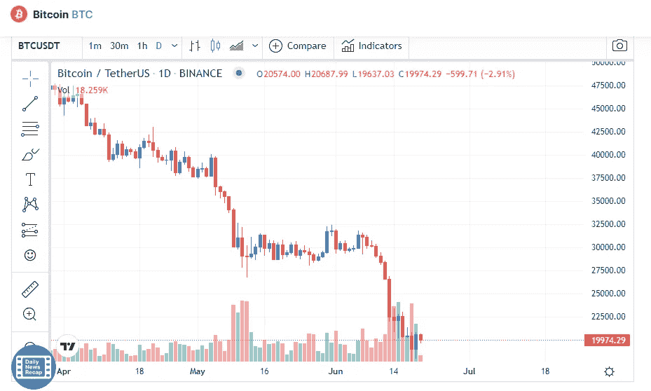

# 6 月 20 日比特币价格分析

> 原文：<https://medium.com/coinmonks/bitcoin-price-analyse-20th-of-june-93c12f9e7d24?source=collection_archive---------22----------------------->

Source photo [Bitcoin price today, BTC to USD live, marketcap and chart | CoinMarketCap](https://coinmarketcap.com/currencies/bitcoin/)

截至 6 月 18 日，比特币的价格已经跌破其最重要的支撑位 20111 美元，标志着其下跌的开始。然而，当天烛台上延伸的尾巴是一个小的积极因素，因为多头买了下降。

为了让价格回到 20，111 美元以上，买家正在努力挽回一些损失。这样做将表明 6 月 18 日跌至 17，622 美元是…