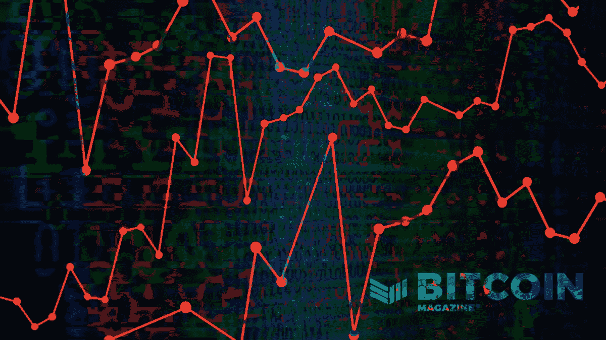
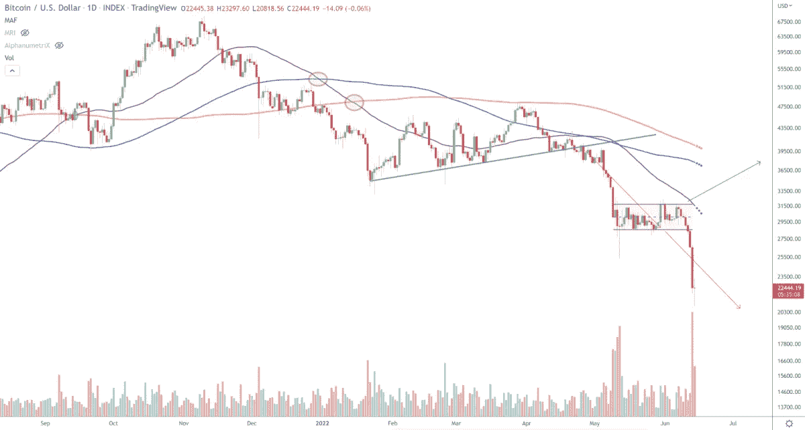
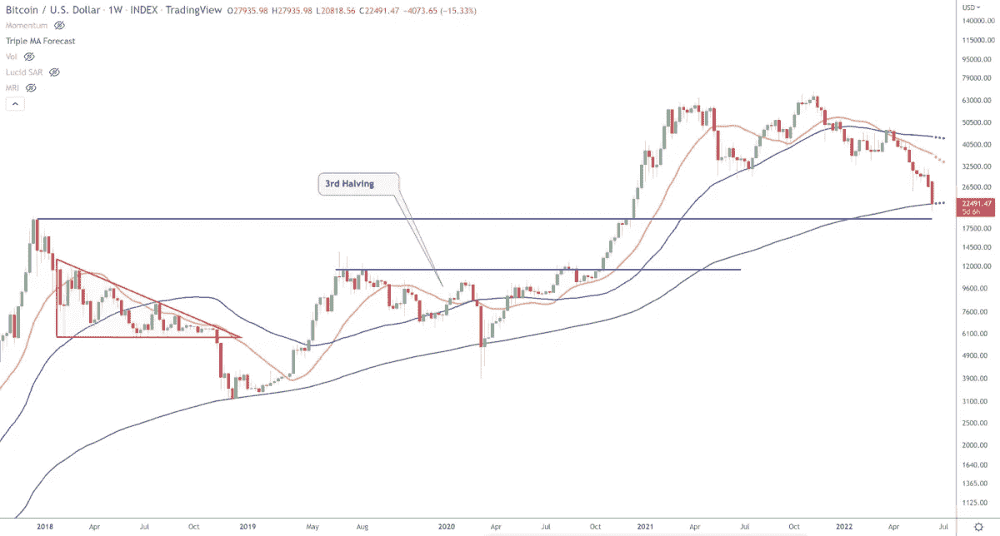

# 比特币价格分析和宏观概述

> 原文：<https://medium.com/coinmonks/bitcoin-price-analysis-and-macro-overview-ce76d77252f3?source=collection_archive---------69----------------------->

我们正在见证比特币典型的四年周期的终结吗？欧洲采纳世界经济论坛的议程对欧元有何影响？

[在 YouTube 上看这一集](https://youtu.be/zuV44K2Odj4?t=6818)或者[隆隆](https://rumble.com/v18dn02-opt-out-of-the-fiat-ponzi-with-bitcoin.html)

听听这一集:

*   [苹果](https://podcasts.apple.com/de/podcast/fed-watch-bitcoin-and-macro/id1543640492?i=1000566532899)
*   [Spotify](https://open.spotify.com/episode/6f0dJCeRr0Q4ybPhsu0er3?si=450d63fd6dcc41ed)
*   [谷歌](https://podcasts.google.com/feed/aHR0cHM6Ly9mZWR3YXRjaC5saWJzeW4uY29tL3Jzcw/episode/ODE2YmI4MWUtNThhNy00NzI1LWExZmEtMmU1NjE3YTNiNGVk?sa=X&ved=0CAUQkfYCahcKEwiYrtD66K_4AhUAAAAAHQAAAAAQZw)
*   [Libsyn](https://fedwatch.libsyn.com/-fed-watch-14-june)
*   [阴天](https://overcast.fm/+m2aea7l0g)

“美联储观察”是比特币创造者的宏观播客。每集我们讨论全球宏观时事，重点是中央银行和货币问题。

在这一集的“美联储观察”播客中，我采访了真正的比特币创造者和长期比特币价格和宏观分析师 Tone Vays。我们的讨论范围从目前的状况到比特币周期，再到更广泛的宏观话题，包括美国政治、欧洲和欧元的状况。

你可以在这里找到这一集的[图表](https://bitcoinandmarkets.com/fed98)。

# 当前比特币市场状况

在播客的第一部分，Vays 谈论了比特币市场的心理状态。

> “我经历了最近两次熊市。2013 年是典型的泡沫图，你已经为即将到来的事情做好了心理准备。2017 年，再次，ICOs，这是一个不合理的指数级上涨，所以你要做好心理准备。我没有做好心理准备。因为，当 2021 年 4 月达到顶峰时，我们有一个令人难以置信的好消息。迈克尔·塞勒，埃隆·马斯克，杰克·多西离开 Twitter，用 Square[现在的 Block]，萨尔瓦多[法定货币法]，然后萨尔瓦多购买比特币。
> 
> *“那变成了卖新闻事件。50%修正，没什么大不了的。每个人在精神上都没问题。那么，这就是你精神状态的全部。当我们在 11 月回到最高点时，那就是 T2 的突破。每个人都认为我们会更上一层楼；我以为我们要去更高的地方。11 月的那场假戏在精神上是残酷的。我们跌回了 3 万美元的低点，跌破了 2 万美元，在过去的三到六个月里，人们一直非常非常担心。*
> 
> *“这一旷日持久的举动让人们勒紧了裤腰带。精神上，他们觉得自己被骗了，不认为比特币应该在这些低点。比特币是为我们现在看到的这个充满不确定性的世界而构建的。他们不仅像在加拿大那样窃取个人的银行账户，还窃取主权国家的银行账户。比特币就是为此而生的，但价格一直在走低。人们开始认输了。每个人都在说越来越低，越来越低。这就是我不得不相信多数永远是错的地方。”*

*Credit: Tone Vays*

*Credit: Tone Vays*

# 比特币周期

我问了 Vays 关于比特币估值模型和四年周期的问题。我的问题是它们是否都坏了，我们是否需要找到一种新的模式。

他说他认为模特总是失败。股票对流量在 Vays 的心目中理论上是正确的，但它不能成功地作为一个技术指标。至于四年减半周期，Vays 认为部分是由于炒作，部分是由于实际供应冲击。

这也是我在“美联储观察”的立场。四年减半周期有自己的炒作周期，与比特币整体炒作完全分开。有点像 altcoins 试图炒作他们的硬分叉升级，比特币通过减半自然地实现了这一点。

然而，我认为炒作是随着每个周期的减少，随着供应冲击方面。这就是为什么我现在认为我们有一个两年的周期。减半的影响较小，但几年后仍会引起反响。

维斯敏锐地指出，牛市和熊市之间的区别要小得多。2020 年和 2021 年的价格走势不会出现明确的分界线。展望未来，描绘这些周期将变得更加困难。

# 欧洲危机与全球宏观

在我们进入有趣的内容之前，我们已经开始在我们的时间限制上奔跑，所以希望我们能在几个月后让 Vays 回来继续这个讨论。但我们确实听到了他对欧洲和欧元的看法。

> “我会说我对西欧的评价很低。挺好的；你去那里很安全。你可以在街上逛逛；你感到相当安全。它有崩溃的资本主义社会的残余，因为他们把所有的权力交给了世界经济论坛(WEF)。我相信 WEF 是一个自由的社会主义组织。他们对政治有太多的控制权。引用克劳斯·施瓦布的话，“我们已经穿透了柜子。”他们做到了。
> 
> *“我认为 WEF 的道路是一条非常非常危险的道路，我对购买其权力的西方国家的未来持悲观态度。这就是我非常看空欧洲的原因。我认为共同货币会解体。”*

我们谈论了这么多，从比特币的相关性到股票和替代币，再到货币政策。这是我在《美联储观察》中最喜欢的一集，所以绝对是必听的一集。

*这个星期到此为止。感谢读者和听众。如果你喜欢这个内容，请订阅，评论和分享！*

这是安塞尔·林德纳的客座博文。所表达的观点完全是他们自己的，不一定反映 BTC 公司或比特币杂志的观点。

*原载于 2022 年 6 月 17 日 https://bitcoinmagazine.com***。**

> *交易新手？试试[加密交易机器人](/coinmonks/crypto-trading-bot-c2ffce8acb2a)或者[复制交易](/coinmonks/top-10-crypto-copy-trading-platforms-for-beginners-d0c37c7d698c)*