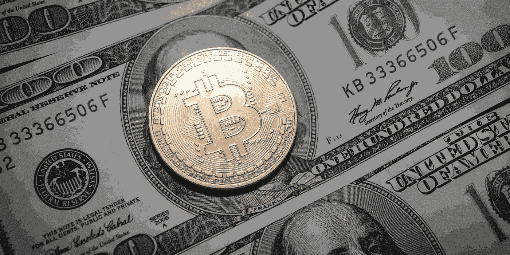
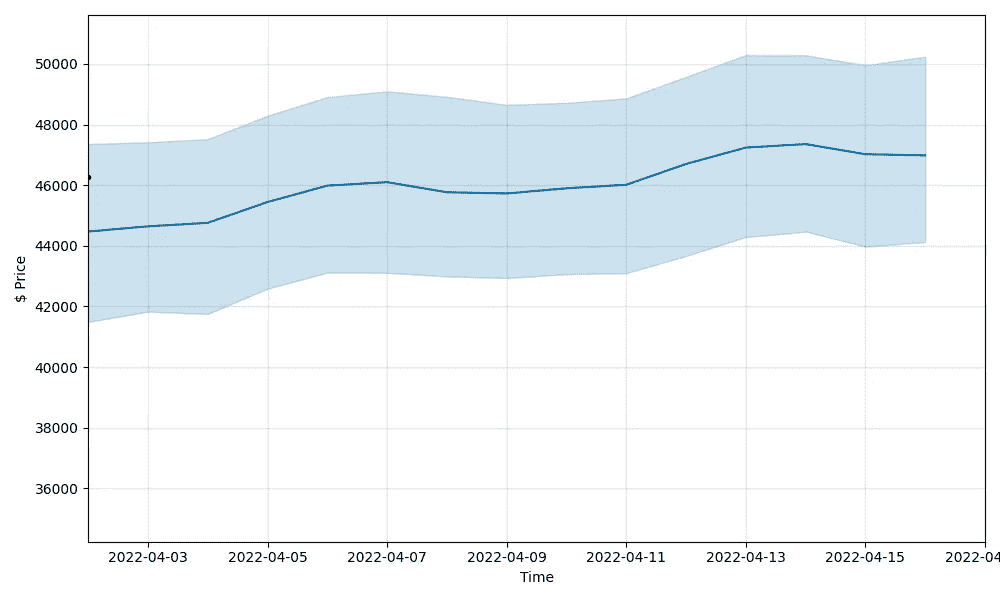
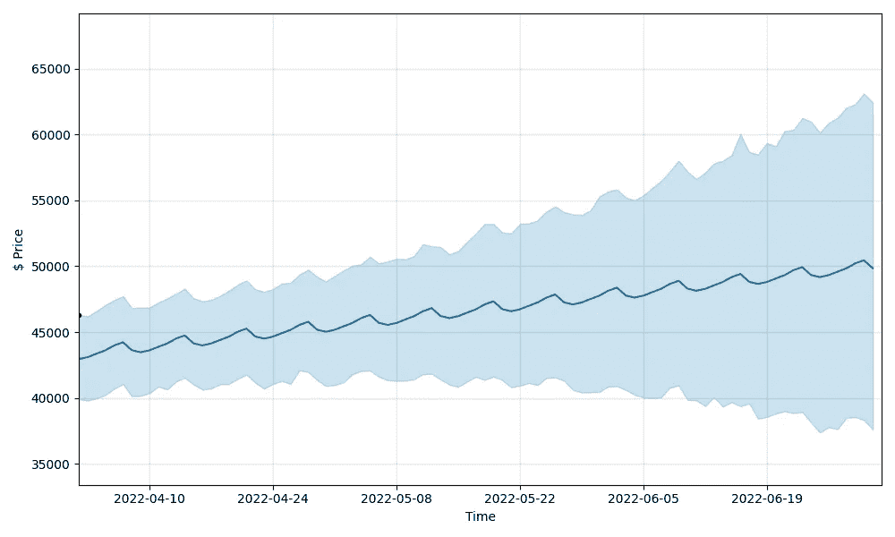
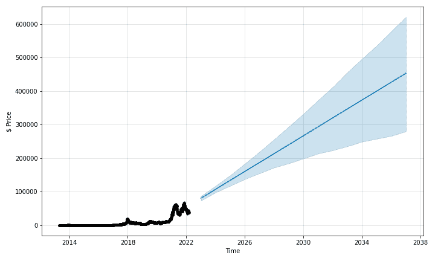

# BTC——2022 年、2025 年、2030 年比特币价格预测

> 原文：<https://medium.com/coinmonks/bitcoin-price-prediction-2022-2025-2030-2050-f5e447260587?source=collection_archive---------27----------------------->

## 比起信任我的银行，我更信任比特币。— [**亚当·德雷珀**](https://www.prediction1.com/prediction/BTC)



Bitcoin is going towards catching new heights. (source — unsplash.com)

根据专家意见和我们的深入研究，到 2022 年 4 月 16 日，比特币的价格预测为 46981.20 美元，较低预测价格为 44128.81 美元，较高预测价格为 50238.32 美元。如果你正在寻找一种高收益的加密货币，比特币可能是一个不错的选择。与当前定价相比，在不久的将来有可能获得最高价格。与当前定价相比，在不久的将来有可能获得最高价格。

我们的团队通过对历史时间序列趋势数据集执行基本面分析和技术分析，并借助深度学习技术来进行价格预测。机构和个人投资者的广泛接受可能有助于保持上升趋势，使比特币(最受欢迎的硬币)的价格超过 90，000 美元。

比特币(BTC)是一种加密货币。BTC 是所有加密货币硬币交换/交易平台用来关联该硬币交易的符号。即使你不是加密爱好者，我也不会重复比特币的优点和历史，就像你以前听说过或了解过的那样。用户能够通过挖掘过程生成 BTC。比特币目前供应量为 19，000，387。比特币的最后已知价格是 46，528.04582679 美元，在过去 24 小时内上涨了 3.88 美元。它目前在 9294 个活跃市场上交易，在过去 24 小时内交易了 35，768，461，871.41 美元。更多信息可在 https://bitcoin.org/.[找到](https://bitcoin.org/.)

在预测加密价格时，有一些要点你应该知道。交易价格与需求/供应，市场资本总额，当硬币超卖/定价过高时会发生什么，推测所有硬币的总市场规模，安全地停止一些硬币的交易。市值也可以给你一个在一段时间内有多少钱涉及加密硬币的准确测量。加密货币有许多不受任何机构控制和监管的特性。因此，看下表对你来说很重要。

重要的是要认识到，没有一个单一的统计数据可以为我们提供一个完整的网络考虑。如图所示，区块链上的活动地址数量一直在逐渐增加。然而，仅此并不能告诉我们任何事情。有可能是一个罪犯多次向自己汇款，每次都使用新的地址。这份清单并不完整，但它可以作为未来指标的有用起点。

## 比特币的价格图表:

## 比特币价格预测:

因为加密货币是如此不稳定，所以了解硬币以前的模式和评估硬币的看涨和看跌事件是至关重要的。为了让你更容易理解，我们&aposve 查看了所有这些硬币的历史价值，确定了它们涨跌的最重要时刻，以及发布重要公告的日期。所有这些事件和记录都被记录下来，以便在未来的加密货币和区块链技术时代为年轻投资者提供可操作的见解。我们使用尖端的人工智能算法和所有这些发现创建了数据驱动的预测。投资者可以利用这些预测来帮助他们决定是买进还是卖出。

## 未来 15 天比特币价格预测:

对硬币价格进行长期预测的最好方法是对其市场和市场趋势进行基本面分析。获得硬币未来的线索并在投资时限制风险的一个方法是从长计议。基本面分析有助于更深入地了解公司的运营、市盈率和营业利润率，以及它在市场上的表现..

## 比特币价格预测图(15 天):



Bitcoin Coin price Prediction for next 15 days — two weeks

## 数字中的比特币预测(15 天):

```
| Date | Prediction (Lower Range) | Prediction | Prediction (Upper Range) |
| --- | --- | --- | --- |
| 2022-04-02 | 41489.20192 | 44470.86108 | 47357.12014 |
| 2022-04-03 | 41828.25552 | 44641.79759 | 47412.11685 |
| 2022-04-04 | 41752.76541 | 44757.91484 | 47517.43075 |
| 2022-04-05 | 42584.40849 | 45443.93753 | 48289.39069 |
| 2022-04-06 | 43114.90901 | 45984.33638 | 48903.08596 |
| 2022-04-07 | 43110.43391 | 46099.10699 | 49094.32843 |
| 2022-04-08 | 42988.51258 | 45765.37125 | 48913.01996 |
| 2022-04-09 | 42935.26432 | 45726.03014 | 48646.29057 |
| 2022-04-10 | 43066.78605 | 45896.96664 | 48714.99837 |
| 2022-04-11 | 43098.12402 | 46013.0839 | 48860.64437 |
| 2022-04-12 | 43663.841 | 46699.10658 | 49571.03786 |
| 2022-04-13 | 44290.66632 | 47239.50543 | 50289.18474 |
| 2022-04-14 | 44465.9084 | 47354.27605 | 50282.09963 |
| 2022-04-15 | 43975.53366 | 47020.54031 | 49951.84238 |
| 2022-04-16 | 44128.8051 | 46981.19919 | 50238.3176 |
```

## 未来三个月比特币价格预测:

我们评估市场稳定性、技术采用、硬币竞争、资本优势、财务杠杆、全球推理，以衡量对货币当前状态和未来预测的理解。以下是未来三个月的预测列表。

## 比特币预测图(3 个月):

在接下来的三个月里，它似乎逐渐向多头方向增长，并将达到新的高度。



Bitcoin Price prediction for next three months 2022

## 比特币数字预测(3 个月):

```
| Date | Prediction (Lower Range) | Prediction | Prediction (Upper Range) |
| --- | --- | --- | --- |
| 2022-04-02 | 39903.32531 | 42951.23792 | 46302.58238 |
| 2022-04-03 | 39788.65632 | 43099.41124 | 46198.47125 |
| 2022-04-04 | 39978.48919 | 43362.11963 | 46597.97091 |
| 2022-04-05 | 40216.52032 | 43616.42459 | 47060.11756 |
| 2022-04-06 | 40695.18819 | 43987.83098 | 47425.62494 |
| 2022-04-07 | 41054.34859 | 44226.26827 | 47733.85276 |
| 2022-04-08 | 40123.40839 | 43626.2008 | 46825.46393 |
| 2022-04-09 | 40155.03889 | 43470.03572 | 46870.77546 |
| 2022-04-10 | 40360.03169 | 43618.20904 | 46871.20651 |
| 2022-04-11 | 40864.21669 | 43880.91743 | 47234.70598 |
| 2022-04-12 | 40645.01067 | 44135.22239 | 47549.38489 |
| 2022-04-13 | 41227.18856 | 44506.62879 | 47904.14421 |
| 2022-04-14 | 41537.10791 | 44745.06607 | 48300.90992 |
| 2022-04-15 | 41018.51501 | 44144.9986 | 47574.41468 |
| 2022-04-16 | 40636.95785 | 43988.83353 | 47348.68804 |
| 2022-04-17 | 40712.45398 | 44137.00684 | 47448.21855 |
| 2022-04-18 | 41034.26164 | 44399.71523 | 47743.02058 |
| 2022-04-19 | 41053.68791 | 44654.0202 | 48148.3657 |
| 2022-04-20 | 41444.58454 | 45025.42659 | 48591.44059 |
| 2022-04-21 | 41767.77487 | 45263.86388 | 48919.91277 |
| 2022-04-22 | 41152.30876 | 44663.79641 | 48256.80223 |
| 2022-04-23 | 40701.26035 | 44507.63133 | 48060.85204 |
| 2022-04-24 | 41064.48278 | 44655.80465 | 48264.41059 |
| 2022-04-25 | 41285.38435 | 44918.51304 | 48677.89804 |
| 2022-04-26 | 41058.87465 | 45172.818 | 48758.39208 |
| 2022-04-27 | 42089.33786 | 45544.22439 | 49364.17791 |
| 2022-04-28 | 41959.85284 | 45782.66168 | 49744.80581 |
| 2022-04-29 | 41356.23423 | 45182.59421 | 49210.6297 |
| 2022-04-30 | 40906.25894 | 45026.42913 | 48841.27207 |
| 2022-05-01 | 40977.13215 | 45174.60245 | 49261.71088 |
| 2022-05-02 | 41180.90802 | 45437.31084 | 49681.80276 |
| 2022-05-03 | 41790.20648 | 45691.6158 | 50035.11107 |
| 2022-05-04 | 42046.95404 | 46063.0222 | 50147.84381 |
| 2022-05-05 | 42076.03664 | 46301.45948 | 50724.72685 |
| 2022-05-06 | 41606.26884 | 45701.39201 | 50219.98218 |
| 2022-05-07 | 41345.69259 | 45545.22694 | 50358.50807 |
| 2022-05-08 | 41297.91568 | 45693.40025 | 50571.49413 |
| 2022-05-09 | 41305.65252 | 45956.10864 | 50521.25333 |
| 2022-05-10 | 41409.62405 | 46210.41361 | 50772.96975 |
| 2022-05-11 | 41797.26339 | 46581.82 | 51675.36696 |
| 2022-05-12 | 41826.55393 | 46820.25729 | 51512.71905 |
| 2022-05-13 | 41393.63465 | 46220.18982 | 51449.25494 |
| 2022-05-14 | 41000.65097 | 46064.02474 | 50915.39991 |
| 2022-05-15 | 40841.07515 | 46212.19806 | 51153.15456 |
| 2022-05-16 | 41232.17336 | 46474.90645 | 51844.76107 |
| 2022-05-17 | 41603.91576 | 46729.21141 | 52476.38935 |
| 2022-05-18 | 41369.85838 | 47100.6178 | 53213.05329 |
| 2022-05-19 | 41617.13267 | 47339.05509 | 53201.81329 |
| 2022-05-20 | 41355.89949 | 46738.98762 | 52582.51946 |
| 2022-05-21 | 40807.93357 | 46582.82254 | 52485.46527 |
| 2022-05-22 | 40928.30455 | 46730.99586 | 53216.06146 |
| 2022-05-23 | 41130.27153 | 46993.70425 | 53245.83116 |
| 2022-05-24 | 40975.04266 | 47248.00921 | 53482.91391 |
| 2022-05-25 | 41517.23455 | 47619.41561 | 54158.25016 |
| 2022-05-26 | 41553.81151 | 47857.85289 | 54533.95073 |
| 2022-05-27 | 41313.51376 | 47257.78542 | 54109.81781 |
| 2022-05-28 | 40607.70628 | 47101.62035 | 53942.44595 |
| 2022-05-29 | 40414.38051 | 47249.79366 | 53889.02137 |
| 2022-05-30 | 40433.95718 | 47512.50206 | 54248.98415 |
| 2022-05-31 | 40457.19724 | 47766.80702 | 55292.7561 |
| 2022-06-01 | 40857.40646 | 48138.21341 | 55669.88395 |
| 2022-06-02 | 40886.68973 | 48376.6507 | 55834.28081 |
| 2022-06-03 | 40608.27168 | 47776.58323 | 55223.51498 |
| 2022-06-04 | 40227.71858 | 47620.41815 | 55004.84118 |
| 2022-06-05 | 40038.66719 | 47768.59147 | 55374.77024 |
| 2022-06-06 | 39985.85028 | 48031.29986 | 55939.57765 |
| 2022-06-07 | 40041.36939 | 48285.60482 | 56477.48705 |
| 2022-06-08 | 40770.93774 | 48657.01121 | 57195.07749 |
| 2022-06-09 | 40941.33167 | 48895.4485 | 58015.67422 |
| 2022-06-10 | 39848.65659 | 48295.38103 | 57187.7958 |
| 2022-06-11 | 39811.25837 | 48139.21595 | 56618.99106 |
| 2022-06-12 | 39382.10921 | 48287.38927 | 57109.39314 |
| 2022-06-13 | 40048.39831 | 48550.09766 | 57812.3271 |
| 2022-06-14 | 39333.68317 | 48804.40262 | 58002.9551 |
| 2022-06-15 | 39682.74187 | 49175.80902 | 58443.51076 |
| 2022-06-16 | 39367.27914 | 49414.2463 | 60041.91227 |
| 2022-06-17 | 39585.29914 | 48814.17884 | 58669.2012 |
| 2022-06-18 | 38408.1529 | 48658.01376 | 58490.35915 |
| 2022-06-19 | 38558.09747 | 48806.18707 | 59358.85298 |
| 2022-06-20 | 38814.2591 | 49068.89547 | 59107.15668 |
| 2022-06-21 | 38988.15843 | 49323.20043 | 60262.42235 |
| 2022-06-22 | 38838.45613 | 49694.60682 | 60349.87456 |
| 2022-06-23 | 38943.57506 | 49933.04411 | 61253.57684 |
| 2022-06-24 | 38137.61609 | 49332.97664 | 60993.00593 |
| 2022-06-25 | 37369.85854 | 49176.81156 | 60132.81096 |
| 2022-06-26 | 37774.28708 | 49324.98488 | 60880.92426 |
| 2022-06-27 | 37628.45433 | 49587.69327 | 61274.74386 |
| 2022-06-28 | 38470.77119 | 49841.99823 | 62029.63721 |
| 2022-06-29 | 38553.46316 | 50213.40462 | 62295.79401 |
| 2022-06-30 | 38309.2434 | 50451.84191 | 63113.20497 |
| 2022-07-01 | 37618.51127 | 49851.77444 | 62425.30307 |
```

## 2022 年、2023 年、2025 年、2030 年、2050 年比特币价格预测:

以下是对 2022 年、2023 年、2024 年、2025 年、2030 年和 2050 年的预测。

## 比特币预测图(2022 年，2023 年，2024 年，2025 年，2030 年，2050 年):



Bitcoin price predictions for 2022, 2025, 2030, 2035

## 数字预测(年):

```
| Date | Prediction (Lower Range) | Prediction | Prediction (Upper Range) |
| --- | --- | --- | --- |
| 2022-12-31 | 3502.61685 | 63332.52557 | 131020.68572 |
| 2023-12-31 | 147987.63658 | 90572.71974 | 329004.47624 |
| 2024-12-31 | 339739.38631 | 118175.91687 | 580033.85734 |
| 2025-12-31 | 590398.57461 | 145391.83994 | 899358.26885 |
| 2026-12-31 | 857178.03913 | 171769.25826 | 1222030.77905 |
| 2027-12-31 | 1151111.39512 | 198590.57895 | 1560990.89807 |
| 2028-12-31 | 1446272.22713 | 225978.94644 | 1988434.22372 |
| 2029-12-31 | 1859929.63671 | 253210.73718 | 2455617.86531 |
| 2030-12-31 | 2264353.70527 | 280559.62935 | 2923691.17515 |
| 2031-12-31 | 2745637.02728 | 307775.55242 | 3415019.66191 |
| 2032-12-31 | 3237728.77014 | 333996.80565 | 3789208.70544 |
| 2033-12-31 | 3723437.70569 | 361122.46474 | 4338372.37903 |
| 2034-12-31 | 4178970.72696 | 388362.65891 | 4966604.39292 |
| 2035-12-31 | 4684383.43645 | 415594.44966 | 5595288.20212 |
| 2036-12-31 | 5240284.37259 | 443181.77912 | 6161330.64931 |
```

## 影响加密硬币价格预测的其他因素:

## 为什么今天比特币价格上涨或下跌:

找出谁发行/创造了硬币，他们做了什么。考察硬币的生产和流通方式。探索硬币的所有权和转让。调查硬币是由什么制成的，如何流通。它看起来是硬币还是代币？硬币设计团队的名字是什么？分布函数是什么？分布函数是什么？ERC #代币有什么要求？无论硬币是否得到监管机构的批准。硬币的可执行性。无论硬币是由企业还是私人所有。代币会被用作投票代币吗？这些令牌的分发方法。这里是关于上述预测的描述——我们不建议你只回复这些预测，请在投资前查看其他来源以交叉检查和支持因素。这是为了教育目的。如果有任何建议或反馈，请联系我们。

## 如何购买比特币

你想买比特币，但不知道从哪里开始？如果是这样的话，你来对地方了。不要惊慌；购买加密货币从未如此简单。鉴于价格上涨的速度，加密货币是一项有趣的投资。

加密货币有什么特别之处？密码是全球性的、高度安全的、私有的和不可逆的。根据报告，目前全球约有 3 亿人持有加密货币。60%的加密投资者年龄在 18-34 岁之间。

截至 2021 年，我们估计全球密码拥有率平均为 3.9%，全球密码用户超过 3 亿。超过 18，000 家企业已经接受加密货币支付。

但是，如果你刚刚开始使用加密交易，购买程序可能会令人困惑，你可能不确定从哪里开始。以下是你可以选择购买的平台列表。

1.  币安
2.  Unisqap
3.  OKX
4.  瓦济克斯
5.  比特币基地
6.  CoinDCX

注:最初发布于[来源](https://www.prediction1.com/prediction/BTC)

> 未来比特币价格预测、BTC 价格预测 2022、BTC 价格预测 2025、比特币过往价格分析、BTC 价格预测、BTC 价格预测 2030、比特币价格预测 2022、BTC 价格预测 2024、BTC 价格预测 2024、BTC 价格预测 2030、BTC 价格预测 2050

> 加入 Coinmonks [电报频道](https://t.me/coincodecap)和 [Youtube 频道](https://www.youtube.com/c/coinmonks/videos)了解加密交易和投资

# 另外，阅读

*   购买 Dogecoin 的 7 种最佳方式
*   [iTop VPN 审查](https://coincodecap.com/itop-vpn-review) | [曼陀罗交易所审查](https://coincodecap.com/mandala-exchange-review)
*   [比特币基地 vs 瓦济克斯](https://coincodecap.com/coinbase-vs-wazirx) | [比特鲁点评](https://coincodecap.com/bitrue-review) | [波洛涅克斯 vs 比特鲁](https://coincodecap.com/poloniex-vs-bittrex)
*   [美国最佳加密交易机器人](https://coincodecap.com/crypto-trading-bots-in-the-us) | [经常性回顾](https://coincodecap.com/changelly-review)
*   [A-Ads 审查](https://coincodecap.com/a-ads-review) | [Bingbon 审查](https://coincodecap.com/bingbon-review) | [Mudrex 投资](https://coincodecap.com/mudrex-invest-review-the-best-way-to-invest-in-crypto)
*   [瓦济里克斯 NFT 评论](https://coincodecap.com/wazirx-nft-review) | [比茨盖普 vs 皮奥克斯](https://coincodecap.com/bitsgap-vs-pionex) | [坦吉姆评论](https://coincodecap.com/tangem-wallet-review)