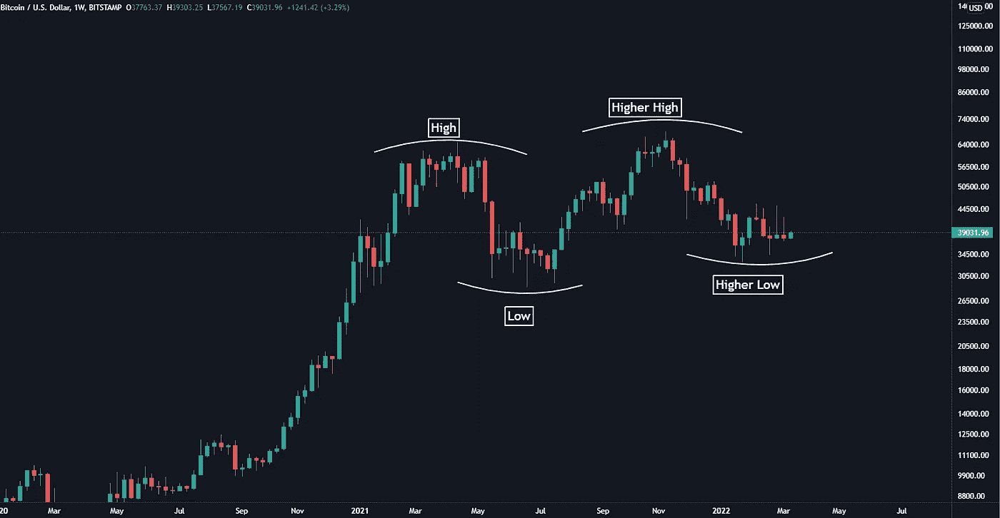
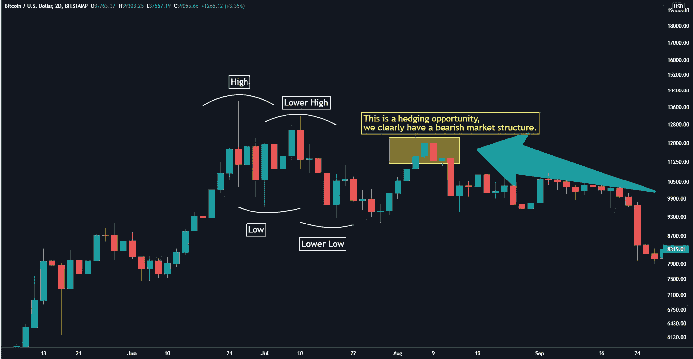
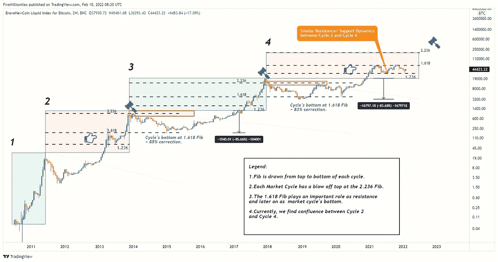
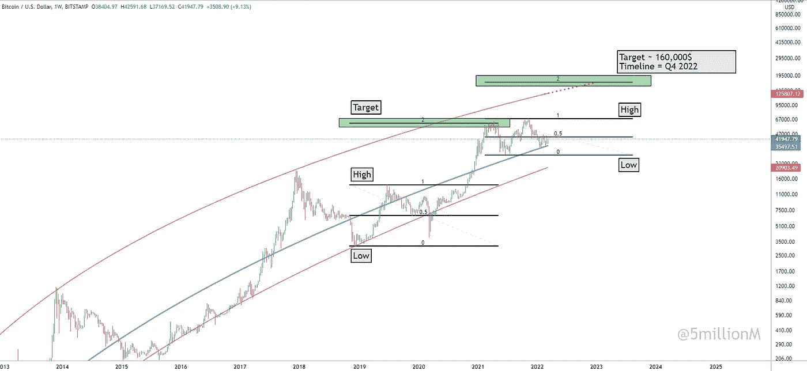
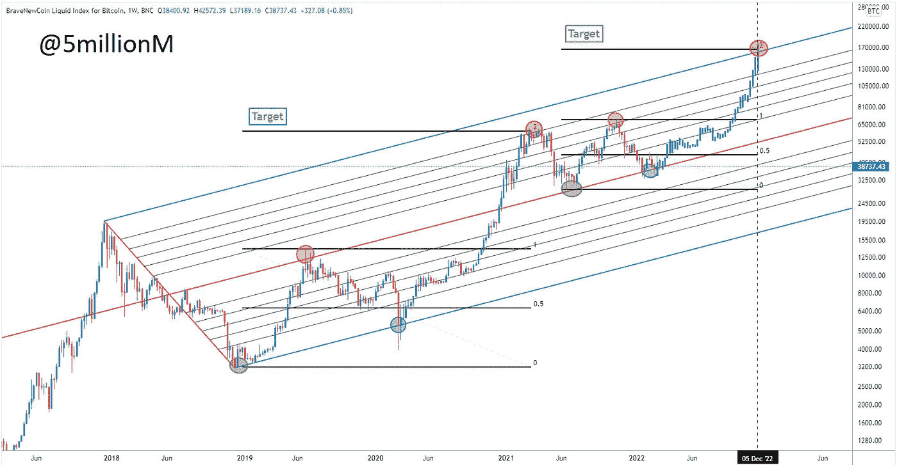
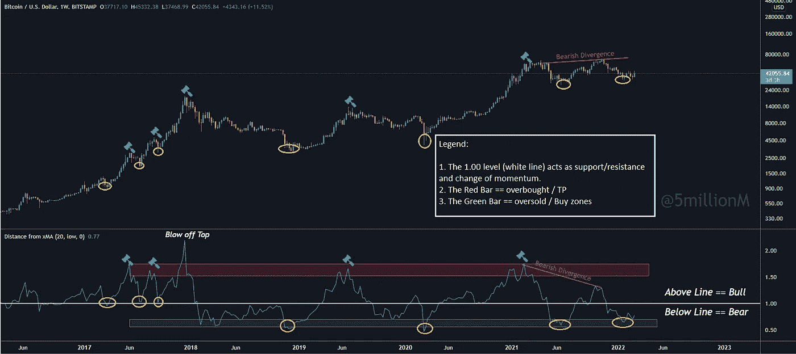
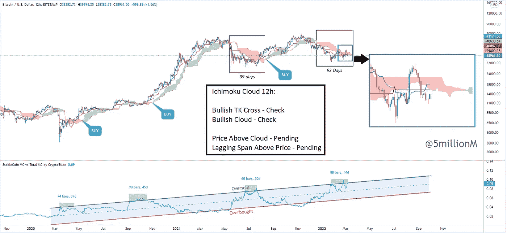
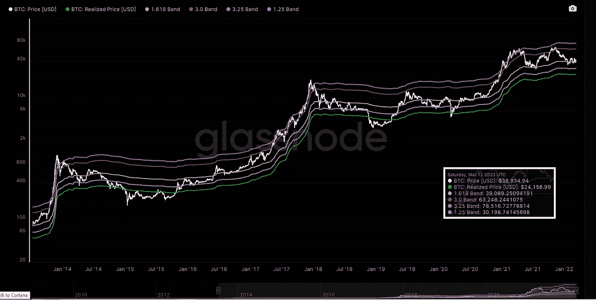
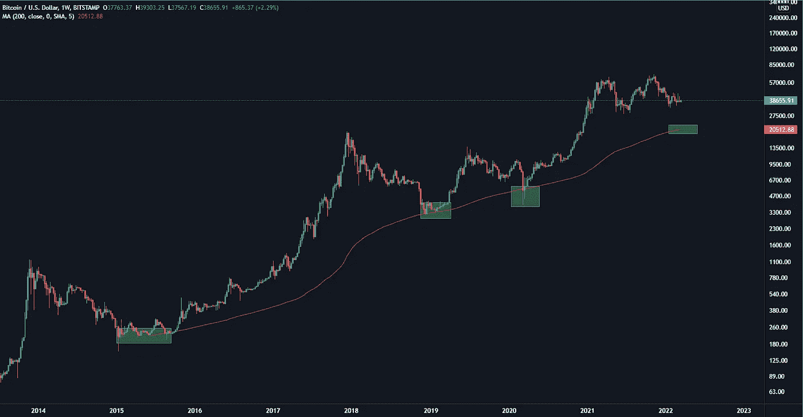

# 比特币价格预测——好的、坏的和丑陋的！

> 原文：<https://medium.com/coinmonks/bitcoin-price-predictions-the-good-the-bad-and-the-ugly-24bc6d9bcf4b?source=collection_archive---------7----------------------->

## 支持/阻力区以及如何为所有可能的结果做准备。

**牛市案例:**

让我们从牛市场景开始，因为我仍然相信这是最有可能的结果。原因是——我们有一个高高低低的看涨市场结构。

Figure 1 : Current Market Structure Zoomed Out — 1W time frame

是的，事情会动态变化，但在 52%的修正后，如果没有适当的反弹来捕捉多头和散户月亮男孩，现在就变成熊市——不太可能。不对称是向上的，在我看来，我们至少应该期待反弹到 50，000-61，000 美元。

Figure 2 : 2019 Local top at 14,000$. Price had a 72% correction all the way down to 3,800$

图 2 是一个看跌市场结构的例子。是的，我们可能没有那么多时间像 2019 年那样对冲现金，然而，你根本不能说熊市没有更低的低点和更低的高点。

至于其他更深入的原因，为什么我相信我们仍然在看涨的领域，请阅读我在 1 月下旬发表在当前低点的文章:[“我他妈的不会离开！”](/coinmonks/i-am-not-f-ing-leaving-53f984176e26)

那么，我们能从这里走向何方呢？时间表是什么，我们的目标是什么？首先，我要说的是，可能没有人能够精确地回答这个问题。然而，有目标就意味着做好准备。有准备意味着少一些情绪，更好的执行。就当是更高的 ROI 吧。零售是由情绪驱动的，FOMO 和 FUD。那不是你想走的路。这是一个邪恶的行业，大多数人都赔钱交易。这意味着 80-90%的人。别傻了，准备好或者努力准备好。以 65，000 美元的价格购买比特币，因为你所有的朋友都是这么做的，这可能会给你短期的心理安慰，让你觉得你在做正确的事情，但这对你的财务收益没有什么帮助。

那些说“比特币将达到 100 万美元，而你对此无能为力”的人也帮不上什么忙。

这是否意味着当你的平均买入费是 35，000 美元时，你不应该在 150，000 美元时获利？影响力大的人希望吸引注意力，理性很无聊——他们不能从中获利。你需要让人们在情感上参与进来，让他们觉得他们需要你——看你的视频，用你的注册奖金等等。请记住，交易绝对不是“我们都会发财的计划”。这是一个猎物和捕食者的游戏。对于一个想在顶部卖出而致富的人来说，他需要退出流动性——也就是在顶部买入，希望自己的钱能翻 10 倍的傻瓜。

既然这个问题已经解决了，我们就来谈正事吧。

让我们从比特币历史上出现的模式开始——因此这一次增加了它们重复的可能性。我们仍在研究小数据样本，但无论如何，比特币或多或少都是如此。

Figure 3 : Fibs that acted as resistance during the previous bull runs

我们大致类似于 2013 年至 2014 年的动态。价格在 1.618 纤维处发现了一个临时阻力。一旦这一点被打破，可能的目标是 2.236 纤维或约 180，000 美元。这些都非常非常敏感，所以即使我们达到了，比如说，150，000 美元，我认为开始减少一些也不是一个坏主意。

其他更关注 2019 年后数据的高时间框架目标约为 160，000-170，000 美元。所以，是的，我称之为汇合。

Figure 4 : Bitcoin non-linear regression curve matched with 2.0 Fibs

如图 4 所示，基于非线性回归曲线和 2.0 Fibs 的可能目标是 160，000 美元水平。这一目标实际上也与多年期干草叉相吻合。再次呼吁将 Q2 2022 作为时间表。

Figure 5 : Clean Pitchfork levels that played out close to perfectly the last 3 years

虽然干草叉不是我的面包和黄油，但这一把在过去 3 年里一直发挥着高精度。我们仍在中线上方交易，这可能成为牛熊偏向。

这一次，我还纳入了 2020 年的分形，当时我们的交易价格正好低于 0.5 Fib。原因是——这是我们目前的确切位置，我们的交易价格正好低于 0.5 Fib。这可能会以多种形式出现。底线——在 65，000-70，000 美元的水平上第三次拒绝和第四次尝试突破不会令人惊讶。

使用 fib、Pitchforks 和非线性回归曲线只是估计比特币下一步走向的许多可能方法中的几种。

也可以用移动平均线(MAs)来做。MAs 可以用在很多方面，不仅仅是 MA 杂交。

1W 20MA 的距离可以突出可能的超买/超卖区域。

Figure 6 : Distance from 20MA on the weekly timeframe

如图 6 所示，我们可以在 14，000 美元、65，000 美元和 69，000 美元的周线上找到与本地顶部的汇合点。我会更加重视最近的数据——2019 年后，因为市场的表现完全不同。它完美吗——不，但也不一定是完美的。请记住，可以分析的数据越多，你的优势就越低。这是你与人工智能机器人和数十亿对冲基金的交易。较低的确定性意味着较高的风险，但较高的风险也意味着较高的投资回报率。就在几年前，人们还在争论比特币是否会降为零。这种担心也是一个机会，随着疑虑的消退，FOMO 将会变得更加强大。

最后，我看多的原因之一是进入这个领域的资金数量。如果你跟踪铸造的稳定硬币的数量——自 2021 年初以来，它已经翻了几番，而价格却几乎保持不变。我们是受范围限制的。为此，我开发了一个实验指标。这个想法很简单——更稳定的硬币=更多准备参与的干粉。

Figure 7 : Experimental Stable Coins MC vs Total Crypto MC Indicator

如图 7 所示，我们从 2020 年 3 月开始在这个通道交易。它抓住了 2020 年 3 月的 Covid 投降，以及所有其他主要的顶部和底部。我们目前非常超卖。

使用更多“流动”指标，如稳定的硬币 MC 或 1W 20MA 的距离的好处是，你没有一个“硬目标”(如 160，000 美元)，相反，你可以以更动态的方式找到超卖/超买区域。你可以在两者之间移动。我可以继续下去，包括一些连锁指标，但这一点很清楚——我们几乎在任何事情上都超卖。我们能不能再低一点——当然，但我认为可能性不大。

最后，这个周期与 2017 年不一样。我们没有给零售商太多的利润空间。坦率地说，零售正变得前所未有的重要。这是一个更难交易的市场。出于这个原因，我会格外重视 2019 年后的数据。

**熊市:**

既然我们已经讨论了牛市的情况，让我们把注意力集中在表明我们还将经历更多痛苦的论点上。我们的目标会在哪里？

熊市的主要说法是，如果我们不处于周期中期的牛市盘整，那么我们还有很多下跌空间。这是真的。我不认为这是可能的，但是是的——有可能发生。

在我看来，在这里寻找目标要容易得多，因为不需要价格发现。我们有历史、模式和链上数据，这些数据在寻找底部时表现非常好。让我们从我在 Glassnode 上工作的指示器开始。这些乐队是最初由 [@TheRealPlanC](https://twitter.com/TheRealPlanC) 发布的修改版本。

Figure 8 : Realized Price Bands — Support / Resistance Zones

在图 8 中，请注意实际价格——或者说人们平均为比特币支付的价格。这包括所有的市场参与者——散户和精明的投资者。现在，这是一个不同的话题——但目前零售在所有市场参与者中只占很小的比例。原因很简单，零售业在过去的一年里得到了复苏。这意味着，平均而言，精明投资者支付的价格更接近实际价格。

如果我们继续看涨的假设是错误的，那么底价应该不会离目前大约 24，000 美元的绿色带(实现价格)太远。现在，值得一提的是，这些波段是动态的，这意味着它们受价格的影响。如果我们向上移动，已实现价格带也将向上移动。如果我们抛售，它也将走向下行。所有这些都意味着在投降事件中，绿色带可能会更低，比如说 20，000-22，000 美元。

让我们看看另一个模型，臭名昭著的每周 200 毫安:

Figure 9 : 200MA on the Weekly Time Frame

如图 9 所示，我们发现 20，000 美元是一个趋同的价格。这很好——这给了我们更多信心，认为这是一个强有力的支撑位。

基于前一个周期 80%以上修正的绝对底部将在 10，000 美元左右。现在，我们没有出现抛物线式的下跌，所以在我看来，出现如此恶性的抛售是不太可能的。坦率地说，即使抛售到 20，000 美元也是一个低概率的举动，但尽管如此，仍然值得一提。

补充几个值得一提的问题-净未实现利润/亏损(NUPL)也远远触及谷底，Pi Cycle 在 Q2 2021 年给出了卖出(市场顶部)信号，但这些链上指标与 HTF TA 无论如何都有很多共同点。

如果我们真的达到这些水平，那将是一个完美的(从以前的结果来看)市场进入。仅供参考——历史上一次总付也比 DCA 好。

根据我们目前的超卖程度、几个月来市场情绪的低落程度以及市场参与者的情况——76%的人是长期持有(不太可能卖出)，我预计底部已经到来。调整和/或访问 1.25 区间(在 30，000 美元左右)以获得额外的流动性也是一种可能性。

在我看来，到 20，000 美元或更低是一个非常低概率的举动。当然不是从这里，不是在我们反弹到 50，000-60，000 美元之前。

对于 0.5 Fib 的反弹，我们已经有了 52%的修正。自 2015 年以来，在我们进行的约 30 次 HTF 校正(20%以上的校正)中，这种情况只发生了 2 次。这种情况发生了两次，都是持续了 30-35 天的 60%以上的快速抛售(2018 年 1 月-2 月，2020 年 2 月-3 月)。自 2021 年 11 月抛售以来，我们已经过了 120 多天。我想你明白我的意思了。

现在，我也提到了“T0”丑陋的“T1”结果。那会是什么——嗯，对我来说，这将是 30，000-60，000 美元区间的进一步长期盘整。也许还要一年左右。然后在 2023 年有强烈的上升冲动。

希望您喜欢这篇文章，并发现它很有用。下次见！

免责声明:

以上分享的内容不是理财建议。

这篇文章重点介绍了我感兴趣的一些模式和工具，仅供娱乐之用。

> 加入 Coinmonks [电报频道](https://t.me/coincodecap)和 [Youtube 频道](https://www.youtube.com/c/coinmonks/videos)了解加密交易和投资

# 另外，阅读

*   [如何购买 Monero](https://coincodecap.com/buy-monero) | [IDEX 评论](https://coincodecap.com/idex-review) | [BitKan 交易机器人](https://coincodecap.com/bitkan-trading-bot)
*   [CoinDCX 评论](/coinmonks/coindcx-review-8444db3621a2) | [加密保证金交易交易所](https://coincodecap.com/crypto-margin-trading-exchanges)
*   [红狗赌场评论](https://coincodecap.com/red-dog-casino-review) | [Swyftx 评论](https://coincodecap.com/swyftx-review) | [CoinGate 评论](https://coincodecap.com/coingate-review)
*   [Bookmap 评论](https://coincodecap.com/bookmap-review-2021-best-trading-software) | [美国 5 大最佳加密交易所](https://coincodecap.com/crypto-exchange-usa)
*   [如何在 FTX 交易所交易期货](https://coincodecap.com/ftx-futures-trading) | [OKEx vs 币安](https://coincodecap.com/okex-vs-binance)
*   [CoinLoan 评论](https://coincodecap.com/coinloan-review) | [YouHodler 评论](/coinmonks/youhodler-4-easy-ways-to-make-money-98969b9689f2) | [BlockFi 评论](https://coincodecap.com/blockfi-review)