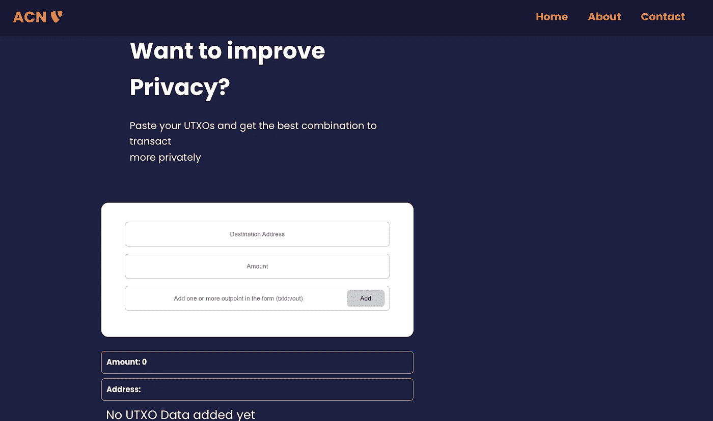

# 比特币隐私

> 原文：<https://medium.com/coinmonks/bitcoin-privacy-68bdbdbb4107?source=collection_archive---------15----------------------->

# **简介**

比特币今天获得了很多媒体的关注，不仅因为它是一种分布式数字货币，还因为它的[匿名特性](https://www.wi.uni-muenster.de/sites/wi/files/public/department/itsecurity/mbc13/mbc13-moeser-paper.pdf) [。](https://www.wi.uni-muenster.de/sites/wi/files/public/department/itsecurity/mbc13/mbc13-moeser-paper.pdf).)然而，由于比特币区块链上的每一笔交易都可以被任何人自由检查和分析，因此比特币用户可以基于试探法和交易图被去匿名化。因此，我们可以说比特币是伪匿名的，而不是匿名的。伪匿名的意思是，比特币地址用于在网络上进行交易，没有名称、物理地址或其他身份与这些比特币地址相关联。

在谈到比特币中的隐私时，区分系统中的匿名和假名是很重要的。在匿名系统中，我们不知道系统中执行动作的人的身份。在假名系统中，由同一实体执行的动作都链接到同一标识符。根据系统的实现方式，该标识符可能会也可能不会链接到真实世界的可识别信息。此外，该标识符不一定是参与者的真实身份，而是可以是半匿名的“假名”

举个例子，如果你在 Twitter 上注册了用户名“恩莱特 999”，你就注册了一个假名。虽然其他 Twitter 用户可能(此时)不知道真实生活中谁是这个账户的幕后黑手，但他们可以在整个网站上跟踪“优雅 999”这个假名的所有活动。如果有一天你发现自己是“优雅 999”这个笔名的所有者，那么你在这个网站上的所有历史和未来活动都可以归于你。相比之下，Twitter 的匿名实现不会显示(或知道)哪些用户/假名发布了哪些消息——该网站上的所有消息都是完全匿名的。

由于其看起来随机的性质，比特币的地址在外人看来可能是匿名的。实际上，它们应该被认为是假名，因为它们可以用来链接同一个用户的多个操作。因此，我们可以得出结论，比特币不是匿名系统，而是假名系统。

# **为什么隐私**

比特币[白皮书](https://bitcoin.org/bitcoin.pdf)有一整节是关于隐私的，其中 Satoshi 承认公开宣布所有交易的必要性如何影响隐私。然而，他建议保持比特币地址匿名，也不要重复使用这些地址，这是保护隐私的好方法。一旦交易在比特币区块链(“链上”)上被确认，它就不能被删除，因此，隐私逐渐退化。想象一个用比特币发工资的雇主。这样的雇主很容易知道员工用他们的收入做了什么账单或捐赠，这可能违背了员工的意愿。另一种情况是，窃贼能够跟踪个人在网络上的所有交易，这可能使这样的个人成为被利用的目标。由于这些原因，每个用户都想保护他们的隐私(在某种程度上)。因此，比特币社区需要获得隐私权，以便用户继续使用它，比特币才能生存。

# **侵犯隐私**

当用户发送或接收比特币时，比特币交易发生在比特币网络上，通常是在比特币交易所管理的比特币钱包([轻量级节点](https://en.bitcoin.it/wiki/Lightweight_node))上进行。还有一些交易可以在其他类型的[比特币节点](https://bitcoin.org/en/full-node#other-linux-gui)上进行。尽管比特币是伪匿名的，但比特币托管机构、经纪公司和交易所等机构通常需要个人信息才能履行 KYC/反洗钱政策，之后用户才能在其平台上进行交易。用户数据与链分析公司、[交易监控公司](https://en.bitcoin.it/wiki/Transaction_surveillance_company) [、](https://en.bitcoin.it/wiki/Transaction_surveillance_company),)等对手进行存储和交易，可以降低用户的伪匿名性，使用户失去隐私。这些公司分析数据，并运用一些启发法，目的是追踪交易，直至个人所有者。对于敌对思维的比特币创造者来说，了解这些启发式方法在消除误解方面有多有效是很有用的，这样他们就可以尝试采取措施来打破它们。例如，如果钱包能够组合不返回变化的输入，则变化检测不会发生。这样，无法检测到更改地址，并且链分析不会为更改地址检测试探法返回有效结果。

# **反链分析**

为了帮助钱包开发者选择交易的最佳输入，以保护用户的隐私，我和我在 [Qala](https://qala.dev) 项目中的一位同事决定建立一个[反链分析器](https://github.com/Jennycj/anti-chainanalysis)，对抗链分析。该应用程序帮助钱包开发者构建钱包，这些钱包创建的交易很难被链分析正确分析。

Anti-chain analyser

该工具遍历开发人员提供的输入，并对每个输入应用不同的启发式算法，返回最佳输入，以最大限度地减少事务易受启发式算法影响的次数。这些试探法包括:

**影子试探法**:比特币交易的一种常见类型是简单发送，一个输出给接收者，一个输出作为变化返回给发送者。这些试探法假设当一个事务的输出 [scriptPubKey](https://en.bitcoin.it/wiki/Transaction#:~:text=The%20scriptPubKey%20in,following%20serialized%20script.) (地址)与输入 scriptPubKey(地址)相同时，很明显这个输出是一个“更改输出”,因为它将返回给发送方。特别是在 2 输出事务的情况下，这也使接收者失去了匿名性，因为现在哪个输出(非变化输出)是他们的变得非常明显。这种启发的另一个变体是:如果任何输出(scriptPubkeys)曾经在区块链上被看到，我们可以假设它是一个付费输出，并且其他输出很可能被改变。反链分析器通过检测重复使用的地址并适当地通知用户来对抗这些试探。

**不必要的输入试探法**:考虑一个有两个输入(2 个 BTC 和 3 个 BTC)和两个输出(4 个 BTC 和 1 个 BTC)的交易。很容易看出 1BTC 是零钱，因为如果 1 BTC 输出是付款，3 BTC 输入是不必要的，2BTC 输入足以支付 1 BTC 并支付较低的矿工费，因此 4 BTC 是付款。反链分析器通过要求钱包开发者总是向反链分析器请求有效载荷传递大于实际支付的金额来解决这种隐私泄露。然后分析器计算最佳输入组合，使得所有输出总是大于任何输入。

**变更检测**:许多链分析试图找到交易的变更地址，因为这可以与其他启发式方法结合，如[通用输入所有权启发式方法](https://en.bitcoin.it/wiki/Common-input-ownership_heuristic)来泄露隐私。这个反链分析器总是在计算最佳 UTXO 组合之前找到与计划花费的金额完全匹配的值。在输入与所需输出量不完全匹配的情况下，分析器会应用其他试探法。

# **挑战反链分析**

反链分析器的主要挑战之一是，它返回的输入多于交易所需的输入，以对抗不必要的输入试探，这导致用户支付更多的交易费用。此外，如果用户有更多的输入以获得更高的值变化输出，则分析器工作得最好。比特币核心没有完整的地址( [scriptPubKey](https://en.bitcoin.it/wiki/Transaction#:~:text=The%20scriptPubKey%20in,following%20serialized%20script.) )索引，可以对任意交易进行查询。因此，反链分析查询[第三方端点](https://mempool.space/signet/docs/api/rest)来检测地址重用，而不是查询本地比特币节点，这可能是一个缺点，因为目的是无信任地使用比特币。查询比特币节点意味着无需信任任何人、第三方端点或任何中介来检测重复使用的地址。

# **结论**

每个人都可以看到区块链账本，包括对手。对手可以看到产生交易的地址和接收交易的地址，包括发送的金额，即使这种交易没有真实的身份。由于比特币托管人和交易所需要用户的身份才能交易比特币(将[法定货币](https://www.investopedia.com/terms/f/fiatmoney.asp#:~:text=Key%20Takeaways-,Fiat%20money%20is%20a%20government%2Dissued%20currency%20that%20is%20not,U.S.%20dollar%2C%20are%20fiat%20currencies.)改为比特币)，隐私被削弱了。然而，当你在比特币生态系统中交易时，无论交易所在做什么都不会影响到你。我相信建立更多的反链分析工具将有助于保护隐私，人们将被鼓励继续使用比特币。

# **参考**

隐私([https://en.bitcoin.it/wiki/Privacy](https://en.bitcoin.it/wiki/Privacy))

比特币交易的匿名性([https://www . wi . uni-muenster . de/sites/wi/files/public/department/it security/MBC 13/MBC 13-moeser-paper . pdf](https://www.wi.uni-muenster.de/sites/wi/files/public/department/itsecurity/mbc13/mbc13-moeser-paper.pdf)

比特币隐私和匿名(【https://river.com/learn/bitcoin-privacy-and-anonymity/】T2