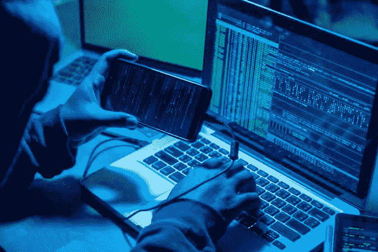

# 所有诈骗平台的比特币私钥恢复和令牌恢复大师

> 原文：<https://medium.com/coinmonks/bitcoin-private-key-recovery-and-token-recovery-masters-from-all-scam-platforms-9329e252c373?source=collection_archive---------29----------------------->

[私钥恢复和令牌管理](https://cryptoprivatekeyrecovery.net):我们在这里帮助任何人解决与加密货币相关的任何恢复问题。我们有 95%的把握收回您的每一美元，有了您的帮助和信任，我们可以让事情变得更容易。

执行任何流程都不需要您的个人信息。如果有人询问您的个人信息，您必须小心。

我们所有的软件都是最新的，您可以有 99%的信心恢复您的发现使用我们的高姿态私钥恢复软件。
网址:[https://cryptoprivatekeyrecovery.net](https://cryptoprivatekeyrecovery.net)
邮箱:[info@cryptoprivatekeyrecovery.net](mailto:info@cryptoprivatekeyrecovery.net)
电话:+1(424)296–0879

https://cryptoprivatekeyrecovery.net

[https://cryptoprivatekeyrecovery.net/Bitcoin](”<a)私钥黑/" >比特币私钥黑< /a >，

[https://cryptoprivatekeyrecovery.net/Token](”<a)恢复软件/>令牌恢复软件< /a >，

[https://cryptoprivatekeyrecovery.net/Fake](”<a)比特币交易/>假比特币交易< /a >，

[https://cryptoprivatekeyrecovery.net/Bitcoin](”<a)私钥恢复/>比特币私钥恢复< /a >，

[https://cryptoprivatekeyrecovery.net/Private](”<a)密钥恢复软件/>私钥恢复软件< /a >，

[https://cryptoprivatekeyrecovery.net/Crypto](”<a)恢复/>密码恢复< /a >，

https://cryptoprivatekeyrecovery.net/Non-spendableCrypto/">非消耗性 crypto < /a >，

[https://cryptoprivatekeyrecovery.net/Dust](”<a)攻击/>尘埃攻击< /a >，

[https://cryptoprivatekeyrecovery.net/Best](”<a)投资平台/" >找回丢失的加密货币< /a >，

丢失包含加密货币的手机或硬件钱包很不方便，但应该不会致命。如果你已经备份了你的私人钥匙，找回你的硬币是一个简单的练习。然而，如果你发现自己处于这样的困境中，在使用钱包恢复短语之前，有几件事你应该知道。
用正确的方法找回你的钱包
如果你足够聪明，把你的比特币存放在一个非托管的钱包里，你也足够聪明，做一个备份。无论你使用的是桌面、移动还是硬件钱包，过程都是一样的:找出你为这个场景藏在安全地方的种子短语，并将其输入到你的替换钱包中。一切都按计划进行，你会看到你的余额恢复，你的硬币在导入种子后几秒钟内重新出现在你的钱包里。

然而，这个规则也有一些例外，因为不是所有的钱包都依赖种子短语来恢复访问。Hashwallet 在智能卡设备的设置期间生成唯一的恢复密钥和恢复种子。当结合使用时，这些组件可用于重新访问存储在钱包中的资金，并且出于安全原因必须分开存储。一旦安全地存储了恢复密钥和恢复种子，它们将从智能卡中永久删除。
在钱包丢失的情况下，用户可以找回并组合这些安全元素，于是他们的新 Hashwallet 将生成访问资金所需的密钥。Zengo 是另一款采用无钥匙设计的钱包。不过，在本指南的剩余部分，我们将重点关注使用种子短语的传统非托管钱包。

> *加入 Coinmonks* [*电报频道*](https://t.me/coincodecap) *和* [*Youtube 频道*](https://www.youtube.com/c/coinmonks/videos) *了解加密交易和投资*

# 另外，阅读

*   [有哪些交易信号？](https://coincodecap.com/trading-signal) | [Bitstamp vs 比特币基地](https://coincodecap.com/bitstamp-coinbase) | [买索拉纳](https://coincodecap.com/buy-solana)
*   [ProfitFarmers 回顾](https://coincodecap.com/profitfarmers-review) | [如何使用 Cornix Trading Bot](https://coincodecap.com/cornix-trading-bot)
*   [十大最佳加密货币博客](https://coincodecap.com/best-cryptocurrency-blogs) | [YouHodler 评论](https://coincodecap.com/youhodler-review)
*   [MyConstant 点评](https://coincodecap.com/myconstant-review) | [8 款最佳摇摆交易机器人](https://coincodecap.com/best-swing-trading-bots)
*   [MXC 交易所评论](/coinmonks/mxc-exchange-review-3af0ec1cba8c) | [Pionex vs 币安](https://coincodecap.com/pionex-vs-binance) | [Pionex 套利机器人](https://coincodecap.com/pionex-arbitrage-bot)