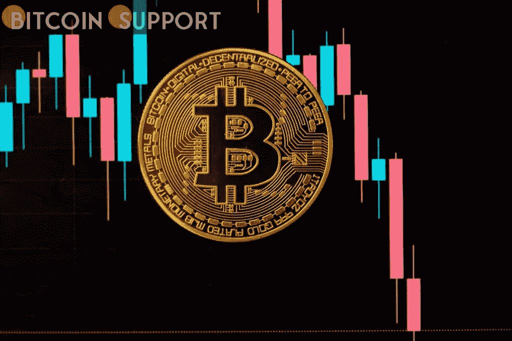
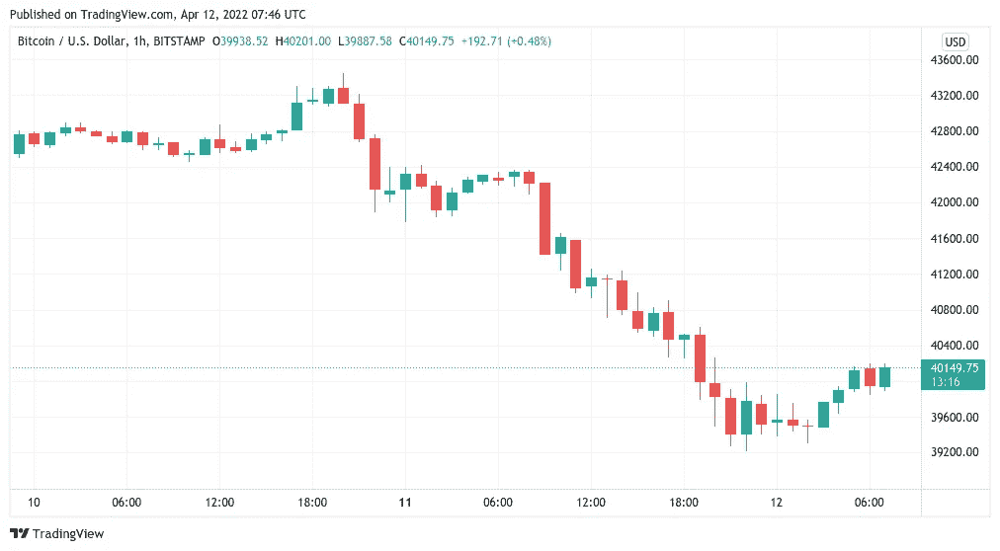
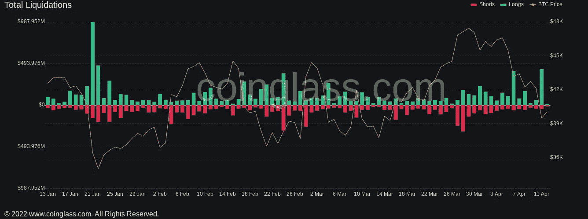
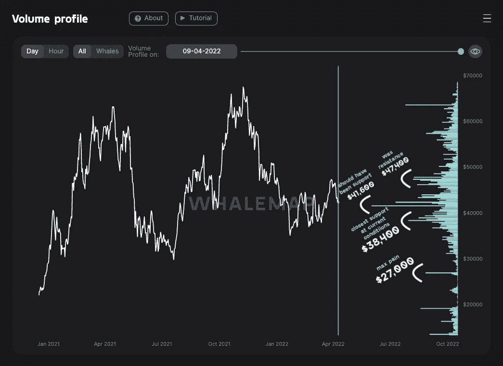

# 随着过去 24 小时内售出的密码数量接近 5 亿美元，比特币回收了 4 万美元

> 原文：<https://medium.com/coinmonks/bitcoin-reclaims-40k-as-24-hour-crypto-liquidations-approach-500-million-5032e53130d5?source=collection_archive---------75----------------------->

即将公布的 CPI 数据预计将震惊市场，比特币交易商预计将出现“短期反弹”催化剂。在经历了 BTC/美元触及三周低点的艰难开局后，比特币(BTC)试图在 4 月 12 日夺回 40，000 美元作为支撑。

消费者价格指数的数据预计会“非常高”

根据 TradingView 的数据，Bitstamp 上最大的加密货币在前一天暴跌至仅 39300 美元后，周二反弹至 40200 美元。在短时间内，比特币似乎毫无吸引力，尤其是在科技股外流的推动下，押注于牛市持续的投资者两手空空。根据在线监控服务 Coinglass 的数据，在过去的 24 小时内，加密交易者在清算的多头交易中损失了总计 4 . 28 亿美元，这是自 1 月 22 日以来单日损失最大的一次。

在 Twitter 上关于当前气候的对话中，Blockware principal insights 分析师 William Clemente 评论道，“技术的这种翻转也影响了 BTC。”

**“不管我同意还是不同意，市场似乎将 BTC 视为一只高贝塔科技股，与前一个月的相关性不断上升。”他的言论类似于 BitMEX 前首席执行官亚瑟·海斯(Arthur Hayes)的言论，后者预测由于周一的宏观设置，BTC/美元将跌至 30，000 美元。与此同时，今天晚些时候预期的最新消费者价格指数(CPI)数据给美国经济和相关情绪雪上加霜。作为自俄乌战争开始以来首次公布的 CPI 统计数据，3 月份的数据预计将增加通胀压力，通胀压力已经达到 40 年来的最高水平。

[https://Twitter . com/DylanLeClair _/status/1513574686915010562](https://twitter.com/DylanLeClair_/status/1513574686915010562)

CPI 事件有导致加密市场短期波动的历史，因此周二东部时间上午 8:30 的发布对于交易员来说非常重要。因此，一些人猜测，一旦数据公布，下行压力可能会有所缓解。

**支持鲸鱼意味着 27000 美元的“最大痛苦”与此同时，另一家连锁分析网站 Whalemap 在分析了大量投资者买入 BTC 的支撑位后，宣布 27000 美元为市场的“峰值痛苦”目标。“不幸的是，41600 美元没有守住。最新最接近的内链支持是 38400 美元。尽管如此，一张描绘鲸鱼头寸的图表显示，由于买家的欲望，41，600 美元“应该”被持有。****

**免责声明:这些是作者的观点，不应被视为投资建议。读者应该自己做研究。**

> 加入 Coinmonks [电报频道](https://t.me/coincodecap)和 [Youtube 频道](https://www.youtube.com/c/coinmonks/videos)了解加密交易和投资

# 另外，阅读

*   [比特币基地评论](/coinmonks/coinbase-review-6ef4e0f56064) | [德里比特评论](/coinmonks/deribit-review-options-fees-apis-and-testnet-2ca16c4bbdb2) | [FTX 评论](/coinmonks/ftx-crypto-exchange-review-53664ac1198f)
*   [联合国硬币评论](https://coincodecap.com/unocoin-review) | [最佳加密赌注硬币](https://coincodecap.com/best-crypto-staking-coins)
*   [如何使用 MetaMask Wallet 获取 KCC 地址？](https://coincodecap.com/kcc-address-metamask)
*   [如何获得自己的。XYZ 领域？](https://coincodecap.com/xyz-domain)
*   [最佳加密交换平台](https://coincodecap.com/best-crypto-swap-platforms) | [最佳加密交易所](https://coincodecap.com/crypto-exchange)