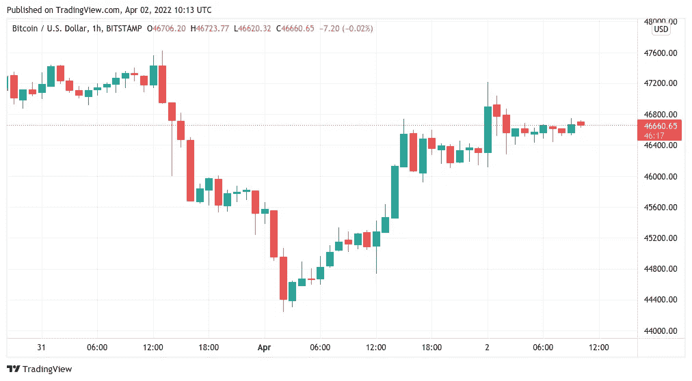
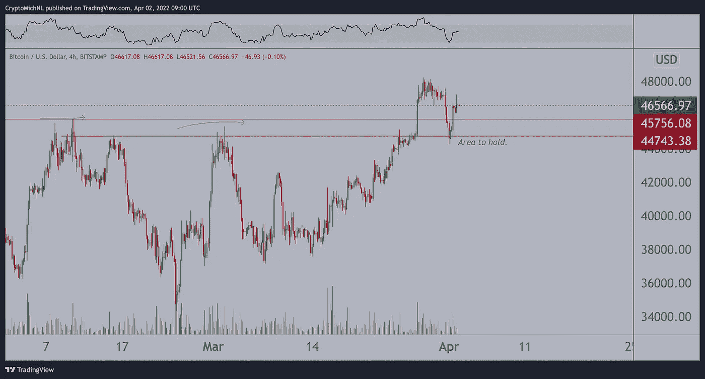
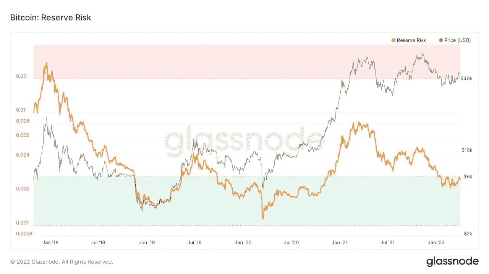

# 一名交易员预测下周比特币价格将达到 50000 美元，从而刷新其年度高点

> 原文：<https://medium.com/coinmonks/bitcoin-reclaims-its-yearly-high-as-a-trader-predicts-a-50k-price-next-week-5bdf3cc0f9a7?source=collection_archive---------52----------------------->

**Visit our website:-** [**https://bitcoinsupports.com/**](https://bitcoinsupports.com/)

阻碍比特币下一个里程碑的是新一轮跌破 45000 美元。

4 月 2 日，比特币(BTC)在短暂恢复形态后，在 2022 年年度开盘上方盘整，多头收复 47000 美元。

**Visit our website:-** [**https://bitcoinsupports.com/**](https://bitcoinsupports.com/)

**对比特币价格的长期支持是“至关重要的”**

根据 TradingView 的数据，BTC/美元在长期支撑处明显反弹后，周六徘徊在 46，600 美元附近。周五，该货币对跌至约 44，300 美元的低点，但这是短暂的，因为乐观情绪主导了华尔街公开赛。为了保持新获得的支持，撰稿人 Michal van de Poppe 下注 50，000 美元。当天，他向推特粉丝总结道，“比特币的关键领域，继续上涨似乎是合理的。”

**“如果我们回到 45k 美元区间，我相信这将是疲软的迹象，我们将向 40k 美元区间移动。如果我们不这样做，下周$50k 是一个可能性。”**

**Visit our website:-** [**https://bitcoinsupports.com/**](https://bitcoinsupports.com/)

与此同时，流行的基于股票到流量的比特币价格模型背后的分析师 PlanB 强调，比特币的相对强度指数仍然强劲(RSI)。

[https://Twitter . com/100 trillion USD/status/1510184902246993923](https://twitter.com/100trillionUSD/status/1510184902246993923)

多头 RSI 表现伴随着最近几周的价格挤压。

**储备风险指标保持在“超额”回报区**

与此同时，在 3 月份，一个环比指标开始对 BTC/美元产生更强烈的买入信号。超过四周后，储备风险(Reserve Risk)在本周末停留在目标区间。储备风险表明何时投资，以确保随着时间的推移获得“超大”回报。Reserve Risk 警告称，从更长的时间尺度来看，当前的价格上涨并不是故事的结束，尽管显示出上涨的迹象。

**访问我们的网站:-**[**https://bitcoinsupports.com/**](https://bitcoinsupports.com/)

**免责声明:这些是作者的观点，不应被视为投资建议。读者应该自己做研究。**

> 加入 Coinmonks [电报频道](https://t.me/coincodecap)和 [Youtube 频道](https://www.youtube.com/c/coinmonks/videos)了解加密交易和投资

# 另外，阅读

*   [3 商业评论](/coinmonks/3commas-review-an-excellent-crypto-trading-bot-2020-1313a58bec92) | [Pionex 评论](https://coincodecap.com/pionex-review-exchange-with-crypto-trading-bot) | [Coinrule 评论](/coinmonks/coinrule-review-2021-a-beginner-friendly-crypto-trading-bot-daf0504848ba)
*   [莱杰 vs n rave](/coinmonks/ledger-vs-ngrave-zero-7e40f0c1d694)|[莱杰 nano s vs x](/coinmonks/ledger-nano-s-vs-x-battery-hardware-price-storage-59a6663fe3b0) | [币安评论](/coinmonks/binance-review-ee10d3bf3b6e)
*   [Bybit Exchange 审查](/coinmonks/bybit-exchange-review-dbd570019b71) | [Bityard 审查](https://coincodecap.com/bityard-reivew) | [Jet-Bot 审查](https://coincodecap.com/jet-bot-review)
*   [3 commas vs crypto hopper](/coinmonks/3commas-vs-pionex-vs-cryptohopper-best-crypto-bot-6a98d2baa203)|[赚取加密利息](/coinmonks/earn-crypto-interest-b10b810fdda3)
*   最好的比特币[硬件钱包](/coinmonks/hardware-wallets-dfa1211730c6) | [BitBox02 回顾](/coinmonks/bitbox02-review-your-swiss-bitcoin-hardware-wallet-c36c88fff29)