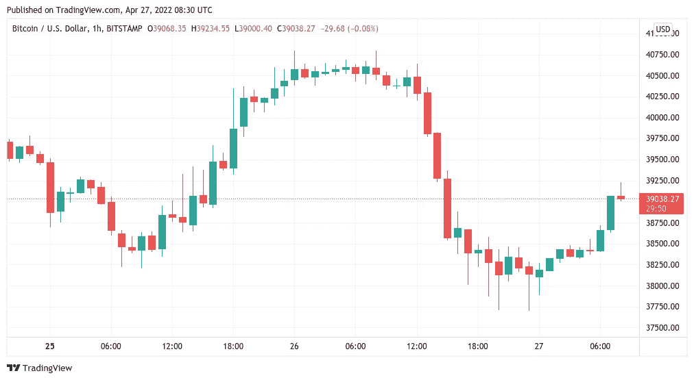

# 在“残酷的”BTC 价格牛市陷阱的警告声中，比特币从六周低点反弹

> 原文：<https://medium.com/coinmonks/bitcoin-recovers-from-6-week-lows-as-a-brutal-btc-price-bull-trap-is-warned-1a512ffdfcc0?source=collection_archive---------34----------------------->

**Visit our website for full blog:-**[**https://bitcoinsupports.com/bitcoin-recovers-from-6-week-lows-as-a-brutal-btc-price-bull-trap-is-warned/**](https://bitcoinsupports.com/bitcoin-recovers-from-6-week-lows-as-a-brutal-btc-price-bull-trap-is-warned/)

谈到比特币新的价格优势，随着美元逼近 2020 年 3 月的高点，所有的赌注都将落空。在又一个痛苦的夜晚之后，比特币(BTC)于 4 月 27 日反弹 39000 美元。BTC/美元已经触及自 3 月中旬以来的最低水平。

**Visit our website for full blog:-**[**https://bitcoinsupports.com/bitcoin-recovers-from-6-week-lows-as-a-brutal-btc-price-bull-trap-is-warned/**](https://bitcoinsupports.com/bitcoin-recovers-from-6-week-lows-as-a-brutal-btc-price-bull-trap-is-warned/)

根据 TradingView 的数据，在撰写本文时，最大的加密货币 Bitstamp 的交易价格为 39，200 美元，上涨了 2.5%。周二华尔街交易一恢复，新的问题就爆发了，比特币跟随股市再次走下坡路，两次触及 37700 美元。尽管该地区已被认定为潜在的流动性攫取地，但一些怀疑论者仍怀疑抛售已经结束。受欢迎的交易者 Kaleo 认为，最近的暂缓只是死猫反弹，真正的痛苦将在势头停止时到来。

[https://twitter.com/CryptoKaleo/status/1519226117785374721](https://twitter.com/CryptoKaleo/status/1519226117785374721)

“此时，比特币的价格走势并没有因为上涨而大声尖叫。这很棘手，因为它逆转了每次上涨的趋势。美元牛市本周继续，随着美元货币指数(DXY)逼近 2020 年 3 月达到的数十年高点，加密货币面临压力。在推特上关于这一现象的对话中，经济学家 Lyn Alden 说，“由于政策制定者在我的基本情况之外的决定，DXY 比我的基本情况还要高。”

**“因此，我们必须认识到这种情况发生时所带来的市场困难。这不是奶昔(例如，美国加息，股票买入)，但所有资产都在受损。”**

**Visit our website for full blog:-**[**https://bitcoinsupports.com/bitcoin-recovers-from-6-week-lows-as-a-brutal-btc-price-bull-trap-is-warned/**](https://bitcoinsupports.com/bitcoin-recovers-from-6-week-lows-as-a-brutal-btc-price-bull-trap-is-warned/)

**对 tradFi 和 crypto 的恐惧是显而易见的**

从市场情绪的急剧下降可以看出，crypto 和传统交易者的紧张情绪是显而易见的。隐秘恐惧&贪婪指数跌至 4 月 12 日以来的最低点，当时为 21/100，表明“严重恐惧”是市场的主导态度。

**Visit our website for full blog:-**[**https://bitcoinsupports.com/bitcoin-recovers-from-6-week-lows-as-a-brutal-btc-price-bull-trap-is-warned/**](https://bitcoinsupports.com/bitcoin-recovers-from-6-week-lows-as-a-brutal-btc-price-bull-trap-is-warned/)

直到最近，恐惧和贪婪指数一直落后于“中性”区域，现在已经赶上来了，周三录得 27/100 或“恐惧”。

**请访问我们的网站获取完整博客:-**[**https://bitcoinsupports . com/bitcoin-recoveries-from-6-week-lows-as-a-bluetooth-BTC-price-bull-trap-is-warned/**](https://bitcoinsupports.com/bitcoin-recovers-from-6-week-lows-as-a-brutal-btc-price-bull-trap-is-warned/)

**免责声明:这些是作者的观点，不应被视为投资建议。读者应该自己做研究。**

> *加入 Coinmonks* [*电报频道*](https://t.me/coincodecap) *和* [*Youtube 频道*](https://www.youtube.com/c/coinmonks/videos) *了解加密交易和投资*

# 另外，阅读

*   [Bookmap 评论](https://coincodecap.com/bookmap-review-2021-best-trading-software) | [美国 5 大最佳加密交易所](https://coincodecap.com/crypto-exchange-usa)
*   最佳加密[硬件钱包](/coinmonks/hardware-wallets-dfa1211730c6) | [Bitbns 评论](/coinmonks/bitbns-review-38256a07e161)
*   [新加坡十大最佳加密交易所](https://coincodecap.com/crypto-exchange-in-singapore) | [购买 AXS](https://coincodecap.com/buy-axs-token)
*   [红狗赌场评论](https://coincodecap.com/red-dog-casino-review) | [Swyftx 评论](https://coincodecap.com/swyftx-review) | [CoinGate 评论](https://coincodecap.com/coingate-review)
*   [投资印度的最佳密码](https://coincodecap.com/best-crypto-to-invest-in-india-in-2021)|[WazirX P2P](https://coincodecap.com/wazirx-p2p)|[Hi Dollar Review](https://coincodecap.com/hi-dollar-review)