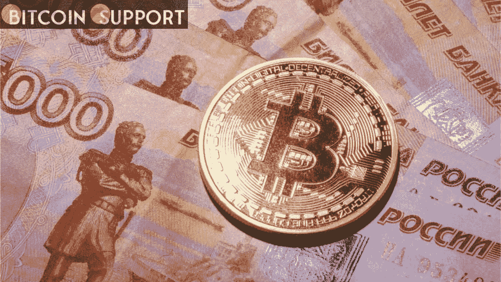
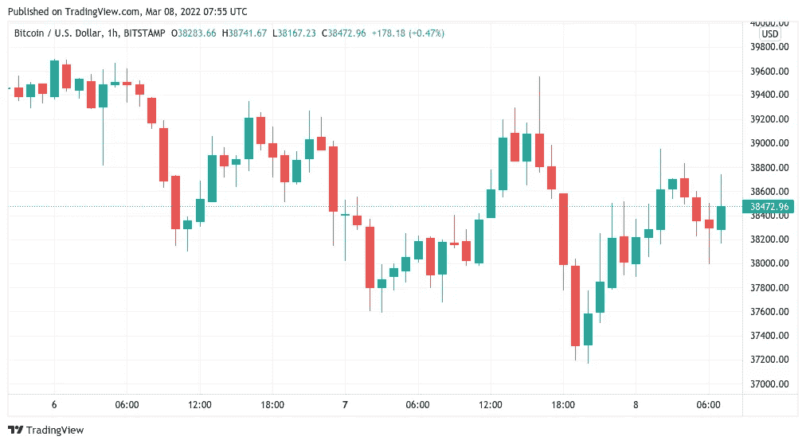
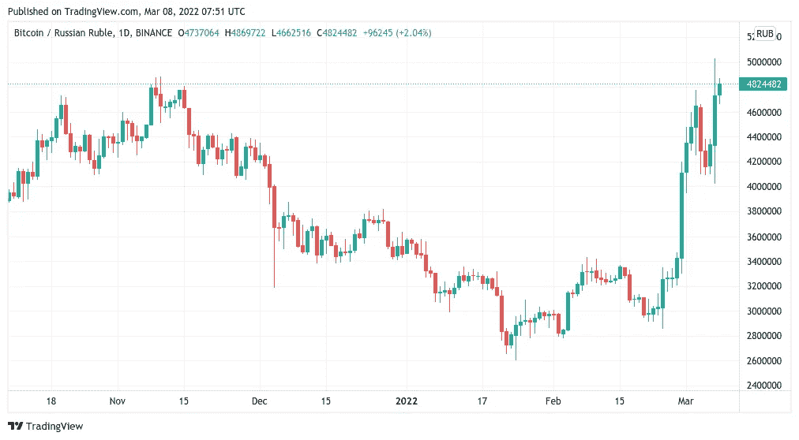

# 比特币保持在 40，000 美元以下，而 BTC 对俄罗斯卢布的价格达到了历史新高

> 原文：<https://medium.com/coinmonks/bitcoin-remains-below-40-000-while-the-price-of-btc-vs-the-russian-ruble-reaches-a-new-all-time-85225c2f204d?source=collection_archive---------75----------------------->

**Visit our website:-** [**https://bitcoinsupports.com/**](https://bitcoinsupports.com/)

本周，随着股票暴跌和大宗商品飙升，比特币持有者中鲜有赢家。在俄乌谈判缺乏进展导致市场下跌后，3 月 8 日，比特币(BTC)从一周低点反弹。

**Visit our website:-** [**https://bitcoinsupports.com/**](https://bitcoinsupports.com/)

**大宗商品“像模因股票一样交易”**

根据 TradingView 的数据，周一华尔街开盘后，BTC/美元在 Bitstamp 上反弹至 37170 美元。在撰写本文时，该货币对的交易价格超过 38，500 美元，隔夜垫款维持支撑。

解决俄罗斯和乌克兰敌对状态的第三轮讨论缺乏共识，对加密货币和股票产生了负面影响。谈判代表 Mykhailo Podolyak 在会议结束后发表的推特上说:“人道主义走廊的后勤工作有了一些轻微的改善……对基本政治规则以及停火和安全保证的密集审议已经开始。”。然而，这一消息不足以激发乐观情绪，因为美国股市全天下跌，标准普尔 500 指数收盘下跌 2.95%。与此同时，大宗商品价格飙升至前所未有的高度，伦敦金属交易所的镍价格飙升至每吨 10 万美元以上。与此同时，俄国的痛苦仍在持续，只有在 BTC 对冲卢布风险的投资者受益。周一晚上，BTC/RUB 在币安触及略高于 500 万的历史新高。

**Visit our website:-** [**https://bitcoinsupports.com/**](https://bitcoinsupports.com/)

尽管比特币作为安全避风港的价格反应不佳(具有讽刺意味的是，比特币与股票相关联)，但在混乱中，忠实的信徒们表达了信念。比特币媒体业务 TFTC 的创始人马蒂·本特总结道:“全世界都在看着信任被实时重新定价。”

**“当尘埃落定时，比特币将是最大的受益者，因为大众将认识到，他们唯一可以信任的是一个分布式系统，这个系统无法由单个人、政府、企业或联盟控制。”与此同时，美国监管机构的担忧导致了市场的恐慌。

**【4 万美元定为短期目标。对于许多在低时间框架交易中的交易者来说，比特币仍然没有吸引力，其上涨潜力明显受到限制。两位著名的交易者 Anbessa 和 Crypto Ed 认为 40，000 美元是多头背离的明显目标。

[https://twitter.com/Anbessa100/status/1500830878968291329](https://twitter.com/Anbessa100/status/1500830878968291329)

“当修正完成后，我们将能够更精确地指定目标，但目前，我们将继续使用 40k，”Crypto Ed 说。美国即将发生的事件，特别是将于周四公布的消费者价格指数(CPI)数据和下周的加息决定，可能会在短期内扰乱市场情绪。

**访问我们的网站:-**[**https://bitcoinsupports.com/**](https://bitcoinsupports.com/)

**免责声明:以上为作者观点，不应视为投资建议。读者应该自己做研究。******