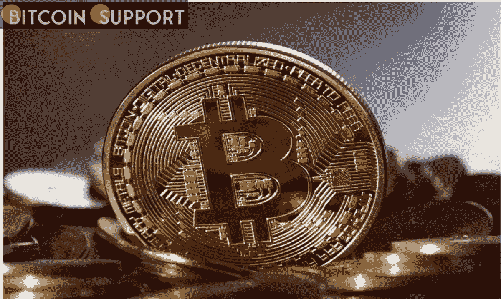
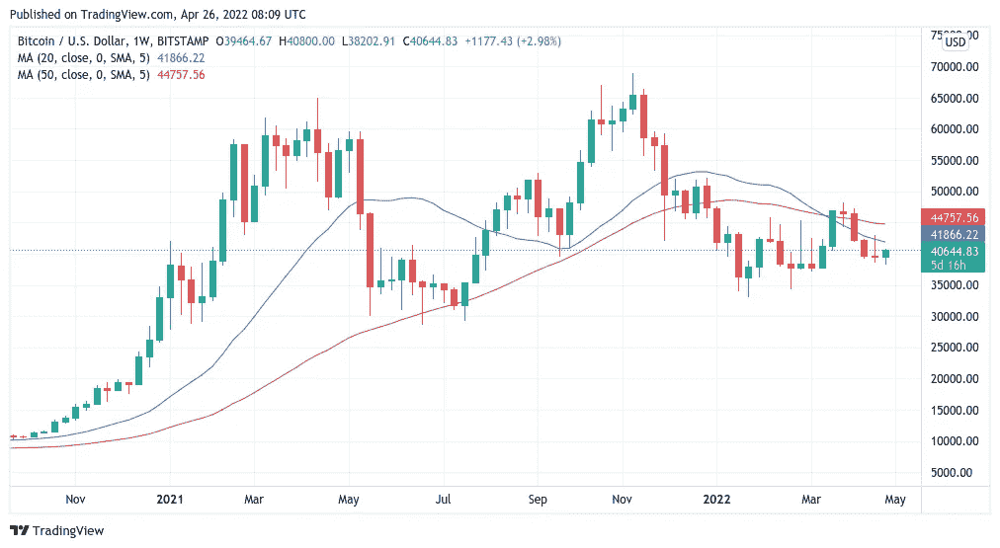
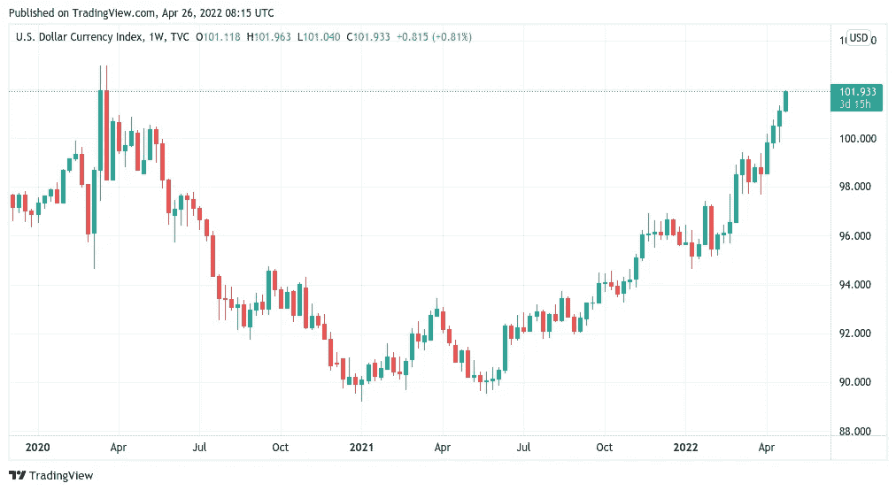

# 比特币复制了千载难逢的周线图指标，导致 BTC 价格下跌 50%

> 原文：<https://medium.com/coinmonks/bitcoin-replicates-a-once-in-a-lifetime-weekly-chart-indication-that-led-in-50-btc-price-drops-29bdb114faaf?source=collection_archive---------20----------------------->

**Visit our website for full blog:-**[**https://bitcoinsupports.com/**](https://bitcoinsupports.com/)

根据比特币周线图“死亡交叉”一个月后进行的分析，两条移动平均线标志着熊市式价格底部的即将形成。最新数据显示，比特币(BTC)目前正在经历一种不寻常的图表现象，这种现象通常会导致价格下跌 50%。

4 月 25 日，知名推特账号 Nunya Bizniz 从 BTC/两个美元主要均线发现了一个新的危险信号。据一位分析师称，BTC 可能需要六个月才能从下跌中恢复过来。比特币的 20 周和 50 周移动平均线(WMA)都开始向下倾斜，这是其历史上的第三次。

虽然乍一看这似乎无害，但前两次——2014 年末和 2018 年末——导致 BTC/美元下跌近 50%。

[https://twitter.com/Pladizow/status/1518414711800356865](https://twitter.com/Pladizow/status/1518414711800356865)

两者都发生在比特币四年减半周期的大致同一点上，虽然略早于时间表，但自 2018 年秋季达到 3100 美元的峰值以来，时间已经几乎一样长了。“我相信这张图表建立了真正的联系，”长期宏观投资者和权威人士图尔·德默斯特谈到这一发现时说。

**“如果这次比特币不能投降并维持 35k 美元以上的价格，这将是一个非常积极的迹象。然而，鉴于全球市场的脆弱性，我的基本预测是价格下降，然后是 3-6 个月的价格反弹。”**

**Visit our website for full blog:-**[**https://bitcoinsupports.com/**](https://bitcoinsupports.com/)

根据 TradingView 的数据，20WMA 在 3 月中旬越过 50WMA 下方，图表分析师称之为“死亡交叉”与其名称相反，这种情况并不总是导致重大损失。

**美元的力量激起越来越多的不信任。在比特币价格长期下跌期间，共识仍在继续形成，这应该与高度关联的全球股市的调整相吻合。面对美联储的反通胀行动，美元的强势也成为关注的焦点，对于那些预测在两年的流动性印刷后将出现冲击事件的人来说，这是一个先发制人的警告信号。分析师迪伦·勒克莱尔(Dylan LeClair)周一在 Twitter 上就此话题发表了新的讨论，他表示:“DXY 正在接近几十年来的高点。”。

**“美元对外国法定货币的强势持续收紧金融状况。从设计上来说，历史上过度杠杆化的经济体系即将迎来一个转折点。”****

**Visit our website for full blog:-**[**https://bitcoinsupports.com/**](https://bitcoinsupports.com/)

根据勒克莱尔的说法，对 BTC·霍德勒来说，这在很大程度上是一个短期痛苦，然后是长期收益的问题。反弹将作为美联储“支点”的结果出现，因为它无法无限期延长对抗通胀的货币紧缩。“美联储最终将被迫恢复宽松政策，因为任何长时间的货币紧缩都将导致严重的全球衰退，”他预测。

“全球负债如此之多，乌克兰危机和中国封锁造成的供应链破坏相当于主权违约。BTC 将起飞。”
**访问我们的网站获取完整博客:-**[**https://bitcoinsupports.com/**](https://bitcoinsupports.com/)

**免责声明:以上为作者观点，不应视为投资建议。读者应该自己做研究。**

> 加入 Coinmonks [电报频道](https://t.me/coincodecap)和 [Youtube 频道](https://www.youtube.com/c/coinmonks/videos)了解加密交易和投资

# 另外，阅读

*   [印度最佳 P2P 加密交易所](https://coincodecap.com/p2p-crypto-exchanges-in-india) | [柴犬钱包](https://coincodecap.com/baby-shiba-inu-wallets)
*   [八大加密附属计划](https://coincodecap.com/crypto-affiliate-programs) | [eToro vs 比特币基地](https://coincodecap.com/etoro-vs-coinbase)
*   [最佳以太坊钱包](https://coincodecap.com/best-ethereum-wallets) | [电报上的加密货币机器人](https://coincodecap.com/telegram-crypto-bots)
*   [交易杠杆代币的最佳交易所](https://coincodecap.com/leveraged-token-exchanges) | [购买 Floki](https://coincodecap.com/buy-floki-inu-token)
*   [3Commas 对 Pionex 对 Cryptohopper](https://coincodecap.com/3commas-vs-pionex-vs-cryptohopper) | [Bingbon 评论](https://coincodecap.com/bingbon-review)