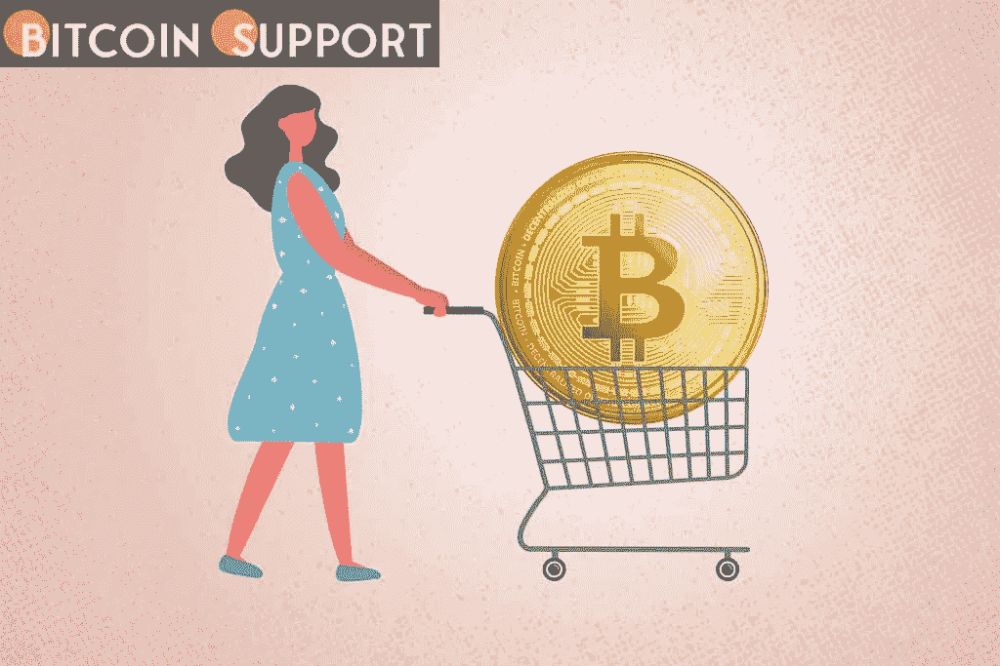

# 随着美联储宣布 3 月份加息，比特币价格升至 45000 美元以上

> 原文：<https://medium.com/coinmonks/bitcoin-rises-above-45k-as-the-fed-announces-a-rate-hike-in-march-f8b7adb2a424?source=collection_archive---------69----------------------->

**Visit our website:-** [**https://bitcoinsupports.com/**](https://bitcoinsupports.com/)

由于市场让交易员保持警觉，比特币价格再次逼近 45000 美元。3 月 2 日，比特币(BTC)触及每日低点，随后大幅反弹，因美国美联储发表新言论，加剧了宏观波动。

**鲍威尔称三月份加息是“合理的”根据几位分析师的数据，周三华尔街开盘前，BTC/美元在 Bitstamp 跌至 43，350 美元。然而，一旦交易开始，该货币对就开始恢复，在撰写本文时，它已经回到 45，000 美元以上。美联储主席杰罗姆·鲍威尔(Jerome Powell)的最新声明导致了波动，他在声明中明确表示，本月将首次加息。他说:“我们的货币政策已经并将继续应对不断变化的经济形势。

“我们的净资产购买已经逐步停止。我们预计，在通胀率远高于 2%且就业市场稳定的情况下，在本月晚些时候的会议上提高联邦基金利率的目标区间是合适的。”市场已经考虑到了此次上调，但关于上调幅度以及到 2022 年还会实施多少次上调仍存在不确定性。鲍威尔接着说，俄罗斯-乌克兰冲突给美国带来了“非常不可预测的”经济后果。然而，比特币没有理会外界对这一消息的任何担忧，升至接近 45000 美元的本地高点。交易员和分析师 Rekt Capital 表示，BTC/美元目前在订单方面处于某种“缺口”状态，这可能会向 48，000 美元的下一个卖方阻力区发起冲击。https://twitter.com/rektcapital/status/1499016227745894405**

LUNA 上涨表明价格反弹至 100 美元的历史高点。

Altcoins 在其他地方保持稳定，ETH 旨在收复 3000 美元水平。按市值计算，Terra (LUNA)是前十名中最有价值的加密货币，在年初被拒绝后，保持了可能超过 100 美元的连胜纪录。

**访问我们的网站:-**[**https://bitcoinsupports.com/**](https://bitcoinsupports.com/)

**免责声明:这些是作者的观点，不应被视为投资建议。读者应该自己做研究。**

> 加入 Coinmonks [电报频道](https://t.me/coincodecap)和 [Youtube 频道](https://www.youtube.com/c/coinmonks/videos)了解加密交易和投资

# 另外，阅读

*   [OKEx vs KuCoin](https://coincodecap.com/okex-kucoin) | [摄氏替代品](https://coincodecap.com/celsius-alternatives) | [如何购买 VeChain](https://coincodecap.com/buy-vechain)
*   [ProfitFarmers 回顾](https://coincodecap.com/profitfarmers-review) | [如何使用 Cornix Trading Bot](https://coincodecap.com/cornix-trading-bot)
*   [如何匿名购买比特币](https://coincodecap.com/buy-bitcoin-anonymously) | [比特币现金钱包](https://coincodecap.com/bitcoin-cash-wallets)
*   [瓦济里克斯 NFT 评论](https://coincodecap.com/wazirx-nft-review) | [比茨盖普 vs 皮奥克斯](https://coincodecap.com/bitsgap-vs-pionex) | [坦吉姆评论](https://coincodecap.com/tangem-wallet-review)
*   [如何使用 Solidity 在以太坊上创建 DApp？](https://coincodecap.com/create-a-dapp-on-ethereum-using-solidity)
*   [币安 vs FTX](https://coincodecap.com/binance-vs-ftx) | [最佳(SOL)索拉纳钱包](https://coincodecap.com/solana-wallets)
*   [如何在 Uniswap 上交换加密？](https://coincodecap.com/swap-crypto-on-uniswap) | [A-Ads 评论](https://coincodecap.com/a-ads-review)
*   [加密货币储蓄账户](/coinmonks/cryptocurrency-savings-accounts-be3bc0feffbf) | [YoBit 审核](/coinmonks/yobit-review-175464162c62)
*   [Botsfolio vs nap bots vs Mudrex](/coinmonks/botsfolio-vs-napbots-vs-mudrex-c81344970c02)|[gate . io 交流回顾](/coinmonks/gate-io-exchange-review-61bf87b7078f)