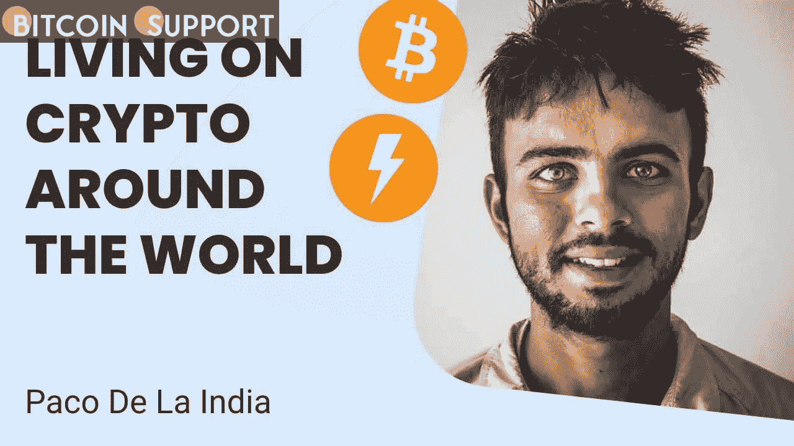
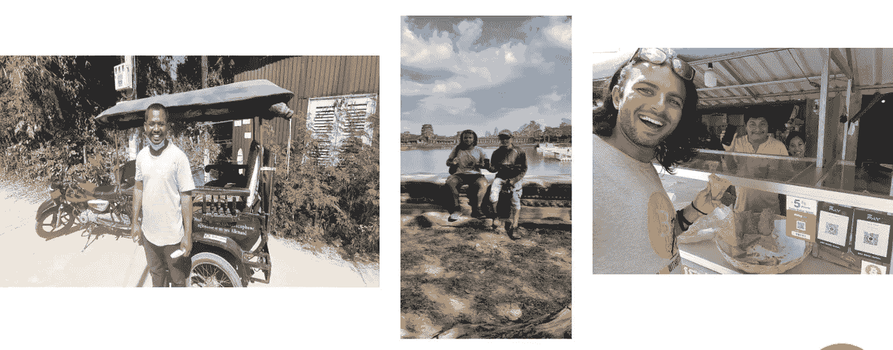

# 比特币统治世界:利用 BTC，我在 400 天内去了 40 个国家

> 原文：<https://medium.com/coinmonks/bitcoin-rules-the-world-using-btc-i-travelled-to-40-countries-in-400-days-f0fd21caecbf?source=collection_archive---------45----------------------->

**Visit our website:-** [**https://bitcoinsupports.com/**](https://bitcoinsupports.com/)

一名来自印度的跑步者兼比特币爱好者霍德勒开始了为期 400 天的旅程，仅用比特币就访问了 40 个国家。在他以比特币为动力的环球马拉松中，一位跑得飞快的比特币制造者已经跑过了 40 个国家中的 7 个。

跑者帕科(Paco the Runner)，又名帕科·德拉印(Paco de la India)，2021 年 9 月 17 日在全世界比特币爱好者的帮助下开始了他的旅程。“比特币以每个人渴望的方式为他们提供了独立，”他演示道。

**Visit our website:-** [**https://bitcoinsupports.com/**](https://bitcoinsupports.com/)

在从一位伟大的朋友那里获得比特币标准后，Paco 从“生活在货币标准的谎言中”转向探索比特币(BTC)世界。由于他的阅读和随后与朋友关于金钱和世界本质的讨论，他掉进了比特币兔子洞。

“一旦你看到它，你就无法视而不见，”他告诉。他穿着橙色的衣服:“那是一个月圆之夜，我的一个朋友问我是否想去探索世界。是的，我说。他声称，你必须用比特币旅行。”

从那时起，Paco 的度假意图变成了一场“比特币意识，广泛采用，展示人类善良”的运动。通过旅行博客和社交媒体更新，他记录了航行和每一笔比特币交易。他说:“与各行各业的人分享比特币是一种福气。”。最好的作品之一是能够向每个人解释比特币与屎币相比的相关性。迄今为止，他已经设法在 BTC 度过了旅程的前七个国家。他只用“现金”乘坐公共交通工具。“尽管如此，纯比特币之旅并非没有困难。他在斯里兰卡时把“房间钥匙”放错了地方，酒店老板很不高兴。

**“我要了一份备份，冲到附近一个没有电的村子里。“当它到达时，我问他是否接受比特币，他回答绝对接受。例如，比特币密钥制造商。”**

**Visit our website:-** [**https://bitcoinsupports.com/**](https://bitcoinsupports.com/)

他还讲述了自己到达泰国苏梅岛的经历，该岛因反比特币情绪而臭名昭著。他吓坏了，因为这是一个全新的岛屿，长达 100 公里。当帕科想到没有钱他将如何在这么大的岛上生存时，恐慌就来了。幸运的是，他开始在岛上漫步，“走了 200 米后，我看到一个标志，上面写着这个地方接受比特币。”好像是宇宙合作让这一切发生了。”

另外还有:

**“我在印度坐火车，隔壁邻居有个信托钱包，我给了他几张 sat，他给我买了晚上的饭。“印度的一个导游，我说服他带比特币。我去了柬埔寨的一家酒吧，用比特币支付。”这份清单还可以继续列下去:一个柬埔寨香蕉面包机，“理发、汉堡、嘟嘟车、牙医”，甚至还有一枚和 BTC 一起购买的“银币”。**

**Visit our website:-** [**https://bitcoinsupports.com/**](https://bitcoinsupports.com/)

这并不简单，但 Paco 建议其他有抱负的比特币旅行者从小做起:

**“开始与你的邻居、你最喜欢的商店、酒吧或剧院分享你的 sat。”他们很容易就能找到像你这样熟悉的面孔。做那颗扔进湖里的小鹅卵石，它会激起造福子孙后代的波澜。在此期间，Paco 将继续在世界各地奔波，会见比特币创造者和预创造者，并支付 sat 费用你今天采取的每一个行动都将塑造你的未来，”他总结道。

**访问我们的网站:-**[**https://bitcoinsupports.com/**](https://bitcoinsupports.com/)

**免责声明:以上为作者观点，不应视为投资建议。读者应该自己做研究。****

> 加入 Coinmonks [电报频道](https://t.me/coincodecap)和 [Youtube 频道](https://www.youtube.com/c/coinmonks/videos)了解加密交易和投资

# 另外，阅读

*   [block fi vs Celsius](/coinmonks/blockfi-vs-celsius-vs-hodlnaut-8a1cc8c26630)|[Hodlnaut 审核](/coinmonks/hodlnaut-review-best-way-to-hodl-is-to-earn-interest-on-your-bitcoin-6658a8c19edf) | [KuCoin 审核](https://coincodecap.com/kucoin-review)
*   [Bitsgap 评审](/coinmonks/bitsgap-review-a-crypto-trading-bot-that-makes-easy-money-a5d88a336df2) | [Quadency 评审](/coinmonks/quadency-review-a-crypto-trading-automation-platform-3068eaa374e1) | [Bitbns 评审](/coinmonks/bitbns-review-38256a07e161)
*   [加密复制交易平台](/coinmonks/top-10-crypto-copy-trading-platforms-for-beginners-d0c37c7d698c) | [Coinmama 审核](/coinmonks/coinmama-review-ace5641bde6e)
*   [印度的加密交易所](/coinmonks/bitcoin-exchange-in-india-7f1fe79715c9) | [比特币储蓄账户](/coinmonks/bitcoin-savings-account-e65b13f92451)
*   [OKEx vs KuCoin](https://coincodecap.com/okex-kucoin) | [摄氏替代品](https://coincodecap.com/celsius-alternatives) | [如何购买 VeChain](https://coincodecap.com/buy-vechain)
*   [币安期货交易](https://coincodecap.com/binance-futures-trading)|[3 comas vs Mudrex vs eToro](https://coincodecap.com/mudrex-3commas-etoro)