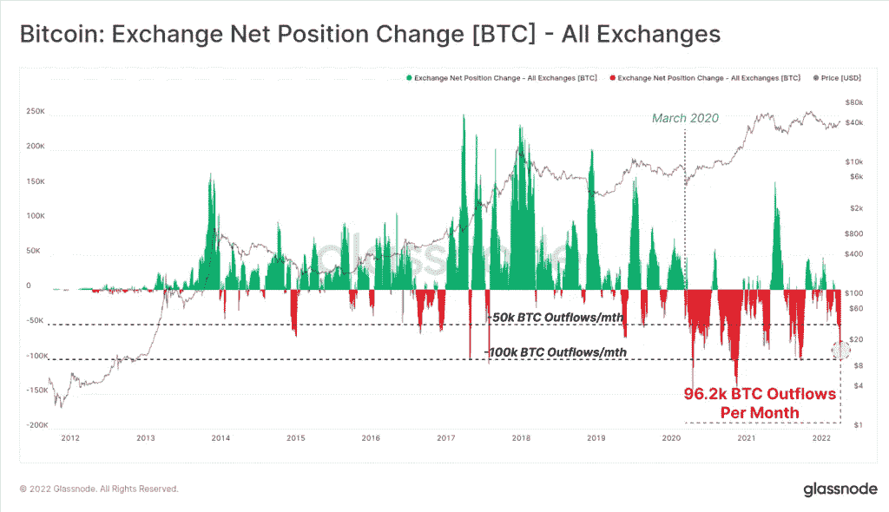

# 由于美联储看跌，比特币下跌 4.5 万美元，但购买活动仍然积极

> 原文：<https://medium.com/coinmonks/bitcoin-slides-45k-in-the-face-of-fed-hawkishness-but-buying-activity-remains-positive-64d2bd291b8b?source=collection_archive---------79----------------------->

**Visit our website:-** [**https://bitcoinsupports.com/**](https://bitcoinsupports.com/)

根据一些分析师的说法，机构使用比特币可能会增强此前将加密货币视为糟糕投资的个人的信任。周三上午，比特币(BTC)跌至 45000 美元的支撑位，尽管链上统计数据显示持续的积极购买活动。

下跌发生在美国美联储(Fed)激进言论引发的全球抛售期间。美联储理事莱尔·布雷纳德在 5 月份表示，遏制通胀“至关重要”，这意味着央行的资产负债表将会缩减。这导致了市场抛售，因为投资者认为限制性环境会导致经济下滑。

周二，标准普尔 500 指数收盘下跌 1.26%，以科技股为主的纳斯达克指数下跌 2.26%。今天上午，下跌转移到亚洲，日本日经 225 指数暴跌 1.48%，香港恒生指数下跌 1.15%。

主要加密货币的疲软引发了加密货币市场的更大跌幅。ETH、Solana 的 SOL 和 XRP 在过去 24 小时内均暴跌 5%，而 Avalanche 的 AVAX 和 Polkadot 的 dot 跌幅均超过 6%。Dogecoin 的加密货币 DOGE 是主要货币中唯一的赢家，这得益于对埃隆马斯克被任命为社交媒体巨头 Twitter (TWTR)董事会成员的乐观情绪，这被视为 memecoin 的有利预兆。不到一周前，比特币曾达到 3 个月高点 48000 美元，此后比特币开始下跌。本周第二次跌至 44500 美元——这一水平见证了买盘活动——跌破这一水平可能导致亏损至 43000 美元。

**Visit our website:-** [**https://bitcoinsupports.com/**](https://bitcoinsupports.com/)

**比特币流入量继续增加**

分析公司 Glassnode 本周在一份报告中指出，尽管过去两周的价格走势仍然不可预测，但在机构需求的推动下，比特币的购买活动继续增加。

“投资者流入打包的 WBTC、加拿大 ETF，以及一般投资者的链上积累具有历史意义，特别是在 1 月 22 日当地价格低点之后，”该论文称。

加密货币交易所报告了大量的加密货币提款，比特币报告每月流出约 96，000 个比特币。Glassnode 指出，这一行动表明“历史性的强劲增长”正在发生。

**Visit our website:-** [**https://bitcoinsupports.com/**](https://bitcoinsupports.com/)

根据 Glassnode 的数据，自 2022 年 1 月以来，加拿大的比特币 ETF 产品持续流入，总持有量增加了 6594 个比特币，按目前水平计算超过 3 亿美元。加拿大交易所交易基金现在有 69052 个比特币。ETF 或交易所交易基金是一种类似于股票的集合投资工具，因为它们可以在交易所交易，而投资者不拥有基础资产。根据其他人的说法，ETF 需求受到东欧政治紧张局势的推动，特别是持续的俄罗斯-乌克兰冲突。

“流入量的增加证明了人们对比特币能力的信心增强，”数字银行 MinePlex 的联合创始人亚历山大·马马西迪科夫(Alexander Mamasidikov)在一份电报中写道。“加拿大 ETF 产品的持续上升表明了比特币 ETF 的受欢迎程度，良好的前景肯定会吸引更多投资者资本进入这种数字货币，有助于维持价格稳定或在不久的将来描绘出温和的增长路径。”

其他人认为，随着交易所交易基金(ETF)等真正的产品获得重视，比特币需求将继续增长。区块链众筹平台 SeedOn 的联合创始人克劳迪奥·米内亚(Claudiu Minea)在一封电子邮件中告诉 CoinDesk，“拥有一只以比特币为基础资产的 ETF 无疑会增强投资者的信心。“这可能会对最持怀疑态度的投资者产生有利影响，他们此前可能会认为加密货币是一种糟糕的投资。”“许多上市公司，如 Microstrategy 或特斯拉，已经拥有相当大的比特币投资组合，而其他公司正在考虑扩大其持有量，以包括加密货币，”Minea 继续说道。

**访问我们的网站:-**[**https://bitcoinsupports.com/**](https://bitcoinsupports.com/)

**免责声明:以上为作者观点，不应视为投资建议。读者应该自己做研究。**

> 加入 Coinmonks [电报频道](https://t.me/coincodecap)和 [Youtube 频道](https://www.youtube.com/c/coinmonks/videos)了解加密交易和投资

# 另外，阅读

*   [Capital.com 评论](https://coincodecap.com/capital-com-review) | [香港的加密借贷平台](https://coincodecap.com/crypto-lending-hong-kong)
*   如何在 Uniswap 上交换加密？ | [A-Ads 审查](https://coincodecap.com/a-ads-review)
*   [WazirX vs coin dcx vs bit bns](/coinmonks/wazirx-vs-coindcx-vs-bitbns-149f4f19a2f1)|[block fi vs coin loan vs Nexo](/coinmonks/blockfi-vs-coinloan-vs-nexo-cb624635230d)
*   [本地比特币评论](/coinmonks/localbitcoins-review-6cc001c6ed56) | [加密货币储蓄账户](https://coincodecap.com/cryptocurrency-savings-accounts)
*   [什么是融资融券交易](https://coincodecap.com/margin-trading) | [成本平均法](https://coincodecap.com/dca)