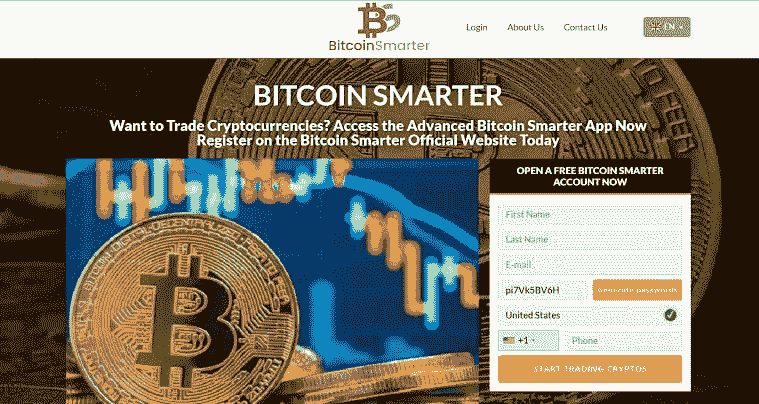
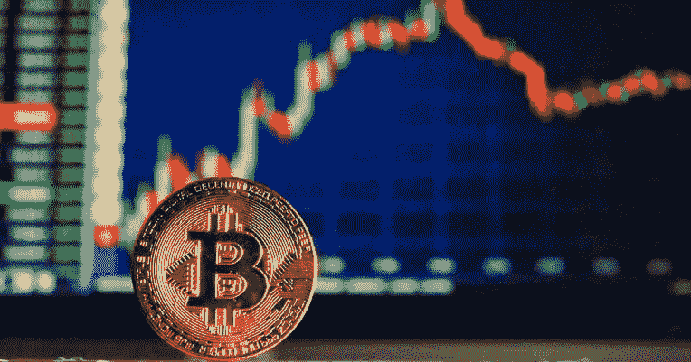
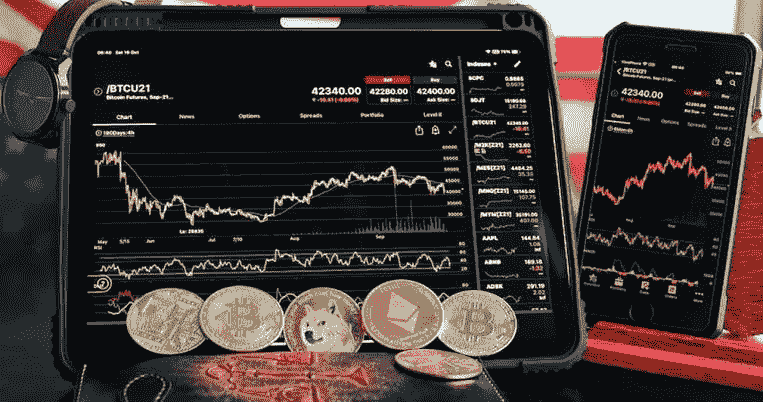

# 比特币智能评论——你需要知道的一切！

> 原文：<https://medium.com/coinmonks/bitcoin-smarter-review-everything-you-need-to-know-3e70b44ea57f?source=collection_archive---------11----------------------->

比特币 Smarter 已经获得了很大的牵引力，在当前这一代加密货币中；个人可以通过多种方式利用加密货币的机会，印更多的钱，我们现在处于机器人时代，通过分析/交易来赚合理的钱(比特币更聪明)。

虽然有大量的加密交易机器人低买高卖，但我们现在有一个机器人在购买/出售加密资产之前根据趋势进行分析。

技术正在全球范围内接管世界，这减轻了我们肩上的一些压力。

用加密货币创造被动收入不再是白日梦，因为个人有很多方式可以利用这个行业；所有需要的是找到一个有信誉的来源来帮助你。

随后，2020 年 crypto 的出现，使得很多投资者离开他们的传统金融工具加入到 crypto 的行列中。加密货币的价值增加，许多人转向加密领域。

然而，加密机器人为这些投资者提供了一种简单的方式来自动化交易活动和赚钱。

在做一些关于机器人创始人的研究时，没有找到关于创始人的信息，这是一个危险信号吗？

这不应该降低机器人的能力。同时本文详细介绍了:什么是比特币更聪明，比特币更聪明合法吗？、比特币智能应用的特点、比特币智能的优势、创建比特币智能账户的逐步指南、比特币智能与其他交易所的区别&比特币智能的一些常见问题。

# 什么是比特币更智能？

比特币智能(Bitcoin Smarter)是一个交易应用，它根据比特币市场的迹象进行交易。兑换应用程序由现代计算驱动，该计算调查数字货币市场和整体新闻模式，以做出成功的兑换选择。

它使客户能够购买、出售和兑换数字货币，而不需要人工协作。该计划作出交流的决定给定的信息，纲要，例子，并在网上全球积累的图表。

定向商人留意每一个已经完成的安排。根据我们的经验，计算可以在几秒钟内完成人类需要几天才能完成的任务。这是最先进的创新，不断领先于对手。

# 比特币更聪明合法吗？

我们认为，每一次冒险都包含一定程度的机会，比特币智能也不例外。随后，我们建议所有客户在进行有效的资金管理之前进行调查。

在我们对比特币智能版进行评估的过程中，我们没有发现该框架的任何漏洞或问题。

正如我们所认为的，这个应用程序是合理的、有效的和可靠的。记录注册过程是直接的，模拟帐户工作允许您在上线之前进行尝试。为了监督交易账户，该应用程序利用了直接交易商和记录主管。

综上所述，谨慎从事比特币交易或投资仍不失为明智之举。

# 比特币智能应用的特点

# 高端技术

比特币智能应用程序特别旨在帮助交易商做出更好的交易选择。它能立即准确地剖析密码市场，为客户提供持续的信息驱动的市场调查。

该产品允许商家直接进入加密市场，使他们能够兑换比特币和其他数字形式的货币。它给不可缺少的知识位尖端计算的利用，并且它在它的检查中涉及专门的指针。

由于这种产品提供的市场知识，经纪人可以区分可能有回报的机会，并做出明智的选择。

# 援助和自主

比特币智能应用的一个关键组成部分是，它精确而渐进地剖析了加密市场。客户可以直接获得不可或缺的市场知识，不管他们以前是否有过交流经验。

应用程序中安装的帮助和独立级别允许客户重做产品，以符合他们的交换能力和机会弹性级别。通过重做产品，客户可以保证它按照他们的倾向和要求工作。

# 安全和安保

安全性对于数字形式的货币至关重要。因此，比特币智能小组实施了广泛的安全措施来保护您的货币和个人信息。

由于比特币智能应用程序，除了兑换你的头号数字货币之外，你不必担心其他事情，因为我们的网站同样通过 SSL 加密得到保护。

同样，比特币更聪明地帮助你更好地交换数字形式的货币，让你的额头对不同的数字形式的货币进行信息驱动的调查。

# 比特币更智能的优势

# 快速支付

我们目前知道比特币更聪明的目的是一种自动化的支付选择。这是一个绝妙的想法。方便的选择不需要鼓励。

一旦现场交流会议结束，支付工具可以计算出你的收入，钱将被记入你的比特币智能记录。如该组织所说，不会有进一步的指控。

# 毫不费力的退出

根据该小组的说法，据说金融支持者的利润可以被删除。活动很顺利。你应该简单地提出提款要求，只需要 24-48 小时处理。

# 演示交易

比特币智能演示交换能力很强。任何需要更熟悉现场交流部分如何工作的个人；可以利用免费的演示交流设备。演示交流是参与现场交流前的一种免费排练方法。

# 创建比特币智能账户的逐步指南

# 登记

比特币聪明有一个工作的招募过程。在没有开立支票账户的情况下，开始在帮助下兑换比特币是不可想象的。

虽然你的姓名、电子邮件地址和电话号码至关重要，但这种情况会进行彻底的检查以保证其真实性。

整个过程应该不超过 5 分钟。检查连接将被运出你的信箱(电子邮件)，如果信息被探索和确认。

比特币 smarter 的克隆网站数不胜数，唯一的比特币 smarter 官方网站([点此](https://the-bitcoin-smarter.financialmarketsworld.com/#formTop))。

# 基金账户

比特币智能是一个易于理解的加密交换机器人，可以免费使用。尽管如此，比特币交易需要基础投资。随后，在可以利用该计算之前，应该进行 250 美元的基本存储。

与其他计算机化的加密交换阶段相比，比特币智能交易的潜在投机性较低。在任何情况下，您最多可以存储 15，000 美元。组织者保证支持最广泛使用的分期付款选项，以提升框架的可用性。

基础商店可以利用附带的技术:银行转帐，发现，签证，万事达卡，和美国运通。这些资产将立即存储在您的记录中。

# 演示贸易

商店获得支持后，您可以立即开始兑换数字形式的货币。假设这是你最难忘的交流，你没有相关知识，建议你利用演示模式。

该模型的主要目标是让客户熟悉计算和加密标记的工作方式。此外，你可以不断审查你的交易投机和策略，而不花任何现金。你不会带来任何现金，但你知道在每种情况下该怎么做。

# 现场交易

客户既可以选择物理交换，也可以利用计算机化的机器人。客户不需要打乱他们此时看不到的界限，然而几个选择会让他们避免意外损失现金。

尽管没有真正的方法来限制加密中与行业相关的赌博，这通常与货币不幸有关，但可以在交换前设置止损限制，以减少在寻找时丢失现金的可能性。

客户同样可以设置每天的交换金额、交换配对以及每天要进行的交换次数。

# 比特币 Smarter 与其他交易所的区别

该程序有编程和手动交换选择，允许您选择如何交换。在使用编程模式时，你完全依赖你的机器人来进行交换。

尽管如此，当使用人工选择时，你根据交换信号选择何时交换。

# 交易信号

比特币更聪明，可以创建指针给出信息检查。事实上，即使是不称职的经纪人现在也可以开始赚钱了。

机器人通过大量的信息，利用精确的计算为你提供准确的发现。你不需要在你的电脑前坐很长时间，紧紧抓住一扇开着的门。

# 降低损失

一个小小的错误就可能毁掉整个比特币交易日。无论如何，随着比特币这样的自动交易机器人变得更加智能，创造收益的潜在后果会让损失现金的后果相形见绌。

像比特币智能交易系统这样的交易设备可以在比特币价值波动发生之前对其进行评估，从而减少损失现金的风险。

此外，交换机器人可以识别人类大脑无法掌握的交换标志，从而降低交换时出错的风险。

# 不必要的监控

交换机器人消除了持续观察比特币交换的需要，同时利用比特币智能器等程序。一旦经纪人开始与这个机器人交换比特币，他们只需制定措施，他们在一天结束前都是免费的。

交换机器人会处理剩下的事情；它将调查数字货币市场，区分交易所投机前景，并为经纪人的利益执行交易。

# 最终想法

不同的比特币智能贡品在网上给了交换阶段最高评价。它基于强大的计算，允许客户获得有利经济形势的数据。

这种交换编程享有各种好处，包括低投机前提，各种元素，巨大的可能利润，等等。如果你选择捐款，先把工作做完，并坚持一个合理的财务计划。

我们不建议储存比你在最悲观的情况下能承受的损失更多的现金，因为密码市场非常不稳定。

请注意，比特币智能不属于金条，这篇文章只是为了传递信息。

# 比特币更聪明常见问题

# 我如何开始使用比特币智能应用程序交易数字货币？

利用比特币智能应用程序来交换加密形式的货币非常简单，因为你只需打开一个免费记录就可以开始了。

在比特币智能授权网站的登录页面上找到注册结构，填写必要的数据并展示该结构，以便激活您的记录。接下来的阶段是通过兑换资本来补贴你的战绩，需要的基础店铺是 250。

最后，您可以开始利用比特币智能应用程序交换比特币、以太坊和其他加密形式的货币，这些信息由产品产生的市场调查驱动，帮助您支持您的交易准确性

# 比特币智能软件兼容哪些设备？

比特币智能编程并不难使用，旨在保证适应性和舒适性。比特币智能应用几乎适用于所有设备，包括平板电脑、电话、工作站和个人电脑。

你只需要一个网络协会和一个互联网浏览器就可以开始了。借助更新的互联网浏览器和网络，您可以随时随地使用比特币智能应用程序兑换加密货币。

# 以前的加密交易经验对使用比特币智能应用进行交易很重要吗？

交流经验是一种回报，但利用比特币智能应用程序和交换加密货币绝不是必要的。如果你只是从一个密码商人开始，或者另一方面，如果你是一个长期参与的专业交易商，这并没有什么不同。

比特币智能应用程序是为所有级别的交易商量身定制的。该产品打破了密码市场，并为您提供了基本的经验，您可以使用这些经验来识别出现在了望台上的打开的门。

应用程序中的独立性和帮助级别同样可以适应您的爱好和专业水平，目标是您可以利用该产品。

# 用比特币智能应用程序交易密码需要多少钱？

允许使用比特币智能应用程序来兑换加密货币。你可以在权威网站上免费打开一个记录。然后，在这一点上，你应该存储至少 250，这解决了你的交换资本。

比特币智能编程没有秘密费用，该集团不收取你的交流佣金。这意味着你可以分享你获得的每一个好处。比特币智能编程将通过不断给你提供信息驱动的市场考试来支持你的导航。

加入电报频道了解更多更新

 [## 加密门户社区

### 欢迎来到加密门户社区。我们在这里下车👇-加密新闻和更新⛅-CRYPTO 宝石和信号🚥-已验证&…

t.me](https://t.me/Cryptoportalchannel) 

> 加入 Coinmonks [电报频道](https://t.me/coincodecap)和 [Youtube 频道](https://www.youtube.com/c/coinmonks/videos)了解加密交易和投资

# 另外，阅读

*   [去中心化交易所](https://coincodecap.com/what-are-decentralized-exchanges)|[Bitbns FIP](https://coincodecap.com/bitbns-fip)|[Bingbon 评论](https://coincodecap.com/bingbon-review)
*   [用信用卡购买密码的 10 个最佳地点](https://coincodecap.com/buy-crypto-with-credit-card)
*   [加拿大最佳加密交易机器人](https://coincodecap.com/5-best-crypto-trading-bots-in-canada) | [Bybit vs 币安](https://coincodecap.com/bybit-binance-moonxbt)
*   [阿联酋 5 大最佳加密交易所](https://coincodecap.com/best-crypto-exchanges-in-uae) | [SimpleSwap 评论](https://coincodecap.com/simpleswap-review)
*   购买 Dogecoin 的 7 种最佳方式
*   [最佳期货交易信号](https://coincodecap.com/futures-trading-signals) | [流动性交易所评论](https://coincodecap.com/liquid-exchange-review)
*   [用于 Huobi 的加密交易信号](https://coincodecap.com/huobi-crypto-trading-signals) | [Swapzone 审查](/coinmonks/swapzone-review-crypto-exchange-data-aggregator-e0ad78e55ed7)