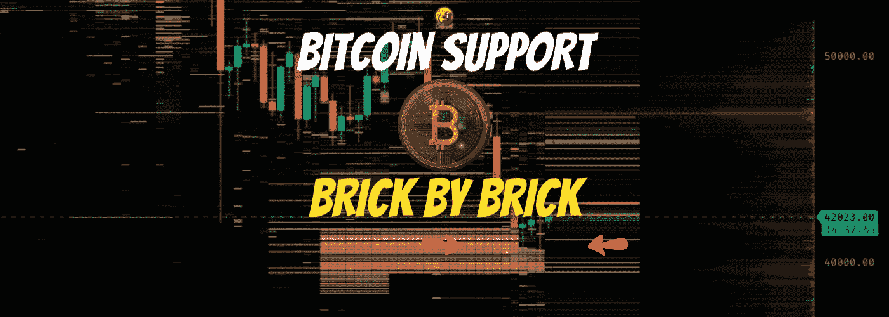
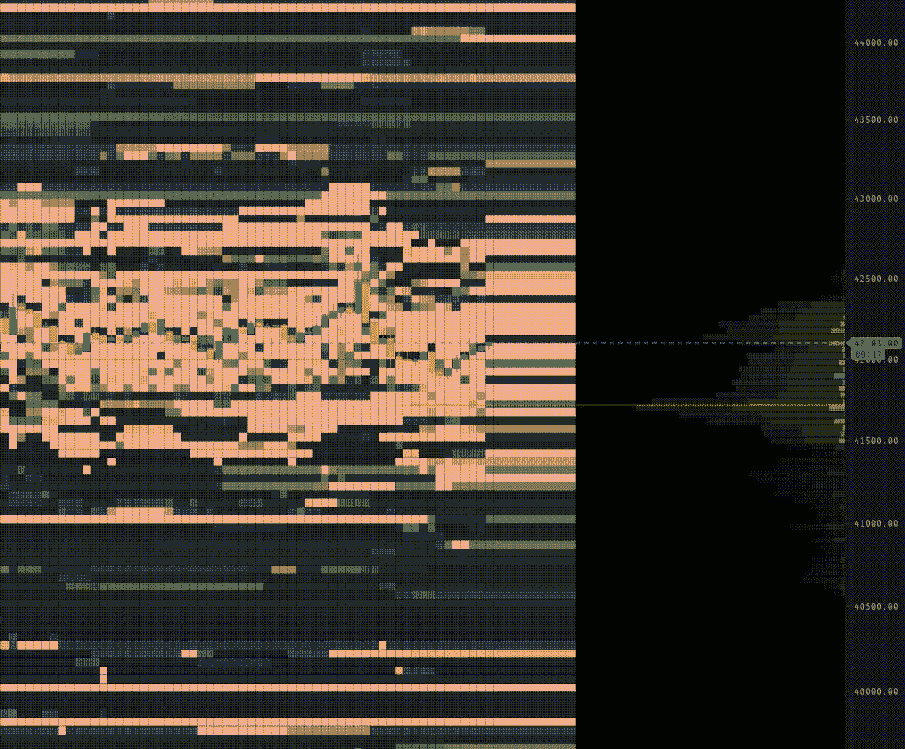
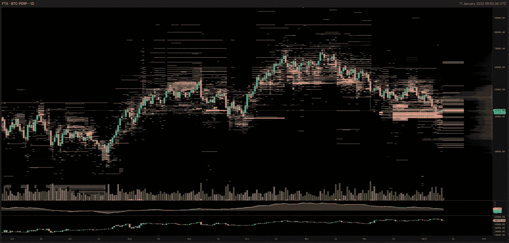
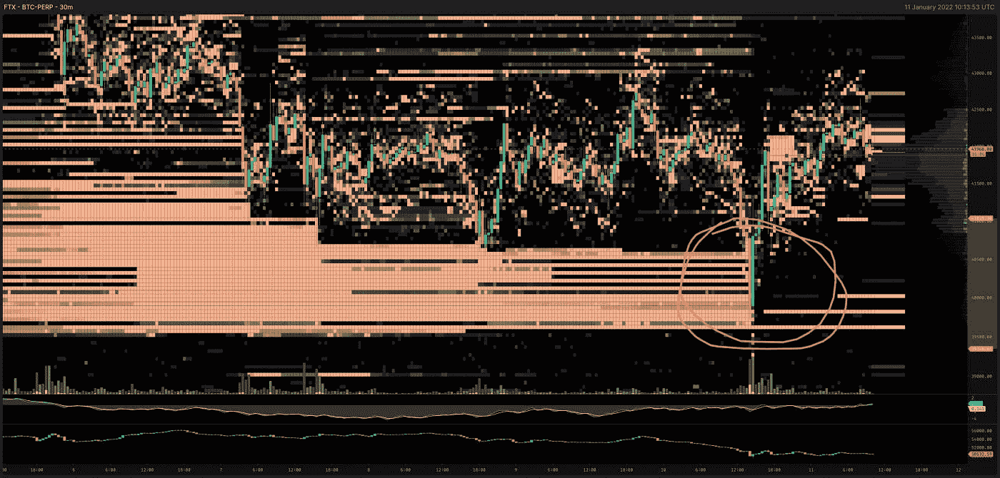
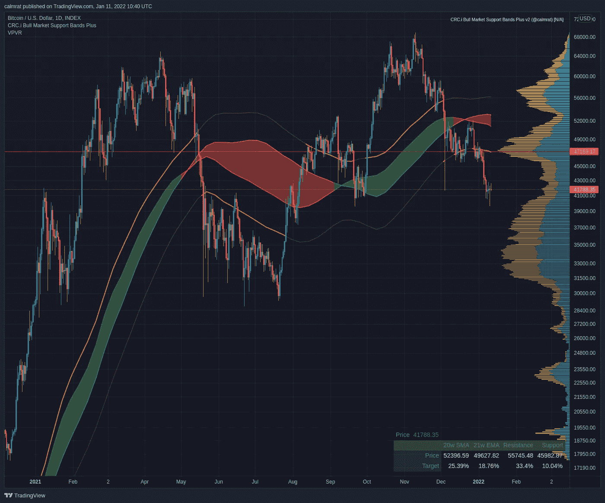

# 比特币支撑墙——一砖一瓦

> 原文：<https://medium.com/coinmonks/bitcoin-support-wall-brick-by-brick-d2aee978029e?source=collection_archive---------8----------------------->

罗马不是一夜建成的。10 万英镑的 BTC 也不是。

自 21 年 12 月中旬以来，对 BTC 的大力支持一直建立在 FTX 的订单上。1 月 10 日，周一，美国市场开盘时，该头寸已被填满，接近 100%。又胖又快乐，肚子里装满了 1000 份价值上亿美元的 BTC-佩珀合同。市场准备好反弹了吗？

在我们回答这个问题之前，有一点很重要，那就是 FTX——日交易量第三大的交易所——以及我们正在审查的行为发生的交易所，主要是为自动交易机器人而建的。但不是唯一的。

从 TradingLite.com 的订单上可以清楚地看出，机器人正在发挥作用。在更高的时间范围内，人们可以直观地识别 bot 订单簿填充模式，因为它们精确地跟踪全天更广泛的价格波动，每周 24x7 天实时更新订单簿。随着价格的上涨或下跌，机器人会更新它们的订单，一路跟踪价格。

许多“订单”不过是一种策略，试图愚弄其他市场参与者，让他们相信在特定水平上有人对账簿感兴趣。只是随着价格的上涨而消失。就像魔法一样。如果我们人类有能力以如此快的速度如此一致地做决定就好了！

经验告诉我，当墙壁建造得很厚，在坚固的基础上，就像我们在这里看到的大约 40k，并且长时间保持静止，不动，这证明**人类做出了决定，而不是机器人**。它有*的意图*。

它可能是一个机构，一条鲸鱼，* *谁* *。没关系。有人想满足他们的订单。获取需要努力，需要市场流动性，最终需要波动性。这取决于做市商，以确保这项工作已经完成。他们的订单被满足了。

不管你喜不喜欢，这个过程对普通散户来说是一个痛苦的经历，重要的支撑位和阻力位正在形成，这对未来的上涨绝对至关重要。在这个案例中，这道墙是由 FTX 的交易员使用 BTC-佩珀永久期货衍生工具建造的。由 1000 份 BTC-佩珀合约组成，在零售市场最担心的水平交易，作为熊市延续的指标。

任何时候，所有交易所都在建造和拆除订单簿墙。它们建在哪里，有多厚，什么类型，取决于更多的因素，而不是我们今天能在这里讨论的。我现在感兴趣的两个关键因素是:交易所的流动性和流动性。如果交易者不想被看到，他们就不会被看到。正如我们所说的，他们需要别人的帮助来建立必要的动力来颠覆现状，这是一个人所能给出的最清晰的信号。

有人知道周一的行动。甚至，他们创造了它。

虽然许多寻求进一步上涨收益的高保证金交易者肯定会对价格下跌感到失望，因为他们可能会被清算或在此过程中遭遇止损。这正是“聪明钱”需要的场景。为了满足他们的购买订单，你必须卖出，不管你想不想卖。清算？再见，伙计，谢谢你的鱼！

尽管令人不安，但乌云中仍可能出现一个 *USDC* 。爱它或恨它，已经向世界发出了一个信号。

**“40k 有*支持 BTC。”**

BTC 价格评估的整个历史充满了陈旧、破碎的弹孔和破碎的墙壁。门面。纸做的墙，注定要被烧毁。故意耍花招。从远处看，这是一个挑战，以推断什么类型的墙存在，是什么意图，直到价格接近。在我们的 supportwall@40k 案例中，我们的问题在昨天的市场交易开始时已经得到了明确的回答，至少短期是这样的。

周一的闪电微崩溃在一个小时的蜡烛里完成了那些未完成的 BTC 订单。数以千计的 BTC，数以亿计的美元被转手，就这样。完美的设置。耐心执行。干得好。是时候回去了！

或者是？下一步是什么？我们将不得不等等看。如果我们继续保持 40k 的水平，在既得利益如此明确的情况下，我预测我们将看到一个轻松的反弹，回到较低的牛市阻力水平和大约 47k 的 VPVR 控制点。我们将需要留意这些同样的玩家在晚些时候获利，因为最终，他们几乎肯定会在晚些时候抛售资产。交易者实际上并不关心 BTC。他们只想要你的钱。

如果我们不能保持 39-40k，很明显，我们正在下降。支撑 BTC 的黄砖将会在我们的背后崩塌。很可能，我们将面临对 30k 水平的潜在重新测试，在那里成交量占主导地位，之前的盘整发生在整个 2021 年的“横盘”市场。

事实上，许多人认为这种情况是未来迈向新 ATH 和 10 万以上估值的必要条件。我个人不这么认为。我持谨慎乐观的态度，40k 是我们目前的支持水平，并希望保持这一观点，直到数据表明我不是这样。让我们一步一步来，看看事情如何发展。

*总结*

*BTC 在 11 月达到新 ATH 后正在巩固，在下一次大动作之前寻找价格支撑。到目前为止，40k-47k 范围内的交易量很小。在 40k，强大的支撑位正在形成。可能代表了本地熊市趋势的底部。这是一件好事，即使很痛。不过要小心交易，因为这也可能是一个陷阱。观看高于 47k 的突破，确认为支持。突破 40k 并确认为阻力位，在我们摆脱当前熊市趋势并继续逼近 100k 之前，预计会对低至 30k 的水平进行重新测试。*

冷静点。学习。找到您的级别。设定买入限额、止损限额和获利限额。观察。别有反应。赢了。 ***鼓掌，喜欢，+1，订阅并关注更多！***

*   新增*免*指标月:[https://www.tradingview.com/u/calmrat/](https://www.tradingview.com/u/calmrat/)
*   分析、预测、交易:[https://medium.com/@calmrat](/%40calmrat)
*   俏皮话和傻笑:[https://twitter.com/calmrat](https://twitter.com/calmrat)

在…交易奖金、折扣等

*   *Crypto.com—*[*https://crypto.com/exch/v4n3pauckj*](https://crypto.com/exch/v4n3pauckj)
*   *币安—*[https://accounts.binance.com/en/register?ref=346510770](https://accounts.binance.com/en/register?ref=346510770)
*   *Bybit—*[*https://www.bybit.com/en-US/invite?ref=EKJRL*](https://www.bybit.com/en-US/invite?ref=EKJRL)
*   *FTX—*[*https://ftx.com/profile#a=60256726*](https://ftx.com/profile#a=60256726)
*   trading view—[https://www.tradingview.com/gopro/?share_your_love=calmrat](https://www.tradingview.com/gopro/?share_your_love=calmrat)

> 加入 Coinmonks [电报频道](https://t.me/coincodecap)和 [Youtube 频道](https://www.youtube.com/c/coinmonks/videos)了解密码交易和投资

## 也请阅读

 [## 杠杆代币[多头代币]终极指南

### 杠杆代币是具有杠杆风险的 ERC20 代币，不考虑保证金、要求、管理……

medium.com](/coinmonks/leveraged-token-3f5257808b22)  [## BlockFi Review 2021:赞成，反对和利率| CoinCodeCap

### 今天，我们提出了一个全面的 BlockFi 评论，这是一个成立于 2017 年的加密贷款平台，拥有其…

blog.coincodecap.com](https://blog.coincodecap.com/blockfi-review)  [## 如何在印度购买比特币？2021 年购买比特币的 7 款最佳应用[手机版]

### 如何使用移动应用程序购买比特币印度

medium.com](/coinmonks/buy-bitcoin-in-india-feb50ddfef94)  [## 加密税务软件——五大最佳比特币税务计算器[2021]

### 不管你是刚接触加密还是已经在这个领域呆了一段时间，你都需要交税。

medium.com](/coinmonks/best-crypto-tax-tool-for-my-money-72d4b430816b)  [## 9 个 2022 年最值得购买的密码| CoinCodeCap

### 2021 年对于加密货币、比特币、NFT 或不可替代代币、元宇宙等等来说是很棒的一年。这一年…

blog.coincodecap.com](https://blog.coincodecap.com/crypto-to-buy-in-2022)  [## 存储比特币的最佳加密硬件钱包[2021] | CoinCodeCap

### 保管您的数字资产很容易，但找到正确的存储方式却是一项繁琐的任务。在线钱包有一个风险…

blog.coincodecap.com](https://blog.coincodecap.com/best-hardware-wallet-bitcoin)  [## Pionex 评论 2021 |免费加密交易机器人和交换

### Pionex 是为交易自动化提供工具的后起之秀。Pionex 上提供了 9 个加密交易机器人…

medium.com](/coinmonks/pionex-review-exchange-with-crypto-trading-bot-1e459d0191ea) 

[https://medium . com/coin monks/top-3-telegram-channels-for-crypto-traders-in-2021-8385 f 4411 ff4](/coinmonks/top-3-telegram-channels-for-crypto-traders-in-2021-8385f4411ff4)

 [## 2022 年 5 个最佳免费加密投资组合追踪器

### 加密投资组合追踪器是作为一个解决方案创建的，既费时又令人困惑的家务提供一个…

blog.coincodecap.com](https://blog.coincodecap.com/free-crypto-portfolio-trackers)