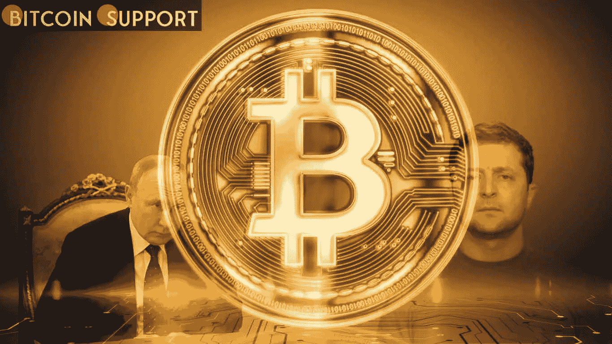
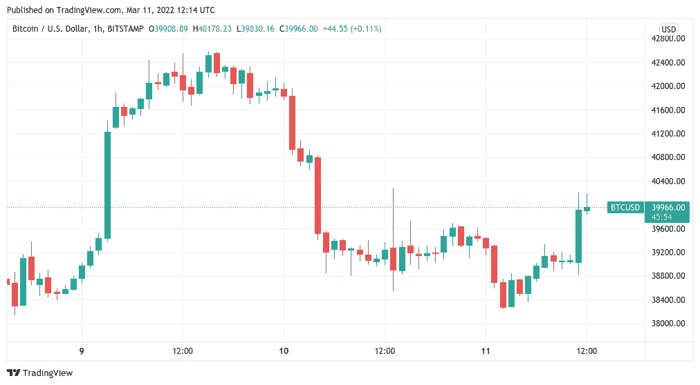
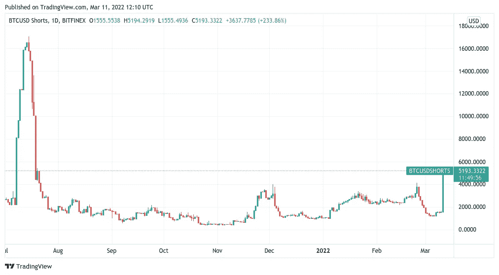
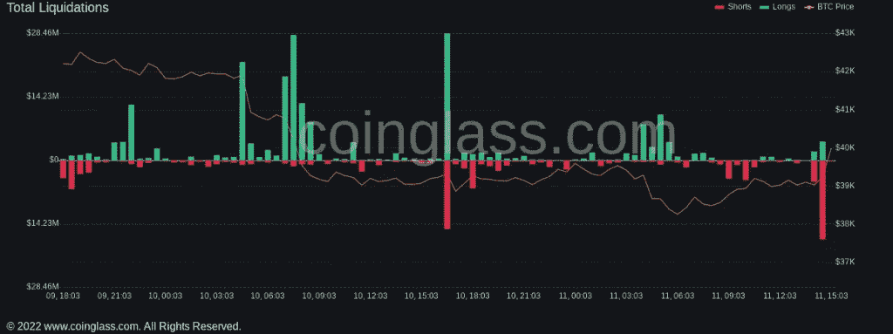

# 俄罗斯认为乌克兰战争辩论出现“积极变化”,比特币价格突破 40000 美元

> 原文：<https://medium.com/coinmonks/bitcoin-surpasses-40-000-as-russia-perceives-positive-changes-in-the-ukraine-war-debate-ee7b27d2a64a?source=collection_archive---------51----------------------->

**Visit our website:-** [**https://bitcoinsupports.com/**](https://bitcoinsupports.com/)

比特币再次表明了它对和平的偏好，因为对更快解决冲突的希望将 BTC 价格推升至 40，000 美元以上。由于对俄乌问题可以通过外交途径解决的乐观情绪，比特币(BTC)在 3 月 11 日经历了短暂的波动。

**Visit our website:-** [**https://bitcoinsupports.com/**](https://bitcoinsupports.com/)

随着希望的增长，Bitfinex 短裤也在增长。

根据 TradingView 的数据，BTC/美元暂时飙升 1400 美元，周五回落至 40000 美元下方企稳。俄罗斯总统弗拉基米尔·普京最近在会见白俄罗斯总统亚历山大·卢卡申科时表示，乌克兰局势出现了“良好的发展”，随后做出了这一决定路透社和其他媒体援引他的话说:“我们的谈判代表告诉我，有一些好的举措。”。已经因厌恶暴力冲突升级而臭名昭著的比特币，很快与欧美金融市场同步复苏。受此消息影响，德国 DAX 指数上涨 2.6%，标准普尔 500 指数在华尔街开盘前上涨 1.1%。在撰写本文时，BTC/美元的波动性仍然很高，多头试图更有说服力地突破 40，000 美元的阻力。然而，在此之前，监控主要交易所 Bitfinex 快速增长的空头头寸的个人已经发出了警告 Bitfinex 是即将到来的短期下跌的传统指标。

https://Twitter . com/ColeGarnerXBT/status/1502124229419958274

在撰写本报告时，这种趋势仍在持续增长，在每日和较短的时间尺度上都可以观察到，并且处于 2021 年 7 月以来的最高水平。

**Visit our website:-** [**https://bitcoinsupports.com/**](https://bitcoinsupports.com/)

跟踪服务公司 Coinglass 的数据显示，金价升至 40200 美元的局部高点，导致衍生品平台的空头头寸得到适度平仓。

**Visit our website:-** [**https://bitcoinsupports.com/**](https://bitcoinsupports.com/)

交易者保持冷静。

比特币仍远低于其既定交易区间的上限，超过 42000 美元的区域被证明不可能在整个 2022 年长时间持有。然而，最近的价格波动让一些交易员受益，热门 Twitter 账户 Anbessa 通知关注者，一切都在按计划进行。与此同时，交易伙伴 Pierre 注意到一个上升的支撑楔，多头应该保持这个支撑楔继续前进。

**访问我们的网站:-**[**https://bitcoinsupports.com/**](https://bitcoinsupports.com/)

**免责声明:以上为作者观点，不应视为投资建议。读者应该自己做研究。**