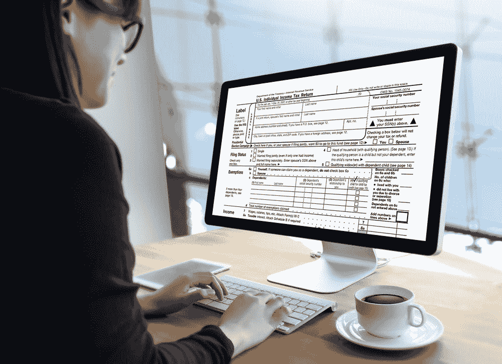

# 比特币和税收:你需要知道的 10 件事

> 原文：<https://medium.com/coinmonks/bitcoin-taxes-10-things-you-need-to-know-abd49c8c123b?source=collection_archive---------22----------------------->

*(原载于《比特币》杂志)*

*greentradertax.com photo*

是的，又到了一年的这个时候。新的一年即将来临，我们都需要开始收集税务文件。有趣的东西，对不对？投资比特币或 Dogecoin 之类的加密货币？如果是这样，事情就变得非常有趣了。顺便说一句，我是专门写美国税收的，但英国的规则非常相似。你需要知道的是: