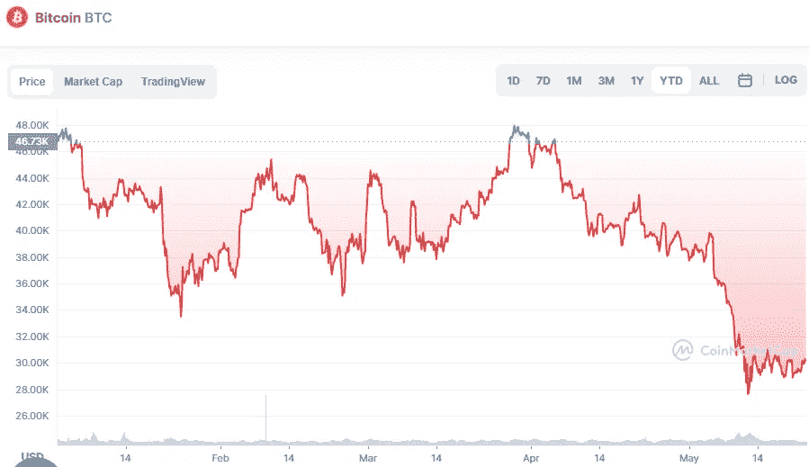

# 5 月 23 日比特币技术分析

> 原文：<https://medium.com/coinmonks/bitcoin-technical-analyse-23th-of-may-6145ec3c9c98?source=collection_archive---------33----------------------->

5 月 20 日，随着比特币从一个关键支撑反弹，在 28，630 美元的买入压力显而易见。多头正在寻求将价格推至下降趋势线以上，这可能是抛售压力减轻的第一个迹象。

Source photo [Bitcoin price today, BTC to USD live, marketcap and chart | CoinMarketCap](https://coinmarketcap.com/currencies/bitcoin/)

如果 BTC/USDT 组合突破下降趋势线(31，887 美元)，它可能会突破 20 天指数移动平均线(EMA)。预计熊队会激烈防守…