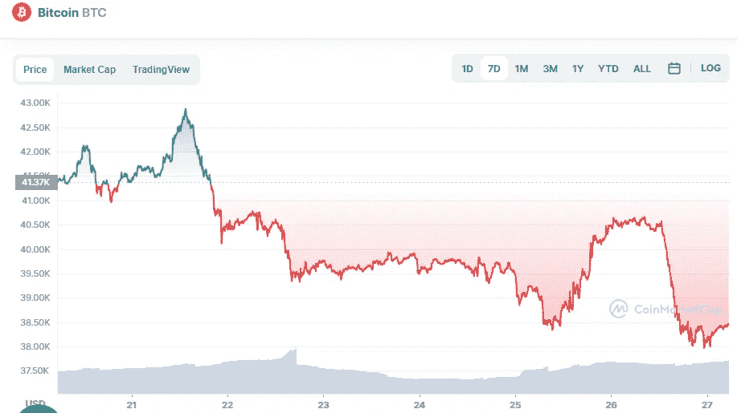

# 比特币技术分析 4 月 27 日

> 原文：<https://medium.com/coinmonks/bitcoin-technical-analyse-27th-of-april-b21c6ec70b97?source=collection_archive---------43----------------------->

Source photo [Bitcoin price today, BTC to USD live, marketcap and chart | CoinMarketCap](https://coinmarketcap.com/currencies/bitcoin/)

比特币的价格试图突破 40，500 美元大关。另一方面，BTC 无法突破 40，700 美元至 40，750 美元之间的阻力。

价格在达到 40，776 美元左右的峰值后下跌。在 40，000 美元和 100 小时简单移动平均线以下，价格急剧下跌。在 BTC/美元对的小时图上，一条连接看涨和看跌的趋势线