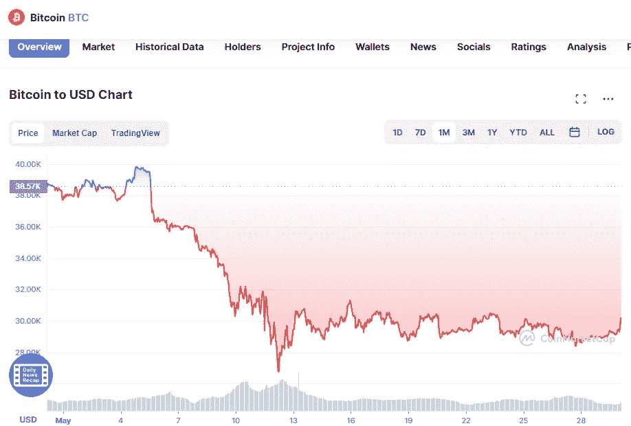

# 5 月 30 日比特币技术分析

> 原文：<https://medium.com/coinmonks/bitcoin-technical-analyse-30th-of-may-9706df134ef1?source=collection_archive---------29----------------------->

比特币的价格继续在下降趋势线和 28，630 美元支撑位之间的狭窄交易区间内波动。5 月份有两天价格跌破 28，630 美元，但空头无法在那里守住价格。因此，在 5 月 28 日，出现了反弹。

Source photo [Bitcoin price today, BTC to USD live, marketcap and chart | CoinMarketCap](https://coinmarketcap.com/currencies/bitcoin/)

上升到下降趋势线以上，测试 20 天指数移动平均线(30，538 美元)现在是多头的议程。这是…