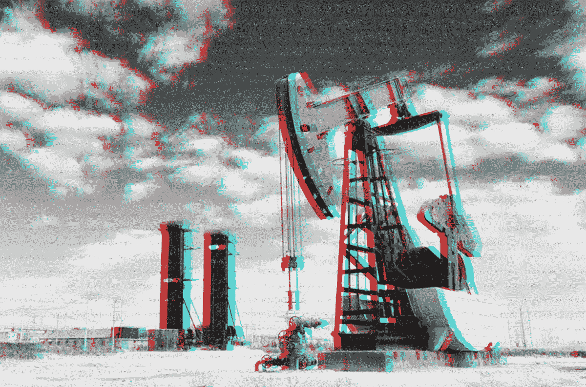
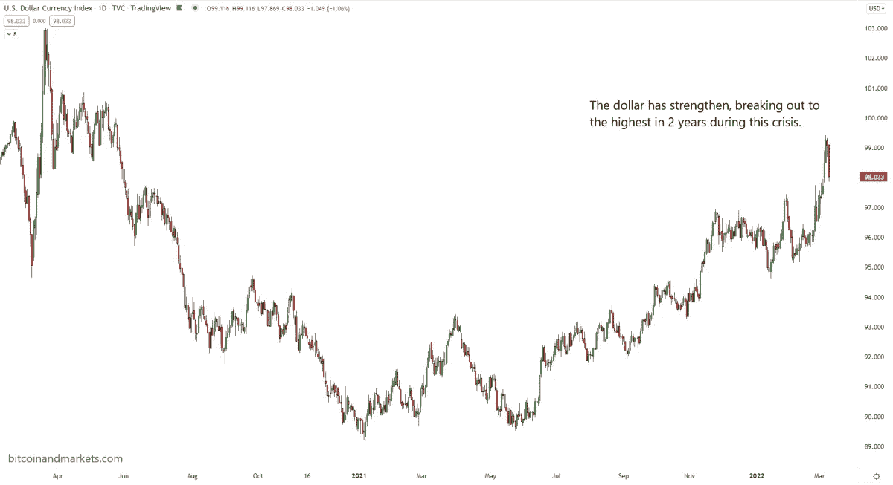
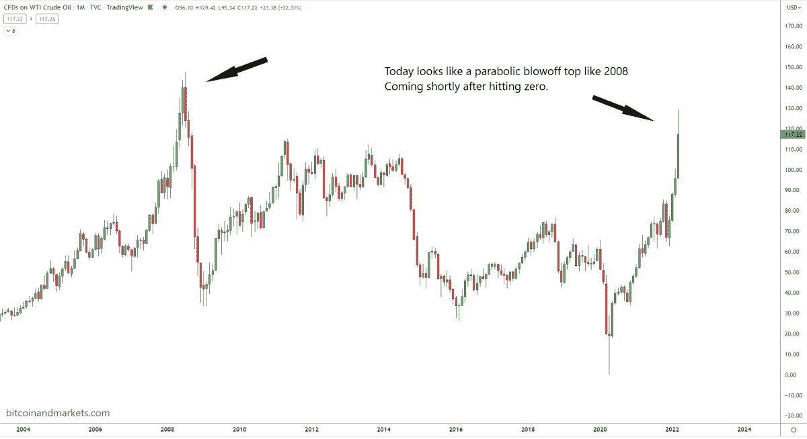

# 比特币、金融体系的结构性转变和石油

> 原文：<https://medium.com/coinmonks/bitcoin-tectonic-shifts-in-the-financial-system-and-oil-a243459f6788?source=collection_archive---------53----------------------->

讨论与比特币相关的最新宏观经济发展，包括油价和市场误解。

[**在 YouTube 上看这一集**](https://www.youtube.com/watch?v=39gnuVpPqHI)

**听这一集:**

*   苹果
*   [Spotify](https://open.spotify.com/episode/2i1W5zDJjSynTYZnoKyUN4?si=cd10a0d0e3bf4920)
*   [谷歌](https://podcasts.google.com/feed/aHR0cHM6Ly9mZWR3YXRjaC5saWJzeW4uY29tL3Jzcw/episode/MmMyYjk3ZDAtMzIwMi00MmFlLWEzOTktODI2YmQzODA0NTJk?sa=X&ved=0CAUQkfYCahcKEwiApubS-rn2AhUAAAAAHQAAAAAQLA)
*   [Libsyn](https://fedwatch.libsyn.com/luke-gromen-on-tectonic-shifts-in-the-financial-system-and-oil-fed-85)
*   [阴天](https://overcast.fm/+m2acGHusA)

在这一集《比特币杂志》的“美联储观察”播客中，CK 和我迎来了一位特殊的客人，卢克·格鲁门。Gromen 是[为树而林(FFTT)有限责任公司](https://fftt-llc.com/)的创始人兼总裁，他为客户提供全球金融体系的宏观见解和可投资分析。在这场广泛的对话中，我们深入探讨了俄罗斯、黄金、石油、影子银行体系、债券——凡是你能想到的，我们可能在这一集里都谈到过。

“美联储观察”是一个播客，面向对央行时事以及比特币将如何整合或取代老化的金融系统的各个方面感兴趣的人。为了理解比特币将如何成为全球货币，我们必须首先了解现在发生了什么。

# 对市场的常见误解

我们以 Gromen 对他观察当前经济形势的模型的总结作为节目的开始(在我笨拙的介绍被 CK 挽救之后)。他指出了两个普遍存在的误解，这两个误解造成了我们现在的处境:第一，石油美元的价值是美元，而不是石油；第二，认为债务无关紧要。这些是人们相信的事情，但实际上却是相反的。

我试图澄清这些误解的根源，但做得很糟糕。我认为，这些误解是由产生它们的制度造成的。然而，在二战后的漫长历史中，它们并不是误解。价值是石油美元的美元，美国债务无关紧要。随着这个时代的结束，他们错了。所以，我想知道的是，是这些错误观念导致了这个时代的结束，还是这个时代的结束导致了错误观念的产生？

# 美元体系的致命弱点

在播客的这一部分，Gromen 更深入地探讨了促成这次采访的推文，关于俄罗斯可能将黄金武器化，以及作为回应，美国将比特币武器化。

以 LBMA 和纽约商品交易所为中心的未分配黄金交易市场非常脆弱。格罗门的观点是，如果俄罗斯愿意，它可以简单地宣布它将出售石油换取黄金，这可能会使这些市场崩溃，并立即将黄金的市值转变为能够处理全球金融清算的规模。

根据 Gromen 有趣的思想实验，这种向石油黄金标准的转变将导致全球国家储备中持有的美国证券减少，并导致多种货币的贸易网络。

# 美元在升值，而不是贬值

如果关于多货币未来的理论是正确的，我们可以预期的事情之一是美元指数(DXY)相对于其他货币下跌。然而，在过去几周，美元汇率飙升，达到 99.4，为 2020 年 5 月以来的最高水平。这是美元在过去五年中仅在几个月内达到的强势水平，主要是在 2020 年初的短暂时期。

*The dollar’s strength is rising*

所以，我问 Gromen，他是否对美元的强势感到惊讶。他说:

“我对 DXY 上涨并不感到意外，因为它一直是融资货币，它拥有庞大的欧洲美元体系，你可以在其中获得美元计价的贷款。所以，任何时候你受到经济压力，DXY 都会上升。尽管如此，美元对石油的汇率已经大幅下跌。”

# 金融重置的下一个实际步骤是什么？

近一年来，我们一直认为，科罗纳金融危机之后，很可能会出现第二次欧洲债务危机，就像大金融危机(GFC)之后一样。这是可以预测的，因为货币、储备和信贷像潮水一样在世界各地流动。我们也说过欧洲是世界金融病夫。欧元和欧盟能否挺过即将到来的债务危机将是一个奇迹。现在，看起来他们也不得不在对他们精心制作的存在理由的身体威胁中生存。

无论如何，我们的立场是，欧元将比美元更早面临生存问题。我们问格罗曼，他对这种动态有何见解。他对下一步该怎么做有一个非常细致入微的流程，并在详述能源和大宗商品危机将如何蔓延至欧洲银行、进而蔓延至美国银行方面做得非常出色。Gromen 说，随着危机蔓延到推动美国边际支出和边际税收的股票，我们最终将看到它蔓延到美国主权债务。

随着税收收入下降，美国面临政府融资危机，美国将转向美联储，坚持再次启动量化宽松(QE)，因为这是唯一的实际选择。Gromen 表示，这表明央行在通胀仍然很高的情况下回归宽松政策。

# 如果石油从这里掉下来怎么办？

接下来，我们谈到了一种可能性(我认为这是最有可能发生的)，即乌克兰比所有人想象的都要快得多，而且不会陷入泥潭。在这种情况下，能源将再次开始从俄罗斯流出，但市场也将反应过度，并使更多的美国、委内瑞拉、伊朗，甚至可能是石油输出国组织的生产上线。这可能会迅速将危机从石油短缺转变为石油过剩。我们必须记住，这次价格飙升发生在两年前，当时石油期货价格为负。仅仅 23 个月后，现在我们已经达到了几十年来的最高水平。如果油价迅速回落至 50 美元/桶或更低，该怎么办？

我指出，该图表看起来类似于 2008 年，是一个抛物线型的井喷，不像是一个持续的向更昂贵的石油转变的机制。格罗门反驳说，这个事件比那个更大。我们所看到的是“相对全球电力水平的市值”这与 Gromen 的立场非常吻合，即切断俄罗斯与 SWIFT 的联系并没收其持有的外汇储备是全球金融体系的一个根本性转变。

Gromen 雄辩地阐述了这样一个主题:世界正在见证二战后美国霸权的终结，以及我们所知的美元体系的终结。

在这里，我问了他一个有趣的问题:是债券价格更正确还是石油价格更正确？这两个市场都非常深入和复杂，但在图表上，石油似乎处于更不可持续的位置，与 2008 年非常相似，而债券仍保持其长期趋势。我之所以问这个问题，是因为有一句古老的格言:债券市场永远是正确的。

Gromen 回应说，他认为石油更正确，尽管他警告说，由于我们现在拥有的战争溢价的消失，可能会有一个短期的调整。然而，他又回到了他论文的一个基本方面，即美国主权债务是这一次的不同之处。美元无法像日本那样继续宽松，因为美元是全球储备货币。

# 从全球主义到地区主义

CK 将我们带回到现实和比特币的领域来结束这场表演。他向 Gromen 询问了对未来体系的信任，以及这种信任如何体现为一个更加地方性和区域性的世界，而不是一个如此全球化的世界，以及与全球主义相关的所有脆弱性。

我们简要讨论了供应链的萎缩，以及更加自给自足和区域性的可信贸易网络的兴起。Gromen 认为这对比特币来说也是一个很好的场景，但最终认为黄金将成为建立新系统最值得信赖的资产。

# 结论

令人惊讶的是，我们没有谈论通货膨胀。随着全球供应链的彻底灾难，以及美联储的大量“印刷”，CPI 同比仅增长 7%令人震惊？我认为在去美元化的叙述中有一个巨大的疏忽，我们甚至没有覆盖，主要是美联储不印钱。希望我们能让 Gromen 回到节目中来讨论这个问题。

这一集充满了预测和思想实验。这是一次有趣的谈话，很高兴见到葛罗蒙。我们试图将一些理性假设应用于全球金融体系的实际后续步骤。这是比特币的一个小亮点，但在我们了解比特币将如何成为全球货币之前，我们必须了解最近事件的严重性，这就是这一集的全部内容。

这是安塞尔·林德纳的客座博文。所表达的观点完全是他们自己的，不一定反映 BTC 公司或比特币杂志*的观点。*

【https://bitcoinmagazine.com】原载于 2022 年 3 月 12 日**。**

> *加入 Coinmonks [电报频道](https://t.me/coincodecap)和 [Youtube 频道](https://www.youtube.com/c/coinmonks/videos)了解加密交易和投资*

# *另外，阅读*

*   *[3 商业评论](/coinmonks/3commas-review-an-excellent-crypto-trading-bot-2020-1313a58bec92) | [Pionex 评论](https://coincodecap.com/pionex-review-exchange-with-crypto-trading-bot) | [Coinrule 评论](/coinmonks/coinrule-review-2021-a-beginner-friendly-crypto-trading-bot-daf0504848ba)*
*   *[莱杰 vs n rave](/coinmonks/ledger-vs-ngrave-zero-7e40f0c1d694)|[莱杰 nano s vs x](/coinmonks/ledger-nano-s-vs-x-battery-hardware-price-storage-59a6663fe3b0) | [币安评论](/coinmonks/binance-review-ee10d3bf3b6e)*
*   *[Bybit 交易所评论](/coinmonks/bybit-exchange-review-dbd570019b71) | [Bityard 评论](https://coincodecap.com/bityard-reivew) | [Jet-Bot 评论](https://coincodecap.com/jet-bot-review)*
*   *[3 commas vs crypto hopper](/coinmonks/3commas-vs-pionex-vs-cryptohopper-best-crypto-bot-6a98d2baa203)|[赚取加密利息](/coinmonks/earn-crypto-interest-b10b810fdda3)*
*   *最好的比特币[硬件钱包](/coinmonks/hardware-wallets-dfa1211730c6) | [BitBox02 回顾](/coinmonks/bitbox02-review-your-swiss-bitcoin-hardware-wallet-c36c88fff29)*
*   *[block fi vs Celsius](/coinmonks/blockfi-vs-celsius-vs-hodlnaut-8a1cc8c26630)|[Hodlnaut 审核](/coinmonks/hodlnaut-review-best-way-to-hodl-is-to-earn-interest-on-your-bitcoin-6658a8c19edf) | [KuCoin 审核](https://coincodecap.com/kucoin-review)*