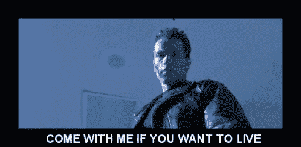
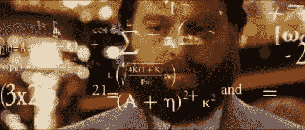
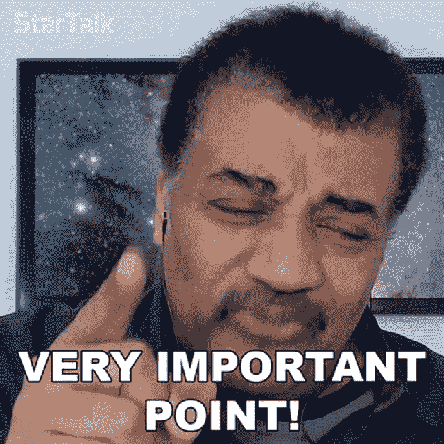

# 比特币——理解比特币的入门指南

> 原文：<https://medium.com/coinmonks/bitcoin-the-comprehensive-guide-in-simple-terms-d419ed656944?source=collection_archive---------16----------------------->

## 以下是你的比特币指南，让你了解市场上最强大的优势。

Photo by [Bermix Studio](https://unsplash.com/@bermixstudio?utm_source=medium&utm_medium=referral) on [Unsplash](https://unsplash.com?utm_source=medium&utm_medium=referral)

## 介绍

> 知识是市场中最强大的工具。

互联网让人们获得了几乎无限的知识和智慧。人们可以为自己创造的杠杆是我们在人类历史上从未见过的。技术的发展迫使我们适应不断变化的世界，改变我们的习惯和行为。

在一个数字化如此迅速的世界里，我们可能会看到人们挣扎着生活，试图生活在他们童年的模拟世界里。如果这些人不能如此迅速地适应，他们能对自己的生活做些什么呢？我不敢回答这个问题。我想说的是，我们应该传播知识，并努力教育那些愿意学习的人。用一种简单的方式揭开现代世界的奥秘，并给他们我们能想象到的最强大的工具——知识。

适应或者失败。进化或者成为猎物。拥抱未来，或者永远留在身后。

下面这篇文章试图引导你了解比特币，让你比大多数市场参与者更好地了解比特币，更不用说整个社会了。所以，事不宜迟，让我们深入比特币的世界。

跟我来。

[*https://tenor.com/YkUv.gif*](https://tenor.com/YkUv.gif)

## 盗梦空间

2008 年 8 月，【bitcoin.org】域名在网上注册。两个月后，2008 年 10 月 31 日，比特币[白皮书](https://bitcoin.org/bitcoin.pdf)发布。在接下来的几年里，白皮书吸引并激励了全球各地的人们，不仅是技术工程师，还有寻求主权的个人。从那以后，为了理解比特币核心的思想，比特币的白皮书被阅读和研究了无数次。

我强烈建议您也这样做，自己研究一下白皮书。你将成为一个可以自豪地说你已经花时间阅读比特币白皮书的人，而不是只在谷歌上搜索“什么是比特币”，阅读基本定义，而不了解正在发生的革命的范围。本文末尾附有比特币白皮书的链接。我给你的一个小小的建议是，在阅读白皮书之前先通读下面的文章，以免一开始就不知所措。

比特币并不是第一次尝试建立一种让人们能够以点对点(P2P)方式转移资金的数字货币。纵观历史，你可能听说过被称为 [Hashcash](https://www.investopedia.com/tech/were-there-cryptocurrencies-bitcoin/) 或 [Bit Gold](https://www.investopedia.com/tech/were-there-cryptocurrencies-bitcoin/) 的加密货币。这两个比特币的前身没有引起足够的关注，也无法创造网络效应，而网络效应是在主流世界站稳脚跟所不可或缺的。在经历了一系列的挣扎之后，比特币成为了最成功的加密货币，并为自那以后创造的所有其他加密货币铺平了道路。

比特币的诞生与一个名叫中本聪的神秘人有关，他是 bitcointalk.org 网站的活跃用户。Satoshi 是一个个体还是一群个体，至今仍是一个问题。Satoshi 最后一次登录他的 bitcointalk.org 账户是在 2010 年 12 月 12 日。从那以后，他从公众中消失了，至少是正式地。这就是为什么出现了关于比特币创造背后的参与者的神秘和阴谋论。就我个人而言，我遇到过许多不同的理论，其中一些严重错乱，而另一些则相当有说服力和深思熟虑。

这不是想知道造物主是谁；它是关于理解创造和它的可能性。自诞生以来，聪留下的遗产一直在改变着世界，并将继续改变下去。

## 区块链—一次一个区块

比特币通常被描述为分布式账本。然而，这到底意味着什么呢？

简而言之，每个人都可以看到区块链上的所有交易；但是，任何人都不能反转或删除已经验证和添加的交易。

想象一下，你和你的朋友经常在外面吃饭，但是只有一个人付饭钱。在钱和别人欠你多少钱的问题上，你非常挑剔。如何以一种每个人都可以访问数据并且数据不能被修改的方式来解决这个问题？

[*https://tenor.com/Af1K.gif*](https://tenor.com/Af1K.gif)

你会得到一个笔记本，每次出门都会记下当天晚上所有的交易。每个人都将得到一份网页副本，然后回家。如果你们中的一个人想修改页面上的数据，其他人会发现不同，并拒绝恶意朋友提供的数据。多数人会达成共识，多数人提供的数据会被视为官方数据。

说到比特币，每过 10 分钟，矿工们就会生产出一个新的区块，并将其添加到主区块链中。所添加的区块包含一些已发生并由矿工自己核实的交易。现在，添加了下面的块之后，将通过向网络提供用户进行的下一组事务来产生下一个块。

## 比特币的工作证明——证明你赚到了

对于任何一家公司来说，为了公司的发展和为客户提供服务，我们需要那些愿意付出努力和工作的员工。谈到比特币，它并没有你想象的那么不同。

在比特币中实现的工作证明共识机制需要负责验证和创建新块的人，以及验证一切是否顺利以及网络中是否有恶意行为者的人。让我解释一下比特币区块链中的共识机制是如何运作的。

比特币正在通过工作证明机制在网络上达成共识。换句话说，网络是通过使用 CPU、GPU 或专门设计用于挖掘比特币的设备(称为 ASIC(专用集成电路))获得的计算能力来验证和保护的。

为了奖励矿工保护和验证网络的努力，他们在每个街区结束时都会获得比特币奖励，这大约需要 10 分钟。然而，成为完成这个街区的人的可能性是微乎其微的。这就是为什么矿商们经常创建资金池，在那里他们创造了复合计算能力的激励，以便有更高的机会获得奖励。

在比特币网络的早期，由于高昂的维护成本和更高的收入前景，建立一个单独的挖掘系统远比现在更受欢迎。随着时间的推移，人们开始创建越来越大的比特币开采设施，这些设施需要大量的空间和复杂的冷却系统，以便提供理想的温度，不会损坏一直运行的设备。

工作共识机制的证明是比特币网络的一个关键要素，因为只有通过在现实世界中以法定货币购买的设备的计算能力才能实现网络的安全。换句话说，采矿者必须愿意向采矿设施投资，这导致了一个独立的业务分支的产生，这就是采矿设施所有权。然而，比特币采矿业务的发展是一个足够广泛的话题，可以在未来的另一篇文章中讨论。

## 减半——你挖掘的越多，得到的就越少

比特币通常与稀缺性联系在一起。

为什么人们认为它是一种稀缺资产？这一切都归结于比特币的固定供应——2100 万枚比特币。

我们能接触到比特币的全部供应吗？不，我们没有。比特币的供应量逐渐添加到网络中，直到达到 2100 万个硬币的上限。最初，比特币以每块 50BTC 的速度开采，每块大约需要 [10 分钟](https://btc.com/stats/diff)才能生产出来。据预测，比特币的最后一部分将在 2140 年左右被开采出来。

但是等一秒钟；你不必是数学天才，每 10 分钟计算 50BTC 也不会得出 2140 年。确实细心的读者。这就是为什么减半机制在比特币区块链中如此重要。

什么是减半？

简而言之，减半是指每生产 210，000 个区块，将链条上生产区块的奖励减少一半的机制，因此得名减半或减半，这需要大约 4 年时间才能完成。如前所述，最初的奖励设定为每块 50BTC，在生产出第一批 210，000 块后，奖励降至每块 25BTC。第一次减半发生在 2012 年 11 月 28 日，此前共开采了 10，500，000 BTC，占总供应量的 50%。截至今天，即 2022 年 4 月，生产一个区块的奖励为 6.25BTC，并将在 2024 年 3 月 19 日[左右](https://www.buybitcoinworldwide.com/bitcoin-clock/)降至 3.125BTC。

减半的机制与比特币区块链的整体哈希值密切相关。在这里，你可以快速浏览一下什么是“hashrate”。

如果每 10 分钟就有一个区块被开采者提供给定数量的计算能力，如果我们增加开采者的数量和他们生产的散列值会怎么样？我们不是能更快地生产积木吗？

[https://tenor.com/GwPo.gif](https://tenor.com/GwPo.gif)

每 10 分钟生产一次积木，有时两边略有偏差。然而，由于难度自适应增加的内在机制，整体哈希表并不影响生成方块所需的时间。矿商提供的哈希拉特越多，生产一个区块就越难。这就是为什么每个数据块 10 分钟的时间是固定的，并且我们能够预测下一个减半发生的时间。

## 节点和块——一点点构建

对于一个刚刚进入密码世界的人来说，你可能会被奇怪的短语和单词的混合所淹没，这些短语和单词的意思不完全是你可能会想到的。然而，你也会发现日常语言中使用的单词，猜测它们的意思并不困难，甚至对它的意思、工作原理和作用有一个模糊的概念。想想你以前读过的区块链技术。

什么是节点，什么是块？想一想。你的第一个想法是什么？

如前所述，区块链只是一串经过验证并添加到主链中的块。但这个“块”是什么？它包含什么？

回到一本书的想法，所有的交易都写在里面是区块链，块只是另一个页面，你会添加，已经充满了关于交易的信息，并得到了大多数人的共识。

我们不会从技术上深入探讨每个模块包含的内容以及它是如何构建的，因为它没有你对它是什么以及它扮演什么角色的概念那么重要。

节点呢？

我们可以把节点和矿工一起视为区块链负责独立核查区块链状况的主要行为者。但这意味着什么呢？

要在区块链建立一个完整的节点，你必须下载整个比特币区块链，并开始根据比特币的共识规则检查每一笔交易。

整个比特币网络的规模有多大？猜一猜。我会等的。

截至 2022 年 4 月，完整的比特币[区块链大小](https://ycharts.com/indicators/bitcoin_blockchain_size)估计约为 389.72GB

现在，让我们打个小比方。

在比特币的区块链，我们有两个主要角色，矿工和节点赛跑者。

让我们回到美国的淘金热。矿工只是……矿工，他们利用自己的力量(物质和货币资源)开采黄金，并获得黄金(比特币)作为回报。他们都因拥有更多黄金而变得更富有，如果他们的公民拥有更多黄金，国家也会变得更富有。

另一方面，节点就像治安官，确保一切都按照普遍共识的规则进行，并确保矿工或网络的其他用户中没有恶意行为者。

## 比特币——失落和绝望

你在交易所看到的比特币价格和每一枚硬币的价格相似吗？即使到了 2100 万，我们还有多少硬币可用？是 2100 万，还是可能会更少？

常识告诉我们，应该相信有 2100 万枚硬币的固定供应量。

如果我的冷钱包里有 1BTC，而我忘记了密码，怎么办？

如果在 2010 年，我有 1000BTC，存放在一个纸质钱包里，然后……它被损坏了，那该怎么办？

如果我在 2010 年挖掘比特币，并拥有数千枚比特币，但我无法获得密钥，那会怎样？

中本聪自己持有的硬币呢？那些硬币从那以后就没动过。

有多少 BTC 真的在流通？

这是许多人试图解决的问题，你可能会发现许多不同的研究或个人研究试图找到 BTC 在流通的真实数量。然而，要小心这些发现，因为这是不可能评估的，给出的数字只是模糊的假设。

另一方面，有些人不是中短期交易者，而是长期投资者，他们不会在任何时候出售比特币，或者会在未来出售少量比特币，以支付采矿或生活成本。

你必须考虑的另一个重要信息是，比特币的价格是通过交易所的供求机制建立的，使用的是流动性 BTC。如果我们减去非保管钱包中丢失的 BTC 和 BTC 的数量，还会剩下多少个 BTC？答案比你想象的要少。

你必须记住的是，我们流通中的比特币比你想象的要少得多，这意味着如果我们知道可供购买的硬币的确切数量，价格可能不会接近比特币的真实需求。

不要低估真正的霍德勒和钻石手投资者的意志和毅力，他们永远不会卖给你他们的硬币，无论市场条件如何。

## UTXO——它到底是什么意思？

未用(U)交易(TX)输出(O)

[*https://tenor.com/3gVj.gif*](https://tenor.com/3gVj.gif)

UTXO 是什么？

想象一下，你带着一个钱包和一张 100 美元的钞票去商店。在你挑选了合适的饮料和小吃后，你正走向收银台去付款。在收银台，你用你的 100 美元纸币付款，收银员收下并找给你 25.50 美元。你拿着它，把它放在你的钱包里。

这只是 100 美元纸币的一部分吗？嗯……肯定不是。

事实是，你钱包里的 25.50 美元与你支付的 100 美元没有关联。它只是你钱包里的 25.50 美元的纸币和硬币。在你的钱包里，你可能有以下各种硬币和纸币:

2x 10 美元 1x 10 美元

1 个 5 美元或 3 个 5 美元

1 个 0.50 美元 2 个 0.25 美元

重要的是要记住，你可以拥有任何其他面值为 25.50 美元的硬币和纸币组合。你不关心它，我敢说在你的一生中，你甚至没有考虑过它。

这就是 UTXO。现在，当谈到比特币区块链和 UTXO 如何工作时，我将只描述它的一般概述，因为了解你在你的冷钱包中持有的硬币是什么是很重要的——我希望如此。

您在某个交易所购买了 1BTC。是整枚硬币吗？大概不会。它只是等于 1BTC 的 UTXOs 的混合物。然后你想把你的 BTC 放进你冰冷的钱包里。假设你交了 0.001BTC 的网费，转了 0.999BTC 到你冰冷的钱包里。这是你不久前得到的同一个 1BTC 吗？嗯……是也不是。它是你刚才喝过的相同或相似的混合 UTXOs，但是区块链上的地址变了。就好像你递给某人一个钱包，那个人拿了一个网费需要的硬币，剩下的硬币和纸币放进新的钱包里交还给你。

UTXO 的想法并不复杂，但为了理解灰尘攻击可能对 BTC 网络造成的威胁以及硬币如何被跟踪，知道它如何工作是相当重要的，这只是举几个例子。

## 闪电网络——快钱

你可能听说过不同的区块链项目被称为“第二层区块链”。

这是什么意思？

简而言之，给定区块链上的第 2 层是一个附加层，它通过提高交易速度和每分钟交易次数以及降低交易成本，为主区块链(第 1 层)提供更大的可扩展性。

想象一下，去一家废弃的银行，把钱转到另一个账户，你必须支付银行的手续费，然后等一段时间，直到钱出现在另一个账户上。另一方面，你可以通过你的银行账户或一些移动应用程序进行转账，你根本不用支付任何费用，或者费用可以忽略不计，资金几乎立即出现在指定账户上。这就是第 1 层和第 2 层支付系统的区别。

但是，不要错误地认为第 1 层已经过时；它只是有更重要的事情要关注，如为整个区块链提供新的，经过验证的块，而第 2 层解决方案的目标是通过做必要的麻烦为第 1 层提供已经处理和验证的交易。这就是为什么主要的区块链，这里是比特币，将只被给予钱包的最终状态。关于在渠道最终关闭之前发生在渠道上的所有交易的信息以及账户与最终资金量的平衡与主链无关。

现在你知道什么是第 2 层，闪电网络的目标是什么。还有一点要记住，不同区块链上的大多数第 2 层解决方案也是作为区块链构建的，但是 Lightning 网络并不是使用区块链技术构建的。记住下面的陈述，因为它是闪电背后最普遍的想法，也是想象闪电是什么的最好的想法。

[*https://tenor.com/bFABl.gif*](https://tenor.com/bFABl.gif)

> ***闪电网(Lightning Network)是比特币钱包之间公共和私人通道的网络。***

要记住的一件重要事情是，用另一个钱包打开一个私人通道只通知有关该通道的存在的两个参与方。另一方面，公共信道的创建和开放通知整个网络这样的连接是可用的并且可能被任何人使用。

你可能会问，在闪电网络上创建和运营一个公共频道有什么意义？

你从每笔交易中获得的费用都要通过你的渠道。

如果你不知道这是怎么回事，那就是钱的问题。

当有疑问时，看看谁从中受益。

## 匿名——我看到你在那里做了什么

你听说过比特币允许匿名吗？或者说比特币因为匿名的特性被用来洗钱？

嗯……你可能听过这样的故事。然而，当你问及为什么或如何允许人们匿名时，谈话就结束了，就好像这只是某人听到的一个故事，没有再考虑一下。

其实比特币并不是匿名的。是假名。

给你一个钱包地址作为你的假名；但是如果有人跟踪交易并发现谁是钱包的主人呢？那你的匿名在哪里？

[*https://tenor.com/wIZG.gif*](https://tenor.com/wIZG.gif)

最容易想到的比特币就像防弹玻璃存储；你不能这么轻易地偷钱，也不能改变里面的东西。然而，如果你有足够的决心花一些时间挖掘和分析数据，你就可以确切地看到里面有什么。

你在网上的每一个动作都会留下痕迹，如果留下了痕迹，就能被追踪到。这是人们似乎经常忘记的最重要的规则。

像这样的功能有其优势，因为当你不确定市场状况时，你可能会看到大玩家鲸鱼在用他们的硬币做什么。有大量的链上数据需要分析，许多人花了大量的时间去做。值得吗？

问自己一个问题。如果你能做到，市场上的大玩家的可能性范围是什么？你认为他们会让你这么容易地看到他们的钱包，只需支付很少的访问费就能获得链上数据吗？

> 关注大局和长期趋势，而不是短期行为。

你用给定的钱包进行的交易越多，你留下的痕迹就越多。如果你没有什么可隐瞒的，那就不是缺点。问题是，它能否在未来引导监管比特币，让每一笔交易都受到监控，就像如今银行业一样？

但是等等。犯罪分子如何利用比特币清洗非法资金并套现？他们正在以某种方式做这件事，不是吗？

有多种服务，比如 mixers，允许你匿名化你的硬币，从而允许你自由地使用它们。这不是一个关于如何让你的硬币匿名的指南，因为如果你不知道你在做什么或者会有什么后果，这对你来说可能是弊大于利。

有一点要记住，你越想匿名，你吸引的注意力就越多。

我想留给你们的最后一个想法是，比特币不是我们可能用来支付商品或服务的唯一加密货币。在众多不同的加密货币中，如果使用得当，我们可能会发现硬币为我们提供了可用性和相当高的匿名性。这种硬币的一个例子可能是 Monero (XMR)，Zcash (ZEC)，甚至 Litecoin (LTC)，在最近的 Mimblewimble 升级后。

## 摘要

恭喜你！您已经到达文章的结尾，并获得了进入比特币和加密货币世界的必要知识。你已经迈出了生活在未来世界的第一步。

在这一点上，你已经知道什么是比特币，它的区块链是如何工作的，为什么它不是匿名的，尽管有一些常见的误解。我敢打赌，你可以向你以前从未听说过的朋友解释闪电网络是什么，UTXO 是如何工作的。

> 知识是市场中最强大的工具。在迈出第一步之前，好好装备自己，争取一个属于自己的胜利。让知识成为你的优势。

如果你觉得这篇文章有价值和有帮助，如果你在 Twitter 和 Medium 上关注我，它对我来说意味着整个世界，因为我希望能接触到和你一样渴望学习的人。先谢谢你，祝你有美好的一天！

[*https://tenor.com/3DvS.gif*](https://tenor.com/3DvS.gif)

https://twitter.com/ModernEremite

【https://moderneremite.medium.com/ 

[https://bitcoin.org/bitcoin.pdf](https://bitcoin.org/bitcoin.pdf)