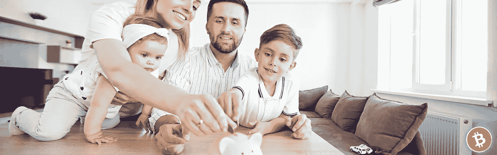

# 比特币:自我保管的重要性

> 原文：<https://medium.com/coinmonks/bitcoin-the-importance-of-self-custody-64b4dde34807?source=collection_archive---------36----------------------->

## 实物资产与虚拟资产

你把你的加密货币——你的虚拟资产*——留在你购买它们的交易所了吗？也许你刚买了你的第一个 10 00 万 Satoshi，也就是 0.1 比特币(BTC)，现在它就在你的投资组合标签里，在 *BTC* 图标旁边。*

*强烈建议您**摘掉。***

***你可能以前听说过这个短语，并想知道这有什么大不了的…资产已经以你的名字购买了*——这难道不等同于*拥有加密货币吗？*****

***可惜没有。***

*它们在你的名下，属于你与交易所合作创建的账户。在某种程度上，你是在从交易所*借用*那个账户，他们会帮你用这个账户获得一些比特币。*

*这与自主保管你的虚拟资产是非常不同的。*

*了解两者的区别将有助于你理解比特币最令人惊叹的特性之一，以及它为什么会改变世界。*

*除了作为一种货币升值技术，比特币还有一些很酷的用户体验。自我监管——成为控制你资产的主权实体——也许是最酷的一个。*

## *为什么自我监护很重要？*

*首先，你已经把辛苦赚来的钱花在了这个神秘的资产上，你应该充分利用它，收获它的好处。自我保管是一项**巨大的**好处，也是我们对整个加密货币资产类别感到兴奋的原因之一。*

*很简单，一旦你把你的比特币从交易所“拿走”,它们就由知道它们的**私钥的**人**唯一保管*而不是其他人*** 。*

## *没有别人。*

*那个私钥，不管是在一个[种子短语](https://en.bitcoin.it/wiki/Seed_phrase)中还是在一堆[乱七八糟的随机数](https://en.bitcoin.it/wiki/Private_key)中，都是*改变那个有价值资产所有权的唯一*方法。*

*十多年来，比特币网络在这方面被证明是绝对安全的，它的实用性赢得了世界上数百万人的心，其中一些人从未体验过这种资产主权。*

*你看，这个功能与你迄今为止体验过的任何其他数字体验都非常不同。*拥有比特币*不同于拥有你的股票和债券、各种股票，以及你登录银行应用时显示的数字。*

*事实上，它甚至不像那些显示在你的*交易账户*投资组合标签中的数字。这些都是*的实物资产。**

*在一天结束时，交换只是你的加密体验的一个入口。它的唯一目的是让你更容易进入网络，这取决于你把它带到一个新的水平。*

## *类比*

*私钥是唯一的个人 ***门户*** 进入虚拟世界——比特币网络——在那里你可以访问比特币，但只有一个特定于你的门户。*

*在某种程度上，比特币在世界上无处不在……但同时又无处不在。现有的*虚拟的—* 分散的—在整个互联网上，每个人都可以访问… **但是绝对没有人有特权。***

*的确，规则对每个人来说都很简单。你进入这个极其强大的计算机网络(碰巧是一个货币网络)的唯一入口是合法的私人密钥和一些基本的比特币软件(碰巧是世界上最容易被访问和分布最广的软件)。*

*拥有数十亿美元硬件的比特币网络的各种节点确保了这一点。*

## *案例研究:交易*

*用一个例子继续我们的门户类比，假设鲍勃想用 0.25 BTC 和爱丽丝交换几袋土豆。在物理世界——肉类空间——鲍勃的工作很简单。鲍勃开车去爱丽丝的家，卸下实物商品——一袋袋的土豆。*

*然而，当谈到爱丽丝的终点——交付名为比特币的虚拟资产——时，有几个概念需要掌握。为了让鲍勃接受这些虚拟资产，他将需要访问网络，并且像我们之前提到的那样，当他想出一个[私钥](https://en.bitcoin.it/wiki/Private_key)时，将 ***仅*** 被授予。*

*顾名思义，对这个密钥的了解应该是保密的，因为访问它意味着访问包含鲍勃所有资金的比特币网络的特定**门户**。根据这个私钥，Bob 可以创建一个[公钥并寻址](https://en.bitcoin.it/wiki/Technical_background_of_version_1_Bitcoin_addresses)。这是他在比特币虚拟世界中的特定入口的地址。*

*从那里，爱丽丝，我们假设她已经有了私钥和地址，因为她选择用 BTC 支付，只需要用她唯一的秘密私钥访问她到比特币网络的**门户，并将 0.25 BTC 发送到鲍勃的**门户地址**。***

*神奇的是，资金到达了鲍勃的**门户**，而*没有其他人的*。没有人能阻止爱丽丝做她做过的事。没有人可以动鲍勃的资金，或者阻止这些资金到达他的手中。他们在一个完全独立的货币网络上互动。*

## *案例研究:交流*

*使用**门户**类比，把交易所想象成存在于物理现实中的**门户商店**。*

*当你准备购买比特币时，你拿着你的一些现金(肮脏肮脏的菲亚特)进入商店。在商店内，一名服务员将帮助你与鲍勃匹配，鲍勃想要你的现金，并有适当数量的 BTC 进行交易。*

*与前面的案例研究一样，实物资产(现金)的交付也很简单。一叠钞票被塞进鲍勃的手里。*

*当然，作为虚拟资产的新手，你没有自己的门户，所以商店会自动为你创建一个，这样你就可以收到承诺的 BTC。*

*不幸的是，这意味着商店对你的私钥有着固有的了解，这是你进入比特币网络的唯一途径。每次你想花掉你的 BTC，你都必须回到商店，让服务员启动你的门户，并把它送到某某地址。*

*就像银行一样，他们是你资金的可信保管人。考虑到交易所受到的法律审查，这没什么，但这不是你资产最理想的存储方式。*

*当风险是完全可以避免的时候，你为什么要冒险呢？如果商店被烧了怎么办？如果它倒闭了呢？如果一个流氓服务员决定把你的资金吸到他的私人门户网站怎么办？*

*你需要打败他，这很简单。你得到了自己的钱包。*

## *拿个钱包*

*想象一下，你进入了一家不同的商店，这家商店没有为你打开比特币网络的入口，而是为你提供了一根**魔杖**，可以打开你自己的*入口。**

*由于开源文化及其严格的道德规范，你可以保证这些魔棒不会将任何私人密钥信息传回商店及其服务员。*

*简单地说，所有这些特殊的工具允许你做的就是创建并安全地存储你的私钥，**访问你的门户，**根据你的需要帮助你方便地打开和关闭这些门户。*

*从这里，你可以请求你的交易店立即使用他们的私钥——他们的门户——并把你的资金(在你的账户下)发送到你真正拥有的门户地址，这个地址是你用魔杖创建的。*

*因此，获得你的资金的完全主权。真正的所有权。*

*熟悉一句流行的话:**不是你的钥匙，也不是你的比特币。***

*要意识到，对你的比特币门户的任何访问都是不必要的，也是完全可以避免的安全危害。拿个钱包。*

> *加入 Coinmonks [电报频道](https://t.me/coincodecap)和 [Youtube 频道](https://www.youtube.com/c/coinmonks/videos)了解加密交易和投资*

# *另外，阅读*

*   *[SmithBot 评论](https://coincodecap.com/smithbot-review) | [4 款最佳免费开源交易机器人](https://coincodecap.com/free-open-source-trading-bots)*
*   *[比特币基地僵尸工具](/coinmonks/coinbase-bots-ac6359e897f3) | [AscendEX 审查](/coinmonks/ascendex-review-53e829cf75fa) | [OKEx 交易僵尸工具](/coinmonks/okex-trading-bots-234920f61e60)*
*   *[如何在印度购买比特币？](/coinmonks/buy-bitcoin-in-india-feb50ddfef94) | [瓦济克斯审查](/coinmonks/wazirx-review-5c811b074f5b)*
*   *[隐翅虫替代品](/coinmonks/cryptohopper-alternatives-d67287b16d27) | [HitBTC 审查](/coinmonks/hitbtc-review-c5143c5d53c2)*
*   *[CBET 评论](https://coincodecap.com/cbet-casino-review) | [库科恩 vs 比特币基地](https://coincodecap.com/kucoin-vs-coinbase)*
*   *[折叠 App 审核](https://coincodecap.com/fold-app-review) | [Kucoin 交易机器人](/coinmonks/kucoin-trading-bot-automate-your-trades-8cf0ca2138e0) | [Probit 审核](https://coincodecap.com/probit-review)*
*   *[如何匿名购买比特币](https://coincodecap.com/buy-bitcoin-anonymously) | [比特币现金钱包](https://coincodecap.com/bitcoin-cash-wallets)*