# 比特币——下一个世界储备货币？历史经常押韵…

> 原文：<https://medium.com/coinmonks/bitcoin-the-next-world-reserve-currency-history-often-rhymes-b940e366f20a?source=collection_archive---------4----------------------->

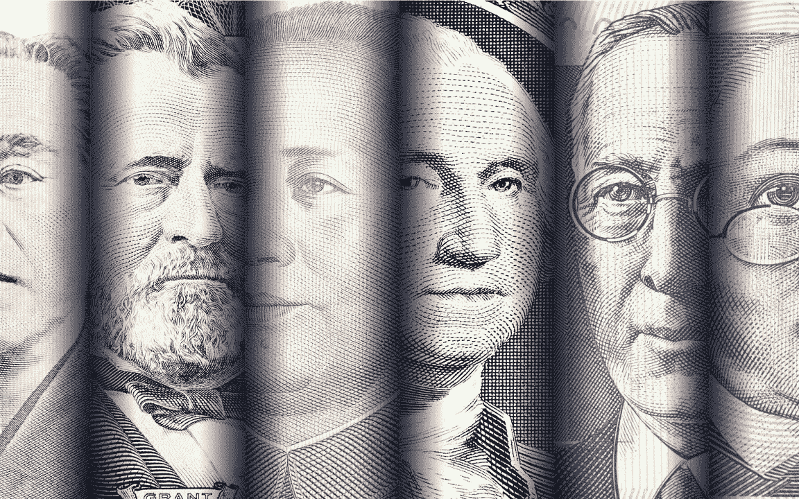

source: midasgoldgroup.com

# 介绍

比特币有可能成为世界储备货币吗？有些人可能会觉得这很荒谬或有趣。然而，历史表明，随着时间的推移，储备货币的地位已经发生了相当大的变化。作为人类，我们决定哪种货币是最有价值的，我们对价值的想法随着时间的推移而演变。

包括我们在内的许多人认为，比特币是有史以来创造的最好的货币形式。要了解原因，请阅读这篇对比特币的深度分析:

[https://medium . com/coin monks/determining-bitcoins-value-with-science-data-d 514 a7 aee 524](/coinmonks/determining-bitcoins-value-with-science-data-d514a7aee524)

因此，相信它有一天可能成为世界储备货币之一并不太牵强。抛开比特币，我们来看看世界储备货币的历史。

# 世界储备货币是什么？

世界储备货币的角色在全球经济中是独一无二的。它是由主权国家、中央银行、银行和大公司用来支持全球贸易、金融和交易的储备货币。自二十世纪初以来，美元一直是当今世界的储备货币，但情况并非总是如此。

# 世界储备货币的兴衰

# 拜占庭固相线:312 年至 1250 年

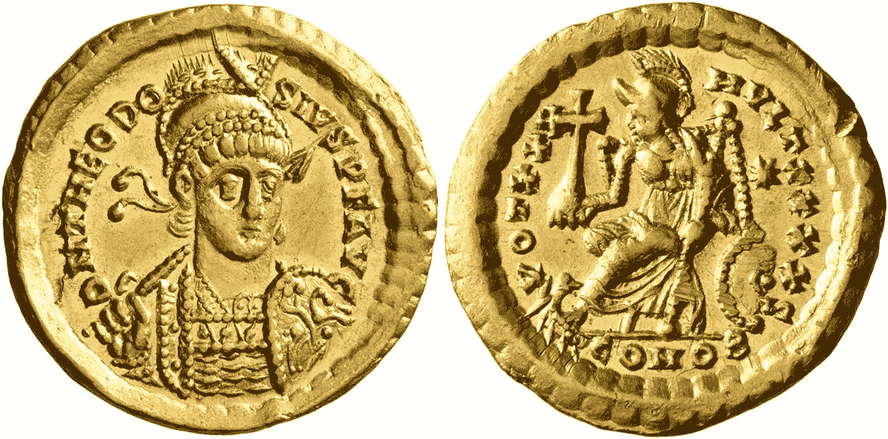

【wikipedia.org】图片来源:T2

拜占庭帝国创造了世界上最受欢迎的储备货币。在近 1000 年的时间里——比美元长十倍——拜占庭货币主导着全球贸易。几个世纪以来，欧洲、地中海、中东以及更远地方的商人都用它来进行贸易。

它被称为 solidus，由君士坦丁一世于公元 312 年首次推出。七个多世纪以来，24k 黄金的重量一直稳定在 4.5 克。因此，它的拉丁名称翻译成“固体”其纯度的持久性在货币史上几乎是前所未有的。

在拜占庭，它是皇权的象征。在当时已知的世界中，它被许多国家的许多君主崇拜和复制，然而没有硬币可以与之匹敌。solidus 是从欧洲到亚洲的主要商业硬币，相当于中世纪的美元。

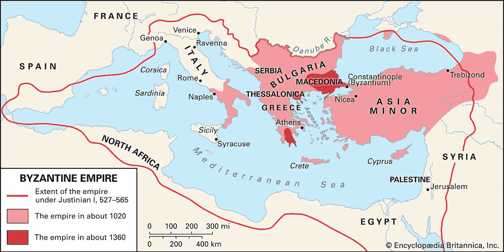

*图片来源:大英百科全书*

**秋天**

solidus 的重量、大小和纯度保持不变，直到 10 世纪，政府开始贬低它。贬值是逐渐开始的，然后迅速加速。几十年间，由于拜占庭帝国难以为多次战争提供资金，黄金的含量几乎为零。

当世界其他地方看着黄金含量直线下降时，他们很快就失去了信心。到那个时候，拜占庭帝国已经是一个空壳，solidus 已经不存在了。

与此同时，意大利的其他王国，尤其是佛罗伦萨和威尼斯，正在繁荣发展。

# 佛罗伦萨弗罗林和威尼斯杜凯特:1250 年至 1450 年

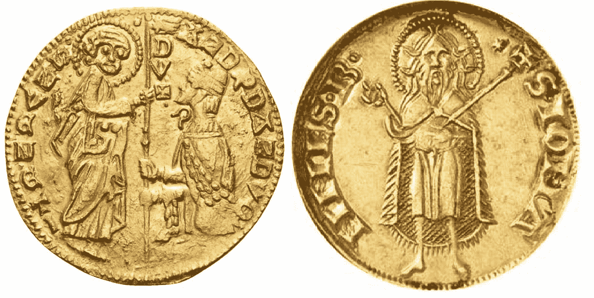

*图片来源:coinworld.com；弗罗林(左)和杜凯特(右)；*

**弗罗林**

当弗罗林在 13 世纪首次铸造时，它迅速扩展到整个西欧，被普遍接受为贸易、债务和会计中使用的硬币。

在许多方面，弗罗林是第一种现代货币。我们当前系统的某些方面可以追溯到那时。比如，现代会计让美第奇银行能够平衡各分行的账户，减少了在整个欧洲大陆转移黄金的需求。

**杜凯特**

在 15 世纪，威尼斯的杜凯特在世界范围内广受欢迎。杜凯特含有超过 99%的纯金，这是当时最高的纯度。

随着威尼斯商人的足迹遍布世界各地，杜凯特成为了国际公认的贸易货币。尽管列奥纳多·达·芬奇不住在威尼斯，法国国王还是付给他威尼斯金币——每年大约 400 金币，相当于今天的 56000 美元。威尼斯硬币在黎凡特、安纳托利亚、黑海和亚得里亚海广泛使用。

达克特和弗罗林可以被视为单一的意大利储备货币。

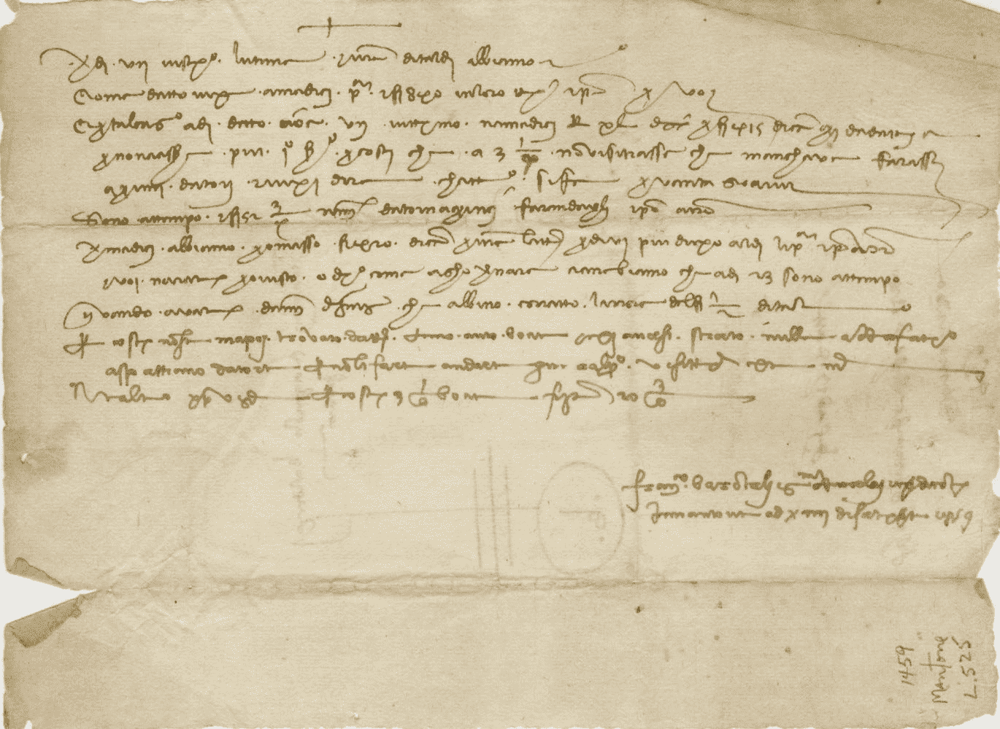

*图片来源:raabcollection 来自文艺复兴时期意大利美第奇银行帝国中心的罕见文件，提到了贷款、信贷和汇率，1459 年。*

**秋天**

在 15 世纪，弗洛林在西欧的许多地方经历了贬值，导致了低等级和高等级弗洛林之间的分裂。贬值的硬币后来被重新命名为“guldens”，而更高等级的金币作为金币重新发行。结果，到 1450 年，杜凯特这个名字包含了大部分以前被称为弗罗林的东西。

然而，随着 16 世纪早期探索时代的到来，ducat 最终被取代。货币中心已经远离意大利，向西迁移。

# 葡萄牙雷亚尔:1450 年至 1530 年

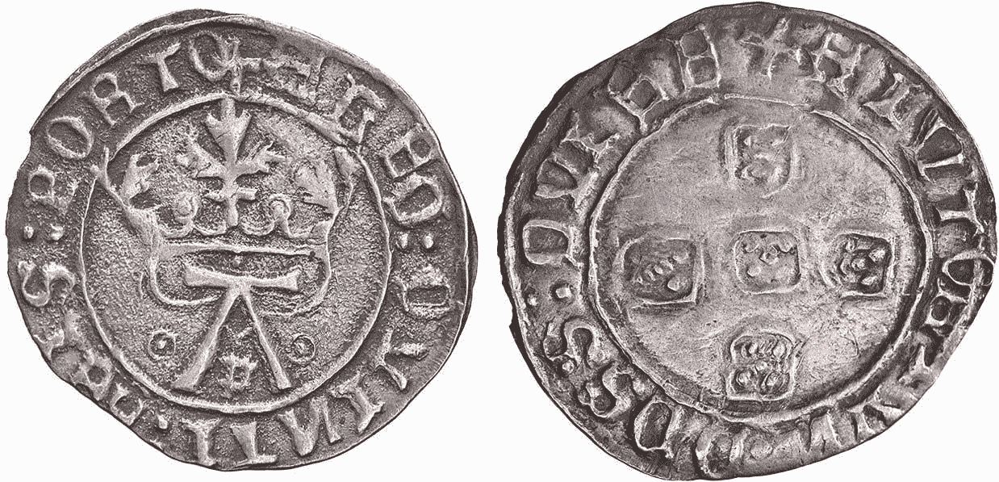

*图片来源:coinweek.com*

由于航海技术的进步，葡萄牙进入了非洲、亚洲的新市场，并最终进入了被发现的美洲，因此葡萄牙成为了一个世界经济帝国。真正的银币是一种天然稀有的重量相当一致的银币。

**秋天**

但由于葡萄牙王位继承问题，西班牙入侵葡萄牙，将两个王国联合起来组成伊比利亚联盟，从而产生了新的世界储备货币。

# 西班牙元(八枚):1530 年至 1640 年

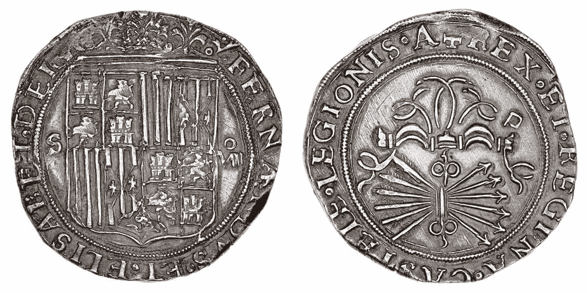

*图片来源:commons.wikimedia.org*

八枚硬币在外国商业中变得如此普遍，以至于直到十九世纪中叶，它们还被视为美国的法定货币。它是在西班牙帝国统治时期铸造的。

这一转变是由一系列重大历史事件促成的。首先，克里斯托弗·哥伦布(Christopher Columbus)在 1492—1500 年间的跨大西洋之旅开启了被称为西欧国家殖民的“新世界”,这是由西班牙资助的。第二，1535 年，新西班牙总督辖区成立。

新西班牙是西班牙帝国的重要组成部分，统治着包括现在的墨西哥、美国西南部的大部分地区和北美洲的加利福尼亚、中美洲、南美洲的北部以及许多太平洋群岛在内的广大领土。

在整个近代早期，它是世界上最强大的帝国之一。

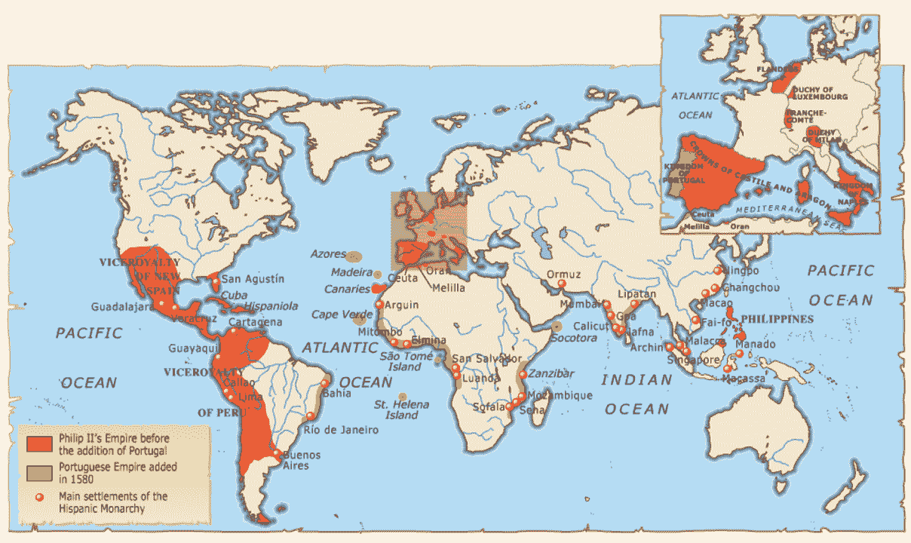

*图片来源:thehistoryofengland.co.uk*

**秋天**

经济上的麻烦引发了西班牙经济的连锁反应，摧毁了它的财富，导致了帝国的长期衰落。

首先，大量的白银最初鼓励西班牙君主积累了大量债务，总是期望它能够通过白银运输及时偿还债务。

第二，荷兰独立战争，通常被称为 80 年战争。正如人们可能预料的那样，在一场 80 年的战争中，有许多起起落落，如西班牙无敌舰队的耻辱，但就我们的目的而言，菲利普三世在 1609 年签署的 12 年休战标志着冲突的第一部分的结束。有了这份停火协议，西班牙实质上承认了荷兰联合省是一个单独的国家，预示着西班牙世界领导地位的终结。

# 荷兰盾:1640 年至 1720 年

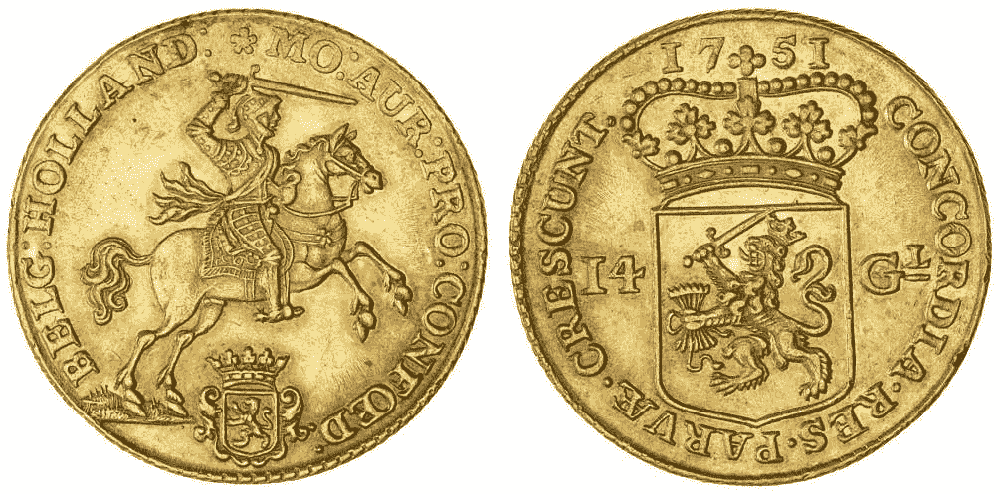

【commons.wikimedia.org】图片来源:T4

当荷兰人在 1581 年获得足够的力量时，他们打败了西班牙人，并从大约 1625 年开始超过西班牙人和中国人成为世界上最富有的帝国，直到他们在 1780 年灭亡。

1602 年，荷兰成立了第一家上市公司(荷兰东印度公司)和第一个股票市场，以及第一个发展完善的贷款机制，使债务更容易产生。许多个人联合贷款并购买盈利企业的所有权。

荷兰的各种投资市场创新吸引了投资者，使阿姆斯特丹成为世界领先的金融中心。

由于这些特点和优势，荷兰帝国变得更加强大，荷兰盾成为黄金和白银之外的世界储备货币，遍布世界大部分地区，其货币得到广泛认可。

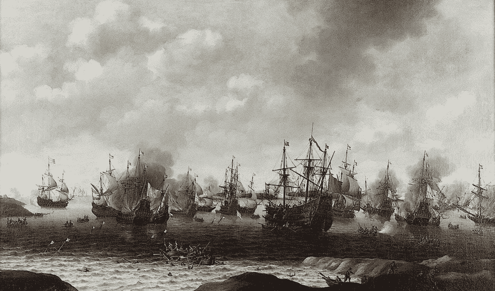

*图片来源:collections.rmg.co.uk*

**秋天**

实力上升的英国人向荷兰人发起挑战，导致了英荷战争。英国在经济和军事上都取得了胜利。荷兰人资不抵债，结果，他们的债务和股权，以及荷兰盾和帝国都崩溃了。

# 法国法郎:1720 年至 1815 年

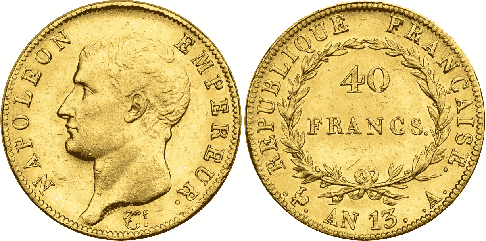

*图片来源:wikipedia.org*

法国殖民帝国的发展，包括海外殖民地、受保护国和从 16 世纪开始受法国管理的委任统治地区，导致了一段时期巨大的政治和经济实力。17 世纪，法国开始在北美、加勒比海和印度建立殖民地。

法国大革命后，拿破仑·波拿巴加冕为法国皇帝，并于 1803 年推出了含有 290.32 克黄金的新金法郎。这种新货币，以及它的化身，被称为“黄金拿破仑”,因其良好的货币地位而广为人知。

在此期间，法郎逐渐成为一种重要的世界性货币。

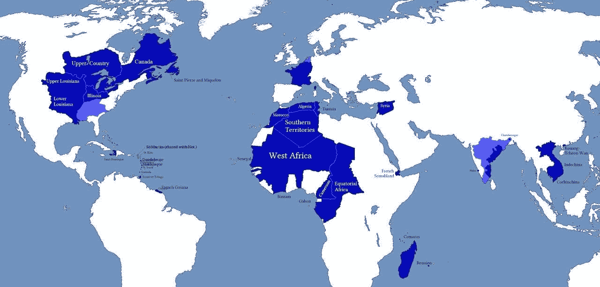

【wn.com】图片来源:T2

**秋天**

在 18 世纪晚期，欧洲内部不同联盟的国家之间发生了很多战争。打败荷兰人后，英国人和他们的盟友继续拿破仑战争，对抗拿破仑指挥的法国人。自法国大革命开始以来，经过近四分之一世纪的持续冲突，英国及其盟友终于在 1815 年取得了胜利。

# 大不列颠英镑:1815 年至 1920 年

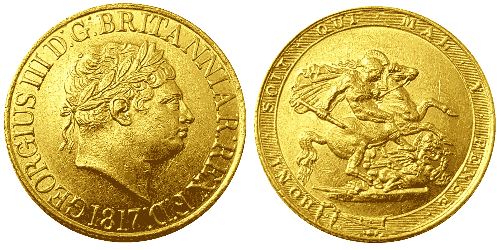

*图片来源:allgoldcoins.co.uk*

战后，战胜国开会建立新的世界秩序。维也纳会议是这次集会的名称。战胜国重新设计了债务、货币和地缘政治体系，并建立了巴黎条约所描绘的新开端。这为英国长达 100 年的“帝国世纪”奠定了基础，在此期间，英国成为无可匹敌的国际力量，英镑成为世界储备货币。

英国人用资本主义的框架来奖励和资助集体劳动。英国东印度公司超过荷兰东印度公司成为世界上最强大的商业力量。自然地，伦敦成为了世界金融中心，并且继续发明金融产品。

从 1870 年持续到 1914 年的创新和富裕繁荣被称为第二次工业革命。

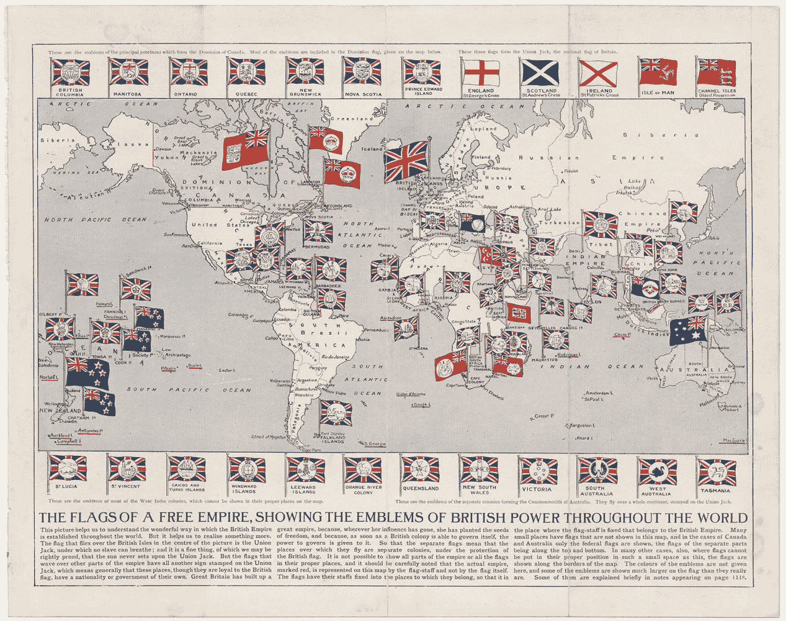

*图片来源:commons.wikimedia.org*

**秋天**

在十九世纪和二十世纪早期，英镑是世界上大多数国家的主要储备货币。当英国在从 1914 年持续到 1918 年的第一次世界大战期间几乎破产时，这一地位结束了。这场冲突的结果是英国变得更加虚弱，对自己的帝国漠不关心。此外，帝国的一些部门为战争贡献了人力和资源，并采取了更加自主的姿态。

# 美元:1920 年至今

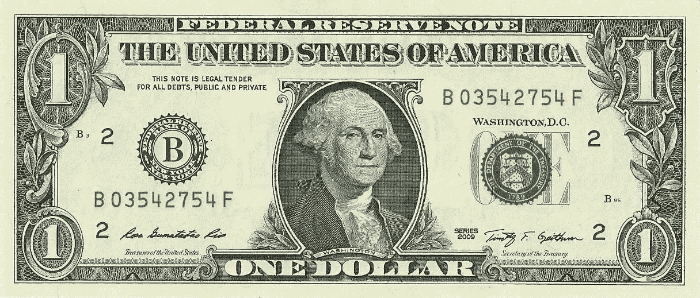

*图片来源:commons.wikimedia.org*

第一次世界大战后，美国和美元崛起为世界储备货币。随着美联储银行的建立，第一枚美元于 1914 年发行。第一次世界大战期间，盟军用黄金向美国支付补给。

第一次世界大战后，战胜国在巴黎召开会议，建立新的世界秩序，这一秩序在 1919 年的《凡尔赛条约》中达到高潮，在该条约中，战败国负债累累，以黄金偿还战争费用。

正如在第一次世界大战中一样，美国在战斗开始后加入了第二次世界大战。参战前，美国是盟国武器和其他产品的主要提供者。大多数国家用黄金支付，导致美国成为世界上最大的黄金持有者。

**布雷顿森林协定**

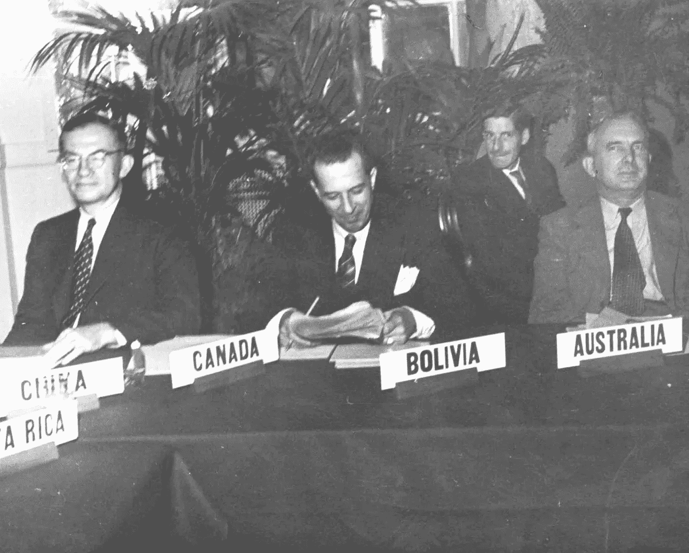

*图片来源:commons.wikimedia.org——sromerobolivia*

1944 年，来自 44 个盟国的代表聚集在新罕布什尔州的布雷顿森林，设计外汇管理系统。该代表团决定，世界货币将不再与黄金挂钩，而是与美元挂钩，而美元与黄金储备挂钩。

**法定货币**

然而，为了控制通货膨胀，防止其他国家将美元兑换成黄金而使经济负担过重，美国在 1971 年放弃了金本位制。美元现在已经成为世界上第一种没有实际黄金或其他任何东西支持的储备货币，世界已经进入了一个法定货币时代。

法定货币是指由政府命令宣布为法定货币的任何形式的货币。一种法定货币纸币，其面值远远超过其商品价值，不能用黄金或白银兑换。

**美元的下跌**

根据美联储的数据，美元占全球贸易的近 60%。当一个国家通过贸易产生大量额外美元时，它通常会将其投资于美国政府债券，通常被称为美国国债。这些产生少量利息，使它们成为一种外国储蓄账户。由于美国国债市场的巨大规模，购买和出售美国国债很容易，价格波动很小。这对美国政府极为有利，因为这有助于它通过向外国出售贷款来为其活动融资，而且国际商业中对美元的持续需求确保了即使大量印刷美元，通货膨胀仍保持相对较低的水平。

然而，这一趋势几十年来一直在转变。

# 1999-2021 年全球货币储备美元

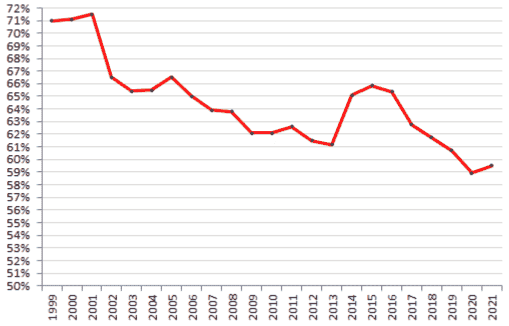

*图片来源:IMF*

如今，基于 GDP 的增长，美国经济出现了放缓的迹象。根据国际货币基金组织 2021 年的官方外汇储备，各国央行的美元储备份额降至 59%，为 25 年来的最低水平。在过去的几十年里，美元的购买力已经急剧下降，这是由于周期性的印钞狂潮以应对经济危机。

由于美元的挣扎和中国等经济强国的崛起，美元在全球市场上开始失去重要性，一些人推动取消美元作为世界储备货币的地位。

此外，最近世界上最大的石油出口国沙特阿拉伯正在考虑接受人民币而不是美元。这一点意义重大，因为将全球石油贸易的一部分转换成人民币可能是巨大的。石油是世界上交易量最大的商品，年贸易额约为 14 万亿美元，大致相当于中国去年的国内生产总值。

正如我们最近在俄乌战争爆发时所看到的，通过贸易、金融和技术限制将美元武器化可能会加速这一转变。美国的战略对手，如中国和俄罗斯，已经在分散对美元资产的投资，这些资产可以被制裁或没收。

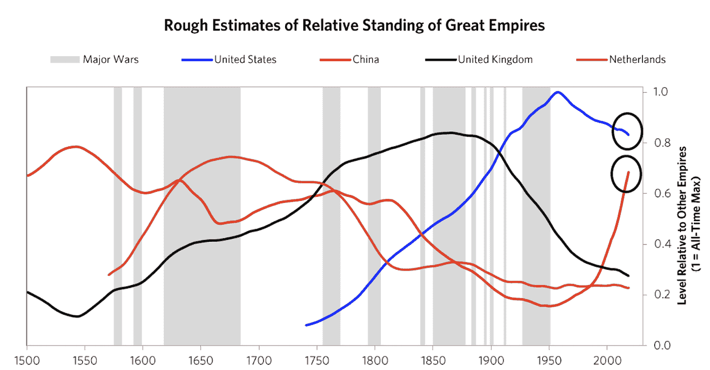

*图片来源:变化中的世界秩序，雷伊·达里奥*

中国正在崛起，已经超过美国成为欧盟的主要贸易伙伴。随着中国预计在 2030 年前取代美国成为名义上的世界最大经济体，一种新的全球储备货币会出现吗？

# 下一个世界储备货币？

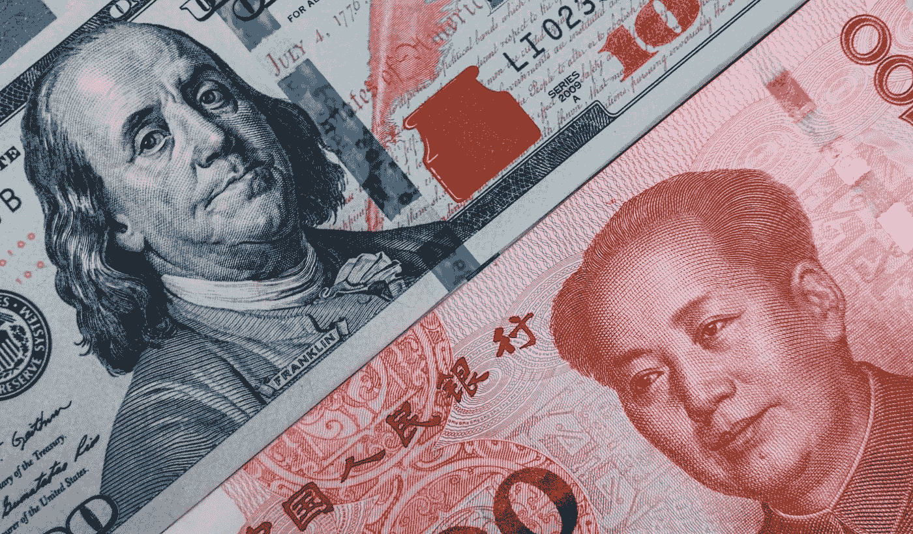

【coindesk.com】图片来源:T4

人民币会成为下一个世界储备货币吗？我们已经看到中国为自己的汇率提供了更大的自由度，逐渐放松了某些资本管制，并开放了新的贷款市场。它鼓励更多的交易，并说服投资伙伴接受人民币作为记账单位、支付方式和价值储存手段，包括外汇储备。它正在开发西方主导的 SWIFT 系统的替代品，以及未来可能国际化的数字人民币。它自己的互联网巨头正在建立大规模的电子商务和数字支付网络，如支付宝和微信支付。

然而，光谈钱是不够的。有多少人完全理解人民币的动态？可能多达国务院的 35 名成员。人民币最大的缺点是缺乏透明度。各国选择美元的主要原因是其稳定性、透明度和信任度。然而，美元远非完美，随着时间的推移，信心正在减弱，但这难道不是我们的最佳选择吗？

# 比特币

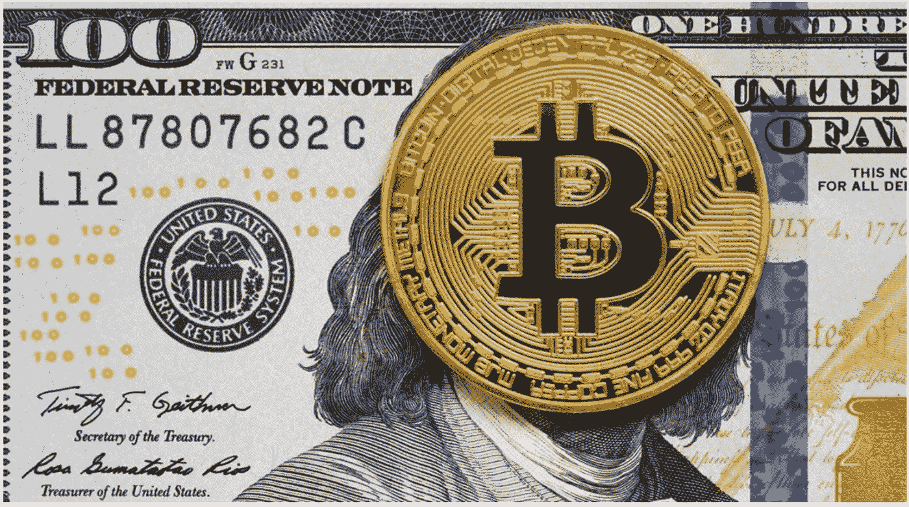

*图片来源:analyticsinsight.net*

比特币在互联网上不再是一种默默无闻的货币。根据纳斯达克 2021 年 10 月的一份报告，比特币已经超过瑞士法郎，成为世界第十三大货币。考虑到比特币仅仅存在了 13 年，这是一个令人震惊的成就。比特币是世界上增长最快的支付网络，年支付交易量超过 3 万亿美元(经济价值)，超过美国运通。

零售、机构、政府、养老基金、房地产投资信托基金和银行都在积聚比特币。

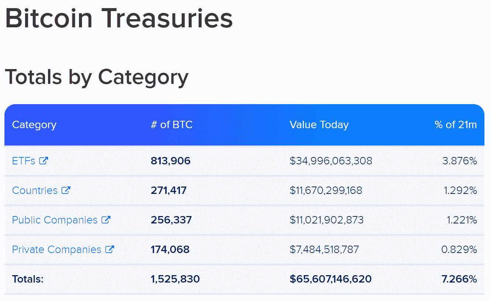

【buybitcoinworldwide.com】图片来源:T2

比特币的潜力是无限的。一只 Satoshi 可能值 1 美元、10 美元或 100 美元，这使得它可以无限扩展。尽管被称为“慢”，但它能够通过使用其第二层扩展技术，即所谓的闪电网络，在参与者网络上提供即时支付结算。

这里需要理解的关键是，与菲亚特不同，比特币从未通过立法强加于人；更确切地说，个人选择与它互动，主要是因为它的免费审查的概念。

自由的概念是这里的基本衡量标准，这就是为什么我们认为人民币不太可能成为世界储备货币。人类正在远离中央集权，对央行的信任度也降到了历史最低点。例如，根据路透社的一项民意调查，66%的英国公民不相信银行会按照社会的最佳利益行事。

即使在政府不支持使用比特币的国家，公民的高接受度也可以迫使政府采取行动。两个显著的例子是尼日利亚和土耳其。

草根公民的采用正在世界各国获得关注。

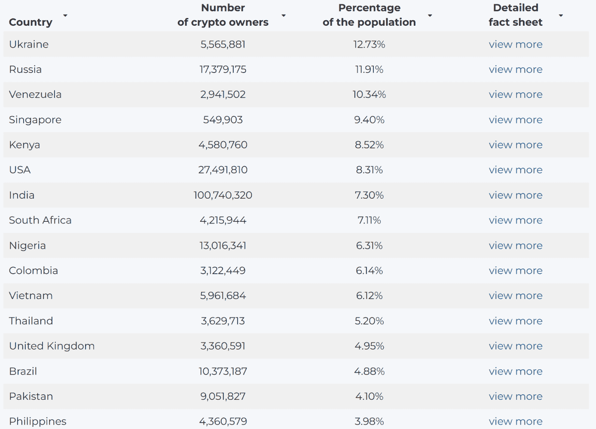

*图片来源:triple-a.io*

汇率操纵也多次成为全球货币市场的一个主要问题。政府定期将本国货币相对于其他货币贬值，以获得相对于其他国家的竞争优势。

# 摘要

历史明确证明，没有什么是永恒的，认为美元是不可战胜的是幼稚的。技术正在改变我们的整个文明。

使用像比特币这样的中性货币作为全球储备将不会留下多少操纵的空间，为所有国家培育一个更加公平和富有成效的金融体系。

事实是，我们没有人知道未来会发生什么，但我们知道，几千年来，历史已经废黜了无数帝国及其储备货币，这种情况还会再次发生。

*免责声明:本文包含的信息仅用于教育目的，并不构成 Wheatstones 的任何形式的建议或推荐，用户在做出(或避免做出)任何投资决定时也不打算依赖这些信息。*

> 加入 Coinmonks [电报频道](https://t.me/coincodecap)和 [Youtube 频道](https://www.youtube.com/c/coinmonks/videos)了解加密交易和投资

# 另外，阅读

*   [CoinDCX 评论](/coinmonks/coindcx-review-8444db3621a2) | [加密保证金交易交易所](https://coincodecap.com/crypto-margin-trading-exchanges)
*   [红狗赌场评论](https://coincodecap.com/red-dog-casino-review) | [Swyftx 评论](https://coincodecap.com/swyftx-review) | [CoinGate 评论](https://coincodecap.com/coingate-review)
*   [Bookmap 评论](https://coincodecap.com/bookmap-review-2021-best-trading-software) | [美国 5 大最佳加密交易所](https://coincodecap.com/crypto-exchange-usa)
*   [如何在 FTX 交易所交易期货](https://coincodecap.com/ftx-futures-trading) | [OKEx vs 币安](https://coincodecap.com/okex-vs-binance)
*   [CoinLoan 评论](https://coincodecap.com/coinloan-review) | [YouHodler 评论](/coinmonks/youhodler-4-easy-ways-to-make-money-98969b9689f2) | [BlockFi 评论](https://coincodecap.com/blockfi-review)
*   [XT.COM 评论](https://coincodecap.com/profittradingapp-for-binance) | [币安评论](https://coincodecap.com/xt-com-review)
*   [SmithBot 评论](https://coincodecap.com/smithbot-review) | [4 款最佳免费开源交易机器人](https://coincodecap.com/free-open-source-trading-bots)