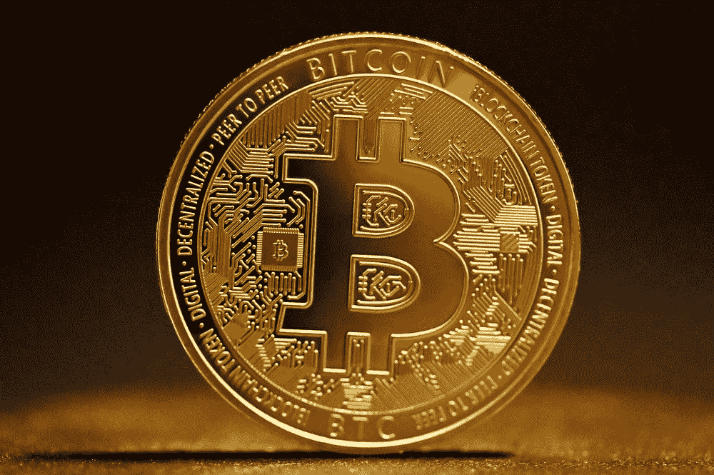

# 比特币:现实的反面

> 原文：<https://medium.com/coinmonks/bitcoin-the-opposite-of-reality-8da8b4c295bc?source=collection_archive---------28----------------------->

## 给加密爱好者一句话:没有内在价值、只受价值感知影响的无担保资产被恰当地称为“投机性的”。从各种理性的标准来看，投资一个密码与赌博没什么不同。

