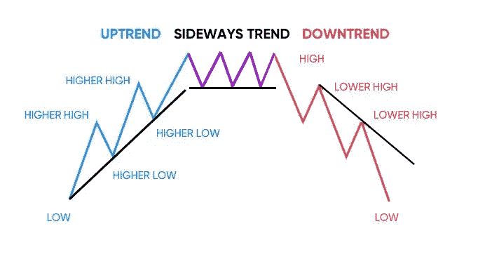

# 比特币:横盘交易的痛苦

> 原文：<https://medium.com/coinmonks/bitcoin-the-pain-of-sideways-trading-f7f29257f24d?source=collection_archive---------40----------------------->

在我看来，图表是浪费时间。我不相信交易者是聪明的。除了过去发生的事情，我不相信这张图表能告诉我们任何事情。过去发生的事情与未来发生的事情基本上是随机相关的。(只是我的看法)。

每当比特币和加密技术横盘交易时，Twitter 上的人都会竭力反对。如果你是成本均线的粉丝，你应该喜欢横向交易，但你不喜欢。如果你是交易者，你肯定讨厌横向交易。

为什么我要分享这个？嗯，我认为比特币价格最有可能的情况是在未来 2-4 个月内横向波动。在这次整合之后，我的直觉是我们会跌到 23，000 美元。我可能是错的，但考虑到下一个减半的时间(不到 2 年)，横向和向下将是有意义的。

人们喜欢加密，因为它令人兴奋。他们希望价格一直波动很大。随着波动性而来的是作为交易者获利的能力。当不存在波动性时，人们会感到无聊，多巴胺的冲击消失了，散户中的 ban wagon crypto 粉丝会去寻找其他事情来消磨时间。

2-4 个月的盘整期将使我们在 9 月份左右开始下一次重大调整。我仍然认为一些散户投资者在短期内过于乐观，这些散户投资者的投资损失还不够多。这就是为什么我认为向下移动是可能的。如果比特币在横盘交易后下跌 25%，我预计大部分替代币将下跌 50%左右。这将导致散户投资者从 Solana 或 Matic 等代币的高点下跌约 95%。我认为我们需要到那里来一次真正的大换血。

如果你像我一样做多，那么你可以接受中短期价格下跌。事实上，因为我相信这种情况会发生，我正在挑战自己，让自己比以前买得更少。这将使我的购买量更大，并有望与价格下跌趋势保持一致。举个例子，对于比特币，3 万美元以下我爱死了。如果能买几枚 20，000 美元左右的硬币就太好了，但如果我买不到，那也没关系。

对我来说，间隔购买对我来说更重要。例如，我想在 2024 年之前拥有大约 1500 辆 SOL。我认为这对我来说很现实，但如果 SOL 跌到我认为的 25 美元，我会更快到达那里。我知道替代币会跌得多快多低，所以我认为在 5 月份最后一次下跌中买了很多之后，我可以后退一步，等待更低的价格。

如果我错过了更低的价格，我将不得不忍受，这是我完全接受的事情。这将意味着价格上涨，无论如何我都会赢，因为我已经打包好行李了。然而，如果价格横向交易，然后下跌，我将能够为我的 DCA 购买获得 30-50%以上。

这不是财务建议。我不知道会发生什么。我只是在解读宏观环境，并认为存在足够的不确定性，高度投机的替代硬币在未来可能会上涨 50 倍，但首先会再下跌 50%。

> 加入 Coinmonks [电报频道](https://t.me/coincodecap)和 [Youtube 频道](https://www.youtube.com/c/coinmonks/videos)了解加密交易和投资

因此，当我谈到替代硬币时，我会提到一些较小的硬币，但主要的替代硬币是以太坊。在我看来，这是 Altcoins 的必然赌注，如果它挑战 1000 美元的范围，我会尽可能多地购买。我认为最低可能在 750 美元左右。在这些水平上，我认为 SOL、Matic、Link 和 Aave 的替代价格将处于历史低点，在下一轮牛市中可能会上涨 25-50 倍左右。

对于那些愿意等待和耐心的人来说，将会有巨大的回报。它可能要到 2024 年或 2025 年才会到来，所以关键是不要过度举债或在未来 3-6 个月花掉你需要的钱。如果你这样做，你将被迫卖出，错过下一波大的上涨。

我的第一名是比特币。我的 2 号是以太坊。其他这些都是投机和我对低市值资产的渴望，这些资产可能会产生超高的回报(否则我的钱会化为乌有)。

这绝不是财务建议。祝你好运！！#CryptoZenn