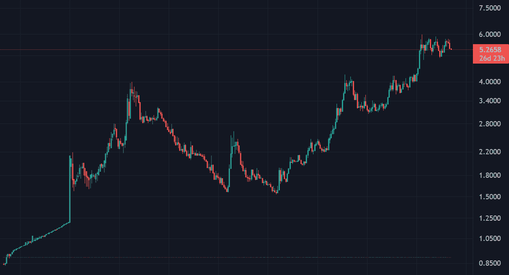
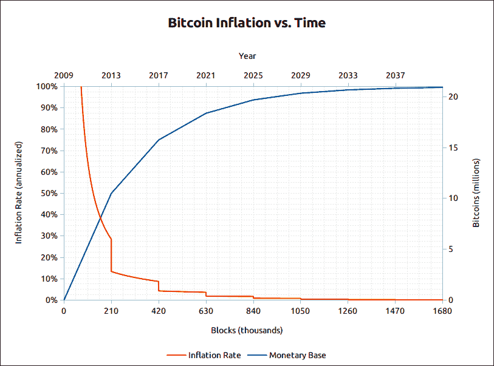
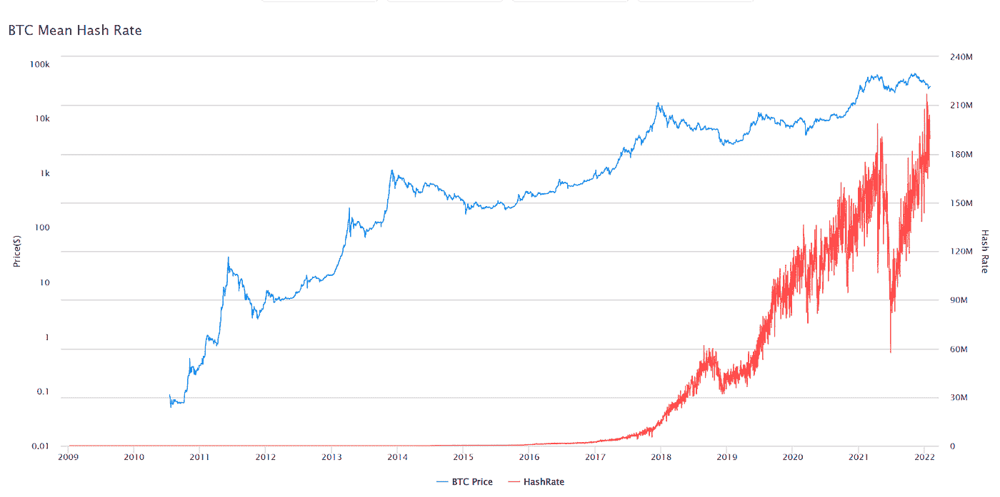
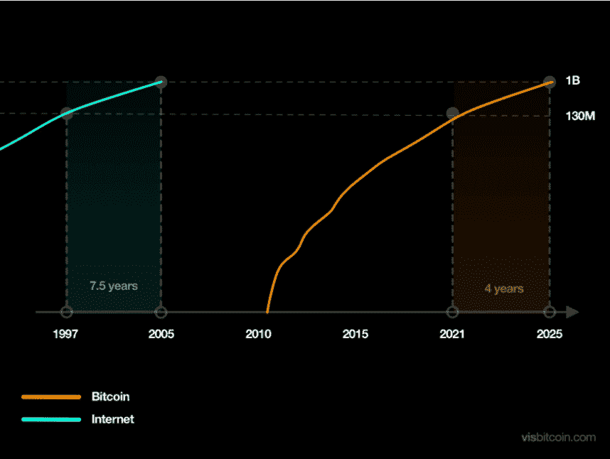
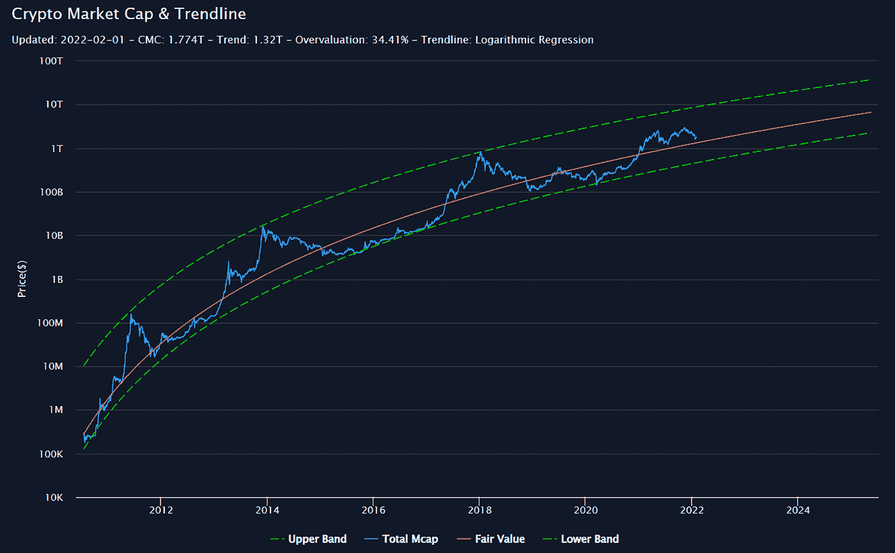
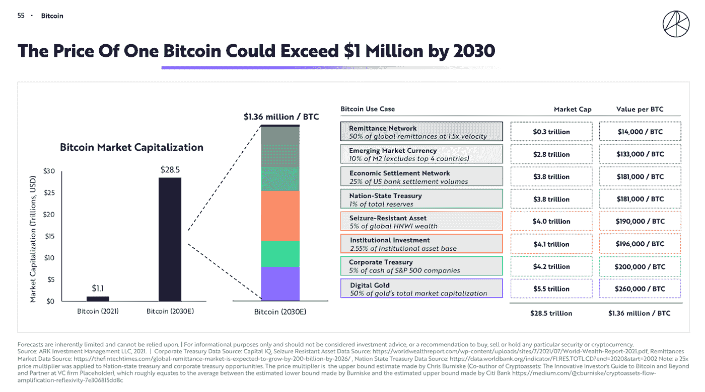
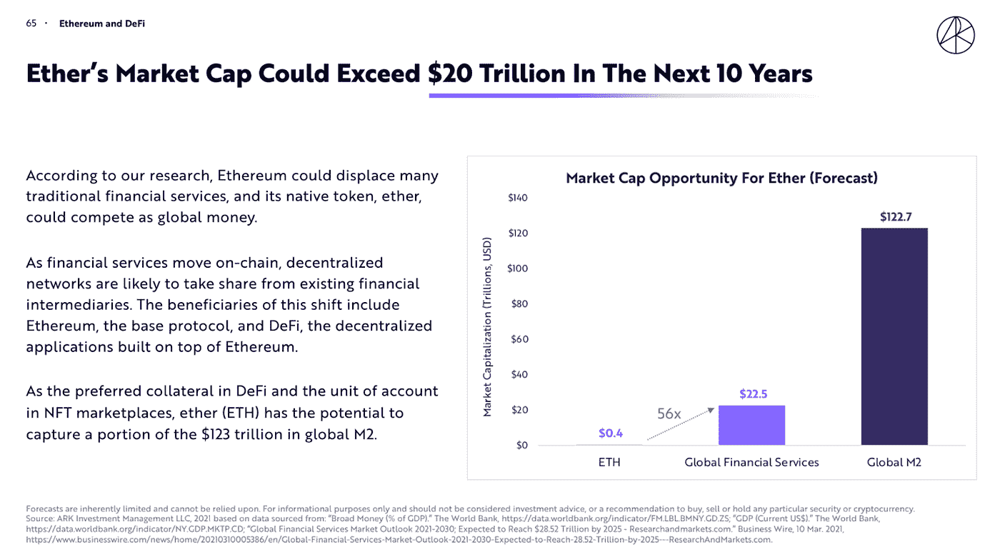
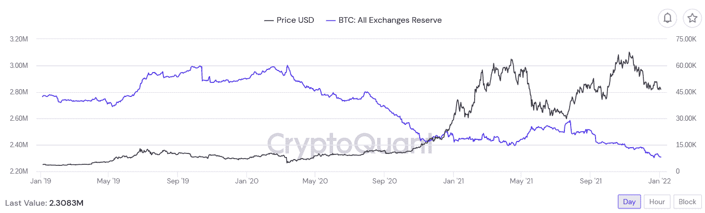
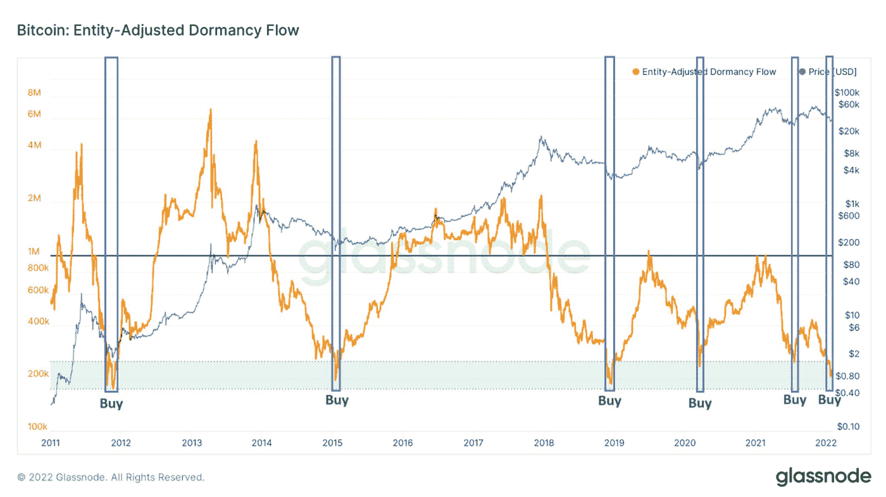

# 比特币思维 VS 菲亚特思维

> 原文：<https://medium.com/coinmonks/bitcoin-thinking-vs-fiat-thinking-29d10aa7857c?source=collection_archive---------4----------------------->

## 一个记账单位能给你的财富管理带来的不同。

```
***Disclaimer****: Nothing here is financial advice. It's just free information, data and my own thoughts. My goal here is to share knowledge, lessons and foster healthy debate. Do your own research and make your own financial decisions.*
```

# **法定思维:使用法定货币的记账单位**

在开始研究更多的经济学后，我开始明白一些事情，因为当今世界生活在一个货币标准中，自 1944 年布雷顿森林协定以来，美元一直是价值储存手段(自 1971 年该协定破裂以来，没有黄金支持，也称为尼克森冲击)，以及所有全球交易和购买的记账单位(得到了[石油美元](https://www.investopedia.com/terms/p/petrodollars.asp#:~:text=Petrodollars%20are%20U.S.%20dollars%20paid,and%20those%20that%20produce%20it.)计划的大力支持)。因此，任何用其他法定货币计算财富积累的**都是一种幻想，是浪费时间。**

由于我出生并在巴西度过了大半辈子，我习惯于用巴西雷亚尔(BRL)来计算我的净资产，但在了解了我们目前生活的美元本位制之后，我意识到我所做的事情根本没有任何意义。自 1971 年以来，由政府信念支持的法定货币一直是一项实验，从历史上看，较弱的货币(来自新兴国家和政治经济更不稳定的国家)贬值更快，通胀更高，而且(任何)通胀数据都非常不精确，无法通用于衡量货币购买力的损失。最重要的是，目前的通胀数据似乎没有很好地考虑汇率变化。

你最多应该计算你的开支和应急储备，但对于长期储蓄来说，不使用美元作为记账单位将是一种幻想(更不用说疯狂和/或短暂的记忆——似乎许多人已经忘记了 20 世纪 80-90 年代巴西的恶性通货膨胀…)。



Source: [Tradiginview. USD/BRL chart](https://www.tradingview.com/symbols/USDBRL/) since BRL's creation in 1994.

根据定义，由于通货膨胀，法定货币趋于零，一些法定货币将比其他货币更快地失去购买力(这种购买力永远不会回来)。法定货币是一种“数字下降”的技术，也是一种可怕的价值储存手段。

> **→练习 1:美元作为记账单位(适用于非美国居民)。**
> 
> 计算近年来你以美元计算的净资产相对于你所在国家(如果不是美国)货币的年复一年的变化，来理解我所说的一点点。
> 
> 你做了提议的练习了吗？你注意到了什么？

# **比特币思维:使用比特币的记账单位——“升数技术”**

比特币区块链(或时间链)上每~10 分钟会产生新的区块，这种情况会一直持续到~2140 年，这时最后一个包裹(1 satoshi1 比特币= 100，000，000 satoshis)的 2100 万个比特币(这个数量是不可变的，即[绝对稀缺性](https://www.nasdaq.com/articles/bitcoins-price-rises-rapidly-due-to-absolute-scarcity-2021-09-05))并且系统将从**在每减半时降低通胀到零通胀**。

大约每 4 年发生一次，减半的影响基本上是这样的事实，在一定数量的区块后，矿工的奖励下降了一半。



Source: [bitcointalk.org forum — posted on December 13th 2012](https://bitcointalk.org/index.php?topic=130619.0).

除此之外，还有根据比特币矿工人数进行的难度调整(结合有限的供应，我们有了[数字上升技术](https://www.ministryofnodes.com.au/what-is-number-go-up-technology#:~:text=Number%20Go%20Up%20Technology%20refers,price%20of%20Bitcoin%20going%20up.))。矿工越少，开采新区块就越容易(即消耗的能源越少，所需的计算能力也越少)，相反的情况也会发生，这是 13+年来一直在发生的事情。

值得一提的是，最近比特币网络达到了 hashrate 的历史峰值，这告诉我们，网络从未如此安全，今天也从未有如此多的矿工愿意花费精力来保持网络的强健和安全，并获得新的比特币。从历史上看，hashrate 的增长是价格增长的延迟指标。



Note: The big +50% drop in hashrate in mid-2021 was when China banned bitcoin transactions and mining in the country. A few months later, miners relocated to other countries with cheap energy, as expected.

问题是，比特币仍处于价格发现和全球采用阶段。2021 年，加密货币在全球的采用率出现了 [880%的跃升，据估计，世界人口中有 2.5%到](https://blog.chainalysis.com/reports/2021-global-crypto-adoption-index/)[到 3.9%的人对这种资产类别](https://triple-a.io/crypto-ownership/)(比特币目前占其资产类别的[~ 42%](https://coinmarketcap.com/charts/))有某种形式的敞口，顺便说一下，其价格与比特币的价格直接相关，比特币是这个市场中的“国王”。预计在 [2025](https://bitcoinist.com/how-bitcoin-adoption-rate-is-beating-the-internet/) 和 [2027](https://cryptoslate.com/internet-vs-crypto-adoption-chart-predicts-1-billion-users-by-2027/) 之间，以比特币为首的加密货币将覆盖 10 亿人:



[Source](https://bitcoinist.com/how-bitcoin-adoption-rate-is-beating-the-internet/)

有趣的是，加密货币市场的市值约为 1.8 万亿美元，最近的峰值约为 3 万亿美元。根据金融分析师和 YouTuber [Benjamin Cowen](https://www.youtube.com/channel/UCRvqjQPSeaWn-uEx-w0XOIg) 的预测，2025 年 2 月的公允价值预测(基于价格演变和市场参与者的行为)将约为 6 万亿美元，最低预期值为 2 万亿美元，最高为+33 万亿美元。



Source: Youtuber and financial analyst [Benjamin Cowen](https://www.youtube.com/channel/UCRvqjQPSeaWn-uEx-w0XOIg).

根据最近来自 [ARK Invest](https://ark-invest.com/) (首席执行官 [Cathie Wood](https://en.wikipedia.org/wiki/Cathie_Wood) )的 Big Ideas 2022 报告，他们的预期是比特币和以太(以太坊网络的标志，最广泛采用的智能合约平台和拥有更多开发者的区块链——以及来自“Web3”的预期基础协议)的资本化分别为 28.5T 美元和 20T 美元，这将使 1 **BTC 的价格= 136 万美元和 1 ETH =+167，000 美元**(不考虑)



Source: ARK Invest report — Big Ideas 2022.



Source: ARK Invest report — Big Ideas 2022.

火上浇油的是，在 2020/2021 年央行纾困和全球通胀最近没有任何迹象表明会很快结束之后，加密货币交易所可供出售的比特币数量几个月来一直在急剧下降…



Source: [CryptoQuant](https://cryptoquant.com/).

更糟糕的是，在 2022 年 2 月 1 日这一周，比特币正处于其历史上最超卖的时刻之一:



Sorce: [Glassnode](https://glassnode.com/) (chart by @ [WClementelll](https://twitter.com/WClementeIII/status/1488201437440094213?cxt=HHwWisC9jdLUk6cpAAAA))

> **→练习 2:比特币作为记账单位。**
> 
> 所以我打算提出另一个练习:再次计算你的净资产在这些年里的变化，但这一次，用比特币作为记账单位。
> 
> 你认为这个练习怎么样？这些年来，你的购买力(以比特币数量衡量)发生了怎样的变化？

如果比特币(或任何其他表现优于比特币的资产——持续超过+13 年，没有)，它不是你投资组合中最大的部分，特别是在投机泡沫时期(历史上在减半后不久，有明显的供应冲击)，你肯定会在这些年里急剧失去购买力(以比特币衡量)。

虽然过去的行为不能保证未来的行为，但我们几乎 100%确定，每 10 分钟就会有一块比特币被放入系统进行验证，它将奖励你的矿工的工作和能源使用。2100 万台。[绝对稀缺](https://www.nasdaq.com/articles/bitcoins-price-rises-rapidly-due-to-absolute-scarcity-2021-09-05)。

> **→练习 1 和练习 2 的教训:菲亚特思维 vs 比特币思维**
> 
> **在加密货币市场兴高采烈的时候，开始用法定货币(最好是美元)来思考和看待你的投资组合，平衡你的投资组合。**
> 
> **在加密货币市场极度恐惧的时刻(就像现在)，开始用比特币来思考和看待你的投资组合，并继续累积 sat。**

```
***IMPORTANT****: If you want to maximize your returns on the short term (if the fundamentals remain the same, the* [*Bitcoin price in any fiat currency will go up forever*](https://seekingalpha.com/article/4464678-bitcoin-going-up-forever-stablecoins-might-become-strong-competitor)*), you should consider external macroeconomic factors. If they remain the same, the logic above has held up for many years and has worked well. However, there are still many uncertainties (short term) such as: 1- Is Covid19 over?; 2- How much will the FED raise interest rates in 2022?; 3- When will the FED's tapering policy start (stop buying assets to prevent market crashes) and how aggressive will it be?*
```

# **最后的想法**

我们生活在一个以美元为世界储备货币、记账单位和主要交易媒介的标准中，但随着通货膨胀的加剧和对中央银行(不仅是美国，而是全球)信任的下降，它作为价值储存手段的地位日益动摇，这促使比特币的故事变得越来越强大，不仅有越来越多的公司将比特币加入他们的资产负债表，而且在 2021 年，我们有了第一个将比特币作为合法货币的国家:[萨尔瓦多](https://cointelegraph.com/news/el-salvador-how-it-started-vs-how-it-s-going-with-the-bitcoin-law-in-2021)。下一个会是哪个国家？

法定货币被设定为随着时间的推移而贬值，有些贬值比其他货币更快。另一方面，比特币拥有绝对已知的新币供应(其协议是不可变的)，而交易所出售的“旧”币供应几个月来一直在急剧减少。

除此之外，我们知道，目前全球约有 2.5%至 3.9%的人接触到加密资产，其中 42%是比特币。这种货币网络和其他区块链(新的叙述是 Web3 的构建，这是另一个帖子)的技术和采用继续快速增长，其采用速度大约是互联网的 2 倍。

在这篇文章的结尾，我想给你一些思考:随着时间的推移，你对比特币的购买力是增加了还是减少了？如果它随着时间的推移而减少，并且趋势仍然明显，那么在管理您的投资和审查您一直用来实现财务成功的策略(根据这些繁荣和萧条周期之间的市场时机和投资组合配置)时，重新考虑您的账户单位可能是明智的…

[历史上最大的财富转移](https://ambcrypto.com/bitcoin-the-great-wealth-transfer-might-be-coming-sooner-than-expected/)已经开始，而且应该比许多人想象的更快发生，转移发生在那些没有也不相信比特币的人(*无币者*)和那些拥有并继续积累比特币的人(*比特币者*)之间。

```
***Disclaimer****: Nothing here is financial advice. It's just free information, data and my own thoughts. My goal here is to share knowledge, lessons and foster healthy debate. Do your own research and make your own financial decisions.* 
```

加入 Coinmonks [电报频道](https://t.me/coincodecap)和 [Youtube 频道](https://www.youtube.com/c/coinmonks/videos)了解加密交易和投资

## 也阅读

[](/coinmonks/leveraged-token-3f5257808b22) [## 杠杆代币[多头代币]终极指南

### 杠杆化令牌是具有杠杆化风险敞口的 ERC20 令牌，不考虑保证金、要求、管理…

medium.com](/coinmonks/leveraged-token-3f5257808b22) [](https://coincodecap.com/crypto-exchange) [## 最佳加密交易所| 2022 年十大加密货币交易所| CoinCodeCap

### 哪一个是最好的加密交换？在本文中，我们将根据多种加密货币列出 10 大加密货币交易所

coincodecap.com](https://coincodecap.com/crypto-exchange) [](https://coincodecap.com/best-swap-platforms) [## 2022 年最佳加密交换平台| CoinCodeCap

### 随着时间的推移，我们大多数人将转向 dex 以获得更好的安全性和隐私。因此。在这里，我们将讨论…

coincodecap.com](https://coincodecap.com/best-swap-platforms) [](https://coincodecap.com/best-online-casinos) [## 10 大最佳在线赌场|赢得并赢取免费 BTC 2022 | CoinCodeCap

### 接收、支付和赚取加密货币| |有各种各样的最佳在线赌场可供选择，有可能…

coincodecap.com](https://coincodecap.com/best-online-casinos) [](/coinmonks/top-5-crypto-lending-platforms-in-2020-that-you-need-to-know-a1b675cec3fa) [## 2021 年最佳加密借贷平台| 6 大比特币借贷平台

### 获得比特币和其他加密货币的最佳贷款利率

medium.com](/coinmonks/top-5-crypto-lending-platforms-in-2020-that-you-need-to-know-a1b675cec3fa) [](/coinmonks/the-best-cryptocurrency-hardware-wallets-of-2020-e28b1c124069) [## 2021 年 6 大最佳硬件钱包|顶级加密硬件钱包[更新]

### 最好的加密货币硬件钱包是绝对必要的。我们将在 NGRAVE、Ledger Nano X 和…

medium.com](/coinmonks/the-best-cryptocurrency-hardware-wallets-of-2020-e28b1c124069) [](/coinmonks/crypto-trading-bot-c2ffce8acb2a) [## 加密交易机器人——19 款最佳免费加密交易机器人

### 2022 年币安、比特币基地、库币和其他密码交易所的最佳密码交易机器人。四进制，位间隙…

medium.com](/coinmonks/crypto-trading-bot-c2ffce8acb2a) [](/coinmonks/best-crypto-signals-telegram-5785cdbc4b2b) [## 最佳 4 个加密交易信号电报通道

### 这是乏味的找到正确的加密交易信号提供商。因此，在本文中，我们将讨论最好的…

medium.com](/coinmonks/best-crypto-signals-telegram-5785cdbc4b2b) [](https://coincodecap.com/bitsgap-review) [## Bitsgap 评论-交易机器人加密信号和套利 2022

### 这篇文章的重点是 Bitsgap 审查，这是一个最终的交易解决方案，并提供交易机器人，信号…

coincodecap.com](https://coincodecap.com/bitsgap-review) [](https://coincodecap.com/best-telegram-channels) [## 40 个最佳电报频道，用于加密、电影、表演和演讲| CoinCodeCap

### 免费下载所有电影。德国免费加密信号。下载讲座。CoinCodeCap 经典，网飞电影等。是……

coincodecap.com](https://coincodecap.com/best-telegram-channels)