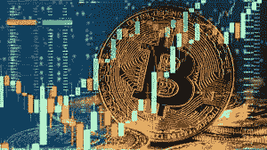
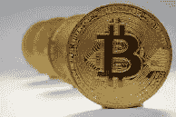
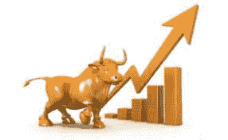
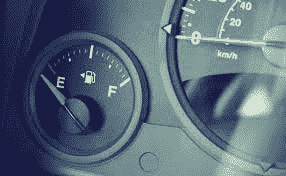

# 比特币到 10K。觉得我疯了？让我告诉你为什么我可能不是！

> 原文：<https://medium.com/coinmonks/bitcoin-to-10k-think-im-crazy-let-me-show-you-why-i-might-not-be-a979ccc22f6d?source=collection_archive---------19----------------------->

**价格预测**

和往常一样，价格预测和技术分析都是基于别人的想法。我不会草率地说这将会发生，但这就是为什么我认为我们会低于目前的价格约 30，000。然而，我也要说，我用了一些数学知识，还有一张我自己做的图表。请随意做你自己的研究，提出你自己认为的想法。这不会伤害我的感情，但这是未来几周或几个月可能会发生的事情的想法。

**历史心理**

当我们作为投资者或交易者考虑进入一个我们不能 100%确定的或新的事物时，我们都有担心。然而，我们可以看看人类在过去做了什么，并对未来可能发生的*有所了解。我们作为动物是懒惰的。我们喜欢走阻力最小的路，我们倾向于让别人来决定我们在图表中“看到”什么。你现在可能正在读这篇文章的原因之一是，你在问自己“这个人知道他在说什么吗”，并试图证明自己什么时候应该投资。所以正如我所说的，我们作为人类喜欢看别人在做什么，看看这对我们是否有意义。很多时候，交易对我们来说就是这样，我们希望看到简单的方法来做事，然后我们继续这样做。*

*所以，通常当有一个支持或阻力区域时，那是因为其他人和大机构实际上**制造了**那个区域，在我们看来，这是一个我们应该关注的区域。所以当我们继续的时候，我希望你能听到我说的话。我不是说这将会发生，但是我在这里是为了让你思考问题，从更大的角度看问题。*

**

***让我们看看过去——2017 年——比特币** 当我们回顾过去时，我们往往会开始注意到不同的事情开始出现在图表上，让我们想知道这样的事情是否会再次发生。如果我们回到 2017 年 6 月，我们会注意到我们有一个约 3000 点的高点。这下降了大约 50%,回到了 1775 年左右。从这一点来看，我的猜测是，每个对比特币有点兴趣的人都想在 50%的回调中买入，所以他们这样做了。公司开始谈论比特币，从那时起，比特币的价格上涨了近 180%，接近每枚 5000 英镑。从那以后，有一个大约 40%的较小的回调，再次回到 3000 左右，然后就是价格爆炸到每枚硬币 20000 左右。因此，在 2017 年末，比特币从每枚 3000 英镑左右一路飙升至 2 万英镑。这几乎是 570%的增长。*

**

***寒冷的一年——2018 年***

*如果我们继续看过去教给我们的东西，那就是底部可能在任何时候掉下来。它不需要告诉你它正准备发生，它不需要有一个理由，它完全基于大量的人想要做什么。2018 年，比特币开始极高，并从每个人的 ATH 下跌，但出现的问题是，当它开始下跌时，没有理由“停止”。在接下来的一整年中，该指数继续下行，最终跌至 3000 点左右的另一个低点。也就是说，在 365 天内下降了约 80%。这是一个疯狂的想法，实际感受，了解和理解。然而，这是新的开始。*

**

***开始重新抬头— 2019***

*2019 年初，我们一直在 3000 点附近徘徊。这是年初的时候。再说一次，我们都在体验新的东西。有人以 16k、17k、20k 的高价买入比特币，结果比特币价格暴跌至 3000 左右。这对许多人来说是毁灭性的，它证明了 crypto 可以多么容易地摇摆以及非常不可饶恕。随着这一运动，许多人准备回购并继续“收拾行李”，正如我们许多人在密码世界中所说的那样。当这些人收拾行李时，比特币的价格开始上涨，到 2019 年年中，我们再次看到 14000 的价格。*

**

***给火箭飞船加满油！— 2020 年***

*在我们达到 14k 后，我们在 2020 年初回落到 4000 左右。当这种情况发生时，我认为人们意识到我们已经达到了 20k，在大约 4k 时，人们意识到他们可以投资，至少可以将他们的投资翻倍。所以他们投资，收拾行李，把自己绑在座位上。几乎没有人知道我们会给火箭飞船加满油，直到年底达到 40，000，然而，油还没有用完。*

**

***为了射出一支箭，你需要先把它拉回来。-2021 年***

*2021 年初，我们看到了从 40k 到 30k 的回落，然后我们再次在加油站停下来，加满油，然后我们出发了。到了 4 月份，我们回到了 64k，然后到了 5 月份，消息传出后，我们一路跌回了 30k。然后有人收拾了行李，我们回到了 68k 和另一个 ATH。*

*数学很有趣！— 2022 年及以后！*

*再说一次，我不希望你坐在这里，认为我告诉你这将会发生。很多时候，人们有一些额外的钱，他们会等待，看看到底发生了什么，并确保在疯狂的事情发生时参与行动。让我们看看我们的数字。如果我们从大约 3，000 人一路增加到 20，000 人，大约增加了 6.6 倍。如果我们从 20，000 一直下降到 3，000，那将下降大约 85%。从 3，000 到 65，000，增长了大约 21 倍。现在， ***如果我们再跌 80%***那我们就又要跌到 10k 左右了。我认为它会发生吗？也许不会，但它会发生吗？是的，非常可能。*

*同样，我写这篇文章的原因是，如果你正在看这些价格，确保你随时准备好回调。看到大亏会让人恶心，但是回报可能很丰厚！*

*今天就注册，参与一些交易！*

*YouTube 上的 grid bot Guru:[点击这里！](https://www.youtube.com/c/gridbotguru)*

*美国公民 pionex:[点击这里！](https://pionex.us/en-US/sign/ref/RnIZeirs)*

*全球公民 pionex:[点击此处！](https://www.pionex.com/en-US/sign/ref/zVt0KmHU)*

*报名比特币基地:[点击这里！](https://www.coinbase.com/join/wyatt_h)*

> *加入 Coinmonks [电报频道](https://t.me/coincodecap)和 [Youtube 频道](https://www.youtube.com/c/coinmonks/videos)了解加密交易和投资*

# *另外，阅读*

*   *[Bookmap 评论](https://coincodecap.com/bookmap-review-2021-best-trading-software) | [美国 5 大最佳加密交易所](https://coincodecap.com/crypto-exchange-usa)*
*   *最佳加密[硬件钱包](/coinmonks/hardware-wallets-dfa1211730c6) | [Bitbns 评论](/coinmonks/bitbns-review-38256a07e161)*
*   *[新加坡十大最佳加密交易所](https://coincodecap.com/crypto-exchange-in-singapore) | [购买 AXS](https://coincodecap.com/buy-axs-token)*
*   *[红狗赌场评论](https://coincodecap.com/red-dog-casino-review) | [Swyftx 评论](https://coincodecap.com/swyftx-review) | [造币厂评论](https://coincodecap.com/coingate-review)*
*   *[投资印度的最佳密码](https://coincodecap.com/best-crypto-to-invest-in-india-in-2021)|[WazirX P2P](https://coincodecap.com/wazirx-p2p)|[Hi Dollar Review](https://coincodecap.com/hi-dollar-review)*