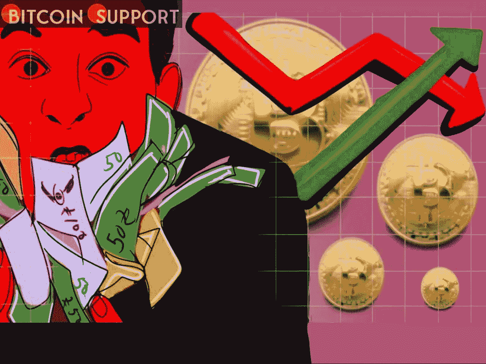

# 尽管有风险资产“痛苦交易”的警告，但一名比特币交易商维持了这种加密货币 40.8 万美元的 BTC 价格目标

> 原文：<https://medium.com/coinmonks/bitcoin-trader-maintains-40-8k-btc-price-objective-despite-risk-asset-pain-trade-warning-4f0284d2cb83?source=collection_archive---------56----------------------->

**For full blog visit:-**[**https://bitcoinsupports.com/bitcoin-trader-maintains-40-8k-btc-price-objective-despite-risk-asset-pain-trade-warning/**](https://bitcoinsupports.com/bitcoin-trader-maintains-40-8k-btc-price-objective-despite-risk-asset-pain-trade-warning/)

比股票和加密货币投降更让投资者愤怒的是“长期”横盘交易。在美国经济政策兴奋度达到一周高点后，比特币(BTC)于 5 月 5 日盘整至 40，000 美元以下。

**For full blog visit:-**[**https://bitcoinsupports.com/bitcoin-trader-maintains-40-8k-btc-price-objective-despite-risk-asset-pain-trade-warning/**](https://bitcoinsupports.com/bitcoin-trader-maintains-40-8k-btc-price-objective-despite-risk-asset-pain-trade-warning/)

**美联储对加密货币市场的影响微乎其微**

继美联储和主席 Jerome Powell 发表声明后，TradingView 的数据证实，Bitstamp 在一夜之间达到 40，050 美元的峰值。美国央行将关键利率上调 0.5%，符合市场预期，这意味着未来将进一步加息。在那之后，一个微小的市场收益让比特币失去了不可思议的波动性，这与美联储过去在通胀等主题上的声明形成了鲜明对比。尽管许多人预计包括加密货币在内的风险资产将因新政策而贬值，但并不是所有人都认为这种情况会给投资者带来最大的痛苦。经济学家林恩·奥尔登(Lyn Alden)表示:“鉴于这么多人呼吁崩盘和崩盘，或许痛苦交易是在很长一段时间内削减风险资产。”同样，比特币领域也没有出现大的趋势转变。Jarvis Labs 的象征性经济学家 Ben Lilly 注意到了 BTC 衍生品市场的低融资利率。

”鲍威尔的言论给市场提供了一些喘息的机会。这种趋势会在密码市场继续吗？首先，相当一段时间以来，融资利率一直为负。在一系列推文中，他表达了自己的观点。

**“这是任何从这里开始的向上动力的美妙基础。”然而，根据礼来公司的说法，在目前的价格下，鲸鱼的积累不足“不是我们想要看到的”。

**对他来说，BTC/美元有望达到 40，800 美元，尽管有“许多因素”排除更大幅度的上涨，但仍有可能。与此同时，连锁监测网站 Whalemap 重申了其之前的预测，即从价格投降的角度来看，25000 美元至 27000 美元之间的区间将是比特币持有者的“最大痛苦”。作为推特评论的一部分，它补充道，“大量的流动性和止损堆积在那里。”****

**完整博客访问:-**[**https://bitcoinsupports . com/bitcoin-trader-maintains-40-8k-BTC-价格-目标-尽管-风险-资产-痛苦-交易-警告/**](https://bitcoinsupports.com/bitcoin-trader-maintains-40-8k-btc-price-objective-despite-risk-asset-pain-trade-warning/)

**免责声明:这些是作者的观点，不应被视为投资建议。读者应该自己做研究。**

> 加入 Coinmonks [电报频道](https://t.me/coincodecap)和 [Youtube 频道](https://www.youtube.com/c/coinmonks/videos)了解加密交易和投资

# 另外，阅读

*   [CoinLoan 审查](https://coincodecap.com/coinloan-review) | [YouHodler 审查](/coinmonks/youhodler-4-easy-ways-to-make-money-98969b9689f2) | [BlockFi 审查](https://coincodecap.com/blockfi-review)
*   XT.COM 评论[币安评论](https://coincodecap.com/profittradingapp-for-binance) |
*   [SmithBot 评论](https://coincodecap.com/smithbot-review) | [4 款最佳免费开源交易机器人](https://coincodecap.com/free-open-source-trading-bots)
*   [比特币基地僵尸程序](/coinmonks/coinbase-bots-ac6359e897f3) | [AscendEX 审查](/coinmonks/ascendex-review-53e829cf75fa) | [OKEx 交易僵尸程序](/coinmonks/okex-trading-bots-234920f61e60)
*   [如何在印度购买比特币？](/coinmonks/buy-bitcoin-in-india-feb50ddfef94) | [瓦济克斯审查](/coinmonks/wazirx-review-5c811b074f5b)