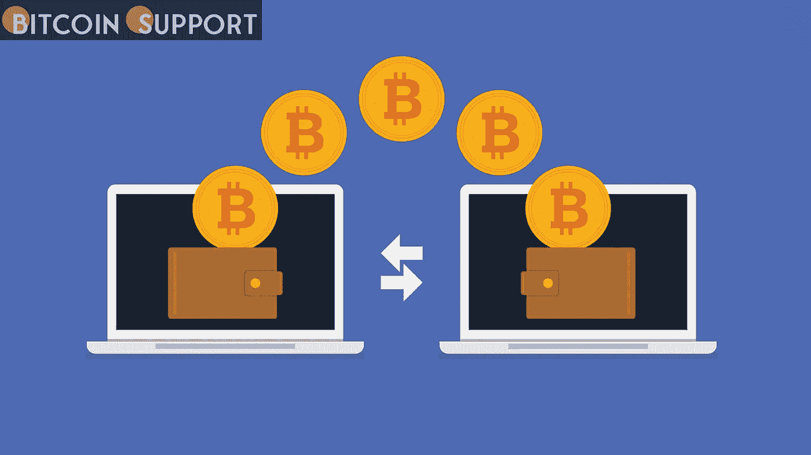

# 比特币交易费用降至近十年来未见的水平

> 原文：<https://medium.com/coinmonks/bitcoin-transaction-costs-have-dropped-to-levels-not-seen-in-a-decade-and-heres-why-5a0551f600a4?source=collection_archive---------50----------------------->

**Visit our website:-** [**https://bitcoinsupports.com/**](https://bitcoinsupports.com/)

由于闪电网络、批处理、矿工行为和协议增强，通过网络转移比特币的成本已降至十年低点。

这是在钱包和兑换商之间转移比特币(BTC)的绝佳机会。根据银河数码的研究，比特币在 BTC 的交易成本已经创下历史新低。

https://Twitter . com/intangible coins/status/1511340416263766027

根据研究，2022 年比特币平均交易费已降至 0.00004541 比特币(2.06 美元)，而中位数为 0.00001292 比特币(0.59 美元)，为 2011 年以来的最低水平。

**Visit our website:-** [**https://bitcoinsupports.com/**](https://bitcoinsupports.com/)

Galaxy Digital 全公司研究主管亚历克斯·索恩(Alex Thorn)表示，费用的下降是 Segwit 采用率上升、批量交易、闪电网络增长、矿商销售崩溃以及“较低的运营回报使用率”等综合因素的结果。Glassnode 的主要链上分析师 James Check 同意 Thorn 的观点，即“批处理和 Segwit 无疑是组合的一部分”，因为这种组合将增加适合一个块的交易量，从而增加吞吐量并减少费用压力。他提交了下面的图表来证明 Segwit 的采用在 5 月至 7 月的低点期间“大幅增加”。

**Visit our website:-** [**https://bitcoinsupports.com/**](https://bitcoinsupports.com/)

检查继续，“然而，这并不是全部……”:

**“我觉得费用低的主要原因是我们在 5 月经历了 50%的价格下跌，这完全摧毁了散户的兴趣。”**

他断言“所有三个指标”(费用、活跃地址和交易计数)“在 5 月份的抛售之后崩溃了。”

**Visit our website:-** [**https://bitcoinsupports.com/**](https://bitcoinsupports.com/)

“在我看来，这是熊市的开始，即使在价格上涨的情况下，我们也看到大量的人在财务上遭受损失，从而被迫退出市场。”

**《第七种财产:比特币和货币革命》的作者埃里克·雅克(Eric Yakes)说:“我们正在经历市场动态的结构性变化。**

就网络的未来而言，“由 lighting labs 筹集的 7000 万美元用于创建稳定的硬币和资产系统”是比特币协议的一个重要里程碑。他继续说，“交易成本继续下降至关重要，因为它们是扩展分散网络的根本障碍。”虽然交易费有利于钱包管理员，并使闪电渠道的建立成为可能，但它们可能表明散户投资者的兴趣已经减弱。根据 Check 的说法，“不要走得太远，去谷歌趋势了解橙色硬币现在有多受欢迎，”这意味着“新用户以接近零的速度出现。”

**Visit our website:-** [**https://bitcoinsupports.com/**](https://bitcoinsupports.com/)

Yakes 对比特币的出现拥有最终决定权:

**“比特币需要闪电网络来保持其目前的增长速度，并为智能合约开发的充满活力的网络的出现创造条件。”**

**访问我们的网站:-**[**https://bitcoinsupports.com/**](https://bitcoinsupports.com/)

**免责声明:以上为作者观点，不应视为投资建议。读者应该自己做研究。**

> 加入 Coinmonks [电报频道](https://t.me/coincodecap)和 [Youtube 频道](https://www.youtube.com/c/coinmonks/videos)了解加密交易和投资

# 另外，阅读

*   [3 商业评论](/coinmonks/3commas-review-an-excellent-crypto-trading-bot-2020-1313a58bec92) | [Pionex 评论](https://coincodecap.com/pionex-review-exchange-with-crypto-trading-bot) | [Coinrule 评论](/coinmonks/coinrule-review-2021-a-beginner-friendly-crypto-trading-bot-daf0504848ba)
*   [莱杰 vs n rave](/coinmonks/ledger-vs-ngrave-zero-7e40f0c1d694)|[莱杰 nano s vs x](/coinmonks/ledger-nano-s-vs-x-battery-hardware-price-storage-59a6663fe3b0) | [币安评论](/coinmonks/binance-review-ee10d3bf3b6e)
*   [Bybit Exchange 审查](/coinmonks/bybit-exchange-review-dbd570019b71) | [Bityard 审查](https://coincodecap.com/bityard-reivew) | [Jet-Bot 审查](https://coincodecap.com/jet-bot-review)
*   [3 commas vs crypto hopper](/coinmonks/3commas-vs-pionex-vs-cryptohopper-best-crypto-bot-6a98d2baa203)|[赚取加密利息](/coinmonks/earn-crypto-interest-b10b810fdda3)
*   最好的比特币[硬件钱包](/coinmonks/hardware-wallets-dfa1211730c6) | [BitBox02 回顾](/coinmonks/bitbox02-review-your-swiss-bitcoin-hardware-wallet-c36c88fff29)